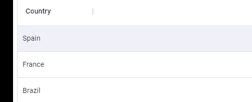

# 如何在您的项目中实现材质 UI 数据网格—第三部分

> 原文：<https://medium.com/nerd-for-tech/how-to-implement-material-ui-data-grid-in-your-project-part-iii-f9d99fb58632?source=collection_archive---------2----------------------->

# {…列定义}

# 呈现标题

**‘render Header’**之于**头**定制就像 **renderCell** 之于**单元格一样。renderHeader'** 需要一个接受头参数**(即字段和 colDef 对象)的函数。**我们将看到一些例子

```
import * as React from 'react';
import { DataGrid } from '@mui/x-data-grid';
import { IconButton, Typography } from '@material-ui/core';
import PersonIcon from '@material-ui/icons/Person';const columns = [
{
field: 'name',
width: 150,
type: 'date',
**renderHeader: (headerparams) => {
console.log(headerparams)
return (
<Typography variant='h6'>
Name
<IconButton> <PersonIcon /> </IconButton>
</Typography>
)}
},**
];const rows = [
{
id: 1,
name: 'Messi',
},
{
id: 2,
name: 'Ronaldo',
},
{
id: 3,
name: 'Neymar',
},
];export default function RenderHeaderGrid() {return (<div style={{ height: 300, width: '100%' }}>
<DataGrid rows={rows} columns={columns} />
</div>
);}
```

上面的例子使用`<Typography>`定制标题字体，使用`<PersonIcon>`定制添加图标

# 列类型

我们可以使用**‘type’**属性定义单元格中可接受的值的类型。基本类型有字符串、数字、日期、日期时间和布尔值。我发现有一种特殊类型对富用户界面很有用，那就是**‘singleSelect’。****single select**属性依赖于另一个名为**‘value options’**的属性

```
import * as React from "react";
import { DataGrid } from "@mui/x-data-grid";const rows = [
{
id: 1,**// Needs to be one of the values from valueOptions** country: "Spain"
},
{
id: 2,**// Needs to be one of the values from valueOptions**
country: "France"
},
{
id: 3,**// Needs to be one of the values from valueOptions**
country: "Brazil"
}
];export default function ColumnTypesGrid() {return (
<div style={{ height: 300, width: "100%" }}>
<DataGrid
columns={[
{
field: "country",
width: 150,
headerName: "Country",
editable: true,**// type and valueOptions properties are interdependent****type: "singleSelect",**
**valueOptions: [
"Bulgaria",
"Netherlands",
"France",
"United Kingdom",
"Spain",
"Brazil",
"India"**
]
}
]}
rows={rows}
/>
</div>
);
}
```



singleSelect 和 valueOptions 提供选项以供选择