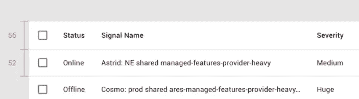
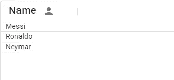
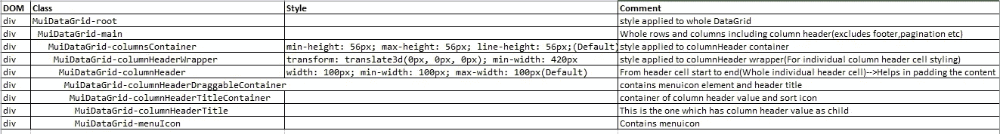
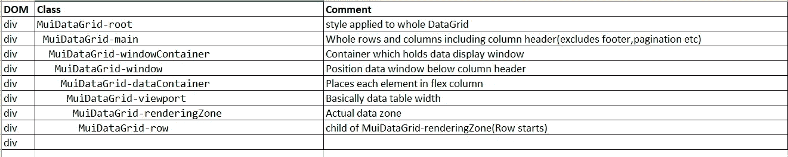

# 如何在您的项目中实现材质 UI 数据网格—第四部分

> 原文：<https://medium.com/nerd-for-tech/how-to-implement-material-ui-data-grid-in-your-project-part-iv-814828b92e05?source=collection_archive---------2----------------------->

# [自定义行]

说到行定制，主要有两个东西——**行高**和**行样式**

说到行，我们通常直接将道具交给 DataGrid 组件本身。默认情况下，**行高**会是 **52px** ，而**头高**会是 **56px。**但是为什么是这些任意的像素呢？因为它符合材料设计准则。



材料设计指南

```
import * as React from "react";
import { DataGrid } from "@mui/x-data-grid";
import { IconButton, Typography } from "@material-ui/core";
import PersonIcon from "@material-ui/icons/Person";const columns = [
{
field: "name",
width: 150,
type: "date",
renderHeader: (params) => {
return (
<Typography variant="h6">
Name
<IconButton>
{" "}
<PersonIcon />{" "}
</IconButton>
</Typography>
);
}
}
];const rows = [
{
id: 1,
name: "Messi"
},
{
id: 2,
name: "Ronaldo"
},
{
id: 3,
name: "Neymar"
}
];export default function RenderHeaderGrid() {
return (
<div style={{ height: 300, width: "100%" }}>
<DataGrid
rows={rows}
columns={columns}
**rowHeight={20}
headerHeight={40}**
/>
</div>
);
}
```



rowHeight 和 headerHeight

谈到 DataGrid 样式，我们首先需要了解 DOM 结构和它们在 DataGrid 中的默认类。



DOM 结构



行的 DOM 结构

在 MuiDataGrid-root 中，我们基本上有两个节点——一个用于列标题，另一个用于行

现在我们将使用名为 **getRowClassName** 的魔术道具，它接受 rowparams 作为参数返回一个类名。该类名将被添加到 div 中，类名为**多数据网格行**

```
import * as React from "react";import { DataGrid } from "@mui/x-data-grid";
import { useDemoData } from "@mui/x-data-grid-generator";
import { makeStyles } from "@mui/styles";const useStyles = makeStyles({
root: {
"& .styledrows": {
backgroundColor: "green"
}
}
});export default function StylingRowsGrid() {const classes = useStyles();
const { data } = useDemoData({
dataSet: "Commodity",
rowLength: 100
});return (<div style={{ height: 400, width: "100%" }} 
className={**classes.root**}>
<DataGrid 
{...data} 
getRowClassName={(params) => **`styledrows`**} />
</div>);
}
```

基本上，设置行的样式包括两个步骤——为数据网格的父类声明父类

```
<div style={{ height: 400, width: “100%” }} className={**classes.root**}>
```

我们需要在父类中给出嵌套类，相应的类名应该与 **getRowClassName** prop 的返回值相同

```
const useStyles = makeStyles({
**root**: {
"**& .styledrows**": {
backgroundColor: "green"
}
}
});
```

这就像是说无论何时你看到' **styledrows** '在' **root** '类中，应用上面提到的样式。

所以我们需要将这个嵌套类添加到每个 Datagrid 行中。这就是我们使用 **getRowClassName 的原因。**

```
<DataGrid 
{...data} 
getRowClassName={(params) => **`styledrows`**} />
```

上面的过程实际上是我们通常在 CSS 中所做的事情的逆过程。希望对你有很大帮助。