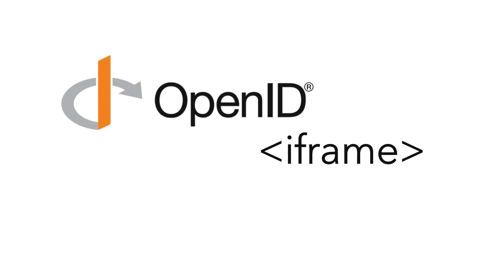

# 如何在 iFrame 内部实现 OpenID Connect 认证流

> 原文：<https://medium.com/nerd-for-tech/how-to-implement-openid-connect-authentication-flow-inside-of-an-iframe-10cf6b155c49?source=collection_archive---------0----------------------->



起初，在 iframe 中实现认证似乎非常方便和用户友好，但是由于安全风险，通常不鼓励这样做。许多流行的身份验证提供者甚至不会在 **iframe** 中呈现身份验证页面，但仍然有提供者允许在 **iframe** 和可接受的用例中实现登录流。

在这篇文章中，我将主要关注技术实现，而不是你是否应该避免 iframe。在本文中，我们将讨论两个主要目标:

1.如何在一个 **iframe**
2 中显示认证页面。认证成功后如何跳出一个 **iframe**

# 起点

我写这篇文章是对我上一篇文章[如何在 Node.js 中用 openid-client 和 Passport 实现 OpenID 认证](/@goranlisak/how-to-implement-openid-authentication-with-openid-client-and-passport-in-node-js-43d020121e87)的扩展

在实现方面，我将尽量做到非常通用，因此即使您使用的是不同的技术，您也应该能够理解。

# 如何在 **iframe** 中显示认证页面

**启动认证流程** 根据您的应用，您可能已经实施了以下方式之一来启动认证流程:

1. **onClick** 函数，启动认证流程，将用户重定向到认证页面
2。特定**路由**上的中间件将启动身份验证流程，并将用户重定向到身份验证页面

本文的原则可以应用于上述两种解决方案。

**神奇之处在于目标**
我相信很多人都知道，如果你将**目标**设置为**<>**元素`_blank`，你的链接将在一个新的窗口或标签中打开，但是人们经常忘记，你可以将目标设置为你的 iframe 的名称——在这种情况下，内容将在 iframe 中呈现。

创建一个想要显示认证页面的 iframe 并给它一个唯一的名字。只需确保在重定向用户之前在 DOM 中呈现 iframe。

```
<iframe name="loginIframe"></iframe>
```

现在，在你的**<>**或 **<表单>** 元素上设置一个目标，这取决于你如何重定向一个用户。

```
<form action="/auth" target="loginIframe">
  <input type="submit" value="Login">
</form>
```

此时，您应该会看到 iframe 中呈现的身份验证页面。成功认证后，用户将被重定向到您在开始认证过程时提供的重定向 URL，但这就变得棘手了…

# **认证成功后如何破解 iframe**

身份验证成功后，用户将被重定向到您在启动身份验证流程时提供的重定向 URL 通常是他们首先尝试访问的私有路由。问题是，当这种情况发生时，页面将在您的身份验证 iframe 中呈现，因此您基本上将在页面中有一个页面。

为了避免这个问题，我们将创建另一个 route `/redirect`,这个 route 将只呈现一个 spinner 和一个普通的消息，表明用户正在被重定向到页面。

这里有一个例子。

现在我们需要添加一些 JavaScript 来重定向用户。创建一个新的 JS 文件，并在`/redirect`页面中链接它。在 JS 文件中，执行以下行来重定向用户:

```
window.top.location.replace('/my-private-route');
```

基本上，诀窍是在顶部窗口调用`location.replace()`方法，以确保我们重定向的是主页，而不是 iframe 中的页面。

如果您想提供一个备份选项，以防用户禁用了 JavaScript，您可以添加一个到重定向页面的链接，并添加一个值为`_top`的目标 ATR ITRI。

```
<a href="/my-private-route" target="_top">Click here to redirect</a>
```

仅此而已。现在，用户成功地通过了身份验证，并被重定向到请求的页面。

如果有任何问题，请随时联系我，或者在下面的评论中留言。

# 想和我去喝杯咖啡吗？

这篇文章把你从一整天的谷歌搜索中解救出来了吗？厉害！你可以在这里给我买杯咖啡:[https://www.buymeacoffee.com/goranlisak](https://www.buymeacoffee.com/goranlisak)

还需要帮助吗？你可以在这里和我预约会面:[https://www.buymeacoffee.com/goranlisak/extras](https://www.buymeacoffee.com/goranlisak/extras)