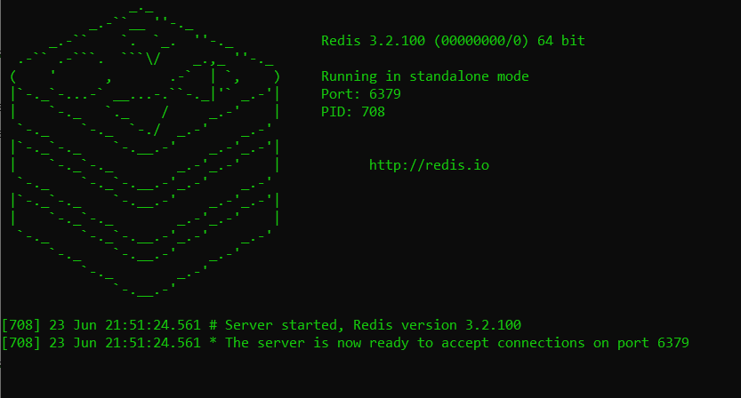
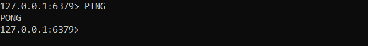
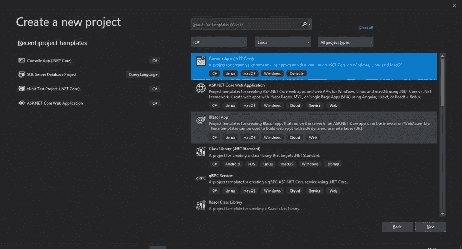
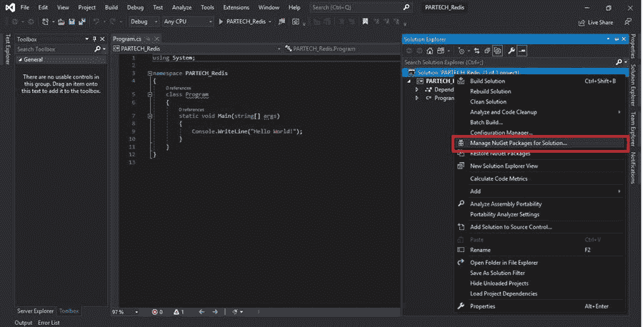
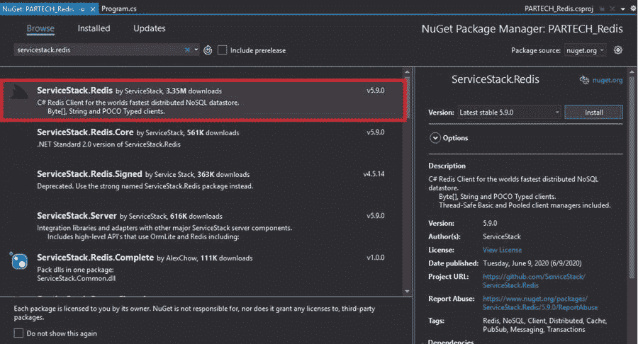
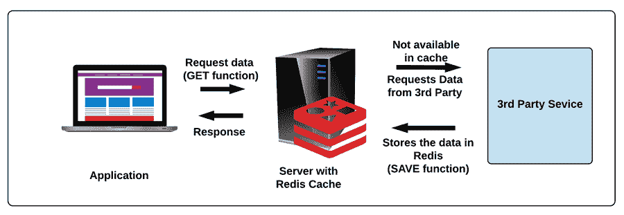
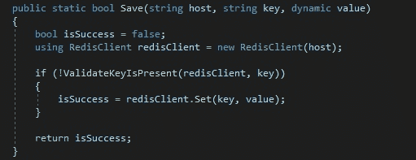
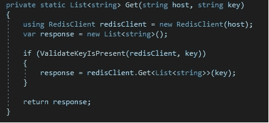
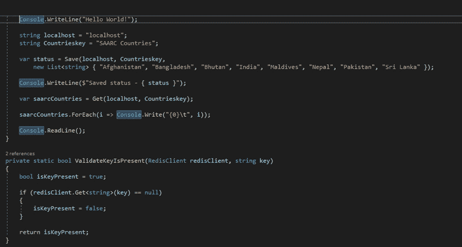
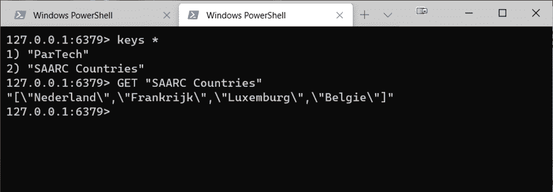

# 如何在 ASPNET 中实现 Redis 缓存

> 原文：<https://medium.com/nerd-for-tech/how-to-implement-redis-cache-in-aspnet-52e2a2926f32?source=collection_archive---------11----------------------->

到目前为止，您应该已经知道什么是缓存，以及为什么开发人员经常使用缓存来提高应用程序的性能。如果没有，我们建议您阅读我们之前关于缓存基础的文章，以帮助您浏览这篇文章。缓存已经被广泛用于减少资源的消耗，Redis 缓存是实现缓存的流行手段之一。

可能有很多框架可以实现缓存，但是我们选择 Redis 是因为它的快速性能、可伸缩性、对多种语言的支持等等。

在本帖中，我们将带您在缓存之旅中领先一步，帮助您了解如何在 ASP.NET*应用程序中实现****Redis 缓存。***

# 目录

1.  如何安装 Redis 缓存？
2.  设置客户端
3.  您的应用程序如何与 Redis 缓存交互？
4.  包扎

# 如何安装 Redis 缓存？

寻找问题'**如何在 ASP.NET 应用程序中实现 Redis 缓存'答案的第一步是在本地系统上安装 Redis。GitHub 有一个可下载的 Redis Cache for Windows 版本。下面是[链接](https://github.com/microsoftarchive/redis/releases)下载。**

您可以选择下载 MSI 文件或 zip 文件。MSI 文件通常会在您的本地计算机上安装 Redis，并创建一个 windows 服务。这将在启动时自动启动 Redis 服务器。另一方面，在 zip 文件版本中，每次需要应用程序与 Redis 交互时，都必须手动启动服务器。

在我们的例子中，我们已经下载了压缩版本。一旦你解压文件到你的本地系统，点击文件 server.exe。这将启动 Redis 服务器，并使您能够查看如下所示的屏幕。该屏幕还显示服务器现在准备好接受端口 6379 上的连接。

您还可以通过选择文件 redis-cli.exe 并输入命令“ *ping* ”来验证服务器是否已经启动。如果服务器运行良好，您将得到“pong”响应。

这里的 127.0.0.1:6379 是我们的客户机将要连接的本地主机。

# 设置客户端

既然 Redis 缓存服务器已经启动并运行，下一步就是让客户机与缓存进行交互。为此，让我们构建一个客户机，在 Redis 缓存中存储和检索数据。通过在 Visual Studio 中创建一个新的控制台应用程序项目来开始该过程。

成功创建控制台项目后，安装 ServiceStack。Redis 包在 NuGet 包管理器的帮助下。这个库对于让您的客户机与 Redis 服务器进行交互是必不可少的。

要安装这个包，你所要做的就是搜索 [ServiceStack。在 NuGet explorer 中 Redis 包](https://github.com/ServiceStack/ServiceStack.Redis)并安装它。

一旦 ServiceStack。Redis 包安装完毕，下一步是定义**保存**和**获取**功能。但是在我们理解 SAVE 和 GET 函数是什么或者如何设置它之前，让我们借助一个例子快速回顾一下 Redis 缓存是如何工作的。

# 您的应用程序如何与 Redis 缓存交互？

假设您的应用程序被组织用来存储员工的详细信息。要捕获的字段之一是他们的国家，我们决定以下拉菜单的形式显示给用户。

现在让我们假设您的数据库由于某种原因没有存储 country 字段(比如国家列表经常变化或者您的应用程序禁止存储国家)。相反，您可以从第三方服务中提取国家列表，并在每次用户尝试注册时将其填充到下拉列表中。

在某一天，成千上万的用户试图注册。这意味着对第三方服务的请求超过一千个。现在，如果第三方服务对其服务的每个请求收费，这就变成了一个昂贵的提议。

为了避免这种情况，我们使用 Redis 缓存来临时存储信息。当第一个用户尝试注册时，将从第三方服务中提取国家列表，并在下拉菜单中显示给用户。同时，国家也存储在 Redis 缓存中。一旦数据存储在 Redis 缓存中，就可以以更快的速度(并且免费)将数据再次提取给下一个用户。国家列表可以在一天结束时在缓存中重置，以便第二天重新开始。

下图描述了您的应用程序如何与 Redis 缓存和第三方服务进行交互来获取数据。

在上图中，您会注意到有两个名为 GET 和 SAVE 的函数。GET 函数用于从 Redis 缓存中提取信息并将其显示在应用程序中，而 SAVE 函数用于将从第三方服务提取的数据保存在 Redis 缓存中。

在 Visual Studio 的控制台项目中，可以如下定义 SAVE 函数。为了定义这一点，我们在这里考虑了保存/提取国家列表的相同示例，这在前面的部分中已经解释过了。

并将 GET 函数定义如下。

让我们定义主函数来调用 GET 和 SAVE 函数。

在上面的定义中，您还会注意到定义了一个`ValidateKeyIsPresent`函数。你知道为什么吗？

记住 Redis 是一个基于键的缓存系统。这意味着只有发送与数据相关联的键，才能从缓存中获取数据。这个检查是由 ValidateKeyIsPresent 函数执行的。如果密钥不存在，则不能从缓存中提取数据，而是从第三方服务中提取。

运行控制台应用程序后，应该有一个关键名称南盟国家。如果我们在终端中运行 redis-cli.exe 并运行命令`KEYS *`,我们将获得 Redis 中存储的所有当前密钥。

获取我们的国家列表只需运行带有键名的 [GET](https://redis.io/commands/get) 命令，带有模式`GET SAA*`的`GET "SAARC Countries"`。

# 包扎

这篇文章向你展示了如何在你的 ASP.NET 应用程序中实现 Redis。Redis 对于商业和非商业用途都是一个很好的选择，因为它是完全免费和开源的。最重要的是，在管理数据时，它的速度极快，性能开销可以忽略不计。因此，继续在您的应用程序中设置 Redis，让您的访问者获得快得惊人的用户体验。

*原发布于*[*https://www . partech . nl*](https://www.partech.nl/nl/publicaties/2020/07/how-to-implement-redis-cache-in-aspnet)*。*