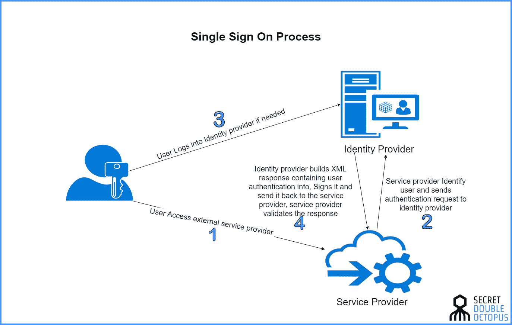
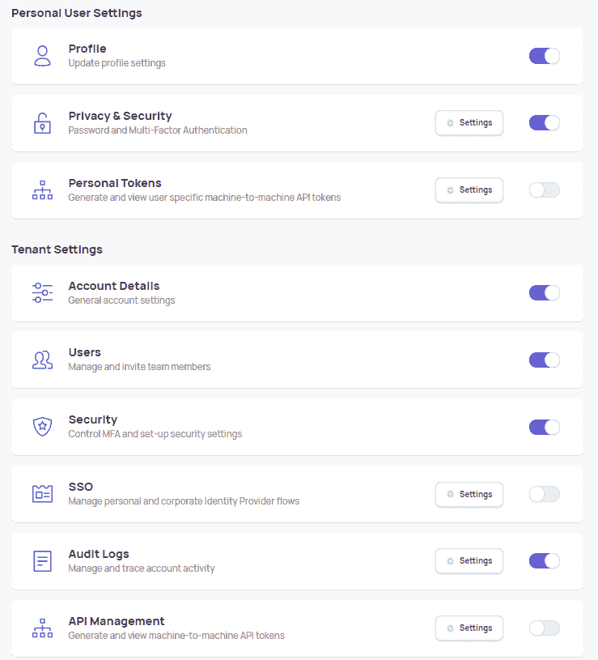

# 如何通过 7 个简单的步骤实现单点登录

> 原文：<https://medium.com/nerd-for-tech/how-to-implement-sso-in-7-easy-steps-eee4c3b36630?source=collection_archive---------6----------------------->


*照片由* [*格伦·卡斯滕斯*](https://unsplash.com/@glenncarstenspeters?utm_source=unsplash&utm_medium=referral&utm_content=creditCopyText) *上* [*下*](https://unsplash.com/?utm_source=unsplash&utm_medium=referral&utm_content=creditCopyText)

**简介**

单点登录(SSO)允许用户使用单一凭证访问许多互连或集成的软件系统。鉴于一般公司使用多种 SaaS 服务，很容易理解为什么 SSO 是企业和中端市场业务中流行的功能请求。

SSO 身份验证可确保您的用户拥有一致的身份验证体验，无论他们使用的是您自己的应用还是第三方应用。加入其中一个应用后，当您登录同一网络中的另一个应用时，就不必再次输入凭据。这是因为您将自动登录到所有这些网站。

[比如亚马逊](https://www.amazon.com/)就用了这个功能。一旦你在一个亚马逊应用程序上创建了登录信息，你就会自动登录他们所有的其他应用程序(亚马逊音乐、亚马逊 Prime、Alexa、Audible、亚马逊 Kindle 等。)

**单点登录的好处**

*   由于 SSO 允许用户使用自己的登录系统登录，因此它还允许管理员管理用户帐户，并允许员工在公司的不同应用程序中使用它。
*   SSO 允许管理员即时控制对所有应用程序的访问，而不是登录 100 个不同的用户管理站点来更改用户权限。
*   SSO 在安全性方面也是有益的。与数百个个人账户相比，保护一个点要容易得多，因为后者可能会成为“漏洞”。

**工作原理**

SSO 依赖于所有应用程序都信任的集中式服务器。在这个中央服务器上，当您第一次登录时会创建一个 cookie。然后，如果你试图访问第二个应用程序，你会被重定向到中央服务器。如果你已经有一个 cookie，你会被直接重定向到一个带有令牌的应用程序，绕过有问题的日志，表明你已经准备好了。

例如，Google 在其服务中使用 SSO。谷歌是谷歌的中央服务器。您可以访问 Gmail、Youtube、Play Store 和 Google Docs，而无需再次输入您的凭据。



[来源](https://doubleoctopus.com/security-wiki/federation-and-sso/single-sign-on/)

**如何实现单点登录**

不管您使用什么平台或应用程序，为它们中的每一个单独登录都是可行的。为此，您需要一个每个应用程序都可以访问的主服务器。

大多数 SaaS 应用程序都有自己的用户目录。要启用 SSO，您应该在同一个页面上获得这些不同的用户目录。这可以通过不同的外部商家来完成，这些商家已经培养了一个单一的集成点，用于你的各个阶段。

为了理解 SSO 的实现过程，我们将以一个常用的商家 Frontegg 为例。

**什么是 Frontegg？**

[Frontegg](https://frontegg.com) 是一个开发者平台，它通过一个丰富的客户端界面实现自助服务、安全性和企业能力。Frontegg 不是简单地通过一个可嵌入的登录框给你身份验证和 SSO 他们为用户提供了一个可配置的管理门户。

Frontegg 的管理门户允许客户控制和监控他们记录的每个部分:监督客户和组，描述和指定角色和授权，通过审计日志获得可见性，购买 webhooks 等。

您可以将 Frontegg 作为 UI 层插入到您的应用程序中，并将其转变为面向最终用户的客户端管理界面，包括个人和工作区级别。此外，Frontegg 通过不同语言和框架支持的丰富的[SDK](https://clevertap.com/blog/what-is-an-sdk/)来控制你的后端。

**将 Frontegg 的 SSO 服务集成到您的应用中**

集成登录框的步骤:

1.  安装 Frontegg reactJS 库

```
npm install @frontegg/react
```

2.用 FrontEggProvider 包装根组件

```
import React from ‘react’;import ReactDOM from ‘react-dom’;import App from ‘./App’;import ‘./index.css’;import { FronteggProvider } from ‘@frontegg/react’;const contextOptions = {baseUrl: ‘https://principalfinancialgroup.frontegg.com',};// Replace this with your app logo 👇const headerImage = ‘https://assets.frontegg.com/public-frontegg-assets/acme-logo.svg';ReactDOM.render(<FronteggProvider contextOptions={contextOptions} headerImage={headerImage}><App /></FronteggProvider>,document.getElementById(‘root’));
```

3.Frontegg 通过 useAuth 陷阱揭示客户端设置和确认状态，该陷阱允许您将未经验证的客户端转移到登录页面并获取客户端的数据。

```
import React from ‘react’;import { useAuth } from ‘@frontegg/react’function App() {const { user, isAuthenticated } = useAuth();return (<div className=’App’>{isAuthenticated && (<div><span>{user.name}</span></div>)}</div>);}export default App;
```

4.运行应用程序，注册并登录

```
npm start
```

Frontegg 现已集成到您的应用程序中。

**集成管理门户的步骤:**

1.  导入管理门户

```
import { AdminPortal } from ‘@frontegg/react’
```

2.添加链接以打开管理门户

```
const handleClick = () => {AdminPortal.show();};<button onClick={handleClick}>Settings</button>
```

3.设置您的管理门户功能:下面的预览为您提供了关于您的管理门户功能的所有设置，您可以根据您的业务需求进行更新。您必须添加与 SSO (SAML 信息)相关的详细信息，定义角色和权限，添加用户等。



一旦这些阶段完成，您就可以使用 Frontegg 界面了。

# 摘要

SSO 为您提供了各种自主编程框架的验证。然而，这些框架都是相互关联的，并且可以通过一个简单的密码来访问和控制。这是 It 软件开发中非常重要的一部分。

为您的产品创建 SSO 答案会使它们适应性更强，探索速度更快，使用起来更简单。它改善了客户体验，使处理产品变得不那么复杂。无论您使用的是哪个阶段或应用程序，都有一个一致的 SSO 安排可以应用于所有阶段或应用程序。