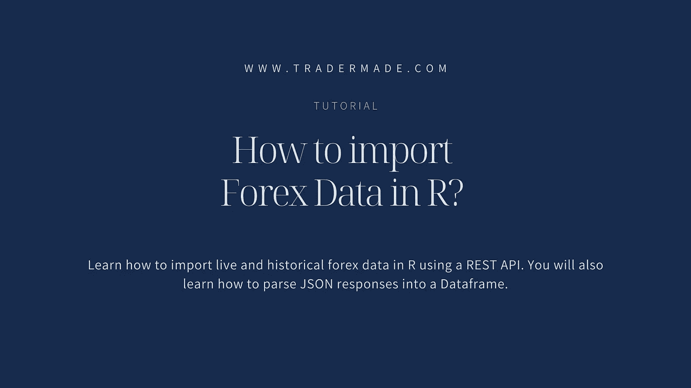
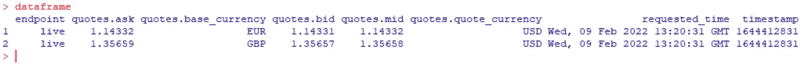
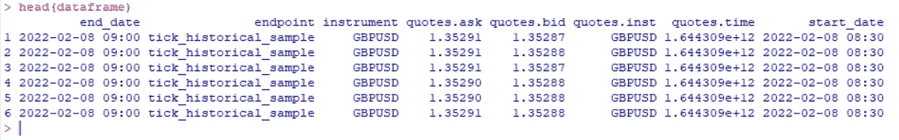
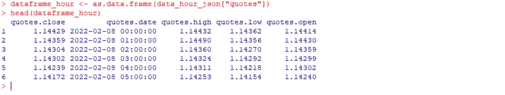

# 如何在 R 中导入外汇数据

> 原文：<https://medium.com/nerd-for-tech/how-to-import-forex-data-in-r-ecdceef2108d?source=collection_archive---------2----------------------->



了解如何使用 REST API 在 R 中导入实时和历史外汇数据。您还将学习如何将 JSON 响应解析成数据帧。要阅读本教程，你几乎不需要任何 r 编程知识。也就是说，本教程对有其他编程语言经验的人和想使用我们的 REST API 的人仍然有帮助。

## 我们开始吧

您需要注册我们的 API，点击[免费加入 API](https://marketdata.tradermade.com/signup)。一旦你有了钥匙，要保管好它。我们每月提供 1000 个请求，永远免费！然后你可以访问官方网站[下载 R](https://cran.r-project.org/) 。

## 获取实时外汇汇率

下载完成后，安装库，如下所示

```
# Installing the packages
install.packages("httr")
install.packages("jsonlite")
```

我们现在可以导入刚刚安装的库，并将 req 变量设置为我们需要数据的 URL 字符串。我们要求的货币是欧元、美元和 GBPUSD。您需要用注册时收到的 REST API 密钥替换 api_key。

```
library (httr)
library (jsonlite)req <- "https://marketdata.tradermade.com/api/v1/live?currency=EURUSD,GBPUSD&api_key=api_key"
```

我们现在将通过发出 Get 请求并将其设置为 data_raw 变量来请求数据。一旦我们有了原始格式的数据，我们将使用 content 函数将其转换为文本格式。

```
data_raw <- GET(url = req)data_text <- content(data_raw, "text", encoding = "UTF-8")
```

python 用户很容易理解这些代码，但是任何编程技能有限的用户都能够理解下面的代码。我们将把文本转换成 JSON，然后创建一个数据框，将数据很好地格式化成我们可以使用的表格。

```
data_json <- fromJSON(data_text, flatten=TRUE)dataframe <- as.data.frame(data_json)dataframe
```

一旦你运行上面的代码，你会看到我们的 API 提供出价，询问价格，以秒为单位的时间戳。这对于进行波动性分析非常有用。大多数免费资源和许多付费资源不提供买卖差价。



我们还通过我们的 API 为 R 用户提供日内外汇数据。这包括对定量分析有用的滴答、分钟和小时速率。

## 获取历史汇率

我们将首先获得历史价格点(API 免费提供前 4 天的历史价格点数据，不包括今天)。我们可以在一个电话中请求的最大值是 30 分钟，每个电话将使用每月 1000 个免费请求中的 10 个。如下所示，我们请求 GBPUSD 从 2022 年 2 月 8 日 08:30 到 09:00 的数据。确保将日期更改为最后四天，否则将返回错误。

```
tick_req <- "https://marketdata.tradermade.com/api/v1/tick_historical_sample/GBPUSD/2022-02-08 08:30/2022-02-08 09:00?api_key=api_key&format=json"data_tick_raw <- GET(url = tick_req)data_tick_text <- content(data_tick_raw, "text", encoding = "UTF-8")data_tick_json <- fromJSON(data_tick_text, flatten=TRUE)dataframe_tick <- as.data.frame(data_tick_json)head(dataframe_tick)
```



数据非常密集，每 30 分钟大约有 2800 多条引用，如果你是一个严肃的数据分析师，这很有用。现在您可以看到，从我们的外汇 API 中获取数据相当容易。让我们再做一次，但是这一次请求每小时数据的 OHLC 数据(最大历史记录只有从当前日期开始的 2 个月)。请查看我们的[文档第](https://tradermade.com/tutorials/how-to-import-forex-data-in-r/marketdata.tradermade.com/docs/restful-api)页，了解更多关于不同端点的历史记录。

```
hour_req <- "https://marketdata.tradermade.com/api/v1/timeseries?currency=EURUSD&api_key=api_key&start_date=2022-02-08-00:00&end_date=2022-02-09-12:11&format=records&interval=hourly"data_hour_raw <- GET(url = hour_req)data_hour_text <- content(data_hour_raw, "text", encoding = "UTF-8")data_hour_json <- fromJSON(data_hour_text, flatten=TRUE)dataframe_hour <- as.data.frame(data_hour_json["quotes"])head(dataframe_hour)
```



正如您所见，从我们的外汇 REST API r 中提取无偏见的外汇汇率相当容易。我们每月免费为多达 1000 个请求提供免费数据，因为为所有人提供外汇数据是我们的使命。你也可以得到 CFD 数据，详细信息请参考我们的文档页面。

如果您有任何问题或想提出建议，请告诉我们。我们一直渴望收到您的来信。还有，拍拍我们的作品，会被高度赞赏的。