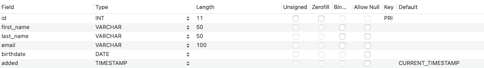
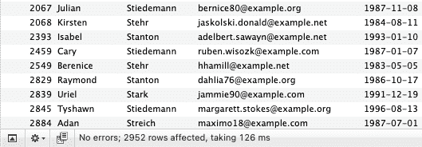

# 如何提高 MYSQL 数据库的性能

> 原文：<https://medium.com/nerd-for-tech/how-to-improve-mysql-mariadb-database-performance-181f270d7fbe?source=collection_archive---------1----------------------->


在我的另一篇文章的后续:[如何提高微软 SQL Server (MSSQL)数据库性能](https://pirex360.medium.com/how-to-improve-microsoft-sql-server-mssql-database-c2b159ced54d)，现在我将对 **MYSQL / MariaDB** 数据库做同样的事情。

当我们开发一个定制的 web 应用程序时，我们必须测试所有类型的场景。通常情况下，数据库的缩放是高质量软件的关键点。最近，我继承了几个在性能上受到影响的遗留应用程序，因为以前的开发人员在数据库级别工作得不好。在网络生态系统中，数据库操作中获得的每一个**毫秒**都是为我们开发的软件提供更好的用户体验的重要一步。

# 让我们开始我们的旅程吧！

最初的起点是了解在 **MyISAM** 和 **InnoDB** 之间选择最佳存储引擎的重要性，这是至关重要的一步，在本文中，我不想关注这两种引擎类型之间的差异，但我在这里留下了一个[链接](https://en.wikipedia.org/wiki/Comparison_of_MySQL_database_engines)来了解关于这个主题的更多信息。

在关于存储引擎的总结中，我倾向于使用 **InnoDB** 来完成我的所有项目，我只在不经常写表的情况下使用 **MyISAM** 。您可以拥有一个混合了 InnoDB 和 MyISAM 表的数据库(我不经常使用这种方法，但这是一种可能性)。

在选择了存储引擎之后，现在是讨论表的字段的索引的时候了。当然，当你创建一个主键时，一个自动索引就被创建了…我看到很多项目只使用这些索引。问题是当数据库增长到更大数量的行/数据时，由于缺乏数据库索引规划，执行过滤数据的 SQL 查询的时间 ***受到*** 的严重影响。

让我们使用我为**概念验证**创建的测试数据库，其中有两个充满虚拟数据的表(作者和帖子)，只有字段(id)中有一个主键，每个表都有 auto_increment 和 InnoDB 存储引擎，下面是表的结构:



表**作者**拥有近**430000**430000**行**大小为 **34.6 MB**


表**贴**近 **276000** 行**大小 **113.6 MB****

现在让我们创建一个简单的可能的真实世界`SELECT`，连接两个表并按照以下标准进行过滤:

*   通过`id`将表格`posts`与`authors`连接起来
*   根据 1979 年到 2021 年间的文章`date`进行过滤
*   按作者筛选`last_name`以“St”开头
*   由作者筛选`age`18 至 40 岁之间

# SQL 测试查询和输出

```
**SELECT** p.id, a.first_name, a.last_name, a.email,a.birthdate, p.title, p.description, p.content, p.date**FROM** posts p
    **INNER JOIN** authors a
    **ON** p.author_id = a.id**WHERE** year(p.date) **BETWEEN** 1979 **AND** 2021
**AND** a.last_name **LIKE** 'St%'
**AND** (**YEAR**(**CURDATE**()) - **YEAR**(birthdate)) **BETWEEN** 18 **AND** 40
```



这些结果是仅使用两个表中主键的索引获得的。

## 输出****行数据**用了 **126 ms** 。**

**现在我们有一个点来比较优化，将在文章的其余部分应用。**

**如果您分析所使用的查询，让我们关注一下`WHERE`子句:有 **3 个**字段被过滤(`p.date`、`a.last_name`和`a.birthdate`)。**

> ****注意:**在我参与的一些外部项目中，我仍然看到没有索引的外键。这是数据库关系中的一个坏习惯，会导致表之间的`JOIN`连接性能下降。**

**我的经验是分析这些字段，并选择最佳候选项，对它们应用一个索引。不要滥用索引字段(尤其是`string`类型),因为添加大量索引会降低性能，除了主键和外键之外，我尽量在每个表中最多使用 1 到 3 个索引，并且只在需要时使用。**

**最好的候选字段是可能有重复数据的字段，例如，posts `date`字段和 authors `birthdate`字段可能有具有相同内容日期年份的 **n** 行，例如:'`1999-MM-DD`'，而 authors `last_name`字段由于内容的性质也可能有重复值，但是字段类型是`string`，我避免向`string`字段添加索引，这只是最后的手段。**

**因此，让我们为帖子`date`和作者`birthdate`字段添加索引。**

```
**CREATE** **INDEX** index_posts_date **ON** posts (date);
**CREATE** **INDEX** index_authors_birthdate **ON** authors (birthdate);
```

**创建索引后，运行一个简单的 SQL 命令来优化表:`OPTIMIZE TABLE table_name`，也可以在一行中使用多个表，表名之间用逗号隔开。**

```
**OPTIMIZE** **TABLE** authors, posts;
```

**如果您想在所有数据库表上运行这个命令，而不需要手动键入所有表的名称，使用下一个 SQL 命令自动应用到所需数据库的所有表，只需替换所需数据库名称的`'your_database'`。**

```
**SELECT** **CONCAT**('OPTIMIZE TABLE ',TABLE_NAME, ';') 
**FROM** INFORMATION_SCHEMA.TABLES
**WHERE** table_schema='your_database';
```

# **运行优化命令后，现在让我们重新运行初始查询并测量结果:**

****

**性能大幅提升。**

## **通过这一修改，我们的查询只花了 12.8 毫秒，而不是最初的 126 毫秒！**

**与第一个查询相比，速度提高了 **90%** ，只是增加了在`WHERE`子句上使用的索引。**

# **这种方法的缺点是增加了表格的大小！**

**让我们比较一下添加索引前的表`posts`大小: **113.6MB** ，添加索引后: **132.6 MB** 。
磁盘空间增加了 **17.35%** ，所以你要知道索引是有代价的，表中增加的大小(大小因记录/索引数量和字段类型/内容而异)。**

> **根据我的经验，我更希望提高性能，并接受我需要更多的数据库磁盘空间…**

> ****注意:**这里显示的所有 SQL 命令对您的数据来说都是绝对安全的，如果您想回滚到以前的状态很容易:只需删除添加的索引并重新运行优化表命令，您的所有表大小都将恢复正常，没有数据丢失……只有速度。**

**嗯，我希望这是一个好的阅读，如果这有助于人们实现他们的目标，我会很高兴。**