# 如何利用数据科学提高销售额

> 原文：<https://medium.com/nerd-for-tech/how-to-improve-your-sales-with-data-science-9ea4b66f6a1b?source=collection_archive---------19----------------------->

## 预测客户接受所发要约的概率的模型

# 介绍

根据星巴克财务报告报道，该公司拥有超过 32，000 家门店，是全球**最大的咖啡连锁店**。

想想这家公司有多大，有多重要，想象一下**通过改善他们的市场行为**他们可以筹集多少资金。所以，这篇文章的目的是增加星巴克的收入。尽管公司在这里，但概念和知识可能会部署在许多公司，这些公司有发送优惠券的政策。即使他们没有，也许使用它是一个很好的选择。

公司有许多方法来提高你的销售额，其中之一就是有效地向你的客户发送报价。这就是我们将在这里深化的战略。

在这个简短的介绍之后，关于这个帖子的**目标**是什么，以及它在用户体验和公司可以拥有的资金方面的**巨大价值。让我们用实践的术语来谈，用从现在开始做的数据来展示工作。要做到这一点，请记住下面的划分，这将在下一节介绍。**

重要的是注意到**这篇文章是技术性的**，换句话说，你将向**展示我从获得数据**到用**代码、表格和图形图像**开发 IA 模型的旅程的细节。

# 内容

1.  商业理解
2.  数据理解
3.  数据争论
4.  探索性分析
5.  建立机器学习模型

# **1。业务理解**

现在是信息时代，是消费定制时代。首先，没有数据这一切都是不可能的，正如经济学家所说，数据是新的石油。有了石油，就必须提炼你的矿物。这意味着你必须根据客户的需求和行为区别对待他们。

有了这个想法，我们可以为忠诚的顾客发送更多的报价。对于距离较远的公司，促销力度可能会越来越小。比参加 A/B 测试并观察他们的行为要好。这些只是可以应用的一些例子。不幸的是，与汽油不同，这些数据没有现成的方法可以遵循，它需要实验和研究。

答经过一些实验，我们的目标是**建立一个模型来预测客户接受**发出的报价的概率。

由于成功完成和未完成报价这两种分类的原因，要评估的指标将是**准确度得分**。最后，你不得不**避免向那些不想收到**优惠券的人发送优惠券，而**增加将使用**优惠券的人的优惠券数量。

这种情况不同于诊断**健康问题或信用卡欺诈**，在这种情况下，您要寻找事件的发生(二进制中的数字 1)，为了实现这一点，您的准确度分数可能会更差，因为**接近 100%的召回率**。

另一方面，在检测电子邮件范围的情况下，为了不将重要的电子邮件归类为垃圾邮件，**可能必须具有高精度分数。**

最后，让我们去理解它是如何可能的，下面的部分显示了可用的数据集。

# 2.数据理解

这个项目的数据**包含模拟星巴克奖励移动应用上的客户行为**的模拟数据。每隔几天，星巴克就会向手机应用程序的用户发出一次报价。优惠可以仅仅是饮料的广告，也可以是实际的优惠，如折扣或 BOGO(买一送一)。某些用户可能在特定的几周内收不到任何报价。

有三种 json (javascript 对象符号)。它们是:

## 2.1 投资组合

包含要约 id 和关于每个要约的元数据(持续时间、类型等)。)

> id (string) —优惠 id
> offer_type (string) —优惠类型，即 BOGO、折扣、信息性
> 难度(int) —完成优惠所需的最低花费
> 奖励(int) —完成优惠给予的奖励
> 持续时间(int) —优惠开放的时间，以天数计
> 渠道(字符串列表)

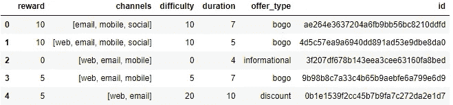

## 2.2 简介

> 年龄(int) —客户的年龄
> 成为会员日期(int) —客户创建应用账户的日期
> 性别(str) —客户的性别(注意，有些条目包含“O”代表其他人，而不是 M 或 F)
> id (str) —客户 id
> 收入(float) —客户的收入

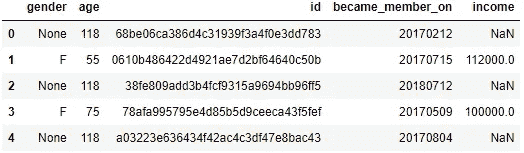

## 2.3 抄本

> 事件(str) —记录描述(即交易、收到的报价、查看的报价等。)
> 人员(str) —客户 id
> 时间(int) —测试开始后的时间(小时)。数据开始于时间 t=0
> 值—(字符串字典)—根据记录，可以是报价 id 或交易金额

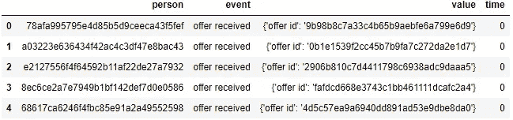

将注意力转向**配置文件和投资组合，它们是维度**表，而**交易是事实**类型。另一个观察，所有的数据处理是与图书馆熊猫。

当然，这篇文章没有所有的代码和解释，直到机器学习，**我策划了什么是更相关的知道这里**。但是，我建议你也打开并关注 [GitHub](https://github.com/matheusvclls/starbucks_offers/blob/main/starbucks_offers.ipynb) 上的完整项目。

当然，在探索性分析之前，有些数据域必须被处理。这是数据科学家花费大部分时间的地方，您将在下面进行探索。

# 3.数据争论

根据 [Forbes](https://www.forbes.com/sites/gilpress/2016/03/23/data-preparation-most-time-consuming-least-enjoyable-data-science-task-survey-says/?sh=7f7a141c6f63) ，**数据科学家 80%的时间用于准备和管理数据以供分析**。所以，就从这个辛苦开始吧。

## 3.1 缺失数据

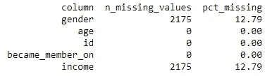

轮廓是唯一具有空值的数据帧，如左图所示。

由于它是一个维度表，所以与抄本数据帧中的 user_id 相关的**事件也被删除。**

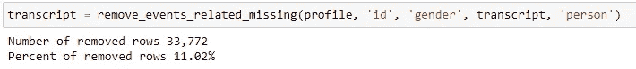

## 3.2 虚拟数据

在这一部分中，所有带字母的类别变量都被转换成数字(0 或 1)。比如性别，你可以在下面看到。

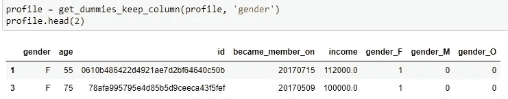

性别是原栏目。该函数负责转换新列中的所有类别值，即 gender_F、gender_M 和 gender_O。注意，原始列被保留，这是因为用 tem 更容易制作一些图形。

## 3.3 数据标签 id

因为您有一个与 offer 和 user 相关的大字符串。除了它们存储的内存大小，另一个原因是为了可视化。

因此，下面的函数为您完成了这项工作，用整数中的唯一值转换标签中的现有 ID。

## 3.4 合并数据帧

使用 pandas 的函数 merge，它允许将三个数据帧连接成**抄本(事实表)**。

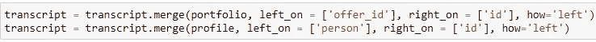

# 4.探索性分析

## 4.1 探索人口统计数据(个人资料数据框架)

为了对数据帧有一个大致的了解，熊猫的功能描述是有用的。

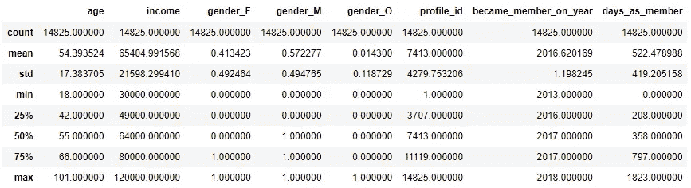

可以带点见识。它们是:

*   *75%的顾客年龄在 42 岁以上。均值为 54.39；*
*   *65，404.99 是收入的平均值，接近中位数 64，000.00；*
*   *关于性别，男性占 57.23%，女性占 41.34%，其他 1.43%；和*
*   *签约年份，即使有 6 年的数据。中位数集中在最近两年。*

## 4.2 按人口统计变量分列的用户数据分布

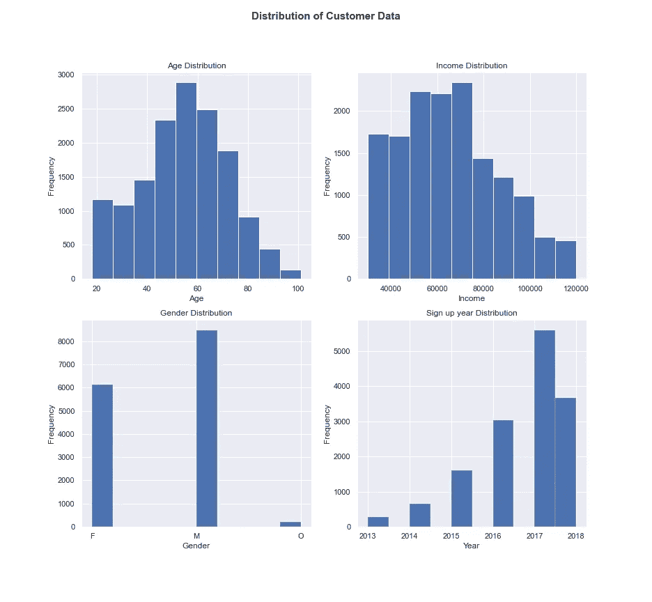

在这里，你可以看到上面的分布描述可视化直方图。

## 4.3 事件数据的分布

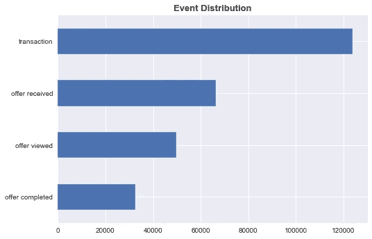

这是抄本数据帧的分布，列**事件**。

请记住，我们的目标是预测发出的报价，因此从现在开始，我们只过滤该数据框架的用户收到的报价**。**

## 4.4 收到的数据框架报价—概述

*   *总共向 14，820 名用户发送了 66，501 份报价。*
*   一个客户发送的最大报价数:6

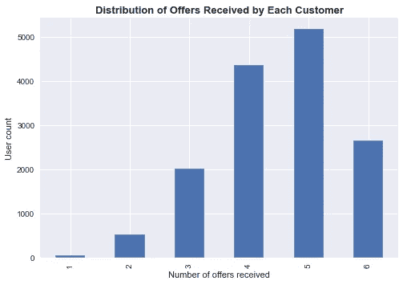

## 数据处理:创建已发送报价成功或失败的列

**数据帧中没有任何信息表明发送**的报价成功或失败。因此，这是必须完成的工作，以实现目标。

下面的代码**需要很长时间来处理**，但是我在编码的时候还没有找到替代的方法。set_event_time 设置完成或查看优惠的时间。

但这不足以创建成功完成要约的列，在此之后，时间被视为在时间完成之前。

因为我们没有关于信息完整报价的数据。让我们考虑这样一种情况，**在要约时间内，信息后面总是跟着一个交易，在用户查看之后，返回 1** 否则 0 表示要约成功完成。

## 4.5 总报价中已查看和已完成的百分比是多少？

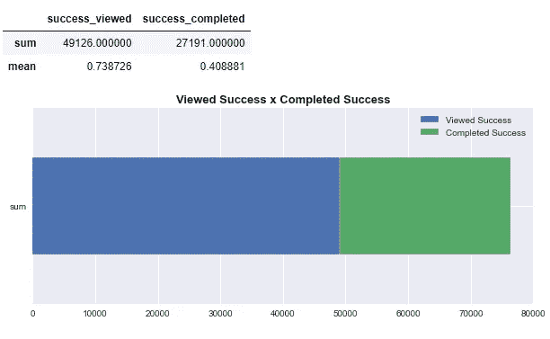

此图突出显示了与总报价相比的成功率。

## 4.6 什么报价的完成率最高？

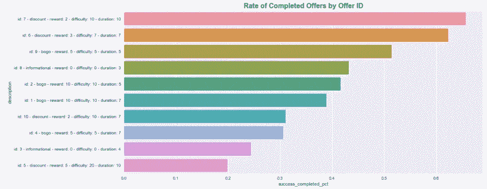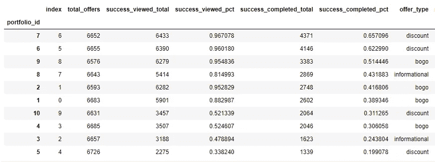

如我们所见，最佳价格是促销 id = 7，折扣为 2，花费 10，持续时间为 10 天。通过上面的表格和直方图，可以看到按 success_completed_pct 列排序的**。**

# 5.建立机器学习模型

最后，您已经准备好构建 ML 的模型了。

## 数据处理:消除列并选择 y 和 X 特征

不幸的是，但还没有，首先让我们删除分类性别 _F 和性别 _O。

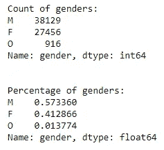

“其他”类型占 1%多一点。基于此，为了改进模型，**您也删除了女性这个变量，只保留男性(多数)。**

在对其进行处理并消除一些列之后，数据集准备好被分离成 **y(目标特征)**和 **X(输入特征)**。

## 5.1 建模

使用的模型如下，并带有 skit learn 网站的链接:

> [SVC](https://scikit-learn.org/stable/modules/generated/sklearn.svm.SVC.html)
> [朴素贝叶斯](https://scikit-learn.org/stable/modules/generated/sklearn.naive_bayes.GaussianNB.html)
> [随机森林](https://scikit-learn.org/stable/modules/generated/sklearn.ensemble.RandomForestClassifier.html)
> [梯度推进](https://scikit-learn.org/stable/modules/generated/sklearn.ensemble.GradientBoostingClassifier.html)
> [逻辑回归](https://scikit-learn.org/stable/modules/generated/sklearn.linear_model.LogisticRegression.html) [KNN](https://scikit-learn.org/stable/modules/generated/sklearn.neighbors.KNeighborsClassifier.html) [决策树](https://scikit-learn.org/stable/modules/generated/sklearn.tree.DecisionTreeClassifier.html)

如上表所示，有七种不同类型的模型。然而，在部署它的基本搜索之前，需要很长时间来运行**最佳分类方法和参数，这将在下面的**中解释。

上面，用选择了**参数的模型使用的代码来训练**。由数字表示的变量由接近默认值的值选择，分类不需要很长时间。这是一个需要很长时间的 SVC 的例子，因此只有一个参数需要测试。

如果你想更深入，看看 skit learn 的网站**，一个建立模型的库，有很好的记录，有关于参数的信息，详细说明了模型和它如何在桌子下面工作。**

现在，下一个函数构建模型，使用管道**用 StandardScaler()，**标准化数据，这样就不会因为数字的不同标度而产生偏差。这里使用的另一个**方法是 GridSearchCV()，用于优化超参数**。

使用 main()函数，您可以有组织地运行构建 ML 模型的所有步骤。你仍然可以看到许多模型和参数，这是真的，也许你认为这可能需要很多时间，但所创建的函数和下一节**使过程**自动化。

## 5.2 运行模型

## 5.4 评估模型

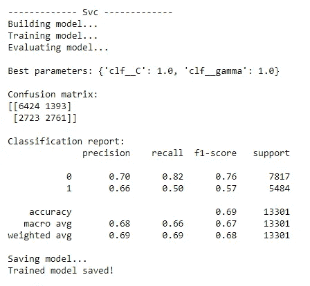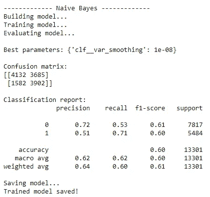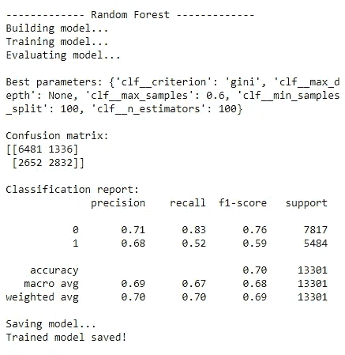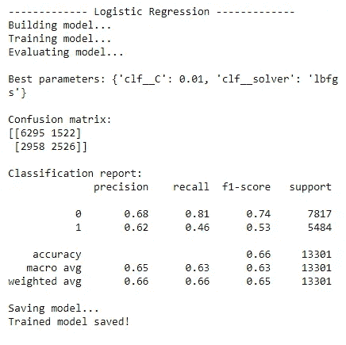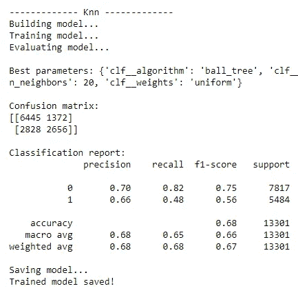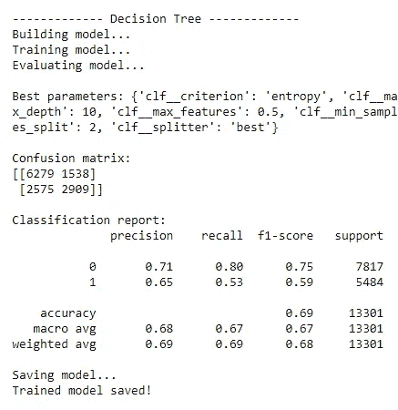

除了朴素贝叶斯，它呈现出最差的准确率，比第一个低 10%左右。**模型更好地预测了 0 类**，正如你可以看到的**召回和精度**的指标。

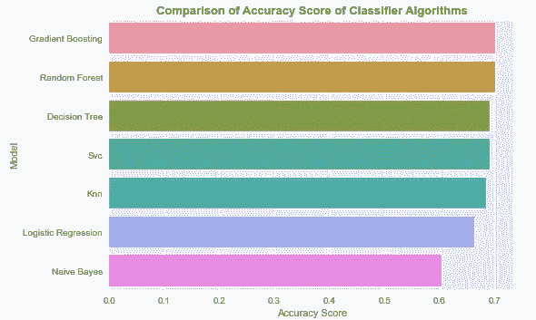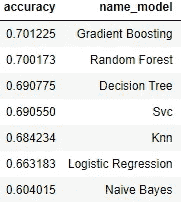

在运行之前声明的所有模型后，**梯度增强** **显示出最佳的准确度得分，其他指标非常相似**。所以，让我们用它来部署 ML 模型。

## 5.5 功能重要性

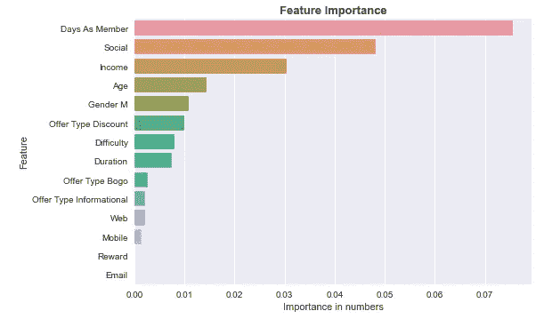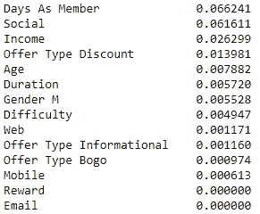

谈到功能重要性，模型最重要的是**【会员天数】****【社交】****【收入】**。

## 5.6 部署模型

下面，部署模型。这是一种应用程序，用来显示用户接受报价的可能性。

列表示要约 id，行表示用户 id。有了这个矩阵，就很容易理解用户和报价的概率，就有可能在这些变量之间进行比较。

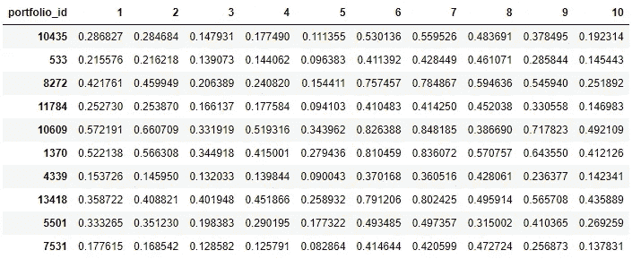

# 结论

这个项目的目标是**建立一个模型来预测客户接受发送给**的报价的概率。完成后，用梯度推进，准确率达到 70%。如前所述，在这个业务问题中，这个指标是有意义的，因为我们需要让**接受和不接受完整的**报价。

然而，准确性方面，需要改进的是类别 1 的召回率和精确度，因为它的比率比类别 0 低，大约 15%或 20%。换句话说，该模型预测未被接受的报价比被接受的报价更好。

在模型之外，数据处理和建立 ML 模型的步骤是用**通用函数**完成的，这些函数可以在**其他项目**中**应用**。所以，检查一下这个项目的 GitHub 库，并随意重用那些创建的函数。

特征**、【会员天数】、【社交】和【收入】**对模型学习最重要。但是，也许可以做的一件好事**是根据客户在交易中已经花费的金额创建一个功能，**它可以是这个价值的每月平均值。

在这个模型实现的真实世界中，有必要进行 A/B 测试。例如，**只发送完成几率超过 65%的报价，如果低于该目标，则不要发送**。一半的客户会遵守这一规则，另一半会照常发送。之后，比较两者的结果，看看是否有效。

另一点是函数 **set_event_time()需要很长时间来运行**，另一个需要很长时间的部分是函数 main()，因为它建立、训练、评估和保存模型，但这只是因为 skit learn 的函数，所以很难优化。

# 参考

[https://www.sec.gov/ix?doc =/Archives/Edgar/data/829224/000082922420000078/sbux-20200927 . htm](https://www.sec.gov/ix?doc=/Archives/edgar/data/829224/000082922420000078/sbux-20200927.htm)

https://en.wikipedia.org/wiki/Starbucks

[https://www . economist . com/leaders/2017/05/06/世界上最有价值的资源不再是石油而是数据](https://www.economist.com/leaders/2017/05/06/the-worlds-most-valuable-resource-is-no-longer-oil-but-data)

[https://scikit-learn.org/stable/](https://scikit-learn.org/stable/)