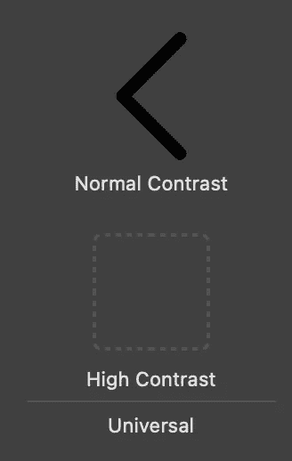
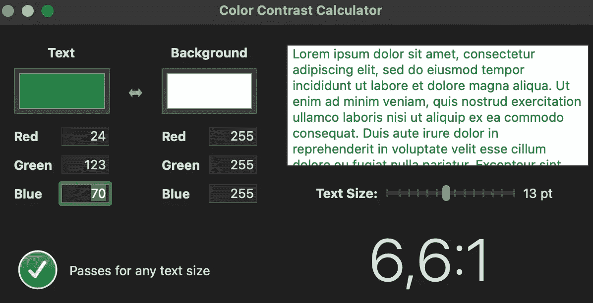
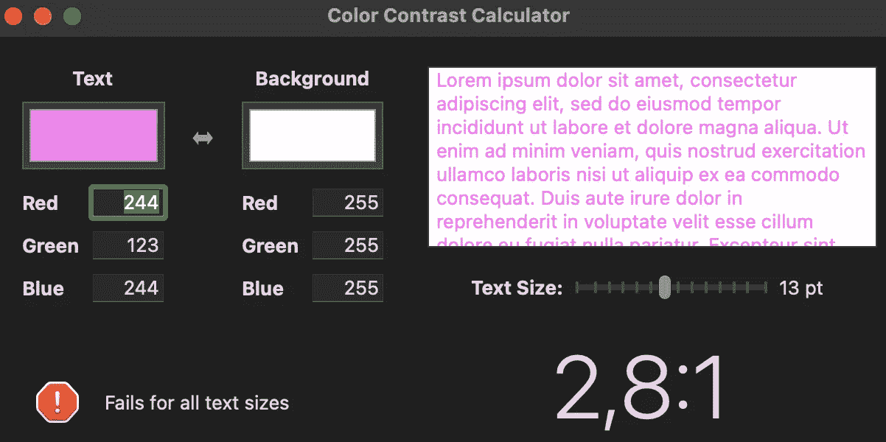

# 如何增加应用程序的可访问性？

> 原文：<https://medium.com/nerd-for-tech/how-to-increase-accessibility-of-the-application-d8de56b5974a?source=collection_archive---------18----------------------->

[Yura Fresh](https://unsplash.com/@mr_fresh?utm_source=medium&utm_medium=referral) 在 [Unsplash](https://unsplash.com?utm_source=medium&utm_medium=referral) 上的照片

# 什么是可访问性？

易访问性是使你的产品更易访问的一种方式。它定义了你为应用程序所做工作的质量。可能我们大多数人都听说过这些特性，但是没有想过要经常使用它们。辅助功能可以是画外音、增加文本大小等。正如我们在[苹果公司的人机界面指南](https://developer.apple.com/design/human-interface-guidelines/)中读到的，“全球大约七分之一的人有残疾，这影响了他们与世界和他们的设备互动的方式。”因此，使用辅助功能不仅仅是我们产品的一个优点。应该也是可以衡量质量的东西。

谈的是规模比较广的应用，比如手机银行。这些应用程序有几十万甚至几百万用户。随着产品规模的扩大，辅助功能的必要性也随之增加。当你的产品有这么多用户时，会有更多的人在使用你的应用程序时遇到问题。他们中的一些人甚至会发现无法与你的应用程序进行交互。如今，这也可能成为该应用发行商面临法律风险的原因。因此它不是“拥有就好”。在我们的产品中实现和改进易访问性是必须的。

对于 iOS 和 Android 平台来说，可访问性的重要性是众所周知的。因此，他们使得轻松使用这些基本功能变得相对容易。

# 如何增加应用程序的可访问性？

让我们来谈谈如何让你的应用程序具有可视化的可访问性。

当我们在做项目时，我们并不总是有 UI/UX 团队来帮助我们构建视觉上可访问的应用程序。因此，WWDC[给了我们一些提示，帮助我们实现无障碍应用。](https://developer.apple.com/videos/wwdc2020/)

**颜色和形状:**

当我们想让特定的物品在我们的视野中突出时，我们通常会选择不同的颜色。这不是一件好事，因为人们可能会发现很难区分颜色。形状是帮助我们在颜色旁边突出物品的工具。以标签栏为例，我们主要用不同的颜色突出显示标签栏的部分，以表示对相关项目的选择。但是启用辅助功能可以在这些项目周围添加形状。尽管这些形状并不完全可见，但从 iOS 14 开始，可以为这些按钮形状提供替代外观。

为了使您的应用程序对高对比度更加友好，有一种方法可以添加高对比度的符号。转到 XCode，打开 Assets.xcassets，选择您选择的资源，在检查器中，您会看到。

在外观中选择高对比度将为资产目录提供额外的选项。

XCode 的对比之旅并没有就此结束。它有一个颜色对比度计算器，可以给出颜色的对比度。

Xcode ->打开开发者工具->辅助功能检查器

窗口->显示颜色对比度计算器

这个计算器给出比率和提示，如果这些颜色对比匹配，以及它们是否应该用于不同的文本大小。

在这种情况下，我们可以看到比率 6，6:1 和绿色勾号，表明这些颜色通过了任何文本大小的测试。

在这种情况下，我们有一个 2.8:1 的比率，这太低了，因此测试没有通过，我们得到一个正确的消息“对于所有的文本大小都失败。”

**文本可读性:**

在开发的第一步，在应用程序中实现可访问性特性是很容易的。文本是我们应用程序的重要组成部分，有几件事应该考虑

*   设计时考虑大文本
*   换行标签而不是截断文本
*   符号和字形应随文本缩放

函数“traitCollectionDidChange”允许我们捕捉字体可访问性的变化事件。根据这些变化，应用不同的字体大小或改变用户界面的布局是提高可访问性的快速技巧。

**显示偏好:**

我们可能经常会用到[*ui visual effect*](https://developer.apple.com/documentation/uikit/uivisualeffect)*并且大多是*[*ui blur effect*](https://developer.apple.com/documentation/uikit/uiblureffect)*。*它们看起来和感觉都很独特，但是当降低透明度打开时可能会有问题。使用模糊效果时，背景上可能会有一些颜色，这会引起文本可读性问题。启用降低透明度会将模糊效果变成单一的纯色，从而使文本更具可读性。这样做的好处是 UIAccessibility 提供了 API 来检查是否启用了降低透明度选项。如何适应这些变化取决于你，但只要你这样做，你的应用程序将会给大多数用户留下很好的体验。**

****结论****

**易访问性是高质量产品的重要组成部分。随着应用程序规模的增长，辅助功能也应该随之增长。有很多方法可以提高应用程序的可访问性，在本文中，我们已经介绍了使用形状来突出一些项目。使用粗体文本以获得更好的可读性，使用系统颜色以支持明暗模式，并支持不同的对比度。在苹果的 API 和 XCode 工具的帮助下，这些功能的实现在应用程序的第一步非常简单。**