# 神经网络中权重如何初始化？

> 原文：<https://medium.com/nerd-for-tech/how-to-initialize-weights-in-neural-network-3b0126c1f775?source=collection_archive---------1----------------------->

## 关于三种最流行的权重初始化方法的直观而简单的教程可以帮助您为您的项目选择正确的方法。

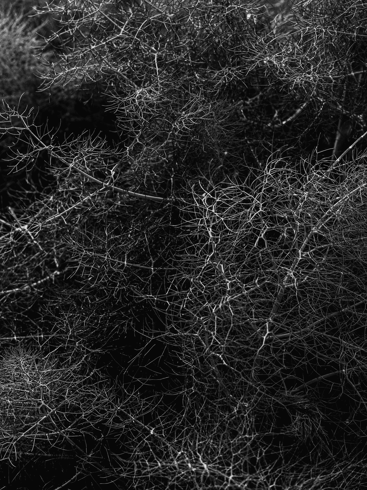

在 [Unsplash](https://unsplash.com?utm_source=medium&utm_medium=referral) 上 [Kier In Sight](https://unsplash.com/@kierinsight?utm_source=medium&utm_medium=referral) 的照片

# 介绍

权重初始化是一个模型设计参数，错误的选择可能会减慢或停止收敛。你可以把它看作损失函数景观的起点。

一个直观的猜测是从 0 开始，但它也导致 0 梯度，因此根本没有学习。

另一种选择是从分布中随机抽取点。在这篇博客中，我们将坚持高斯分布有两个参数，均值和方差。这些值定义了分布的范围。

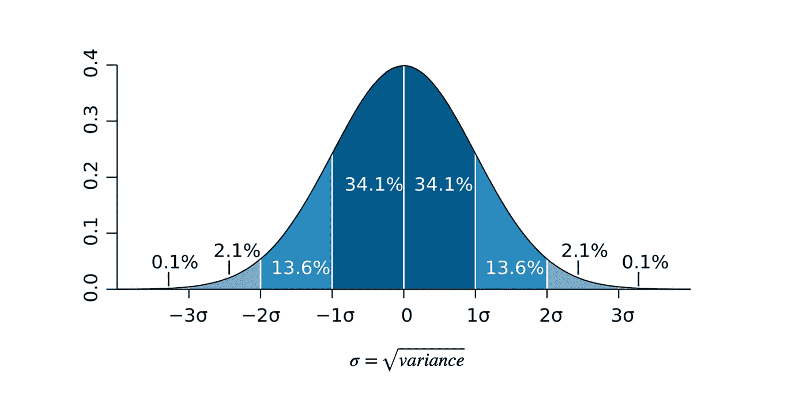

## 这都是关于方差的

假设我们有一个简单的感知器，我们传递输入 x。

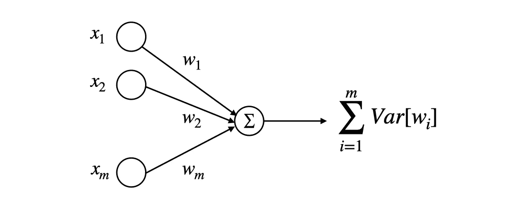

我们对每个权重的方差也进行了求和，这意味着它随着每一层而增长。这个总和输出有一个更大的**值分布**。

让我们在概念上的 10 层神经网络上测试一下。在现实生活中，训练这样的模型需要时间和计算能力。我们可以简单假设通过十层“网络”执行十次矩阵乘法，测量**层**之间的**均值和方差**。

如果你想看完整的代码，可以看看我的 Github

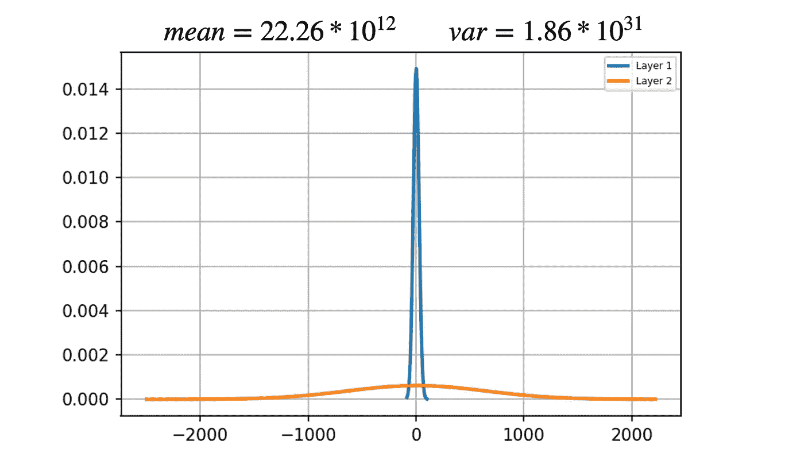

标题中的平均值和方差

如你所见，**方差已经在第二层展开**。绘制其余的值会使图表不可读。

主要的一点是，巨大的值在网络中是不受欢迎的。它们会使模型**变慢**并可能导致**爆炸梯度**问题。因此，我们希望在所有层中保持相同的分布。

# 乐村化

n-输入——输入数量

这是第一次尝试在整个网络中保持相同的方差。这是 PyTorch 目前使用的默认方法。我们只需根据进入该层的输入数量缩小初始化规模。

*我们的网络表现:*

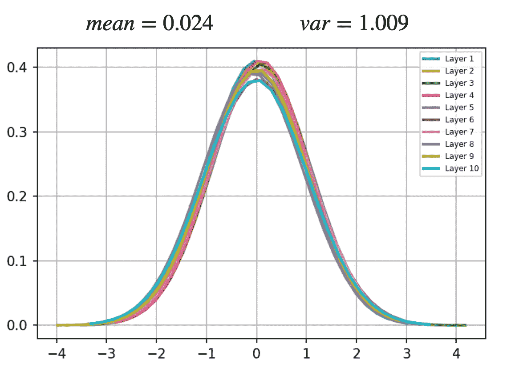

正如你所看到的，我们在整个模型中保持了相当相似的分布，但是我们忽略了一个重要的因素。

激活函数和反向传播如何影响方差？

# Xavier 初始化

Xavier 2010 年的论文讨论了激活函数和反向传播对整个网络方差的影响。他们计算出正切**后的方差减少**，并且**梯度** **在反向传播中消失**。

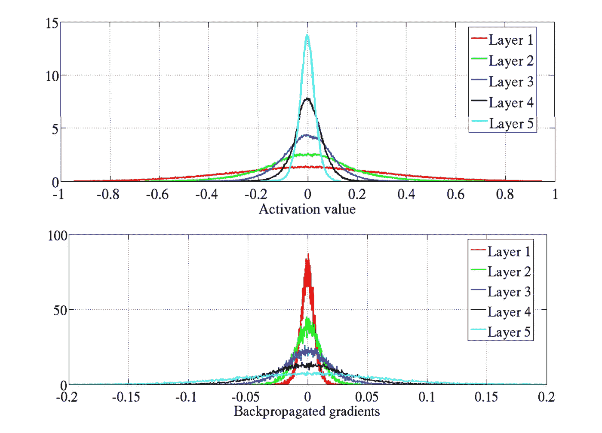

[1]

为了解决这个问题，他们引入了一种新的初始化方法，为对称点为 0 的激活函数创建，就像 Tanh 一样。并且还归一化了反向传播梯度的方差。

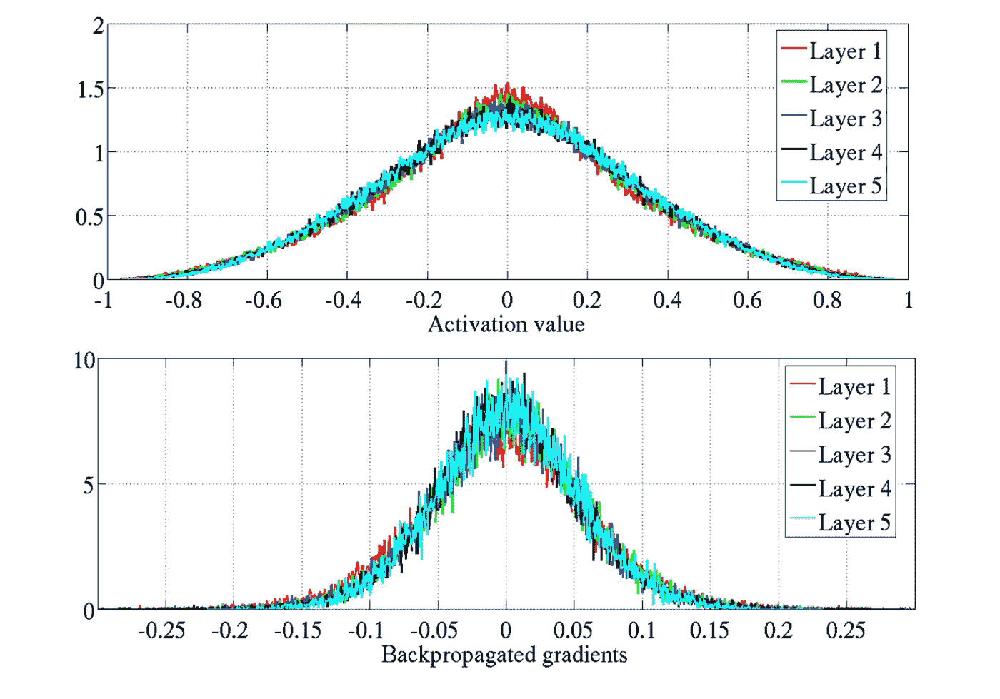

[1]

如果你想更深入地挖掘统计数据以及它们是如何产生的，我推荐这篇 [**博文**](https://pouannes.github.io/blog/initialization/) 。

*我们的网络性能:*

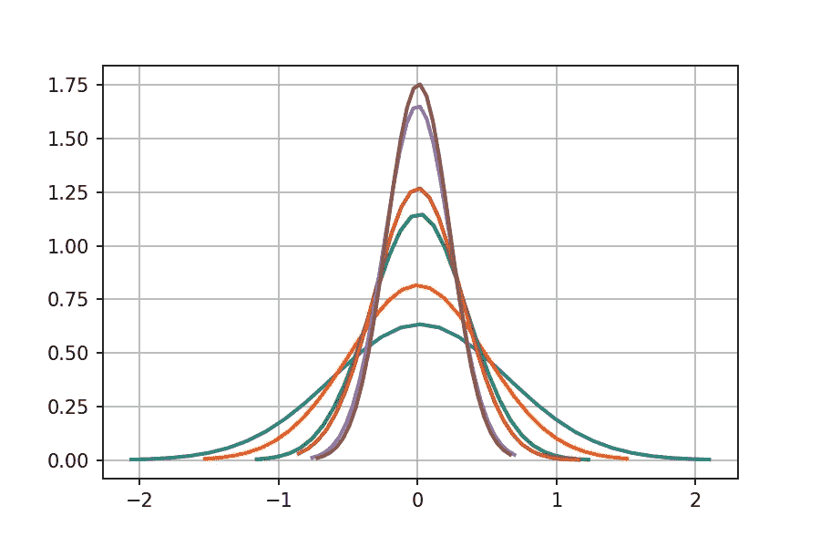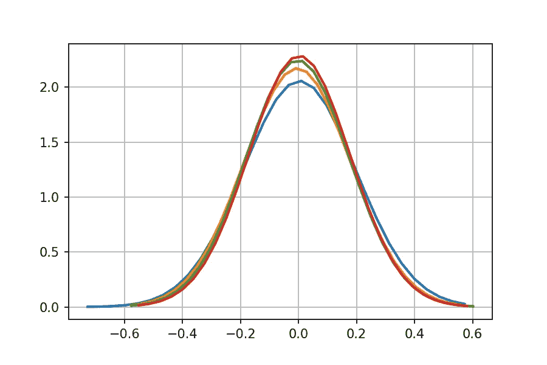

左:前 6 层，右:后 4 层

好的，所以只有当**的输入和输出数量等于**时，网络才保持相似的分布。

解释就是 Xavier 论文中使用的**网络**。他们的前馈模型每层有 1000 个隐藏单元。因此，他们取得的结果看起来很好，很顺利。

*那 ReLU 呢？*

由于 ReLU 是一个非对称函数，它在 Xavier 初始化中表现不佳。

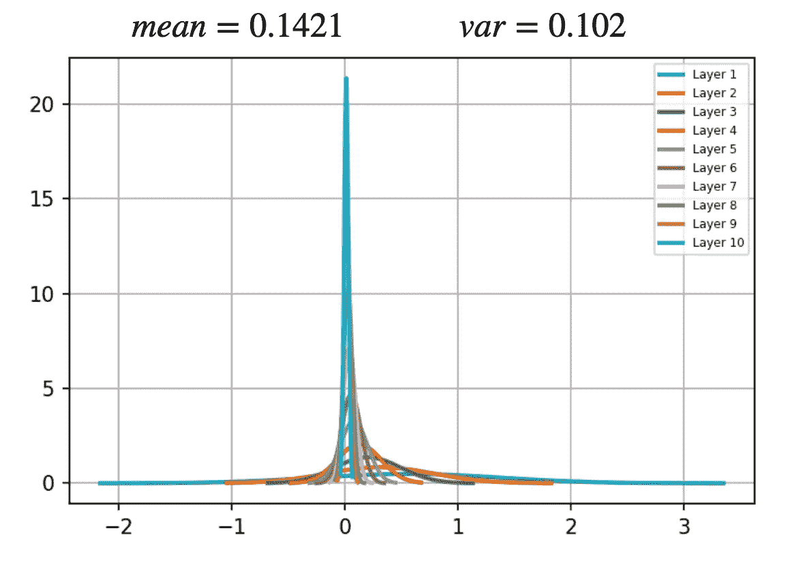

因此，在 AlexNet(2012)之后，大多数模型使用 0 均值和 0.01 标准差执行权重初始化。缺点开始出现在更深的模型中，更容易出现消失/爆炸梯度问题。最好的例子是 VGG19 模型，它必须使用来自预训练的 11 层浅层网络的权重。

# He 初始化

在 2015 年的一篇论文中，Kaimar 分析了 ReLU 函数对输出方差的影响，并提出了一种新的初始化。

*我们的网络表现:*

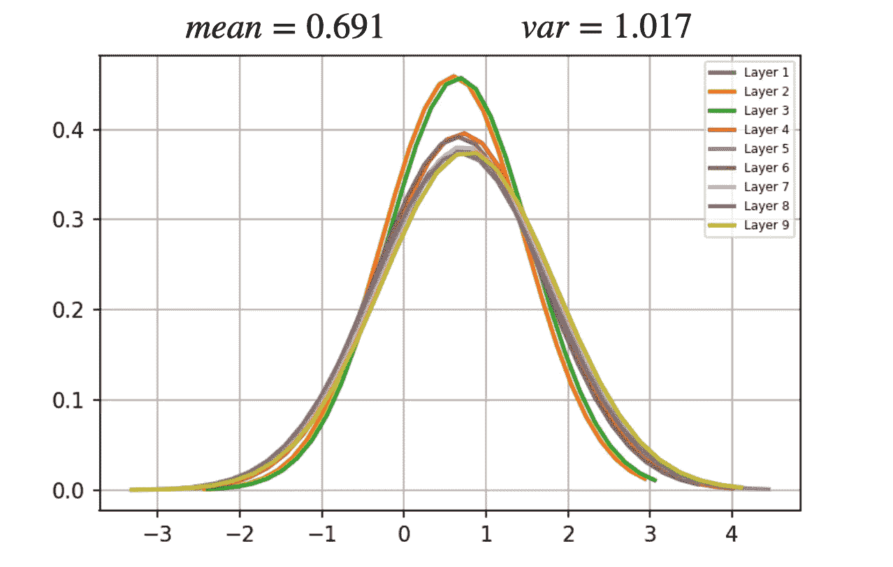

自从深度学习开始深入到 30 层以上。我还将我们的模型扩展到 50 层，并进行了测试。

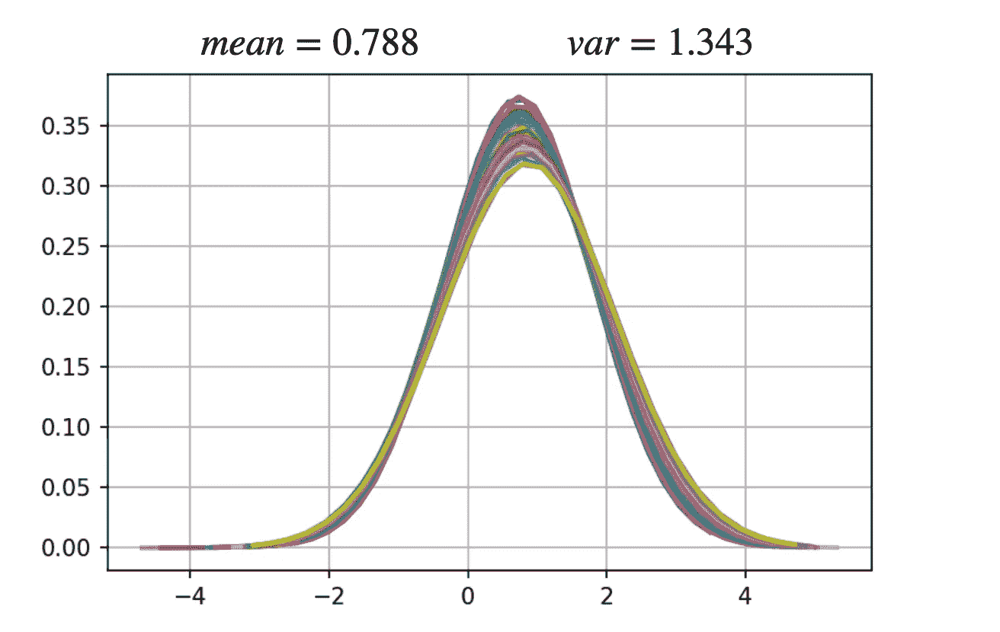

50 层网络

如您所见，初始化在所有层中保持相对相似的均值和方差。由于 ReLU 的非对称特性，均值明显偏移。

> 初始化用于训练图像识别纸深度残差学习中的**结果**。

# 讨论和结论

自 2015 年放开批量归一化后，权重初始化的意义降低。批量标准化缩小了每一层中的激活，这加速了计算并减少了爆炸梯度的问题。因此，*小心初始化*解决的一些问题得到了解决。

然而，Yang 和 Schoenholz[2]表明，Xavier 和 He 都不具有 ResNet 的最优方差，并且初始化应该依赖于深度。这证明了权重初始化仍然是一个活跃的研究领域。

这篇博客的目的是介绍不同的初始化技术，并提供更多关于神经网络如何工作的内幕。希望我的解释和可视化能帮助你理解它，并激发你进一步探索这个话题。

查看我的 [**中型**](https://maciejbalawejder.medium.com/) 和 [**Github**](https://github.com/maciejbalawejder) 简介如果你想看我的其他项目。

# **参考**

[【1】](https://proceedings.mlr.press/v9/glorot10a/glorot10a.pdf)了解训练深度前馈神经网络的难度

[【2】](https://arxiv.org/pdf/1712.08969.pdf)平均场残差网络:混沌边缘