# 如何在 Ubunto 18.04 上安装配置 Hadoop 3.2.1

> 原文：<https://medium.com/nerd-for-tech/how-to-install-an-configure-hadoop-3-2-1-on-ubunto-18-04-fcaea7348027?source=collection_archive---------16----------------------->


在本教程中，我们将在带有**单节点的 **ubunto** 上安装和配置 **hadoop** 。**

首先，我们需要:

**虚拟盒子**——[https://www.virtualbox.org/wiki/Downloads](https://www.virtualbox.org/wiki/Downloads)

**18.04**——[https://releases.ubuntu.com/18.04/](https://releases.ubuntu.com/18.04/)

之后，我们将在 virtual box 上安装 ubunto 来做这件事。

*   [https://brb.nci.nih.gov/seqtools/installUbuntu.html](https://brb.nci.nih.gov/seqtools/installUbuntu.html)

在我们的设置完成之后，我们将开始打开 ubunto 上的终端:

使用以下命令检查是否安装了 ja:


如果没有安装 java，请键入以下命令:


之后，我们将创建 haddoop 组用户:


之后，我们将创建一个名为 hadoopusr 的新用户:

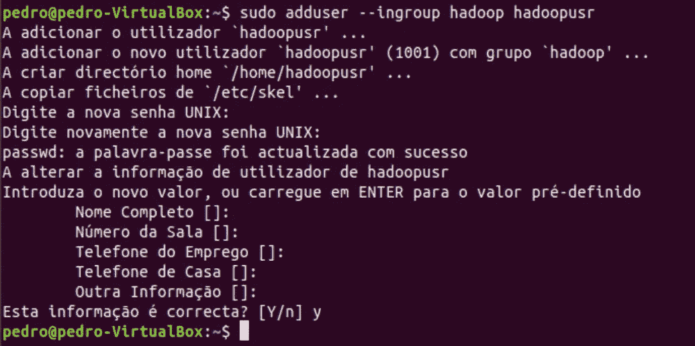

接下来是以下命令:

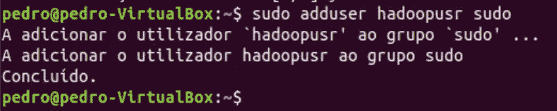

**下一步是安装和配置 ssh。**

要安装 OpenSSH 服务器，只需键入以下命令:

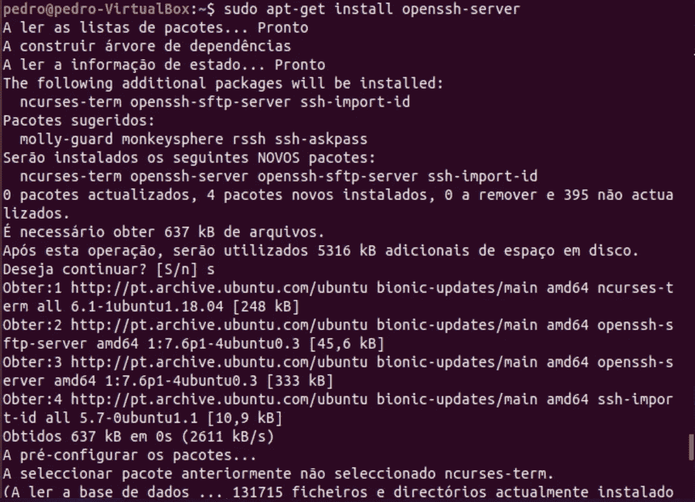

Hadoop 使用 SSH 来访问节点，在这种情况下，一旦它是单个节点，我们就必须对其进行配置以访问本地主机。

让我们使用之前创建的 hadoop 用户进入:

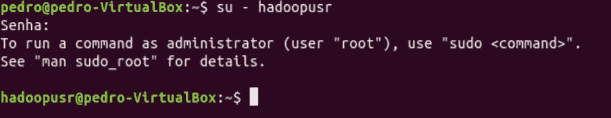

之后，我们将为 hadoopusr 生成一个公共 SSH 密钥:

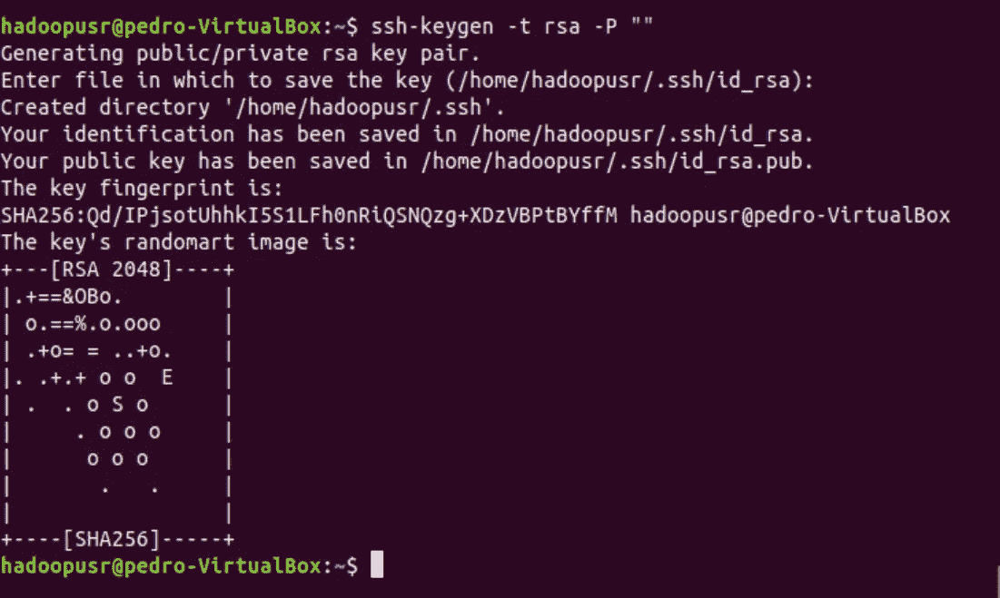

现在让我们将生成的密钥添加到 authorized_keys 列表中:

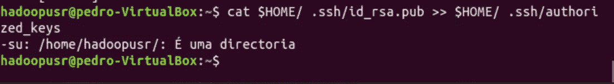

让我们验证 SSH 配置:

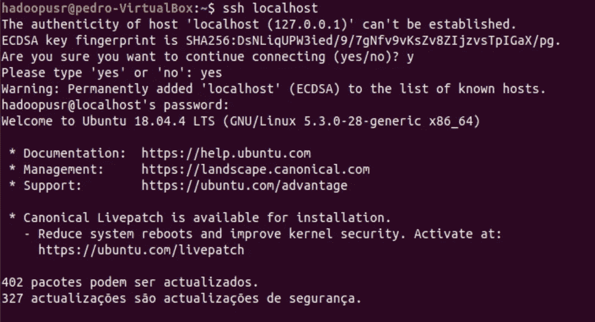

要完成连接，只需键入:


下一步是下载 do Hadoop 2.9.1。该文件将放在桌面上:

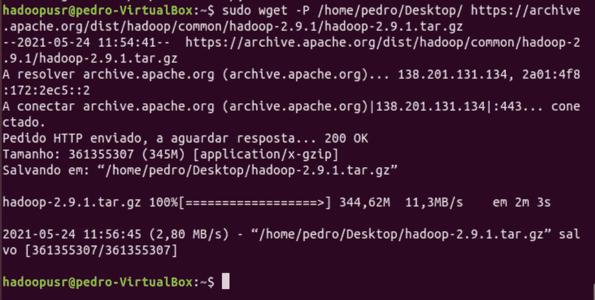

现在转到 Dektop 并解压缩 hadoop 文件夹:

```
cd /home/pedro/Desktop
sudo tar xvzf hadoop-2.9.1.tar.gz
```

然后将文件夹移动到目录 **/usr/local/hadoop:**

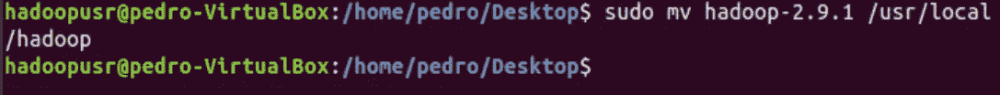

下一步是将“hadoop”文件夹的所有权分配给用户 hadupusr:

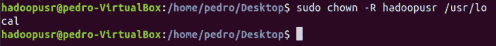

现在让我们配置几个文件来配置 Apache Hadoop，首先在文件 **~/上定义变量。巴沙尔:**


文档打开后，您应该在最后放置以下代码:

> 导出 HADOOP _ HOME =/usr/local/HADOOP
> 导出路径=$PATH:$HADOOP_HOME/bin
> 导出路径=$PATH:$HADOOP_HOME/sbin
> 导出 HADOOP _ map red _ HOME = $ HADOOP _ HOME
> 导出 HADOOP _ COMMON _ HOME = $ HADOOP _ HOME
> 导出 HADOOP _ HDFS _ HOME = $ HADOOP _ HOME
> 导出 YARN _ HOME = $ HADOOP _ HOME

现在执行以下代码:


现在让我们编辑文件 hadoop-env.sh 并定义变量 JAVA_HOME:

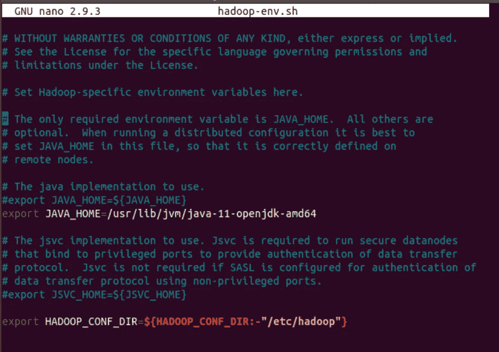

之后，让我们配置 **core-site.xml:**

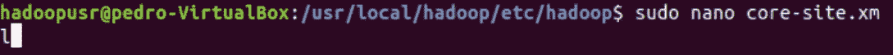

在配置中添加以下代码:

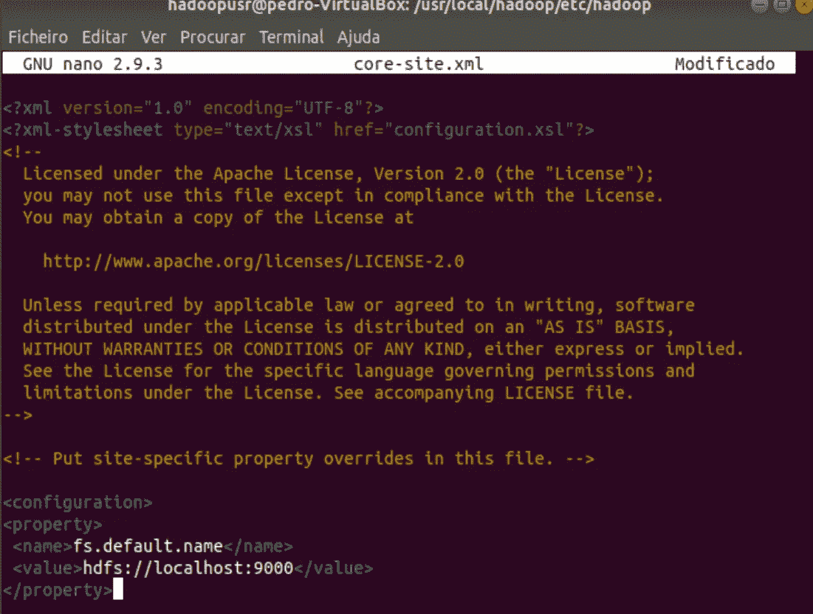

下一个文件是 **hdfs-site.xml:**

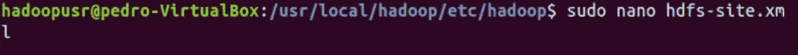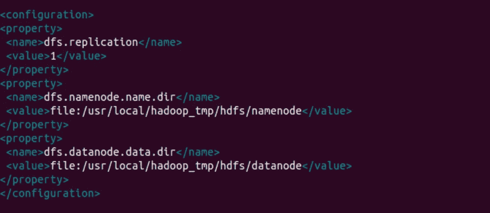

下一个文件是 **Yarn-site.xml:**

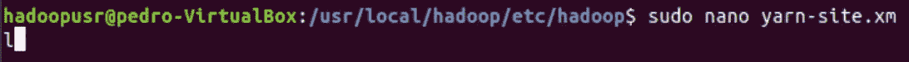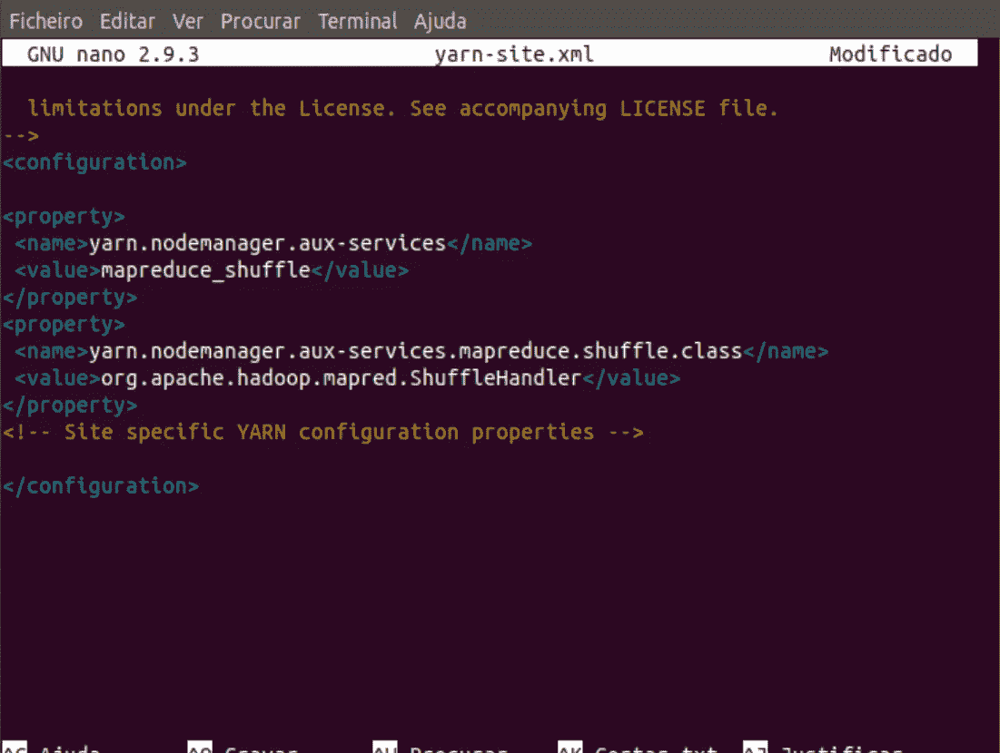

下一个文件是 **mapred-site.xml.**

为此，我们复制一份文件 **mapred-site.xml.template** ，并将新文件命名为 **mapred-site.xml:**

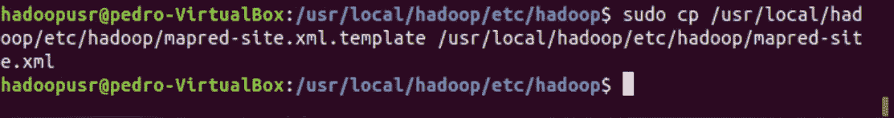

创建文件后，让我们编辑它:

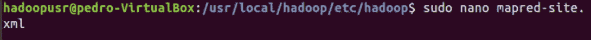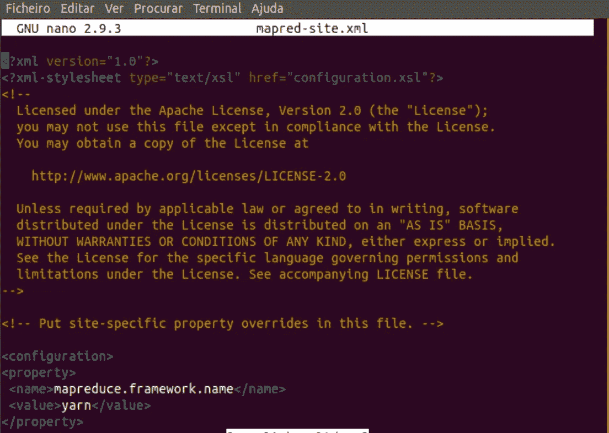

现在让我们创建两个文件夹到 **namenode** 和 **datanode** :

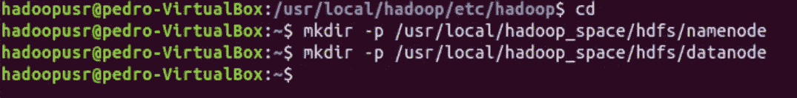

现在配置完成后，我们将把文件夹" **hadoop_space** "的所有权分配给用户 **hadoopusr** ，然后使用以下命令格式化 namenode:

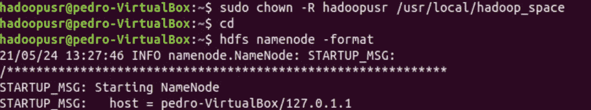

现在让我们启动 hadoop 服务:

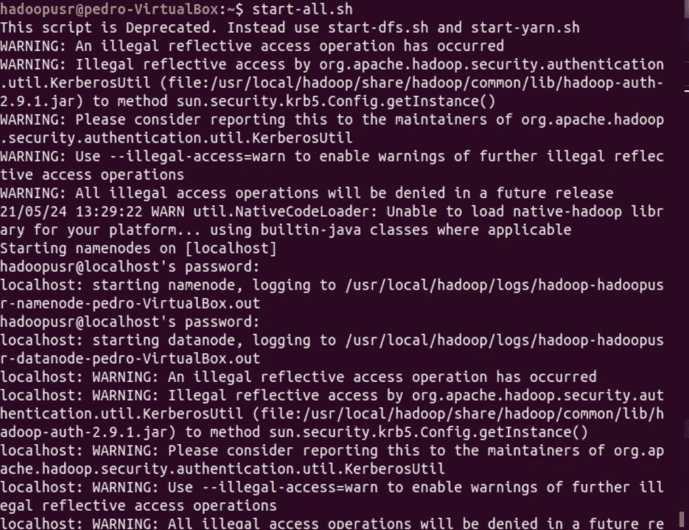

为了查看所有服务是否都正确启动，我们运行了以下命令:

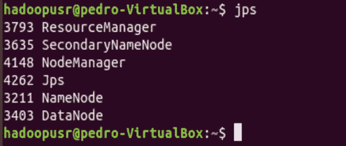

要访问 Apache Hadoop 管理界面，只需打开浏览器并插入以下 url:

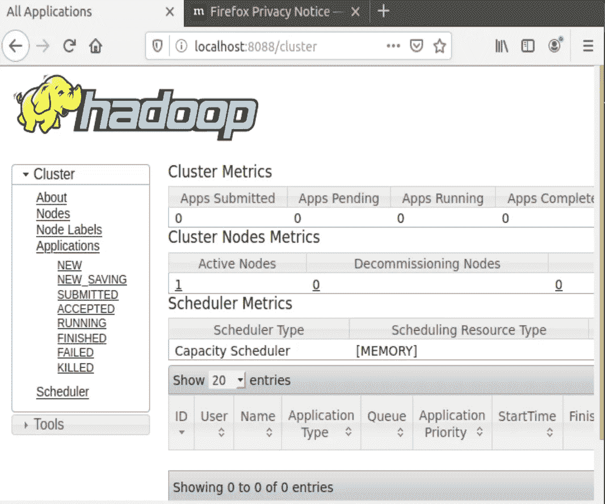

就是这样，我们创建了一个单节点群集。