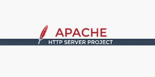
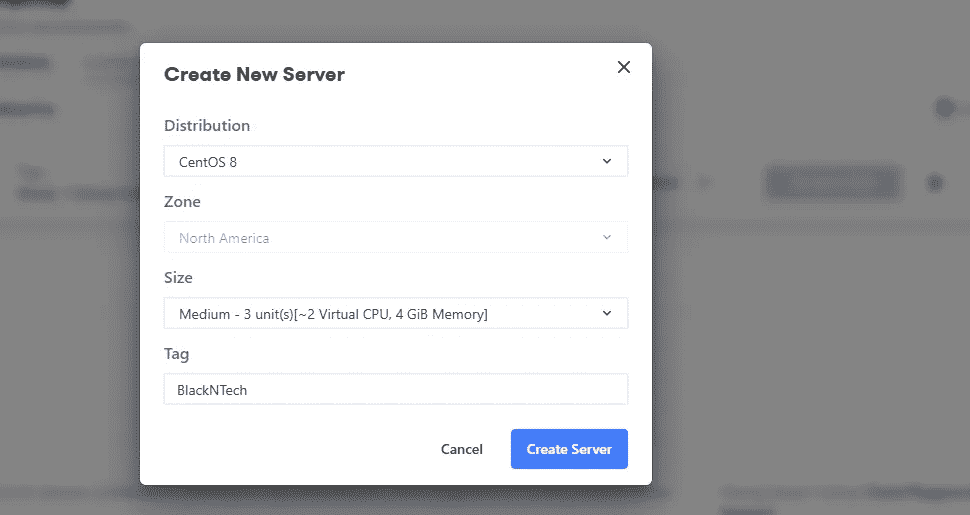
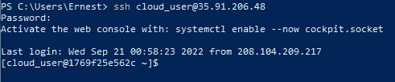
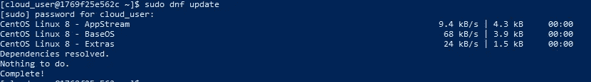
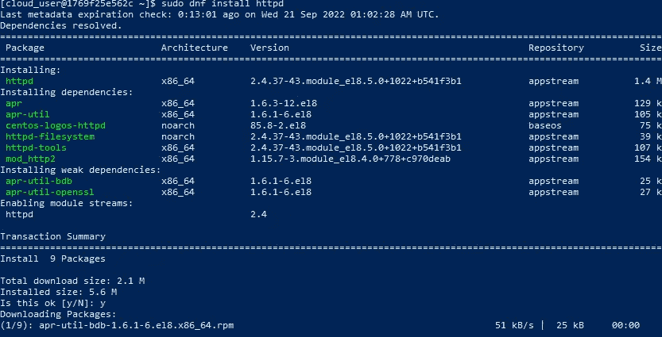
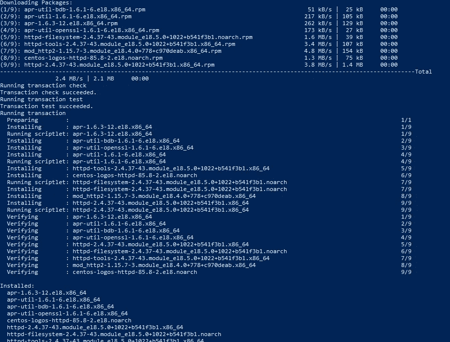
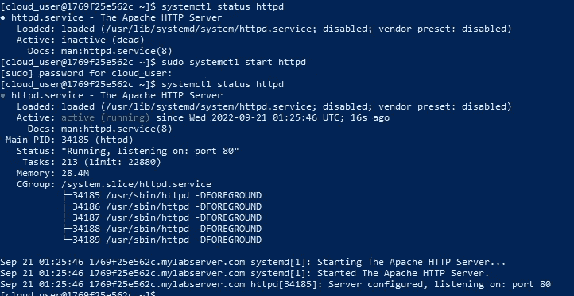
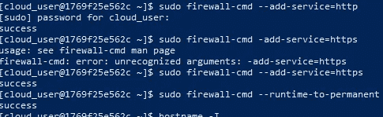
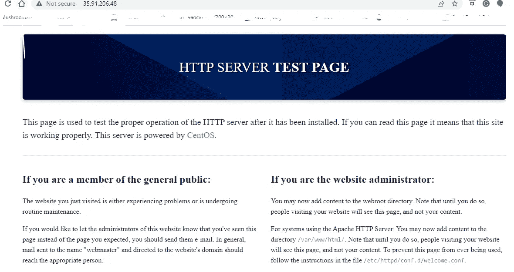

# 如何使用 Windows PowerShell 在 CentOS 8 上安装和测试 Apache Webserver

> 原文：<https://medium.com/nerd-for-tech/how-to-install-and-test-apache-webserver-on-centos-8-using-windows-powershell-604c5480a5be?source=collection_archive---------2----------------------->

嘿，大家好！这是我在科技升级的第一个项目，这是一个好项目。我的第一个项目是关注如何在 Linux 下的 CentOS 8 主机上安装 Apache web 服务器。为了显示这一点，我将使用 Windows PowerShell 来测试和运行我的命令。我主修历史，在我们开始之前，我想提供一些我们将在文章中使用的技术的历史事实。

# **关于 Linux 的事实:**

。Linux 是一个开源操作系统，由 Linus Torvald 于 1991 年发布。

。Linux 提供了许多服务，例如，无论是 web 服务器(Apache)还是电子邮件服务器(PostFix)。

。Linux 是我们日常生活的一部分，因为它在我们日常使用的技术中无处不在。Android 操作系统是一个很好的例子，因为它由 Linux 开源软件组成。

# 关于 Apache 的事实:

。Apache 只是一个 web 服务器软件，它是开源的，可以通过互联网提供 web 内容。

。它是网络上仅次于 NGINX 的非常流行的 HTTP 客户端。两者都有不同的产品，但是 Apache 比 NGINX 更好的地方是 Apache 有更多的功能和特性。

。世界上超过 67%的 web 服务器使用 Apache！

这是阿帕奇的标志

我们开始吧！！！

**第一步:**为了打好基础，我们想创建一个我们将远程接入的云服务器。我能够通过一位云计算专家来实现这一点。

创建基础。

**第二步:**一旦我们的服务器启动并运行，我们需要" **ssh** "进入它。我可以通过 Windows PowerShell 做到这一点。在那里，我们将输入我们的临时凭据，并创建我们自己的唯一凭据。一旦我们的证书被接受，我们就成功了！

**步骤 3:** 在测试 web 服务器之前，我们要确保所有的包都已更新。在安装任何东西之前，我们希望确保我们使用的是最新的功能&安全性。这表明我们正在采取正确的措施来确保我们这边的一切都是安全的。我们通过使用“ **sudo dnf update** ”命令来实现这一点。Sudo 在 Linux 中给了我们更高的特权。

完整！让我们知道更新已经完成

**步骤 4:** 接下来，我们将安装我们的 Apache Web 服务器。我们输入命令“ **sudo dnf install httpd** ”。从那里，这将下载和安装文件和模块需要运行我们的服务效率。

我们安装信息的第一部分

Apache 安装信息的第二部分。

**步骤 5:** 一旦我们安装了 Apache，我们就要检查 web 服务器的状态，看它是否处于活动状态。最初，我运行我的“ **systemctl status httpd** ”命令，认为它将是活动的，但是我遇到了“ **inactive(dead)** 状态。通过研究，我能够通过运行“ **sudo systemctl start httpd** ”命令获得如何启动我的 web 服务器的信息。我再次运行我的“**系统状态 httpd** ”命令，我能够显示活动(运行)状态。

**第 6 步:**我们想要设置防火墙规则，以便访问我们的网页。我们希望确保端口 80 和 443 是开放的，以便其他人可以访问该网页。这是我们的游戏改变者！我这样称呼它是因为我在运行 ifconfig 以获取我的 ip 地址来测试我的网页后无法访问它，但这是研究正确命令的地方。为了设置我们的防火墙规则，我们运行“**sudo firewall-cmd—add-service = http**”和“**sudo firewall-cmd—add-service = https**”。为了让我们的更改更加持久，我们运行**“sudo firewall-cmd——运行时到永久**”。如果所有 3 个命令都正确运行，我们将从运行的所有 3 个命令中获得一个“ **success** ”输出。

第七步:在我们的最后一步中，我们想通过在网络浏览器中输入我们的 IP 来测试它。我用我的一个云大师公共 IP 实现了这个。一旦我在我的地址栏输入了我的 IP 地址，我就可以得到我的测试网页了！！！

我们现在有了一个可行的测试页面！

我希望每个人都觉得这篇文章有趣，内容丰富。这对我来说很有趣，因为我能够从我的历史学位中学习到我的可移植的详细研究技能，因为我以前从未安装过测试 web 服务器。所以我很乐意犯错，并从我的测试 web 服务器的错误中吸取教训。请关注我未来的更多项目！