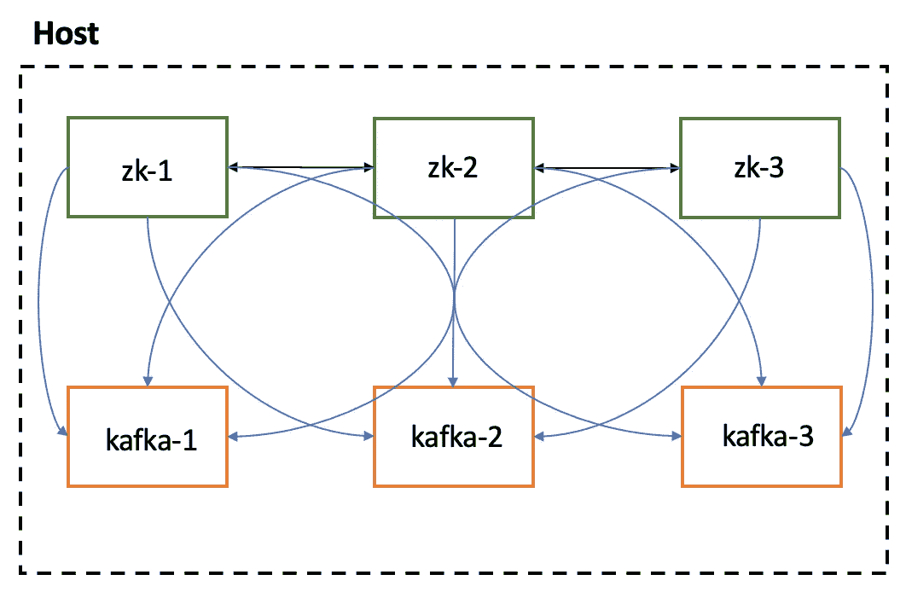

# 如何使用 Docker 安装 Kafka

> 原文：<https://medium.com/nerd-for-tech/how-to-install-kafka-using-docker-fe2e70f650d8?source=collection_archive---------1----------------------->

安装并配置 Docker 环境，以便在本地运行 Apache Kafka

使用 Apache Zookeeper 和 Apache Kafka 的 Docker 环境拓扑—来自作者

# 介绍 Apache Kafka 生态系统

Apache Kafka 是一个开源的分布式事件流平台，被数千家公司用于高性能数据管道、流分析、数据集成和任务关键型应用程序。