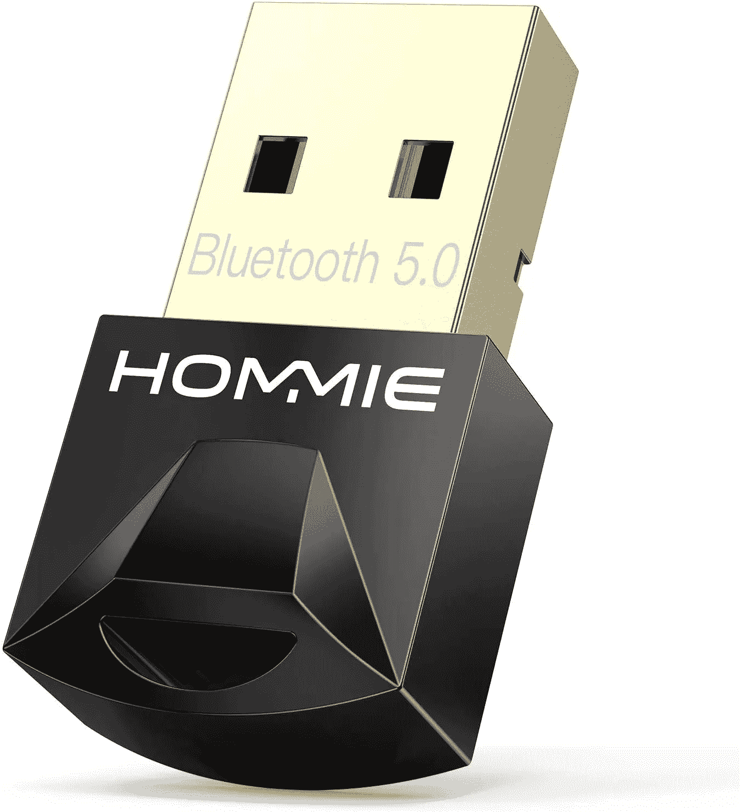
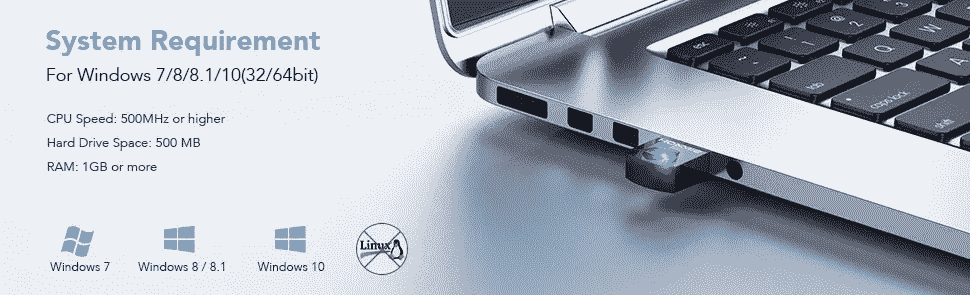

# 如何在 Linux 上安装不支持的蓝牙 5.0 加密狗

> 原文：<https://medium.com/nerd-for-tech/how-to-install-unsupported-bluetooth-5-0-dongle-on-linux-4bf34aa99fed?source=collection_archive---------0----------------------->


我在亚马逊**上买了一个便宜的蓝牙加密狗，没有仔细阅读**的特性……现在我必须告诉你一个小**的故事**。



我买的加密狗…

我的一台家用台式电脑不支持蓝牙 5.0，因为双模连接和更快的速度，我需要一台。

所以我盲目地订购了我能找到的最便宜的加密狗…没有对我未来的设备做更多的研究。

在它到达后，我无法让它在我的 Linux 机器上运行。

我在另一台 *Windows 10 Pro* 机器上进行了测试，它*工作*。

所以我回到制造商网站，然后我看到了这个:



不兼容 Linux:(

因此，在做了一些研究后，我试图自己解决这个问题，阅读设备的官方文档，我看到加密狗有一个 RTL8761B 芯片组，所以知道这一点会使过程更容易找到和修复。

这些将是在 Linux 中成功安装加密狗**的步骤，在本例中，*基于 Debian 的 Linux* 。**

**为了检查这个问题，我使用了" *dmesg* "命令来获得关于错误的更多信息。**

```
sudo dmesg | grep Bluetooth
```

**你会看到这样的东西…这意味着我们需要为这个芯片组安装固件，因为文件不在那里。**

****

**因此，让我们遵循这些小步骤来让它发挥作用:**

1.  **导航到这个网址下载芯片组驱动压缩文件，我在官方 Arch 包里找到了:[https://aur.archlinux.org/packages/rtl8761b-fw/](https://aur.archlinux.org/packages/rtl8761b-fw/)(如果这个链接不行，下面为个别文件添加新链接)
    -[https://raw . githubusercontent . com/Realtek-open source/Android _ hardware _ Realtek/RTK 1395/BT/rtkbt/Firmware/BT/RTL 8761 b _ config](https://raw.githubusercontent.com/Realtek-OpenSource/android_hardware_realtek/rtk1395/bt/rtkbt/Firmware/BT/rtl8761b_config)
    -[https://raw](https://raw.githubusercontent.com/Realtek-OpenSource/android_hardware_realtek/rtk1395/bt/rtkbt/Firmware/BT/rtl8761b_fw)**
2.  **解压缩下载的文件**
3.  **导航到驱动文件所在的位置，在我的例子中是在*2020 12 02 _ LINUX _ BT _ DRIVER/rtkbt-firmware/lib/firmware/RTL BT***
4.  **现在我们必须将固件文件复制到*/usr/lib/firmware/RTL _ Bt*，并将其重命名为*。bin* 扩展，为此我们需要 *sudo* 的权限。我们需要两个文件: *rtl8761b_config* 和 *rtl8761b_fw***

```
sudo cp rtl8761b_config /usr/lib/firmware/rtl_bt/rtl8761b_config.binsudo cp rtl8761b_fw /usr/lib/firmware/rtl_bt/rtl8761b_fw.bin
```

**5.复制完文件后，我们需要再次拔掉 USB 加密狗或重新启动您的电脑，并再次检查“*dmesg”*命令，如果一切顺利，丢失文件错误“*未找到*”将不再存在。**

**6.就是这样…享受你的蓝牙 5.0 连接:)**

> **注:如果您的 Linux 操作系统在将来升级固件，您将需要再次重复这些步骤，以便在升级后安装设备驱动程序，因此我建议好好阅读如果系统升级也将升级固件，如果出于任何原因您的蓝牙加密狗停止工作…您知道该怎么做。**

> **我希望这个迷你指南能帮助像我一样的人:)**