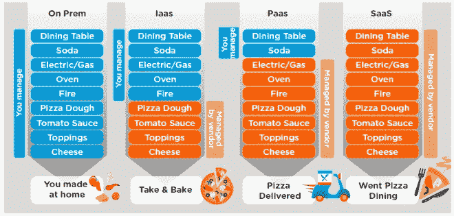
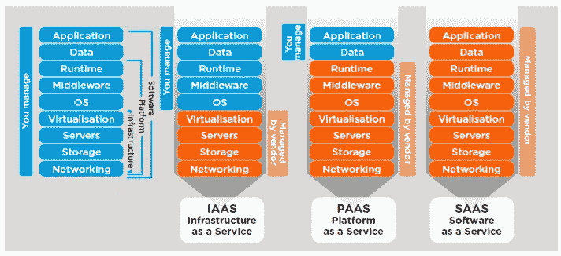
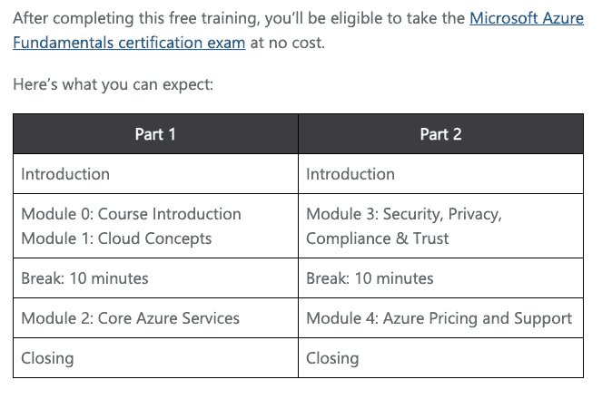
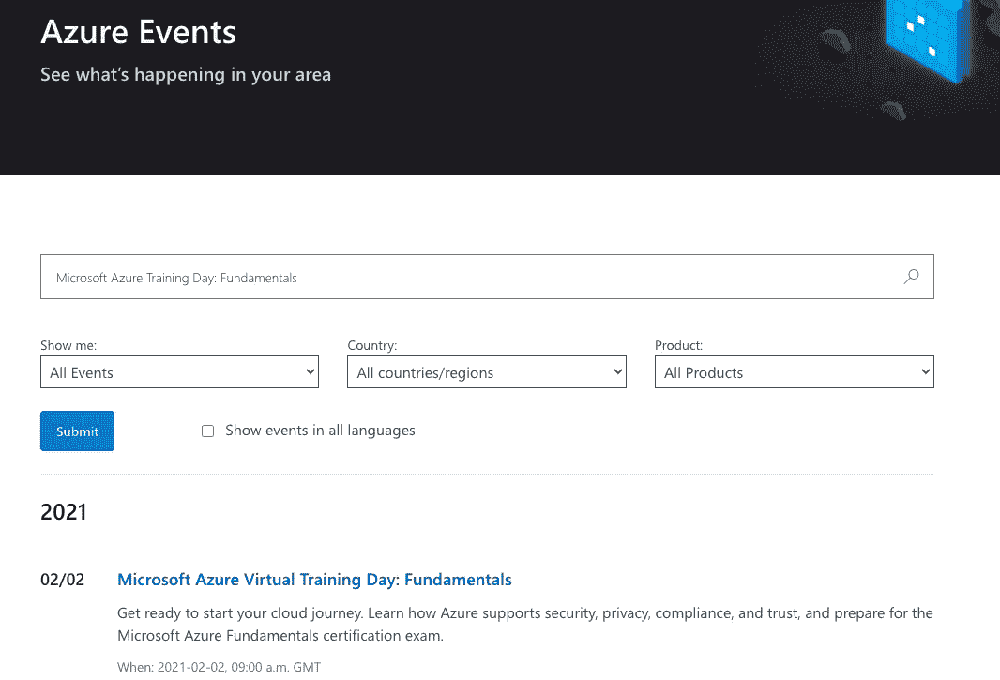
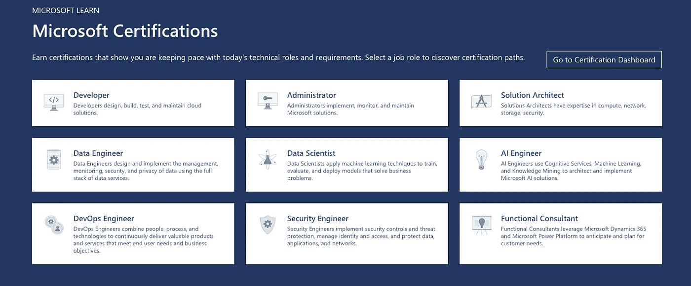
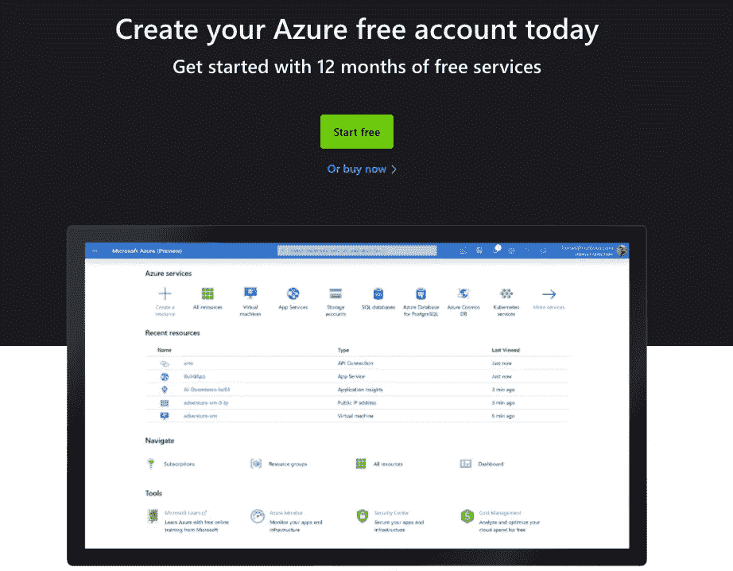
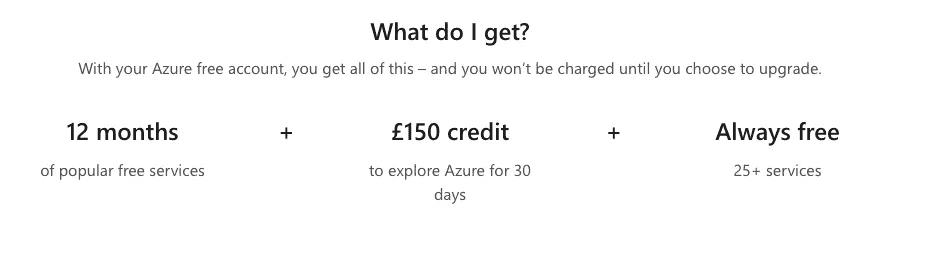
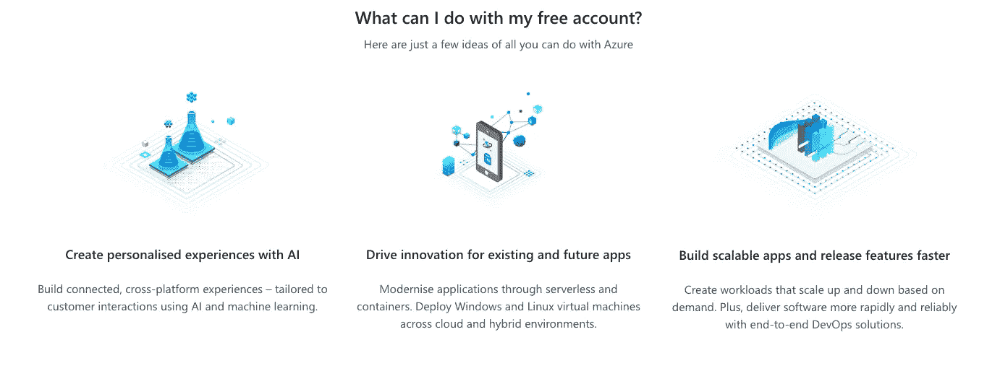

# 如何在微软 Azure cloud 开始职业生涯？

> 原文：<https://medium.com/nerd-for-tech/how-to-kick-start-a-career-in-microsoft-azure-cloud-e71b3a210259?source=collection_archive---------3----------------------->

当我们作为初学者谈论 Azure cloud 时，我们想到的第一个问题是，我从哪里开始，我如何学习 Azure cloud。在这个数字世界里，网上有太多可用的材料，但是从正确的选择开始才是最重要的。

在本文中，我们将讨论 Azure 云、最佳可用资源、获得实践和认证途径。

先说一个很基本的问题，**Azure 是什么？** Azure 是微软提供的一个云平台，它提供了一系列广泛的产品和服务，帮助您解决那些依赖本地数据中心托管其应用程序和数据的客户所面临的挑战性问题。Azure 允许您在云中构建、运行和管理应用程序和数据，在内部数据中心、云和边缘设备之间进行大规模通信。

# 三个

与市场上的任何其他云提供商一样，Azure 有三种不同的云产品，它们被称为基础设施即服务(Iaa **S** )、平台即服务(Paa **S** ) 和软件即服务(SaaS**S**)。

SaaS**S**—软件提供商按需托管应用程序，并通过互联网提供给最终用户。

Paa **S** —为开发者提供了一个完整的环境来开发和部署互联网上的东西。

Iaa **S** —为用户提供执行业务流程和任务的硬件。

并不总是需要使用所有这三种服务，因为它们是单独提供的，也可以相互结合使用。

以比萨饼为例，可以很容易理解这三种产品是如何工作的:)

# 3 V 的

某些关键因素决定了一个用例需要哪些云产品和/或服务，设置所需资源的成本取决于这些因素。这些因素被称为**3v——音量、速度和变化**。我将在接下来的文章中讨论这些。3 V 主要适用于大数据架构，但肯定可以扩展到云中的其他应用程序架构。作为一名顾问，一开始就把这件事做好是很重要的。

> *记住，拥有云平台的成本就像给汽车轮胎充气，太多会损坏轮胎，太少会导致失败。它只需要适量就能保持高效运转。*

# Azure 基础知识

了解 Azure 的基础知识应该是迈向 Azure 之旅的第一步。

有大量的文章和课程是收费的，但是当这些都可以从微软免费获得时，为什么还要花钱呢？使用 Azure 创建个人帐户将帮助您跟踪您的课程和完成百分比。

可以通过链接[https://docs . Microsoft . com/en-us/learn/certifications/azure-fundamentals](https://docs.microsoft.com/en-us/learn/certifications/azure-fundamentals)访问该课程

Azure 基础知识的学习路径包括以下内容:

1.  Azure 的核心概念
2.  核心 Azure 服务
3.  Azure 中的解决方案和管理工具
4.  安全和网络功能
5.  治理和合规性特征
6.  成本管理和服务水平协议—还记得汽车轮胎吗:)

该课程将最终引导您成功获得 Azure 基础知识(AZ-900)证书。认证需要费用，而且通常以当地货币计价。与其他证书相比，这一成本是最低的。但是，这里有一个来自微软的交易。如果你参加 Azure 培训日活动，这是一个针对 Azure 基础知识的虚拟讲师指导课程，微软将为你提供一张参加 AZ-900 考试的免费代金券。

可以使用您的个人帐户访问虚拟培训活动，课程将在一天内完成。一般来说，课程分两部分进行，每部分有 10 分钟的休息时间。

这在不同的时区都可用。先决条件是注册参加活动。这可以通过链接 https://azure.microsoft.com/en-ca/community/events/?的[来实现查询=微软+Azure+培训+日% 3A+基础知识](https://azure.microsoft.com/en-ca/community/events/?query=Microsoft+Azure+Training+Day%3A+Fundamentals)

在写这篇文章的时候，只有 2 个与基础课程相关的事件，但是请继续关注这个空间，因为微软几乎每天都在更新它们。

# Azure 认证路径

微软根据经验水平提供各种认证。我建议回顾一下微软提供的认证途径，选择最适合你的角色和兴趣的。基础认证没有任何先决条件，而助理和专家级认证有一些先决条件，您需要满足这些条件才能参加考试。

该列表可以从 https://docs.microsoft.com/en-us/learn/certifications/[获得](https://docs.microsoft.com/en-us/learn/certifications/)

# 蔚蓝动手

成为云顾问的愿望或目标永远不会实现，除非你在该平台上有了实际/实时的体验。微软帮助你实现这个愿望。微软在一定时间内免费提供这些服务。不只是一两个月，是 12 个月免费。

你可以通过链接[https://azure.microsoft.com/en-gb/get-started/](https://azure.microsoft.com/en-gb/get-started/)访问并创建一个账户

好吧，12 个月是很有吸引力，但是，我能得到什么呢？现在，这是你得到的。

我可以用我的帐户做什么有任何限制吗？微软确实允许你探索它提供的几乎所有其他服务。

在最初的 12 个月里，你可以免费获得大量的产品和服务，也有一些产品你可以一直免费享用。这些都列在我在本节开始时分享的链接中。

> *记住，微软定期更新他们的政策。12 个月免费期内的任何产品或服务可能会被删除，或者 Microsoft 可能会在此列表中添加新产品和服务。请注意微软的这一空间*

我希望这篇文章对你有所帮助，并为你提供急需的信息来提升你的 Azure 体验！

这是我在博客世界的第一篇文章，非常感谢你的意见和反馈。欢迎在 Linkedin 上联系我进行讨论。

# 让我们学习，帮助别人学习！

*版权:本页面的部分内容归美国华盛顿州雷蒙德市微软公司所有。*