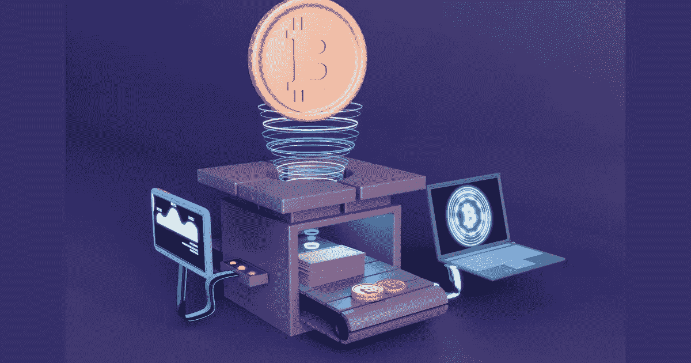

# 如何了解密码交易所开发的基础知识？

> 原文：<https://medium.com/nerd-for-tech/how-to-know-basic-things-about-crypto-exchange-development-3899caa0bf75?source=collection_archive---------13----------------------->

## C **瑞普托交易所发展:世界级加密交易软件 A-Z**

rypto 交易已经成为数字世界的趋势。他们计算了建立一个平台可以获得的财富数量，因此有许多交易所正在建立。交换平台的增长非常显著，许多公司将此作为一种习惯，并通过其令人难以置信的加密货币交换发展壮大了许多企业家。

这些公司提供各种各样的交换服务，可以吸引大量的观众，但你知道在加密王国漫游的交换平台是什么类型吗？

# **加密货币兑换软件开发:种类**

特别是在讨论 DeFi 应用程序的开发时，有许多不同的加密交换平台，每个平台都有其独特的特征。如果我们分解不同类型的加密交换平台，我们可以更好地了解每种类型的加密交换平台在开发方面提供了什么，以及在为贵公司创建加密货币交换网站时如何使用它。

## **集中交易所(CEX)**

用户必须将他们的数字资产存放在集中交易所(CEX)，以便在网上市场进行交易。平台由运营方提供，运营方也从交易中收取佣金。用户可以使用这个平台来购买、出售和存储加密货币。

## **分散交易所(DEX)**

区块链技术由[去中心化交易所](http://bit.ly/3FdzT2o) (DEX)使用，这是一种相对较新的交易所类型，使加密货币的交易更加容易。由于不需要第三方持有加密货币，它们是分散的，没有人可以控制你的钱。但是，它们不与特定的服务器或业务相关联。如果你想开办比特币交易所或另一种知名加密货币交易所，这很有帮助。

## **点对点交流(P2P)**

点对点交易(P2P)使得买家和卖家可以通过一个在线平台进行直接交流。买家使用他们喜欢的支付方式直接支付给卖家，卖家自己设定商品或服务的价格。

## **混合加密交换**

混合加密货币交易所将集中式和分散式交易所的各个方面结合在一起。除了在使用平台服务时给予用户对其资产的某种程度的控制之外，这些平台通常具有监管交易的某些方面(例如安全性)的中央机构。

你可以选择最好的交易所，然后再去找那些帮助你为未来建立一个完美交易所的公司。但是您知道您添加的特性数量可能会决定您平台的未来吗？

# **需要整合到系统中的特性**

## **以下是必备功能列表:**

✏授权和验证
✏交易引擎系统
用于存款/取款的✏加密钱包
✏内部 API
✏管理面板
✏分析仪表板
✏通知和警报
✏帮助和支持系统
与银行卡集成
交易历史

既然你已经有了自己的特色，你需要知道雇佣一个 [*密码交易开发公司*](https://bit.ly/3Y78Del) 的好处，以及他们创造的关键步骤。

# 雇佣一家开发交易所的公司的有趣好处

与经验丰富的加密交换开发公司合作有很多好处。以下是它们的列表:

## **他们具备必要的知识和专长:**

与专业开发公司合作有这样的好处，这是它最重要的好处之一。他们有一群经验丰富的开发人员，技术高超，能够创建一个既安全又易于使用的平台。

## **他们提供有效的项目管理:**

与经验丰富的企业合作还有另一个好处，那就是他们可以提供有效的项目管理。在开发过程的每个阶段，您都将得到他们的项目经理团队的帮助。

## 他们提供全天候的支持

大多数信誉良好的企业都提供全天候的客户服务。您可以随时与他们联系，他们会帮助您解决问题。

## **他们帮助你的交易所进行营销和推广:**

你可以从一个好的开发公司那里得到交换营销和推广方面的帮助。他们会对你的平台产生兴趣，并吸引更多的用户使用它。

## **强大的维护和援助:**

专业公司不仅创造了一个奇妙的平台，还提供了坚实的维护和支持。这意味着，如果您在将来的交易中遇到任何问题，他们将帮助您找到迅速有效的解决方案。为了确保您的加密货币交易所的成功，除了建立它之外，您还必须正确地维护和支持它。为此，您应该与一家声誉良好的加密交换开发公司合作。

# **开发加密货币兑换软件的步骤**

**(i)构思—** 构思是做任何生意的第一步。

**(二)预算计算—** 在着手创建平台之前确定预算。

**(iii)法律效力问题—** 在继续使用平台之前获取法律效力。

**(iv)组建团队—** 组建开发人员团队的必要性及其他摘录，以使您的平台正常工作。

**(五)技术启动—** 使用每一堆操作，搭建平台，测试，然后部署。

在总结之前，您需要了解它们提供的好处，因为这将有助于您创建有史以来最成功的平台。

# **加密交换开发的 5 大优势**

确保你充分利用数字货币繁荣的一个好方法是建立一个加密交易业务。启动自己的加密货币交易平台将为您提供塑造公司长期成功的机会。

★强劲的需求
★高盈利潜力
★简单可扩展
★额外的业务可能性
★增加投资回报

# **包装完毕！**

最好的加密货币交易所开发公司可以帮助您以最特殊的方式创建平台。您可以轻松地建立自己的平台，并利用。他们的特点和好处可以让你信任他们，并在未来发展你的业务。所以，跟着流程走，和最好的公司一起开发你自己的密码交换。