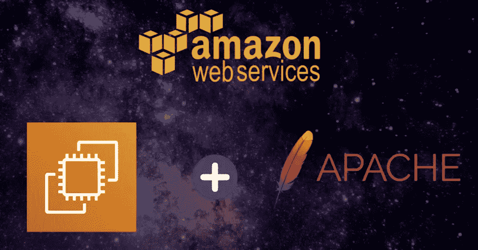
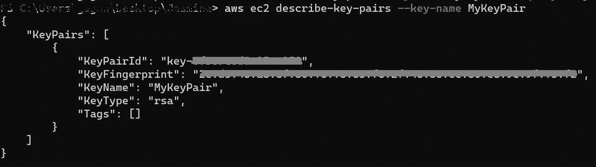
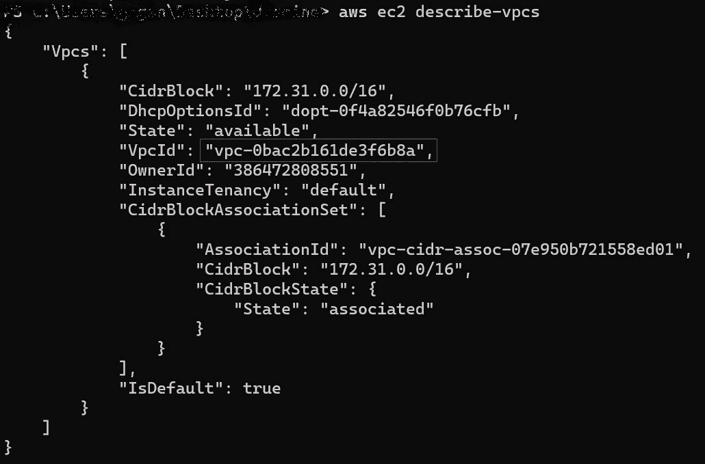
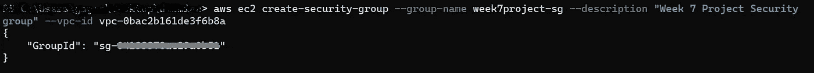
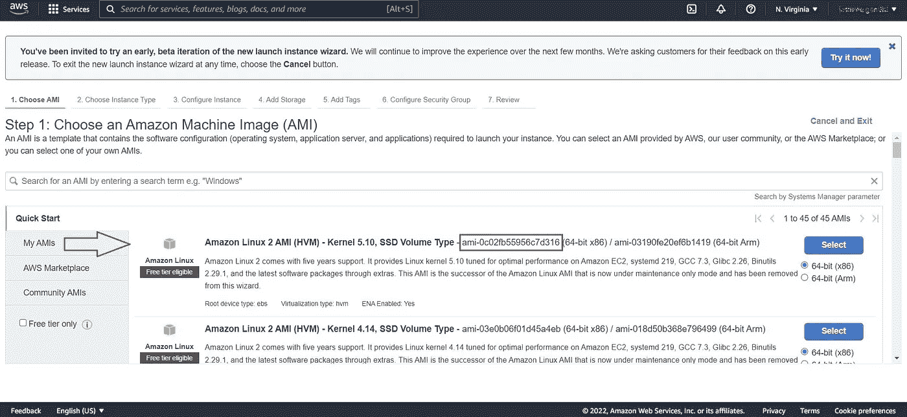
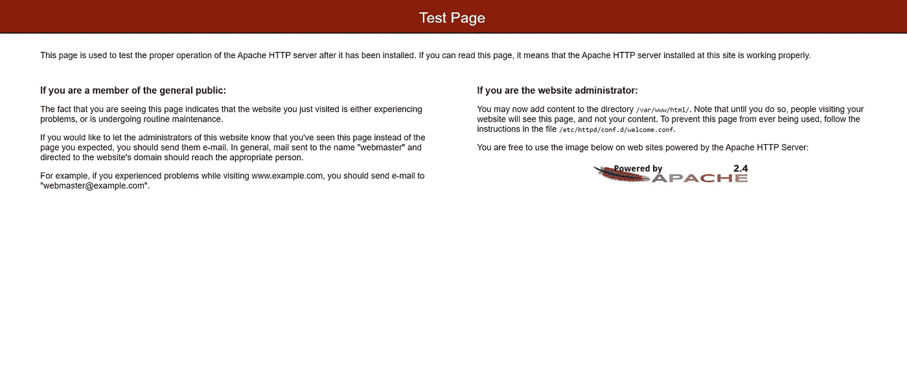

# 如何使用 AWS CLI 通过 Apache 服务器启动 EC2 实例

> 原文：<https://medium.com/nerd-for-tech/how-to-launch-an-ec2-instance-with-apache-server-using-aws-cli-d75b23bb909e?source=collection_archive---------1----------------------->



# **简介**

AWS 是云计算领域的市场领导者和顶级创新者。它帮助公司处理各种各样的工作负载，如游戏开发、数据处理、仓储、存档、开发等。但是，AWS 不仅仅是引人注目的浏览器控制台。

在本项目中，将向您介绍 AWS CLI(命令行界面)。AWS CLI 使您能够通过脚本自动化控制和管理 AWS 服务的整个过程。这些脚本使得用户可以轻松地完全自动化云基础架构。

# 目标

在这个项目中，您将使用 AWS CLI 通过 Apache Webserver 创建一个 EC2 实例。实例类型应该是 t2.micro .并且您最终需要验证 Apache Webserver 是使用公共 IP 地址下载和安装的。

# 先决条件

*   有权允许 AWS EC2 访问的 AWS IAM 用户帐户
*   AWS CLI 已安装和配置(参见[本](https://docs.aws.amazon.com/cli/latest/userguide/getting-started-install.html)文档获取帮助)
*   Vim 文本编辑器已安装

# 现在让我们开始吧！

## **创建 AWS EC2 密钥对**

EC2 密钥对用于在连接到实例时进行身份验证。首次创建实例时，必须向 AWS EC2 提供密钥对。使用以下命令创建密钥对。

```
aws ec2 create-key-pair --key-name MyKeyPair --query 'KeyMaterial' --output text > MyKeyPair.pem
```

要验证是否已经创建了密钥对，请使用以下命令。

```
aws ec2 describe-key-pairs --key-name MyKeyPair
```



## 为 AWS EC2 创建安全组

AWS 安全组作为防火墙运行，其规则决定哪些网络流量可以进出。

要创建一个安全组，首先你需要知道 VPC(虚拟私有云)ID 号。使用以下命令找出默认的 VPC。

```
aws ec2 describe-vpcs
```

这将显示 VPC 信息，如下所示:



请记下这个 VPC 身份证号码。您需要该 ID 来创建安全组。

现在使用下面的命令创建一个安全组。

```
aws ec2 create-security-group --group-name <Enter a group name> --description "Enter a description" --vpc-id vpc-0bac2b161de3f6b8a
```

将创建一个安全组，如下所示:



请记下 GroupId 号。你以后会需要它的。

## 向安全组添加规则

安全组中添加了规则，以允许通过您的方式连接到映像的传入网络流量。

例如，如果您想要启动一个 Linux 实例，您通常会添加一个规则来允许 TCP 端口 22 上的入站流量支持 SSH 连接。

此外，您可能希望人们能够通过端口 80(即 HTTP)访问您的 web 服务器。

第一步是找到你的 IP 地址。使用以下命令启动:

```
curl [https://checkip.amazonaws.com](https://checkip.amazonaws.com)
```

接下来，输入以下命令来添加规则，以便对同一安全组中的实例启用 SSH:

```
aws ec2 authorize-security-group-ingress --group-id <group id> --protocol tcp --port 22 --cidr <ip address>
```

现在，对于端口 80，输入以下命令:

```
aws ec2 authorize-security-group-ingress --group-id <group id> --protocol tcp --port 80--cidr *0.0.0.0/0*
```

## 创建用于引导 EC2 实例的脚本

为了确保 AWS 在 EC2 实例上安装 Apache，编写一个 bash 脚本，该脚本将在安装实例时执行。使用 vim 编辑器，通过以下命令打开一个脚本文件:

```
vim userscripts.sh
```

一旦打开一个空文件，按“I”键进入插入模式。在脚本中输入以下代码。完成后，点击“Esc”并按下“:wq”保存并退出。

```
#!/bin/bash
sudo yum update -y
sudo yum install httpd -y
systemctl enable httpd
systemctl start httpd
```

这段代码将首先更新所有的包，然后安装 apache。最后两个命令将启动并启用该服务。

## AWS EC2 设置先决条件

您还需要选择一个 Amazon 机器映像(AMI)来创建 EC2 实例。为此，请转到[这个](https://us-east-1.console.aws.amazon.com/ec2/v2/home?region=us-east-1#LaunchInstanceWizard)链接，查找您想要创建的机器，并记下 AMI ID 号。您将需要它来从 CLI 创建 EC2 实例。



## 启动 AWS EC2 实例

现在您已经具备了创建 EC2 实例的一切，所以让我们开始吧。使用以下命令启动 EC2 实例:

```
aws ec2 run-instances --image-id ami-0c02fb55956c7d316 --count 1 --instance-type t2.micro --key-name MyKeyPair --security-group-ids <security group id> --user-data file://userscripts.sh
```

成功完成后，使用以下命令验证并获取公共 IP 地址。

```
aws ec2 describe-instances --filter "Name=instance.group-name,Values='week7project-sg'"
```

## 验证 Apache

下一步是测试公共 IP 地址。要做到这一点，请使用 web 浏览器并粘贴 IP 地址。您应该会看到如下所示的页面:



**注意:**在“http”而不是“https”中打开公共 IP 地址。

**祝贺你！！你已经成功地完成了这个项目的目标。**