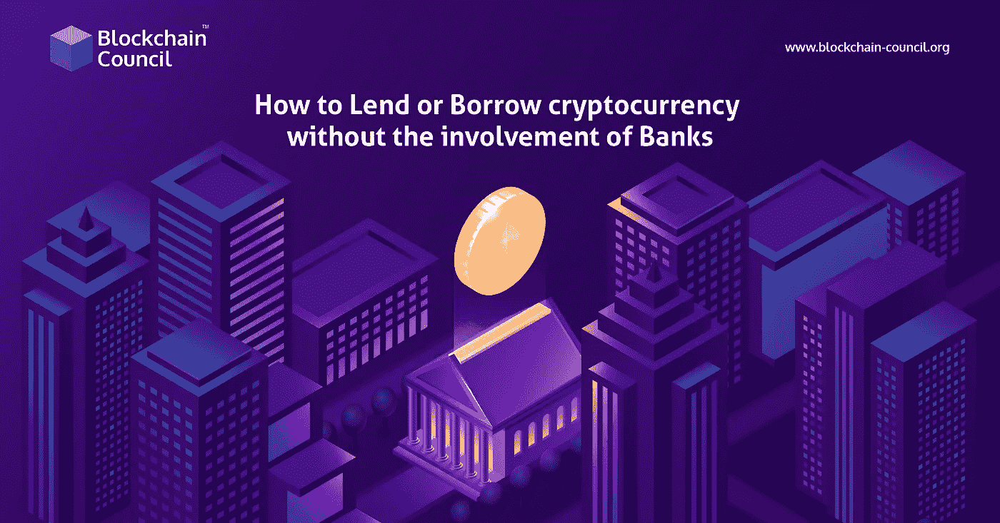

# 如何在没有银行介入的情况下，借出或借入加密货币？

> 原文：<https://medium.com/nerd-for-tech/how-to-lend-or-borrow-cryptocurrency-without-the-involvement-of-banks-d1a44f15858d?source=collection_archive---------7----------------------->

在过去的几个月里，加密货币交易获得了大规模的采用，导致投资者数量急剧增加。据 [**区块链专家**](https://www.blockchain-council.org/certifications/certified-blockchain-professional-expert/) 团队介绍，对 [**加密货币交易**](https://www.blockchain-council.org/certifications/certified-cryptocurrency-trader/) 日益浓厚的兴趣，让人们获得了基础**区块链教育**。此外，这些分散化的进步正在给传统金融业带来创新变革。

关注我们的媒体出版物，获取最新的区块链更新—[**https://medium.com/blockchaincouncil**](https://medium.com/blockchaincouncil)

此外，由于易于访问和整体工作程序，密码借贷正获得显着的势头。如今，千禧一代和 Z 世代都愿意学习和利用科技来变得精通财务。因此，如果你认为你应该了解这种经济转型，那么继续深入阅读，以获得更多关于基于加密的融资的见解。

# 目录

*   密码借阅的工作机制
*   了解密码借出和借出的过程
*   理解概念的例子
*   结束语

# 密码借阅的工作机制

在加密货币融资领域，借款人和贷款人通过第三方平台进行联系。总的来说，这些都是加密货币借贷平台。因此，只有三个实体对执行加密交易至关重要:借贷平台、贷方和借方。与传统融资系统不同，不需要银行等成熟金融机构的参与。

在这里，贷款人是指将加密货币、现金或稳定硬币借给其他用户，并以股息形式获得被动收入的人。其次，加密贷款平台是指连接贷款人和借款人并帮助他们进行交易的第三方空间。这些平台可以是分散的、自治的或集中的(一组公司或个人运行平台)。最后，借款人是指出于各种目的需要资金的实体。在这里，他们以抵押品的形式使用法定或加密资产来换取资金。因此，**区块链对于金融专业人士来说**可能是有利的。

# 了解密码借出和借出的过程

用加密货币借款相当简单。投资者可以通过加密货币融资轻松借入所需的加密货币贷款或现金。在这种情况下，投资者需要将他们持有的一些密码作为抵押品，以便借入资金。由于加密贷款的特殊规定，贷方成为整理的加密货币资产的所有者。但是，抵押品加密持有不得用于任何类型的交易或交易。

这一规定对于想要将他们的加密资产用于 HODL 的加密投资者来说是有利的，这是一个加密货币术语，代表着“珍惜生命”。这样做也能使他们在此期间持有资产获得丰厚的利息。在这里，获得的利息被称为加密货币红利。因此，加密投资者可以通过持有和出借他们的加密货币资产来有效地获得被动收入。

简而言之，加密货币贷款是一种抵押贷款，用户可以从加密贷款平台或加密交易所获得。它的工作方式类似于汽车贷款或抵押贷款，你可以利用加密硬币来贷款。然而，你可以通过密码社区与知识渊博的区块链专家联系，以了解更多关于其功能和底层技术的信息。或者你可以选择**区块链认证**，涵盖关于区块链应用和加密货币的全部课程和项目。

# 理解概念的例子

让我们看看下面的例子，以便更好地理解加密借贷的概念。假设你有 10 个左右的比特币，想通过投资获得稳定的被动收入。在这里，把所有这 10 个比特币放进你的数字钱包，这个钱包与你正在使用的借贷平台兼容。然后你就可以开始为你持有的股票赚取每周或每月的利息。

通常，比特币提供的利率在 3%到 7%之间的范围内。然而，你也可以赚取高达 17%的利息，为一个更稳定的加密资产。

它与传统借贷系统的不同之处在于它的点对点方式。此外，如前所述，借款人的优势是用他们的资产作为抵押品来获得资金，这使得程序非还款贷款。在这里，投资者有权出售加密资产来弥补损失。另外注意，这类投资平台通常需要加密贷款 25%到 50%的股份。因此，它能够弥补大部分损失，保护投资者免受损失。

更重要的是，加密融资让你甚至可以借实物货币，如美元，加拿大元，欧元。因此，用户可以在需要紧急财务帮助的情况下出售他们的资产。

# 结束语

区块链技术通过设置一个无许可的设置来执行交易，为用户提供了控制其财务和交易决策的自由。此外，还有许多区块链认证供用户更好地了解这项技术。一个可靠的资源是[区块链委员会](https://www.blockchain-council.org/)，在那里你可以直接向**区块链专家学习。**