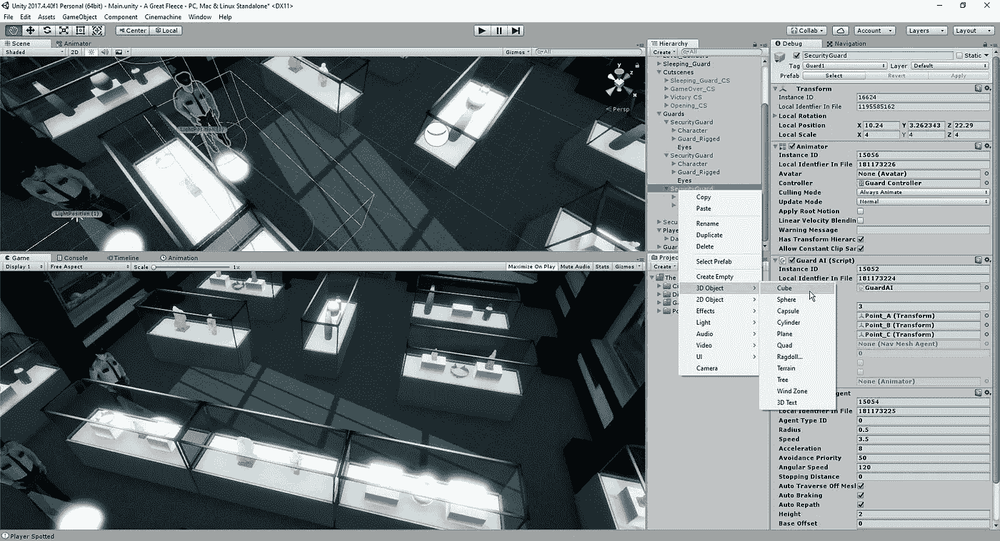
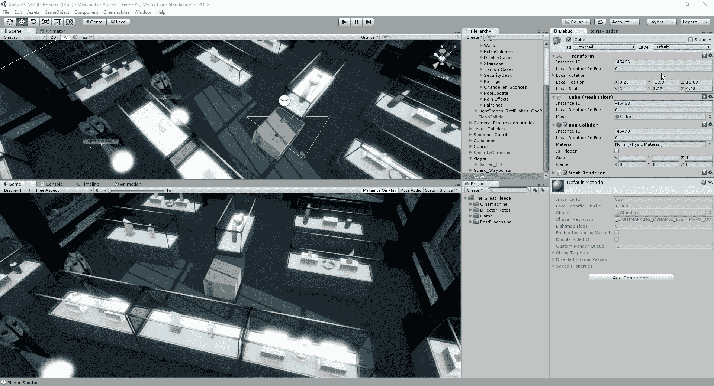
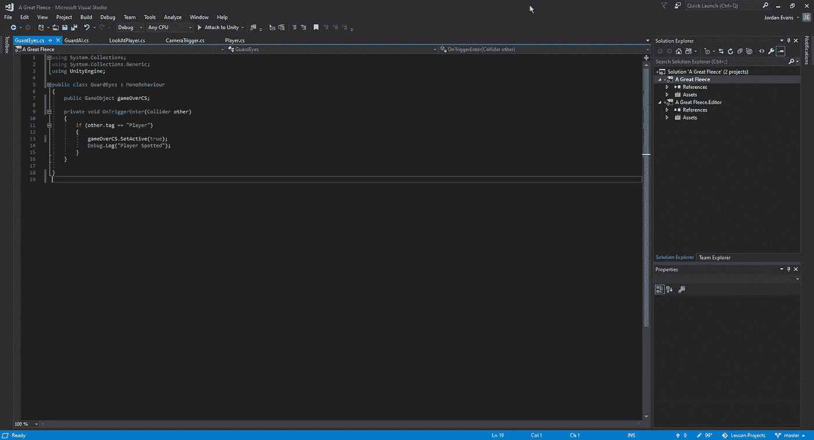

# 如何让你的 AI 看到！

> 原文：<https://medium.com/nerd-for-tech/how-to-let-your-ai-see-832c89f51780?source=collection_archive---------10----------------------->

随着我们的守卫移动，我们现在可以开始实施一个系统，让我们的守卫看到球员经过。这个过程和我们允许我们的船在经过[这里](/nerd-for-tech/enemies-killing-our-powerups-3327e33618eb)时开火非常相似。

作为快速复习，让我们在这里快速回顾一下。首先，我们需要创建一个立方体作为警卫的视野:

从这里，我们将只是扩大我们的立方体，为我们的警卫创造一个良好的视野范围的长度，并删除网格过滤器，这样我们就只剩下一个对象，在我们的场景中没有视觉覆盖:

一旦我们将它连接到所有 3 个守卫，我们将创建一个脚本，并在其中快速添加几行代码:

因为我们希望过场动画游戏在我们被抓住的时候播放，所以我们必须将它作为游戏对象附加到我们刚刚创建的眼睛上，一旦被触发就激活它。有了这一切设置，我们可以看看它是否在我们的游戏中的预期工作:

既然我们的守卫有办法发现玩家，让我们看看这个游戏还会有什么。