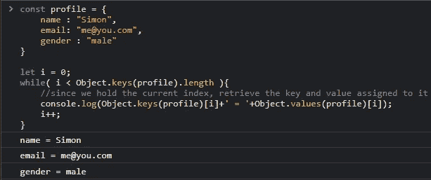
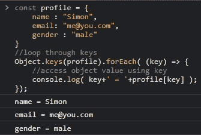
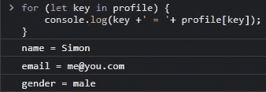

# 如何在 JavaScript 中遍历一个对象

> 原文：<https://medium.com/nerd-for-tech/how-to-loop-through-an-object-in-javascript-e1625a5bc3e7?source=collection_archive---------3----------------------->

图片由 Tine Ivani 在 Unsplash 上拍摄

计算中的循环是一条反复迭代或重复或执行一条或多条语句**的指令**。

一些循环只要指定的条件为真就执行该语句，而另一些循环则执行该语句多次。

我敢肯定你的音乐播放器里有一个循环功能，你可以选择一首特定的歌曲反复播放。这意味着一个循环基本上是*重复某件事*！

今天，我将讨论如何循环遍历一个对象。但是在我们继续之前，我希望你能理解什么是对象以及如何创建一个对象。

# 物品复习

什么是对象？

对象是一种特殊的数组，它以{键-值}对的形式存储数据。一对这样的数据称为该对象的一个属性。

下面是用 JavaScript 创建对象的一些方法；

*   使用对象文字语法 **{ }**

*   使用构造函数

*   使用工厂函数

刷新您的记忆后，我将向您展示遍历对象的不同方法。

在我们开始任何方法之前，我希望您理解这两个对象方法。

*   `Object.keys()`

这个方法有助于检索属于一个对象的所有键作为一个`Array`

*   `Object.values()`

该方法有助于将属于一个对象的所有值作为一个`Array`进行检索

了解了上面的对象方法，我们可以编写一个循环来遍历一个对象。

# 方法 1(使用数字作为索引)

现在，记住一个对象属性只是一个键和值的组合，即`{ key : value }`。因此使用`Object.keys()`方法，我们可以检索属于一个对象的所有键，使用`while-loop`循环遍历这些键，然后使用一个特定的键作为数字索引，我们将检索分配给它的值。

在上面的代码中，对象有 3 个属性，为了遍历对象的键，我们必须:

*   查询密钥的长度
*   访问所有对象关键点，并检查指定`index`处的关键点。
*   访问所有对象值，并检查指定`index`处的值。

如何通过对象方法循环 1

# 方法 2(使用一个键作为索引)

> 回想一下，使用 Object.keys()方法检索对象的键作为一个`Array`。

在这种方法中，我们将使用一个`for-each`循环来遍历作为*数组*返回的对象的键，然后使用一个特定的键作为手边的元素，我们可以访问分配给它的值。

如何通过对象方法循环 2

# 方法 3(用于..在环路中)

考虑上面的第二种方法，我们可以通过使用`for ...in loop`获得相同的结果。

在这种方法中，我们需要定义循环的语法来访问对象中的每个键。然后访问每个键，检索相关的值。

这种方法是迄今为止遍历对象最简单的方法。

我希望你已经理解了在 JavaScript 中遍历一个对象的三种方法。

你已经到了我文章的结尾。

# 额外的

我最近发布了一个 JavaScript 包，它使用验证规则、正则表达式和表单输入属性来验证 HTML 表单。

如果你能抽出几秒钟来检查一下，我将不胜感激。

[产品搜寻的 octa validate](https://www.producthunt.com/posts/octavalidate)

谢谢你