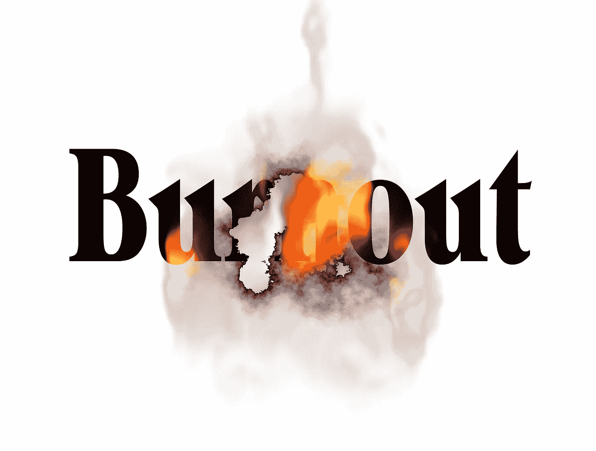

# 如何在熊市中保持心理健康

> 原文：<https://medium.com/nerd-for-tech/how-to-maintain-your-mental-health-in-a-bearmarket-72d74141d47d?source=collection_archive---------10----------------------->

crypto / NFT 熊市已经持续了几个星期，似乎还没有结束的迹象。

这可能会令人沮丧和沮丧，尤其是如果你是加密或 NFT 空间的新手，或者在这方面投入巨大。周围一片黑暗，很难保持情绪高昂。

也就是说，你可以做一些事情来确保你的心理健康保持在正轨上，即使在加密市场的艰难时期。

## 为什么保持心理健康很重要

保持心理健康的最大好处之一是，它有助于我们应对逆境。你可能知道，生活和商业充满了斗争——应对这些挑战需要韧性。

积极是韧性的源泉。

乐观的人处理问题的方式让他们比同龄人压力更小、更有效率、更快乐。

他们也有更强的免疫系统，从疾病中恢复得更快。如果你感到不知所措或沮丧，试着花几分钟想想你的生活中有什么是好的。花些时间享受一些让你开心的事情。你可能会发现自己已经感觉好多了！

## 如果你情绪低落，有 4 种方法可以改变你的情绪

在熊市中，人们很容易开始感到沮丧，并忽视加密货币或 NFT 的神奇之处。有很多方法可以让你快速轻松地改变心情。

让我们来看看有哪些方法可以帮助你走出目前的心态，进入一种积极向上的心态。为你自己尝试四个中的任何一个或全部！

## 你可以采取行动的方式

1.  深呼吸，从 10 开始倒数。

2.通过锻炼来发泄一些沮丧，比如跑步或散步。

3.结识一些朋友，享受和他们在一起的时光。不要想你的问题，也不要谈论它们。

4.告诉你自己，每一个心烦意乱或害怕的时刻都是失去享受生活的机会——然后开始寻找快乐的方法！