# 如何在 MacOS 中做一个好看的终端？

> 原文：<https://medium.com/nerd-for-tech/how-to-make-a-nice-terminal-in-macos-5f2fdf8f8ac7?source=collection_archive---------3----------------------->

标准的 MacOs 很无聊，让我们做一个新的终端，有更多的功能和好看的外观。

确定您已经安装了 Xcode:

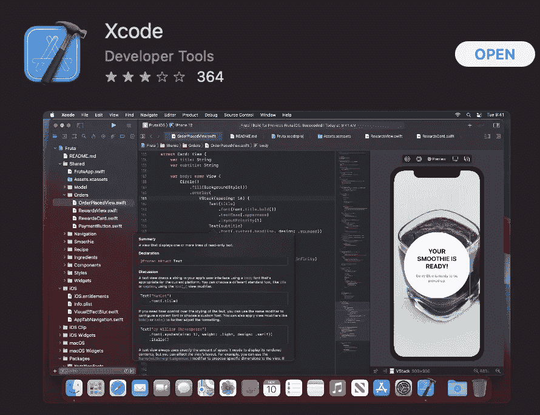

然后需要使用标准的 mac 终端安装 brew。

***/bin/bash-c " $(curl-fsSL https://raw . githubusercontent . com/home brew/install/HEAD/install . sh)"***

成功安装后，现在可以用下面的命令安装 iterm2。

***酿造安装—木桶 iterm2***

如果您看到下面的消息，您的安装将会成功。

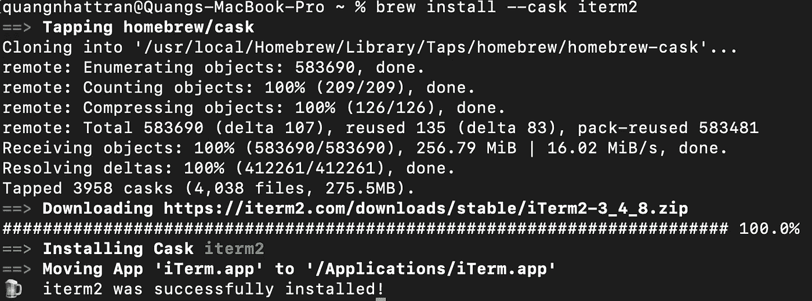

iTerm 将有一个配色方案供您上传到 iTerm。你可以通过下面的网址下载这个计划。提取并使用文件夹方案。

[https://github.com/mbadolato/iTerm2-Color-Schemes](https://github.com/mbadolato/iTerm2-Color-Schemes)

现在打开 iTerm。

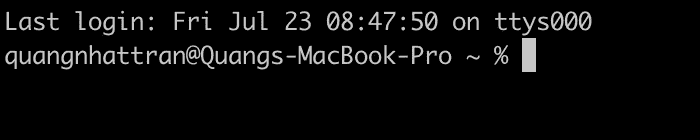

从 iTerm 的左上角选择首选项。

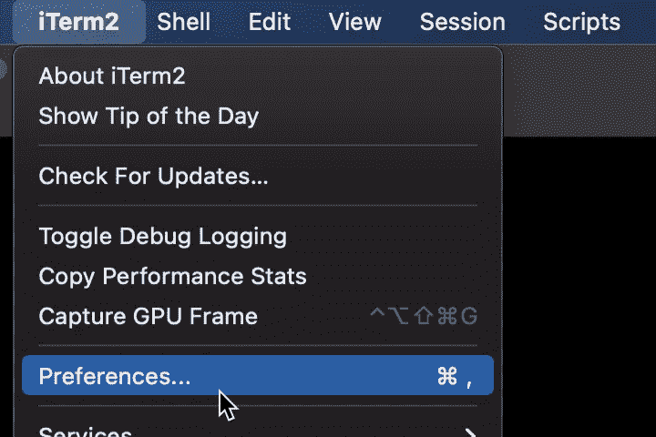

让我们选择配置文件选项卡和子选项卡颜色。在颜色预设下拉列表中选择导入选项。

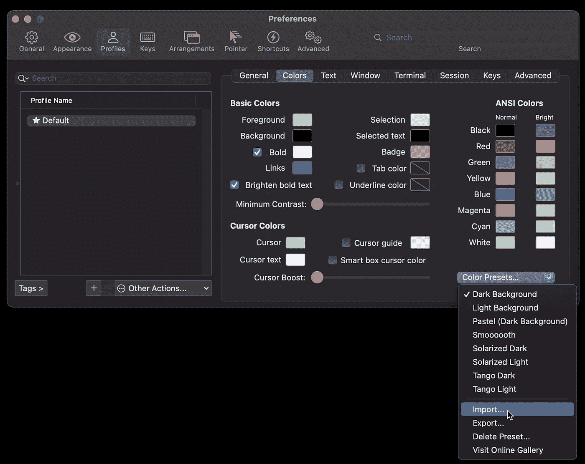

您可以选择所有方案或几个方案。

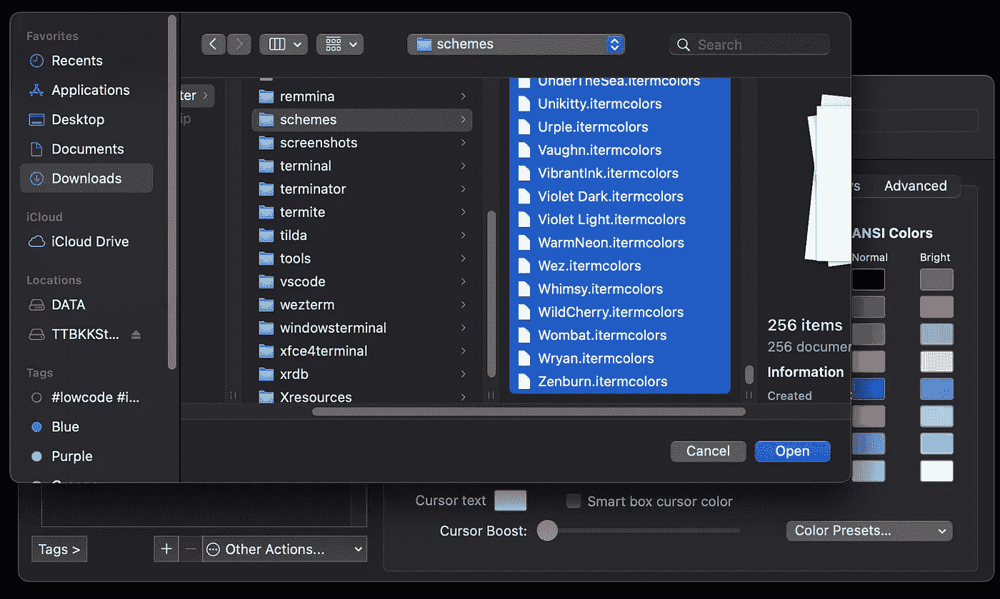

在我的例子中，我选择 all，并等待导入完成。我可以看到很多可供选择的配色方案。

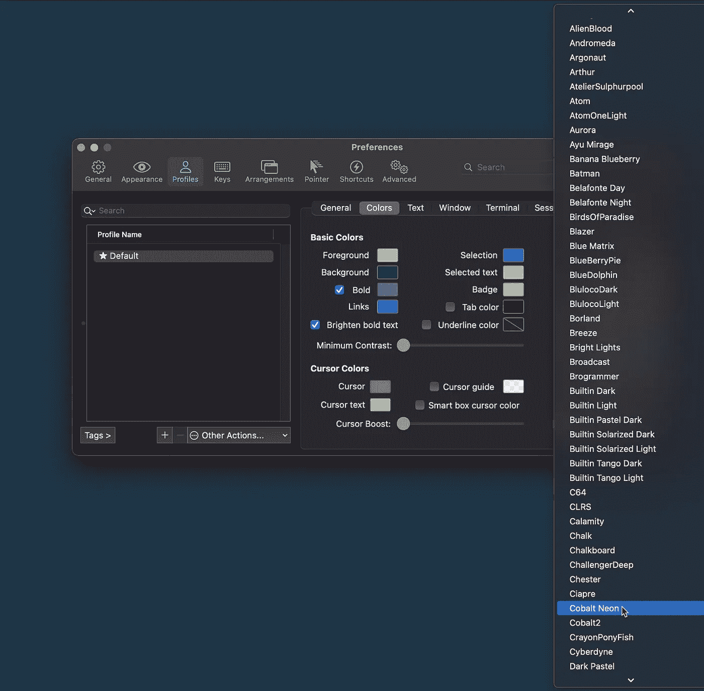

接下来，需要字体。你可以从下面这个网址下载所有字体。用命令行解压并安装。

 [## GitHub - powerline/fonts:为电力线用户提供补丁字体。

### 这个存储库包含预先修补和调整的字体，用于电力线状态线插件。运行…

github.com](https://github.com/powerline/fonts.git) 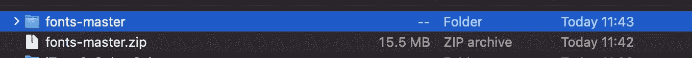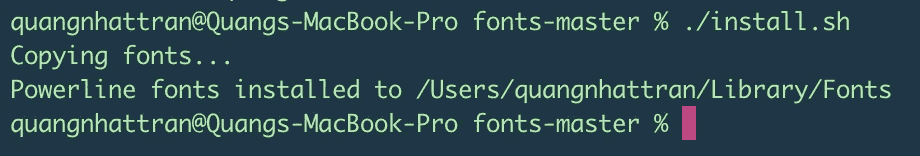

你可以通过这个菜单改变字体。

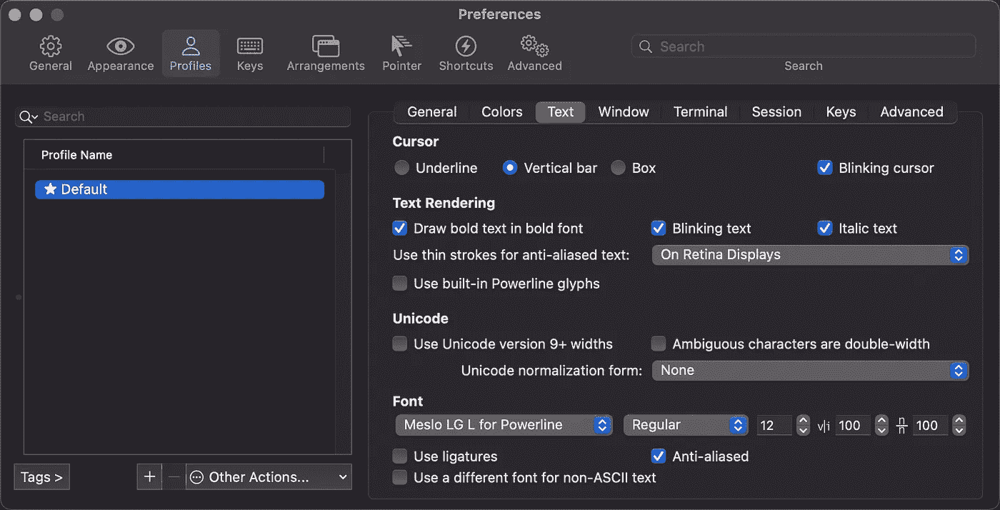

继续安装 Zsh 和 Oh my Zsh。

***brew 安装 zsh-zsh-completions***

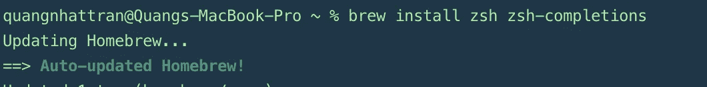

***sh-c " $(curl-fsSL https://raw . github . com/robbyrussell/oh-my-zsh/master/tools/install . sh)"***

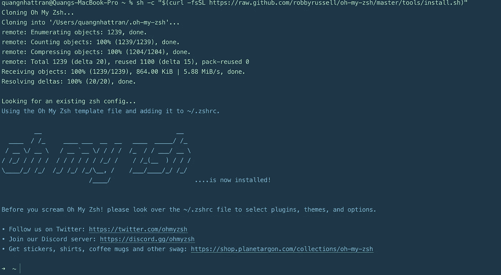

你需要加载主题到我的天啊

**主题 10k**

**【https://github.com/romkatv/powerlevel10k.git】饭桶克隆＄{ ZSH _ CUSTOM:-~/。oh-my-zsh/custom }/themes/power level 10k**

**主题 9k**

***git 克隆 https://github.com/bhilburn/powerlevel9k.git ~/。oh-my-zsh/custom/themes/power level 9k***

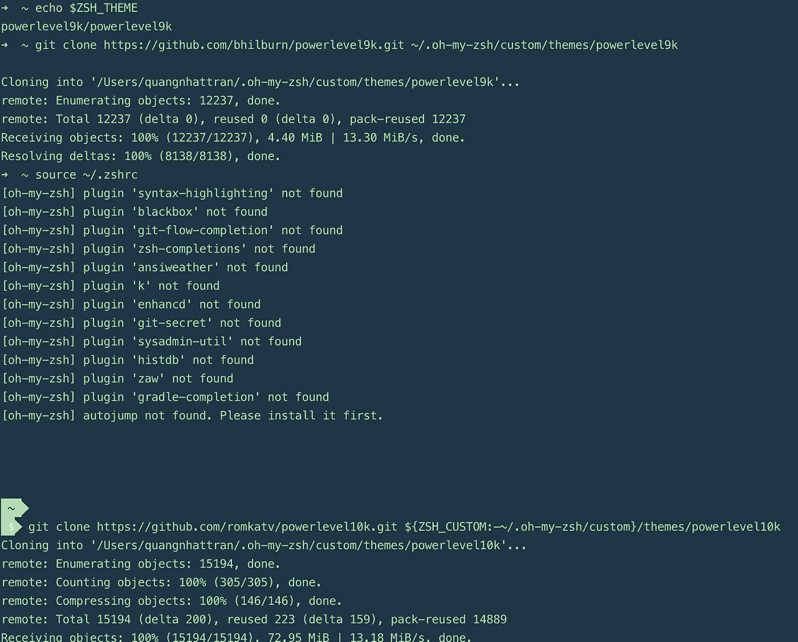

在这一步，你已经有了 zsh 和 oh my zsh，但是我们仍然需要自定义。zshrc 简介。

我们修改了如下图。

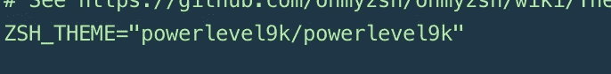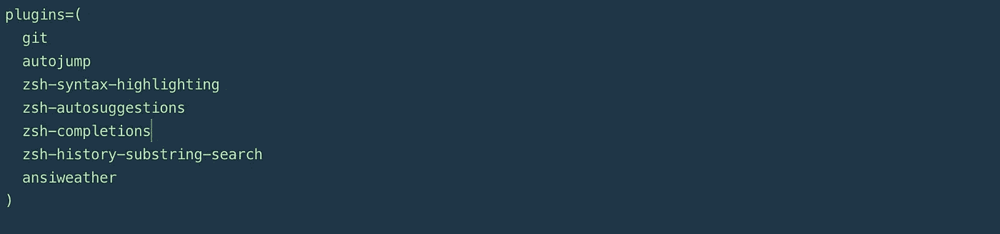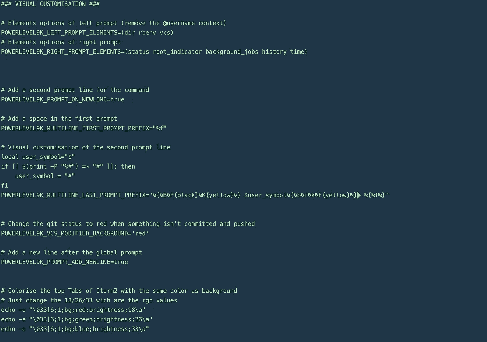

那就跑

如果没有找到插件，转到[https://github.com/zsh-users](https://github.com/zsh-users)找到可用的插件并运行如下命令。

***git 克隆 https://github.com/zsh-users/zsh-syntax-highlighting.git $ { ZSH _ CUSTOM:-~/。oh-my-zsh/custom }/plugins/zsh-syntax-highlighting***

***git 克隆 https://github.com/zsh-users/zsh-completions.git $ { ZSH _ CUSTOM:-~/。oh-my-zsh/custom }/plugins/zsh-completions***

最后，我当前终端看起来像这样。

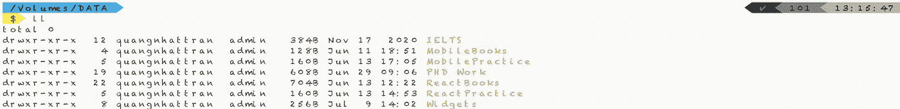

你也可以继续用 nerd 字体和 power10k 自定义你的终端。

 [## GitHub - ryanoasis/nerd-fonts:图标字体聚合器、集合和修补器。3600 多个图标，50 多个…

### 图标字体聚合器，收集和修补程序。3600+图标，50+补丁字体:Hack，源码 Pro，更多。字形…

github.com](https://github.com/ryanoasis/nerd-fonts#option-4-homebrew-fonts) 

但是，过多的字体和过多的自定义会使您的终端变慢。

感谢您的阅读。