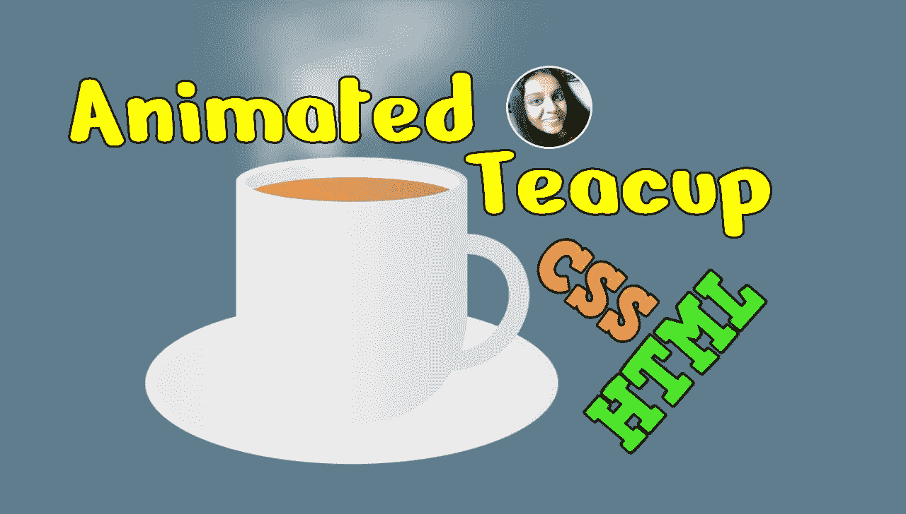
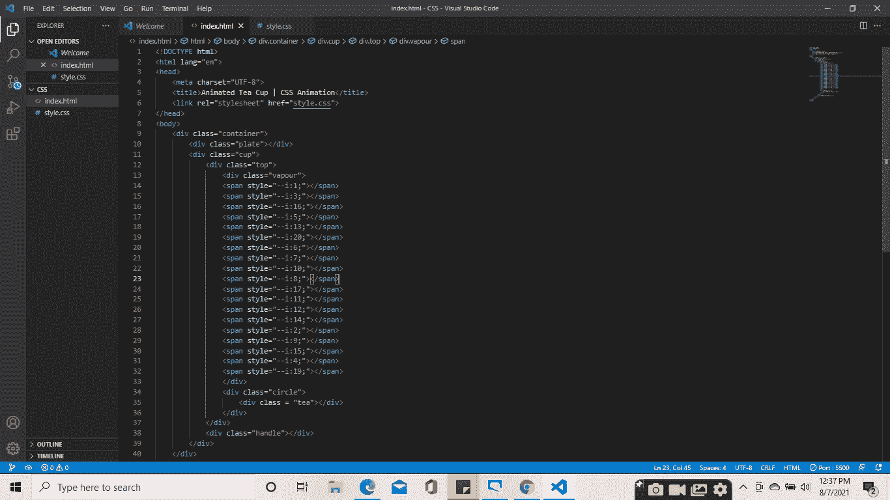
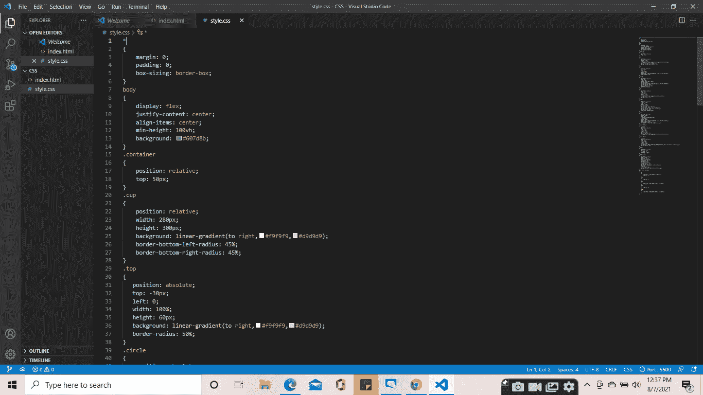
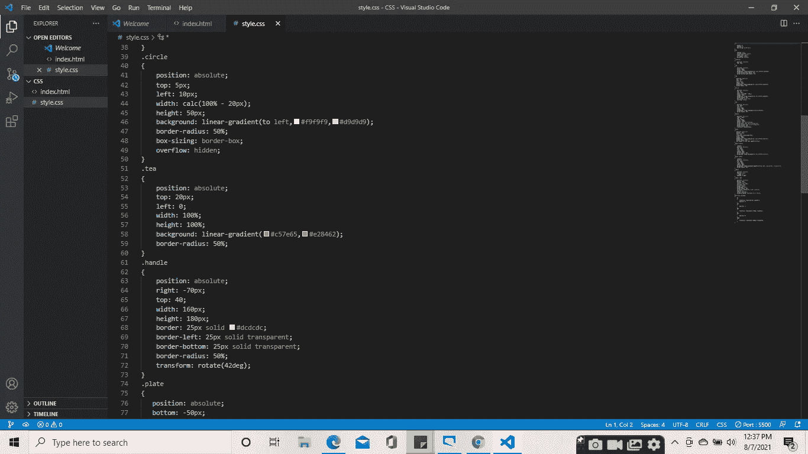
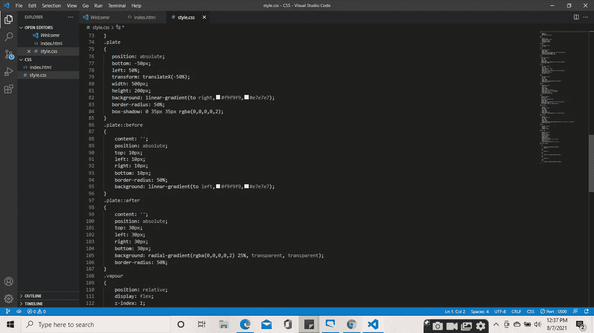
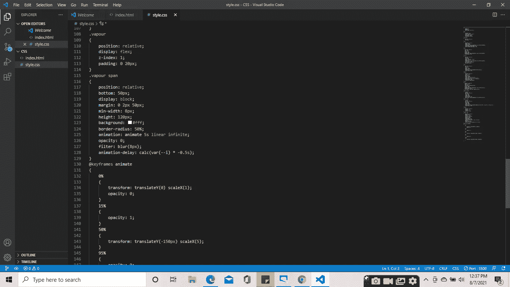
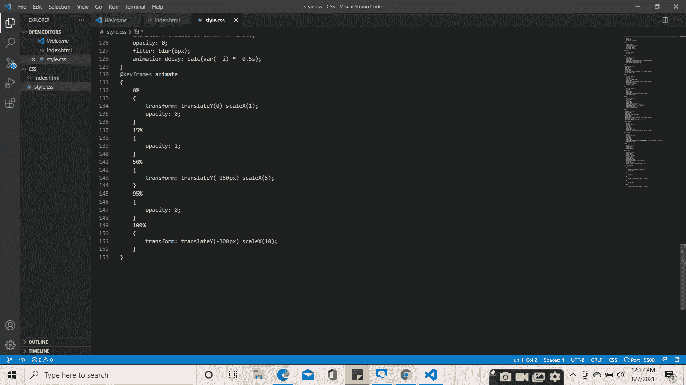
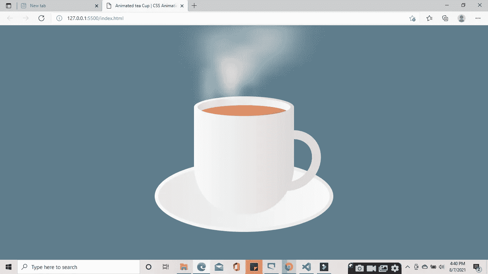

# 如何使用 CSS 和 HTML 制作动画茶杯

> 原文：<https://medium.com/nerd-for-tech/how-to-make-a-tea-using-css-and-html-a594088d6af0?source=collection_archive---------9----------------------->

> 我已经知道你想知道该怎么做。在本文的最后，你可以只用 CSS 和 HTML 制作一个动画茶杯。

CSS 允许不使用 JavaScript 或 Flash 的 HTML 元素的动画！

## 什么是 CSS 动画？

动画让元素逐渐从一种风格变成另一种风格。

您可以根据需要多次更改 CSS 属性。

要使用 CSS 动画，您必须首先为动画指定一些关键帧。

关键帧保存元素在特定时间将具有的样式。

# **第一步**

开放 vs 代码。

# **第二步**

创建一个新文件夹。

# **第三步**

创建 index.html 文件。请参考代码。

# **第四步**

创建 style.css 文件。请参考代码。

# **第五步**

您可以使用实时服务器打开 index.html 文件。

希望这对你有用。如果你在实现这个过程中有任何困难或者你需要任何帮助，请联系我。