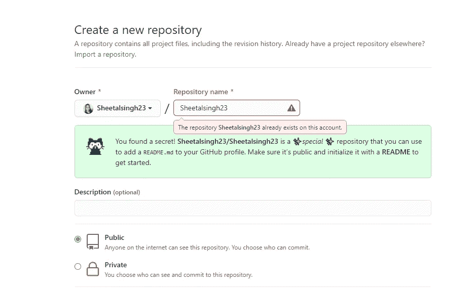
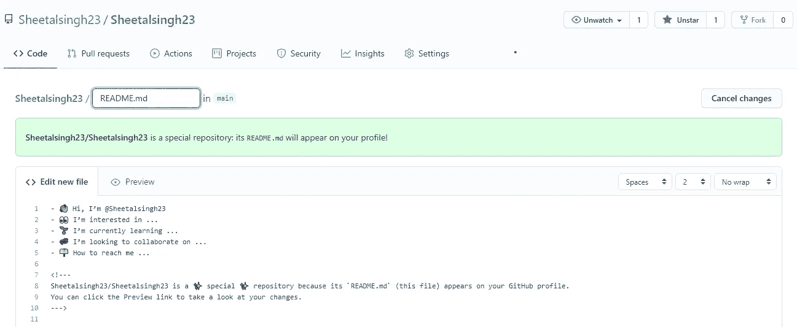
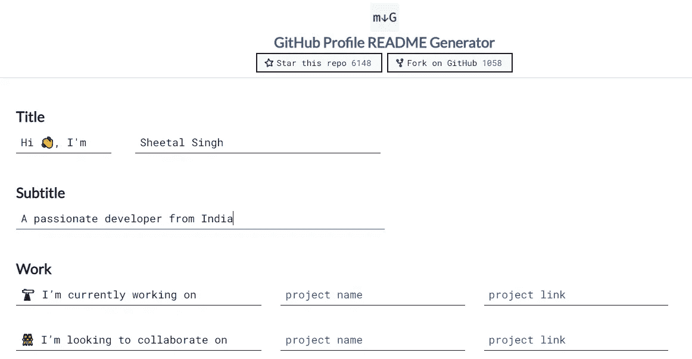
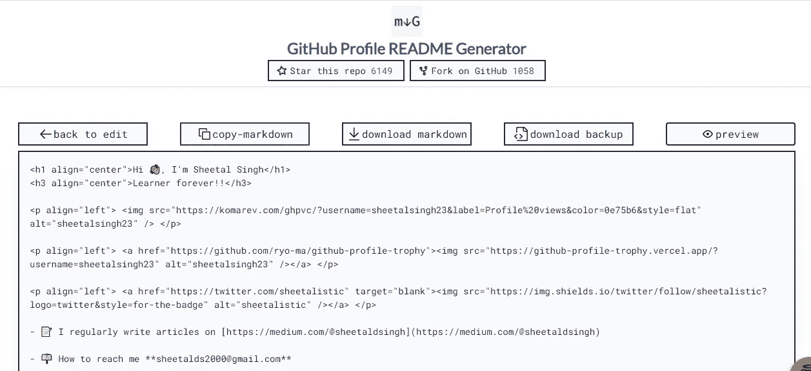
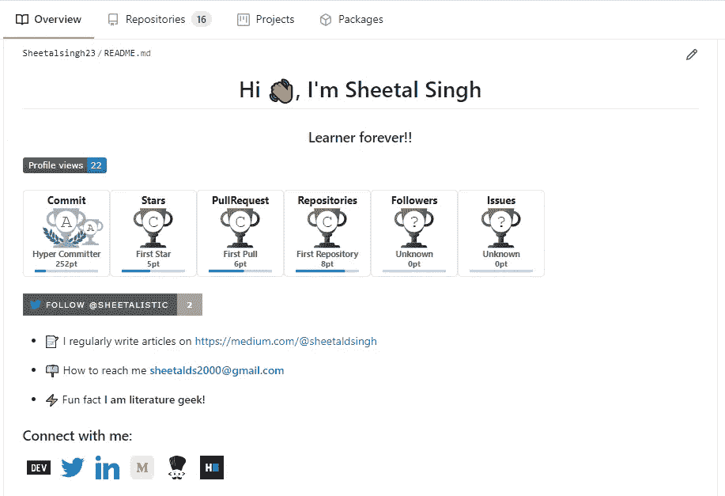

# 如何不用编码制作一个牛逼的 Github 简介 README.md 页面？

> 原文：<https://medium.com/nerd-for-tech/how-to-make-an-awesome-github-profile-readme-md-page-with-no-coding-24cf6a61523e?source=collection_archive---------7----------------------->

创建您自己定制的 github 个人资料页面。如何在此学习？！

谈到开源贡献，Github 是一个强大的工具。你问什么是开源贡献？请看这里:“[开源贡献入门。](/nerd-for-tech/getting-started-with-open-source-contribution-8f0cf0d604ad)“如果你是初学者。

最近，我一直在看这个令人惊讶的 github 个人资料页面，每个人都在添加他们的细节、技能、项目等等。我很高兴能找到更多关于它的信息。因此，在撰写本文的同时，我创建了我的 github readme 页面😃。这也不需要编写一行代码。

现在， **Markdown** 是一个轻量级且易于使用的语法，用于在 **GitHub** 平台上设计所有形式的写作。因为熟悉它的人可以很容易地在其中编码。但是对于那些没有想法的人来说，你可以这样做。

这里使用的方法是一个自动的自述文件生成器，因此您不需要手动编写它。

## **让我们潜心撰写一步一步的指南，创建一个令人敬畏的 github 个人资料页面**

**第一步:注册或登录您已经拥有的 github 帐户，打开它。**

**步骤 2:在您的个人资料页面上，创建一个新的存储库。**

您要做的第一项任务是创建一个与您的 github 用户名同名的**新存储库。**

**示例**:我的 github 用户名是 Sheetalsingh23，所以新的存储库也应该命名为 Sheetalsingh23

创建新的存储库

**注意**:此处由于仓库已经存在，所以我无法再次创建。但就你的情况而言，一切都会好的。

将这个库**公开**(如图所示)并且用一个自述文件初始化它。一旦你完成了刚才点击创建存储库。

**步骤 3:转到创建的存储库并打开它的 README.md 文件**

打开 README.md 文件后，默认情况下，您会在 README 文件中看到一些行。把那些东西都清理掉，因为我们不打算用它。在这种情况下，你的自述文件已经是空白的，你可以走了。

第四步:定制你的 README.md 页面。

神奇的事情发生了，你已经准备好将你无聊的 github 档案转换成一个有趣的档案。

打开自述生成器****。****

****

**自述文件生成器**

**这是最简单的方法是！！你只需要在文本框中输入你的详细信息。你可以添加你的技能、框架、前端和后端技术等等，只需选择复选框(没错！就这么简单)。**

**第五步:生成你的自述代码。**

**完成后，点击页面末端的**生成自述文件**按钮。将出现一个**降价**代码。现在你会看到这样的东西:**

****

**降价代码已生成。**

**复制这段代码，粘贴到 github 的 README.md 文件中。点击预览按钮，你会看到它是什么样子的(如果你想的话，可以做些修改)。**

**现在预览看起来正是你想要的样子。点击提交更改按钮。瞧啊。！**

**刷新你的 github 主页，就可以了。您已经成功地转换了您的 Github 个人资料页面，而无需编写任何代码。**

**以下是我的长相:**

****

**我的 README.md 个人资料**

**看起来比以前无聊的页面好多了😅。这是我的 github 的链接:[https://github.com/Sheetalsingh23](https://github.com/Sheetalsingh23)(以防你想知道结果如何)。**

**希望有帮助！评论你的想法也可以关注我:)**