# 如何让你的聊天机器人脱颖而出

> 原文：<https://medium.com/nerd-for-tech/how-to-make-your-chat-bot-standout-3cf39bfee488?source=collection_archive---------3----------------------->

## *NLP 模型、情感分析、问题回答、摘要、知识图表、欺诈检测、个性化&回退*

交谈是人类与生俱来的，就像解渴或充饥一样。但是*即使对于强大的机器来说，同样的事情也是令人惊讶的复杂*，这导致了有趣的自然语言处理规则和具有挑战性的聊天机器人用例。无论聊天机器人有多复杂，它们对增强人类能力或产生商业线索都有极大的帮助。让我们深入了解各种 NLP 技术和有趣的功能，这些技术和功能可以让您的机器人出类拔萃！

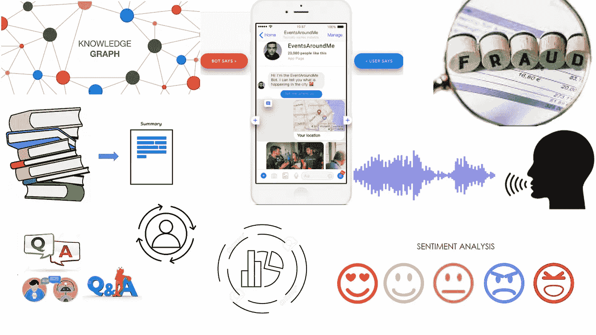

**聊天机器人用例概述(图片由作者提供)**

# **为什么**理解**语言对计算机来说很难？**

*为了理解挑战的数量，考虑这些情况:*

**A .字不一样，但意思是一样的！**

> -你多大了？
> 
> -你多大了？

**B .词语相同，但意思不同！**

> -你要去哪里？
> 
> -你从哪里来？

**C .同一个词在不同的语境下可以有不同的意思！**

> -沙发装不进门，因为太窄了。
> 
> -沙发装不进门，因为“ **it** 太宽了。

单词“it”在第一句中的意思是“door ”,而在第二句中是“sofa ”! ***那么，机器是如何理解或者编码一个单词的呢？***

答案在于 NLP 的基本原理，概括为:

> 从一个人所交往的公司你就可以知道这个词:弗斯(1957)

即，可以通过分析大型语言语料库中词汇共现的**模式来导出单词的语义表示。**

在 NLP 中，你将单词表示为向量。因此，嵌入层将是 NLP 模型中的初始层，用于捕获上下文。在高层次上， **NLP 可以用，**来完成

1.  ***向量空间模型***
2.  ***概率模型***
3.  ***序列型号***
4.  ***关注车型***
5.  ***图形型号***

让我们先睹为快，这样你就能从总体上理解 NLP，并具体改进聊天机器人。

1.  **向量空间模型**

**单词向量**可以对句子中每个单词周围的上下文进行编码。

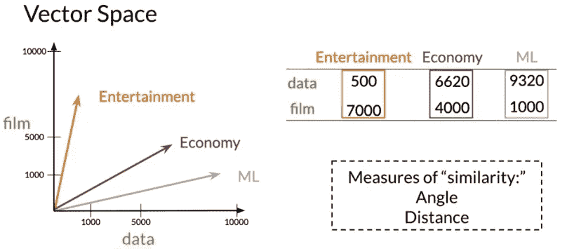

按文档设计:“数据”在“娱乐”文档中出现 500 次，在“ML”文档中出现 9320 次

您可以根据用例使用不同的单词嵌入:

*   **手套，Word2Vec** :最流行嵌入**字样**
*   **PCA，t-SNE** :在**较低维度**创建嵌入
*   **通用语句编码器(使用)**:用于**语句**或段落
*   **FastText:** 比 W2V 更适合**生僻字**；训练时间长
*   **庞加莱:**对词语的**层次化**树信息进行编码
*   **节点 2Vec:** 用于非线性数据，如**图形**
*   **深度学习嵌入**使用 BERT、Roberta 等。

**嵌入向量**对于做文字运算非常有用，可以找到同义词、聚类、类比、情感等。由于这些 **2 属性:**

1.  每个单词的嵌入是一个固定大小的向量
2.  如果两个单词意思相似，它们的**向量将接近**

**要计算单词间的相似度**，使用以下任一方法比较向量:

*a)* ***角度*** *:余弦相似度*

*b)* ***距离*** *:欧氏距离*

嵌入向量长度可以基于语料库中的样本数量而变化，但是向量之间的角度保持不变。因此，**余弦相似性是比欧几里德距离更好的度量**来寻找相似性。

其他比较指标包括*字移动器距离(WMD)、平滑逆频率、詹森-香农距离、K 均值、变分自动编码器(VAE)、连体曼哈顿 LSTM (MaLSTM)等。*

**2。概率模型:**

概率 NLP 模型用于**用例**，如下所示。

i) **拼写校正:**使用*最小编辑距离*算法，通过动态编程找到插入、删除和替换操作的最小成本。如果成本低于阈值，则修改拼写。

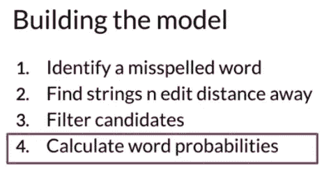

图片[承蒙](https://www.udacity.com/course/natural-language-processing-nanodegree--nd892)

ii) **自动更正**:即使拼写正确，单词也可能上下文不正确。

通过查看单词周围的单词，单词“deer”将被更正为“dear”

**单词概率**通过语料库中的单词数÷总单词数来计算

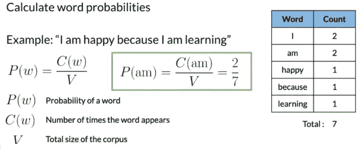

图片[礼貌](https://www.udacity.com/course/natural-language-processing-nanodegree--nd892)

要自动更正，找到最接近的单词并替换。

iii) **词性标注:马尔可夫链**是一种描述可能事件序列的随机模型。

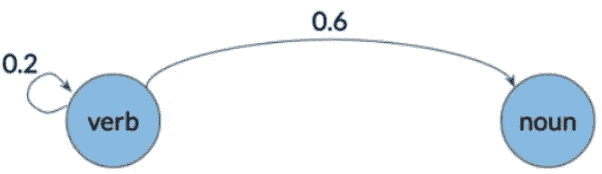

可视化表示在一个句子中从动词-动词和动词-名词转换的概率([礼貌](https://www.udacity.com/course/natural-language-processing-nanodegree--nd892))

iv) **自动完成:** n-gram 语言模型用于自动完成给定的句子。n 元概率是二元和三元概率的扩展。

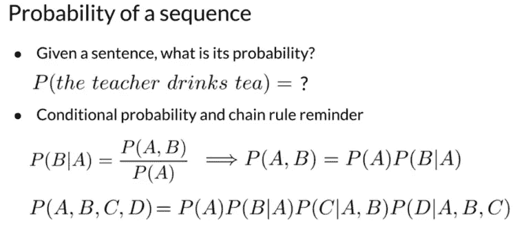

为了计算序列概率，**应用条件概率和链式法则。**但是精确的序列可能不会出现在语料库中，因此使用‘朴素的’**马尔可夫假设**当前单词仅依赖于前一个单词。

为了处理语料库中没有出现的 n 元语法，我们可以使用诸如*拉普拉斯平滑、Katz-Backoff 和插值之类的技术。*

**3。基于序列的模型:**

传统模型**需要巨大的语料库和巨大的 RAM** 来存储每个词组合{w1，w2}的条件概率 P (w1，w2)。此外，更大的 n 元模型需要更多的内存来捕获更长的依赖关系。

由于这种方法很快变得不切实际，我们不得不使用 rnn，因为它们从头到尾都在传播信息。

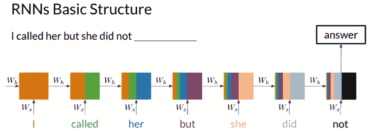

最后一步进行的计算包含了句子中的所有单词([礼貌](https://www.udacity.com/course/natural-language-processing-nanodegree--nd892))

RNNs 的主要优点是它们在序列内传播信息，并且****计算共享大部分参数。****

**对于长单词序列，即使是普通的 rnn 也会丢失相关信息。 **GRUs(门控循环单元)**可以解决这个问题，因为它具有控制**从过去忘记多少信息以及从当前输入提取多少信息的参数。****

****连体网络**，由两个相同的神经网络最后合并而成的神经网络，在 NLP 中有很多应用。他们的目标是**找出是什么让两种输入相似，又是什么让它们不同。** *例如，它们* *可以被用于* ***来识别问题重复*** *，即先前由聊天机器人回答的或者已经在库中的问题。***

**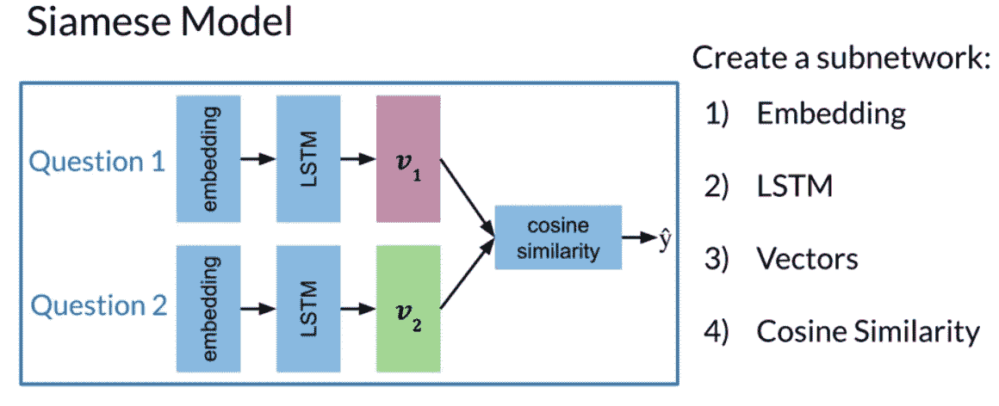**

**图片[承蒙](https://www.udacity.com/course/natural-language-processing-nanodegree--nd892)**

**在测试上述模型时，您将执行**一次性学习、**，即找出两个输入问题之间的相似性得分。因此，问题从 K-类分类变为**测量两个类之间的相似性。****

**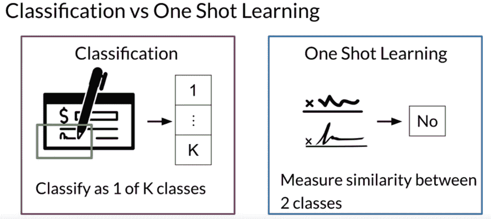**

**如果要在 K 类中区分一个样本很少的新签名，就不需要重新训练了！([礼遇](https://www.udacity.com/course/natural-language-processing-nanodegree--nd892))**

**一次性学习是聊天机器人背后的**基本原则，因为很难用几个例句对每个“意图”进行“分类”。****

****4。注意型号:****

**传统的 Seq2Seq 模型，如 LSTMs 和 GRUs，通常用于避免消失梯度。但是，由于 seq2seq 使用固定长度的内存，较长的序列会出现问题。因此，该模型对于较短的序列表现得非常好，但是对于较长的序列则不然。**

**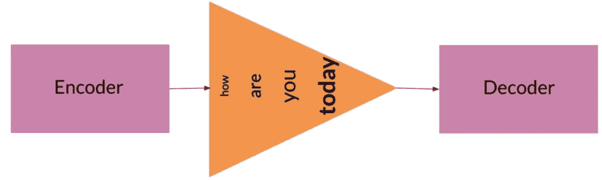**

**在编码器的最终隐藏状态中，单个输入开始堆积([承蒙](https://www.udacity.com/course/natural-language-processing-nanodegree--nd892))**

**一种解决方案是将输入中的每个单词向量给解码器，而不是将其粉碎在一个隐藏状态向量中。但是我们需要**关注每一步最有可能出现的单词**来节省内存。因此，您需要添加一个层来帮助解码器了解哪些输入对每个预测更重要。**

**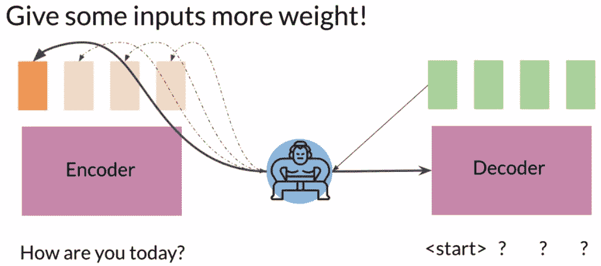**

**注意力层赋予橙色块更多的权重([礼貌](https://www.udacity.com/course/natural-language-processing-nanodegree--nd892))**

****机器翻译:**注意机制使用输入(编码器隐藏状态)和输出(解码器隐藏状态)的编码表示。当单词组是翻译对时，输入向量和输出向量将是相似的，因此点积将是高的。**

****

****注意矩阵:**浅色方块表示路径([礼貌](https://www.udacity.com/course/natural-language-processing-nanodegree--nd892))**

****变压器**是 rnn 处理序列数据的绝佳替代品。由于他们使用**多头注意力层**而不是 RNN 的循环层，因此有了并行计算的空间。**

****最先进的变形金刚:****

****a) CBOW** :上下文窗口是固定的。如果你需要更多的上下文呢？**

****b) ELMo** :使用左边的 RNN&右边(双向)预测中心字**

**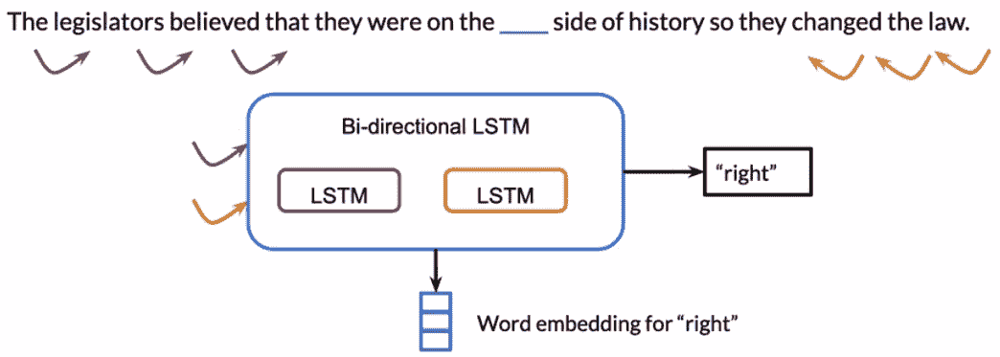**

**要预测“正确”这个词，你需要上下文**

****c) GPT-2:** 只有解码器堆栈，并且是单向的**

****d)伯特**:只有编码器**堆栈&是一个经过训练的**双向**LSTM****

****e) T5:** 有**编解码**栈加双向上下文。这款多任务变压器可以做多项任务。例如:回答问题、总结等。**

**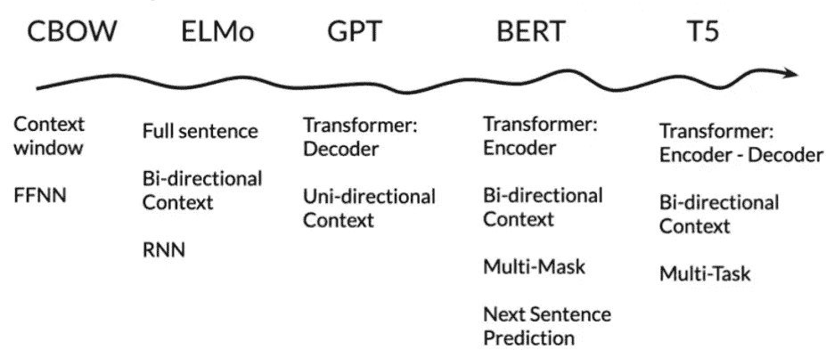**

**模型演变的顺序([承蒙](https://www.udacity.com/course/natural-language-processing-nanodegree--nd892))**

****5。基于图形的模型:****

**在基于图的模型中，单词成为节点，单词(关系)的共现形成边。一个众所周知的图排名算法是 **Google 的 PageRank** 。另一个众所周知的， **TextRank** 算法可以用于关键词提取和文本摘要。**

**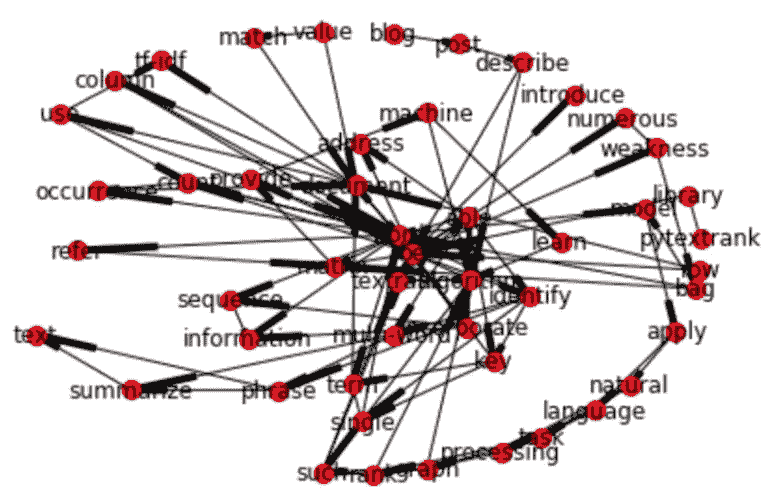**

**段落的文本等级图。[礼遇](/@aneesha/beyond-bag-of-words-using-pytextrank-to-find-phrases-and-summarize-text-f736fa3773c5)**

**NLP 库从句子中生成**句法&语义解析图**。**

**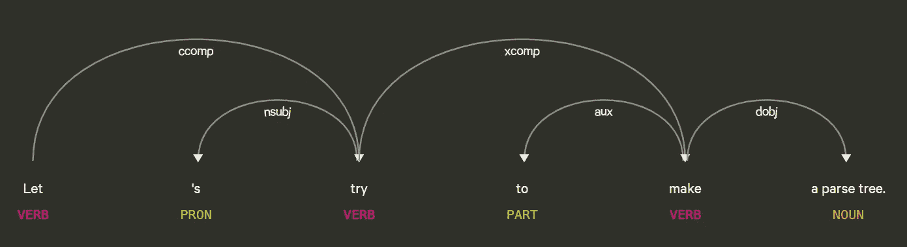**

**由 **Spacy** tagger ( [礼貌](https://spacy.io/usage/linguistic-features))输出的解析器**

**从文本文档中提取**潜在结构，并将其存储在一个图中，可以实现几种不同的用例。 ***Eg*** *:自然语言搜索，文档相似度*****

****知识图(KG)** 有助于通过相互关联的实体将数据置于上下文中——**现实世界的对象、事件或抽象概念，如文档——使您能够搜索“事物”。 ***Eg*** *: DBPedia、Geonames、Wordnet、FactForge 等。*****

*****KGs 结合了*的特性****

*   ******数据库**:通过结构化查询浏览****
*   ******图形**:分析为网络数据结构****
*   ******知识库**:可用于推断新的事实****

****对于像问题回答和信息检索这样的任务，KGs 正变得越来越受欢迎。最近，**图形神经网络(GNNs)** 已经被用于捕获固有地存储在这些知识图中的结构信息，因为它们通常是不完整的。****

****到目前为止，我们已经看到了可以用于任何 NLP 任务的各种模型，包括聊天机器人。在实践中，建议使用诸如 **Spacy、ChatterBot、NLTK、TextBlob、PyNLPl 等库。**处理自然语言处理功能。现在让我们来看看一些可以使它们变得强大的特定于 bot 的特性。****

# ****类固醇上的聊天机器人:突出的功能****

# ******1)感情分析******

****在任何业务中，最重要但无形的指标是客户的情绪。我们可以使用聊天机器人**通过机器学习或深度学习技术**捕捉用户情绪，后者更准确。****

****情感分析有两种类型:****

****i) **二元情感分类器:**您可以**使用 ML 技术，如逻辑回归、SVC、DT 或深度学习，**给定二元标记数据。另一种方式是使用带有情感管道的拥抱脸变形金刚。****

****ii) **多类情感:**理解不同程度的情感更具挑战性，但也更有用。明智的做法是建立一个**定制的 LSTM 网络**来完成这项任务。经过分析， **LSTM 优于 Logistic 回归、SVC、DT、GBDT &随机森林。******

******定制 LSTM 建筑:******

****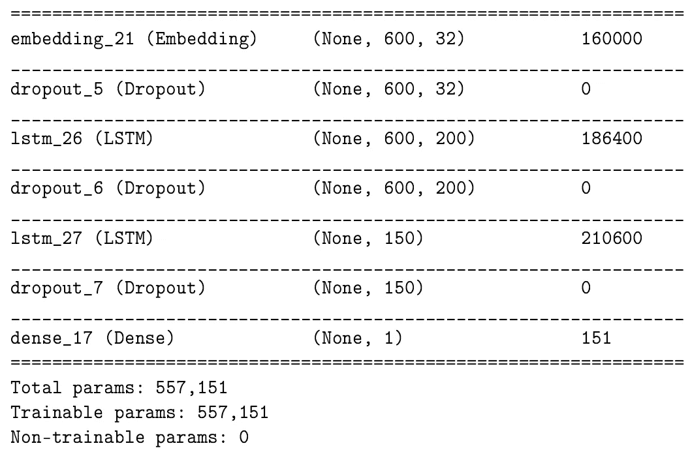****

****用于情感分析的多 LSTM 层架构:200 (1) -150 (2) LSTM 堆栈****

****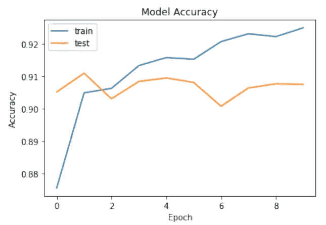****

******情感机器人在行动:******

****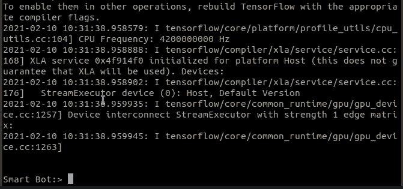****

****5 级情感识别****

*****你可以在这里看到源代码*****

*****基于用户情绪，企业可以追求**满意的客户(引导一代)**或者给**不满意的客户提供替代选择(后备)*******

# *****2)好友推荐*****

*****一般来说，一旦 Bot 开始推荐文章、电影、医生、投资或下一个最佳行动，它就会成为一个私人伙伴。为了实现这一点，主要有 **4 种推荐系统算法:*******

1.  *******协同过滤:最流行。**它的基本原理是，过去同意的用户将来也会同意。*****
2.  *******基于内容的过滤:没有冷启动问题。**根据内容本身的属性查找相似的项目。*****
3.  *****混合系统:现代推荐器结合了协作过滤和基于内容的模型。*****
4.  *******深度学习方法:**使用协作过滤&基于内容的特征创建嵌入。由于 DL 系统**是非线性的**，它们会先发制人，避免过度简化，并支持**跨域**数据集。*****

*****为了增加实现的味道，让我们在 Matlab 中做**协同过滤。*******

******你可以在这里* 查看完整源代码*****

# ******3)问题回答(CDQA 和 ODQA)******

******对人类来说，从文章中理解并找到答案是一项艰巨的任务。如果一个机器人能够做到这一点，那么没有什么比它更好的了！我们可以使用 **MRC(机器阅读理解)模型**来完成同样的任务，并使用 **LDA-NMF** 主题建模和语义搜索来扩大规模。******

******要回答给定上下文的问题，需要对上下文和查询之间的复杂交互进行建模。典型地，这些机制使用**注意力**来将这样的交互转换成向量。有许多 MRC 模型，如 *BiDAF、DAANet、RNet、QANet、CogQA、XLNet、ReasoNet 等。*******

********双向注意力流(BiDAF)模型**是一个**闭域问答**模型( **CDQA** )可以回答仿真问题。BiDAF 使用多级分层上下文表示来实现查询感知的上下文表示，而无需早期摘要。******

******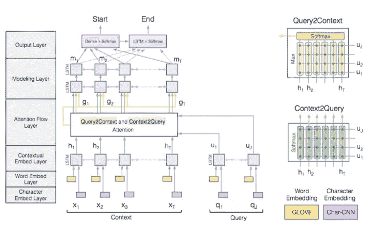******

******BiDAF 架构([礼貌](https://github.com/ElizaLo/Question-Answering-based-on-SQuAD))******

********MRC 机器人在行动:********

******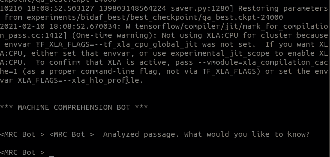******

*******你可以在这里看到源代码*******

*********另一方面，开放领域问题回答(ODQA)** 涉及从覆盖广泛主题的广泛文档集合中寻找自然语言查询的答案。虽然性能落后于 CDQA，**这个模块增强了机器人的对话体验，当定位在*级联后退机器人架构中的 CDQA 之后和人类移交***之前。*******

******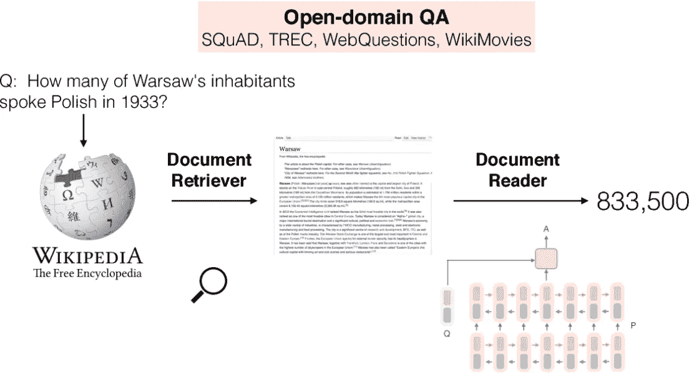******

******来自庞大知识库的开放领域问题回答([礼貌](http://ai.stanford.edu/blog/answering-complex-questions/))******

*******热门车型包括，*******

******I)**DeepPavlov 的 ODQA:**接受一批查询作为输入，并从维基百科文章中返回最佳答案******

******ii) **脸书研究公司的 DrQA:**针对潜在的非常大的非结构化文档语料库中的“大规模机器阅读”(MRS)任务******

******iii) **强化的阅读器分级器(R3):** ODQA，具有基础事实分级器组件以及基于强化学习的训练******

# ******4)总结******

********想象你给一个机器人发了一篇很长的文章或者一个 PDF 的书。如果机器人回复它的摘要，会节省多少时间？这正是总结模型所做的。********

******这在各种 bot 用例中都很有用。例如，生成**机器人对话的要点**以供进一步参考，或者**机器人可以用其领域的精选文章**的摘要来问候。******

******概括地说，自动文本摘要有两种方法:******

*   ********摘录:**从源文本中选择子序列，然后排列它们以形成摘要(类似于荧光笔)******
*   ******抽象:理解意图，用自己的话写总结(类似于钢笔)******

******传统上，使用 **seq2seq 模型进行总结时要注意。然而，在这个模型中，从原文中复制一个单词太难了，导致事实上不准确或重复的摘要。********

********指针生成器网络**通过**允许从源代码复制单词**，同时**保留从固定词汇表生成单词**的能力，从而实现了两全其美。******

******各种变压器型号，如 *T5、BART、GPT2、Longformer、Pegasus 等。*用于根据手头的用例生成概要。******

# ******5)欺诈检测******

******在金融等敏感领域，异常检测占据了中心位置。部署在此类领域的机器人应该有能力检测它们，无论是假冒用户还是不太可能的交易。******

******一般来说，**你可以使用高斯模型**通过寻找概率非常低的值来检测异常值。让我们考虑一个 2D 样本数据集。******

******a) **估计均值和方差**以拟合高斯分布。******

******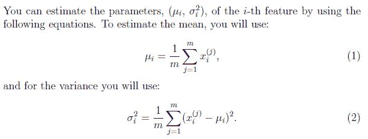******

******b)逐步增加ε**阈值**的值。******

******c)对于每个ε，根据精确度和召回率计算 F1 分数。******

******d)找出 F1 分数最高的那个**最佳阈值。**外界值为分类异常。******

******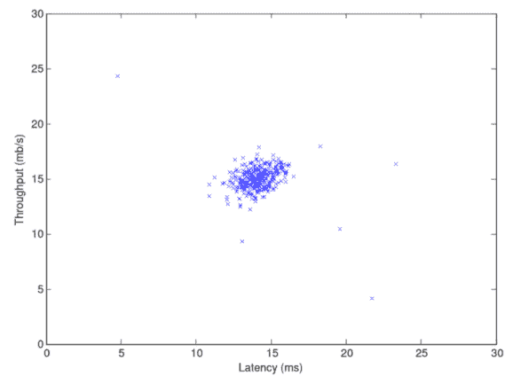******

******[图片由](https://www.edx.org/new/course/the-analytics-edge)提供******

******使用高斯消去法查找数据异常的 Matlab 代码******

*******你可以在这里* 查看源代码******

*******为了检测欺诈，**朴素贝叶斯分类器**被广泛使用。无监督方法的标准方法包括**localooutlierfactor、一类 SVM 或 IsolationForest。**相反，你可以**使用 PCA 或 t-SNE** 降低维度，并尝试重建数据，类似于**自动编码器**。如果重建不完美，那么就存在潜在的欺诈。*******

# *******6)知识图表*******

*******驱动聊天机器人的知识库可以存储在知识图中，基于这个知识图，机器人可以回答人类语言的询问。各种知识图解决方案包括 *Grakn、TigerGraph、Neo4j、GraphDB、JanusGraph 等。********

******基于用户意图和实体， **bot 后端可以生成一个 Grakn 查询，并通过图形遍历检索查询到的仿真陈述。通过这种方式，机器人交互变得非常自然和强大。********

# ******7)基于图像的交互******

******能够使用图像与机器人交互，使数字体验更加丰富。这可以通过两种方式在**中完成:********

******a) **用户向机器人:**用户向机器人发送图像。机器人分析图像，并回复图像中的细节。 ***例如*** *:机器人后端使用 YOLO 来检测图像中的对象，或者使用定制的人工智能模型来诊断 X 射线图像中的疾病。*******

******b) **Bot to User:** 基于上下文，Bot 可以给出图像的智能选择，让用户选择。 ***例如*** *:显示礼物选项的图片，让用户选择图片。*******

# ******8)个性化******

******个性化有多个层次。仅仅给机器人取名为“T1”，说“史蒂夫”，或者“T2”称呼用户的名字“T3”就是一种简单的个性化。还可以在机器人对话中注入一些错别字，使聊天机器人不那么像机器人。******

******此外，机器人可以存储用户的一些关键事实，并在以后继续对话。**历史记忆**可以给机器人使用者带来神奇的体验。想想 Fin-bot 建议你通过记录日常开销来减少酒店食物？******

# ******9)预测分析******

******这是人工智能的经典用例，也是个性化的自然延伸。例如，*基于 LSTM 时间序列分析，Fin-bot 可以预测低账户余额，或者 eCom-bot 可以预见农产品价格的下降。*******

# ********10)位置特征********

******能够获取地区新闻或使用地理位置 API 根据用户的位置建议附近的餐馆或医院增加了机器人的体验。******

# ********11)语音识别********

******除了图像，支持语音的交互也增加了用户的便利性。更好的是，如果机器人能够使用定制训练的人工智能模型识别地方口音，正如我的博客中所解释的******

# ******12)回退机制******

******为了最大化查询覆盖率，建议采用*多级级联回退*架构，如*常见问题解答-CDQA-ODQA-人工切换*。最后但同样重要的是，机器人可以根据用户的选择或情感切换到真人。******

# ******结论******

******各种 NLP 技术和库可以为机器人添加有用的功能，如自动拼写纠正或使用 n-gram 模型完成单词。*我们已经建立了一个端到端的渠道，为上面讨论的每个突出特征整合了更好的模型。想象一个机器人，它可以从来自多个领域的文章、研究论文或书籍中总结或回答查询。**如果上面的阅读激起了你的好奇心，或者你可能想要一个机器人来改善你的业务，那么你可以联系我** [**这里**](https://www.linkedin.com/in/ananduthaman/)*******

# ******源代码仓库:******

1.  ********感伤分析:** IPython 代码 [*此处*](https://github.com/AdroitAnandAI/Multi-Class-Sentimental-Analysis-Deep-Learning)******
2.  ********问答:** Python 代码 [*此处*](https://github.com/AdroitAnandAI/Question-Answering-MRC-with-AI)******
3.  ********欺诈检测:** MATLAB 代码[此处 ](https://github.com/AdroitAnandAI/ML-Algorithms-in-MATLAB/tree/master/8.%20Anomaly%20detection%20and%20Recommender%20systems)******
4.  ********推荐系统:** MATLAB 代码 [*此处*](https://github.com/AdroitAnandAI/ML-Algorithms-in-MATLAB/tree/master/8.%20Anomaly%20detection%20and%20Recommender%20systems)******
5.  ********语音识别:**自定义模式 [*此处*](https://github.com/AdroitAnandAI/Indian-Accent-Speech-Recognition)******

# ******参考******

1.  ******[deep learning . ai NLP Specialization](https://www.deeplearning.ai/program/natural-language-processing-specialization/)作者 *Younes Bensouda Mourri、ukasz Kaiser、Eddy Shyu*******
2.  ******[自然语言处理中的图形综述](https://web.eecs.umich.edu/~mihalcea/papers/nastase.jnle15.pdf)V . nasta se，R . Mihalcea，Radev 博士，自然语言工程，2015 年******
3.  ******[由 Udacity 公司生产的 NLP 纳米学位(nd 892)](https://www.udacity.com/course/natural-language-processing-nanodegree--nd892)******
4.  ******[Edx(麻省理工学院)的分析边缘](https://www.edx.org/new/course/the-analytics-edge)******
5.  ******[https://medium . com/neural space/graphs-neural-networks-in-NLP-DC 475 EB 089 de](/neuralspace/graphs-neural-networks-in-nlp-dc475eb089de)******
6.  ******[http://www . abigailsee . com/2017/04/16/taming-rnns-for-better-summarying . html](http://www.abigailsee.com/2017/04/16/taming-rnns-for-better-summarization.html)******