# 如何从头开始制作你的第一个 Android 应用程序

> 原文：<https://medium.com/nerd-for-tech/how-to-make-your-first-android-app-from-scratch-df31d9c557a2?source=collection_archive---------0----------------------->

## 遵循这 5 个步骤来制作你的第一个 Android 应用。


丹尼·米勒在 [Unsplash](https://unsplash.com/s/photos/android?utm_source=unsplash&utm_medium=referral&utm_content=creditCopyText) 上的照片

n droid 应用程序开发是一个开发原生 Android 应用程序的过程，一开始可能看起来很难，但它可以打开一个充满可能性的世界。很难找到从哪里开始，但不要担心，这是一篇完美的文章，可以作为一个实际的例子，让你的第一个运行应用程序在手机上使用。

> 如果你对移动开发感到困惑或者想要完整的知识，请阅读这篇文章。

要在 Android Studio 中开发一个应用程序，你需要学习 Java 或 Kotlin 编程语言。

> 选择哪种语言是一个不同的讨论话题，但是我将给出一个简单的概述。Java 是最流行的编程语言之一，一段时间前，它还是谷歌对 Android 的首选语言。许多应用程序运行在 Java 上，甚至今天还在使用。最棒的是，它还为 android 的每个主题提供了大量的示例和丰富的教程，帮助初学者快速学习。而 Kotlin 是 Google 目前首选的新兴语言。它很容易学习，而且比 Java 有一些优势。此外，它还减少了代码的长度，并预先消除了一些最著名的“空指针异常”和其他 Java 运行时错误。

在决定学习哪种语言并习惯语言之后，下一步是在开始 Android Studio 之前了解 Android、其 SDK 和开发工具的概况，这样你就不会第一眼就感到困惑。学习了 Android 的基础知识，了解了 Android Studio 的各种特性和功能之后，就可以往前走，做第一个实用的 app 了。

# 以下是所需的 5 个步骤:

## 1.下载应用程序开发所需的工具

**您需要设置开发应用程序的环境。Android Studio 是 Android 开发所需的集成开发环境。它是一个完整的包，包括 SDK、仿真器、UI 设计器、程序编辑器、编译器和调试器。安装 Android Studio 后，您需要下载一些 SDK 和模拟器，这一点很重要。**

> **你可以从[这里](https://developer.android.com/studio)下载 Android Studio**

## **2.创建新项目**

***从这里开始你的 Android Studio 之旅。***

**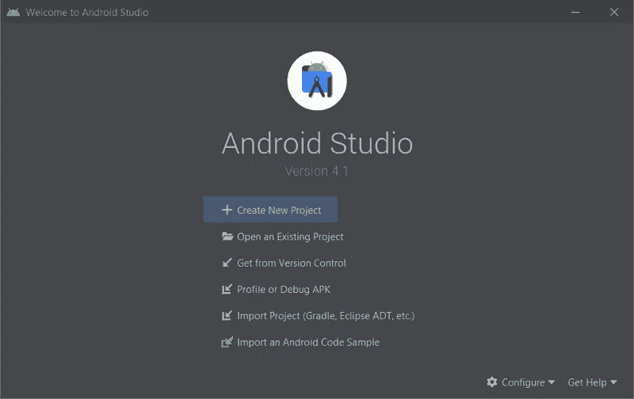**

**成功安装 Android Studio 后，启动程序，你会看到如上图的第一个屏幕。点击**创建新项目**。**

**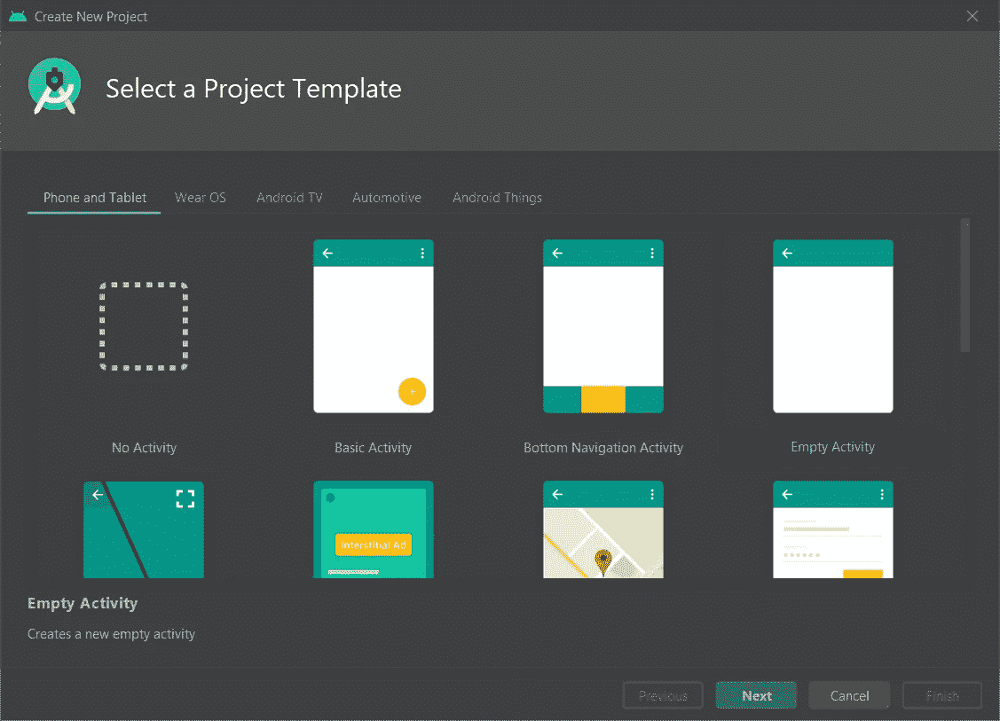**

**它将引导您进入如上所示的下一个屏幕。该页面提供了标准的预构建模板，您可以根据需要从中选择任何模板，而不是创建它们。尽管这些模板对开发人员很有帮助，但我们还是会使用**空活动**，因为其他模板可能会让我们第一次开始时感到困惑。现在点击**下一个**。**

**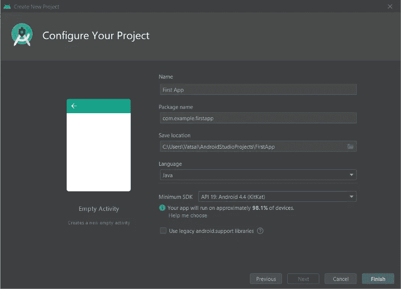**

**这将引导您进入如上所述的项目设置的最后一步。此页面用于设置项目的一般规范。如图所示，它询问项目的**名称**(例如: **First App** )和**包名称**(例如: **com.example.FirstApp** )。包名是 Android 用来区别于其他应用的内部参考。它应该使用您的顶级域名(例如:。com)、域名或组织名以及应用程序名。现在，因为我们没有组织，所以我们保持默认，选择**位置**来保存项目。**

**有必要在两种语言(Java/Kotlin)中选择一种你觉得舒服的。它将被选为项目的**默认** **语言**，尽管您可以在以后定制您的文件。之后，您需要为项目选择**最小 SDK** 。如果你熟悉 Android，你会知道它简称为 else，它是你想要支持的 Android 的最新版本。然后点击**完成**创建项目。**

## **3.向界面介绍自己**

**将所有这些按钮和窗口放在一起看可能会让人感到困惑。但是不要担心，它会发生在所有人身上，慢慢地我们会习惯的。我们的主要重点是制作和运行一个简单的应用程序。以下是 Android Studio 中常用窗口的一些图片，并附有说明。**

**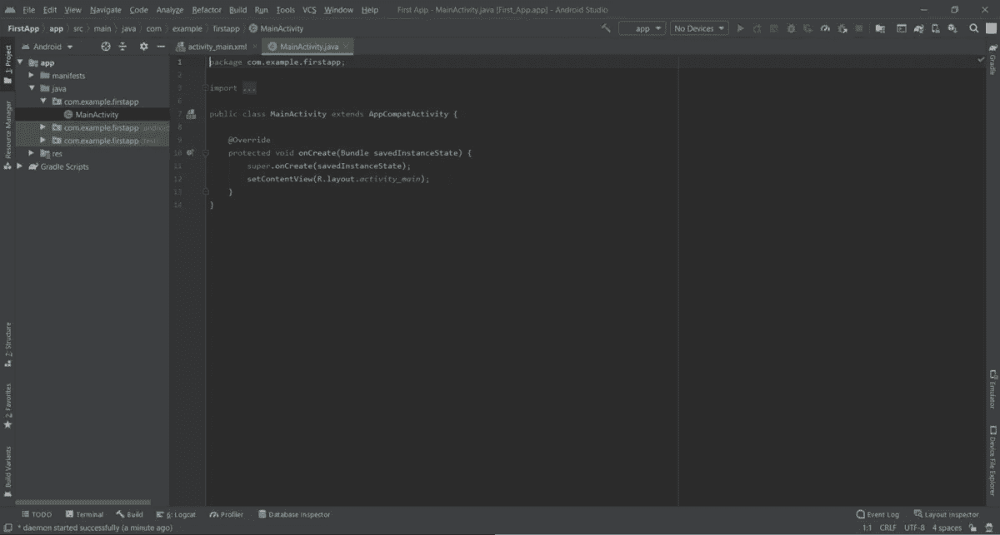**

**这是默认可见的主屏幕。它显示了所有项目文件的**代码编辑器**以及**导航面板**。将文件视图切换到安卓系统，因为开始时更多的文件可能会让你困惑，所以保持简单。**顶栏**包含了 Android Studio 的大部分选项和功能。底部的**栏**包含一些测试、调试等必需的便利工具。**

**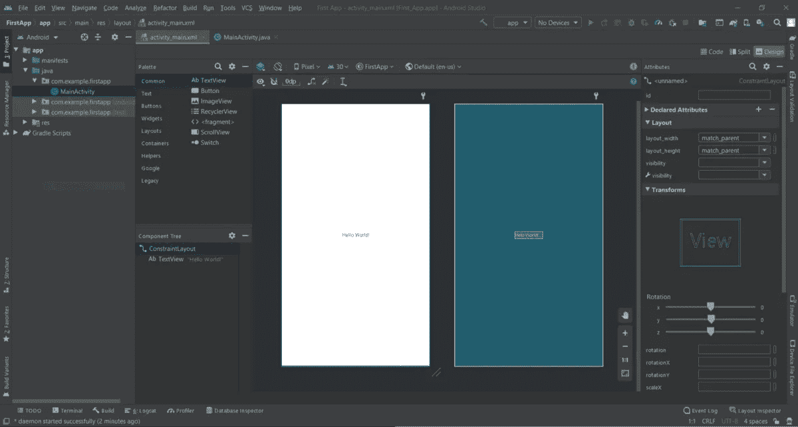**

**这是 UI(布局)开发屏幕。在这里，您可以编辑和查看与应用程序组件外观相关的所有内容。在这里你可以找到 Android 支持的每一个元素**左侧**。在**右侧**，显示所选 UI 元素的所有属性。在该窗口的**右上角**，你可以看到 **3 个按钮**带有代码、分割和设计标题。您可以通过单击这些按钮来切换视图，单击的结果如下所示。**

**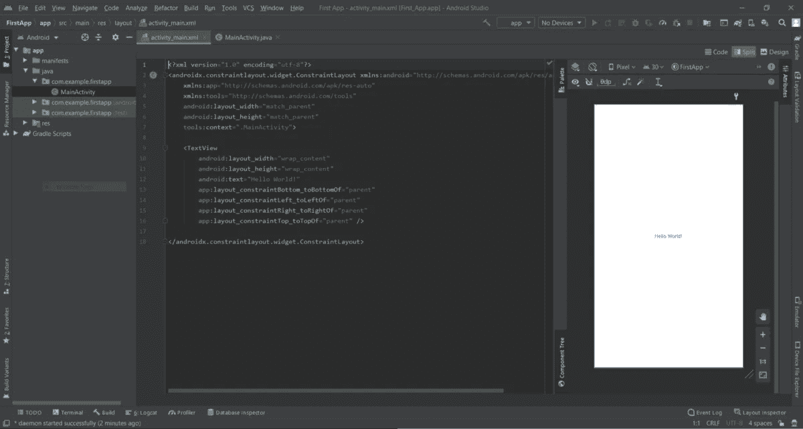**

**点击由设计和布局代码组成的**分割**按钮，该布局可见。你可能想知道这是什么代码？android 中的 UI 基于 **XML** 编码。这可以通过如上所示的简单拖放或通过学习编写 UI 来实现。编写 UI 元素的代码会更快，并且在开发过程中给你更多的控制权。**

**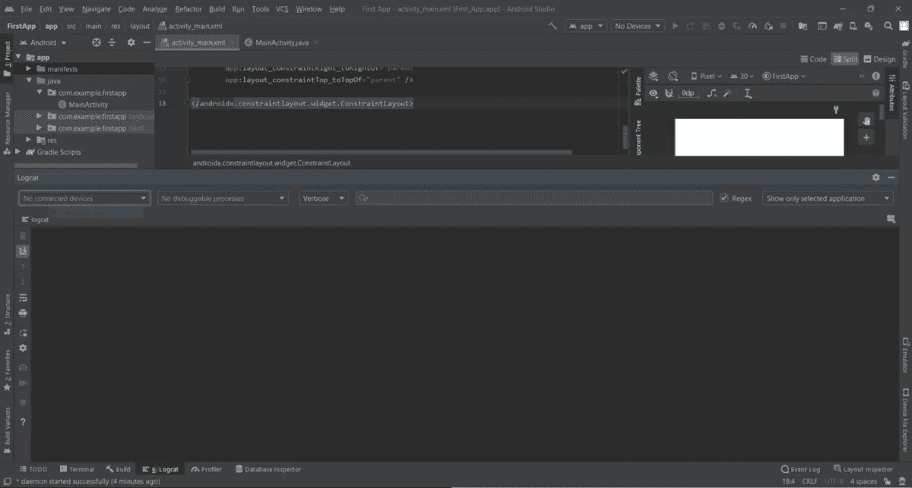**

**如图所示，从底部栏打开了一个名为 **Logcat** 的窗口。这是应用程序开发的一个重要工具，因为它显示了应用程序在设备或模拟器上运行时的所有报告。这对于找出应用程序崩溃的原因特别有用，因为在开发过程中会发生多次崩溃。**

**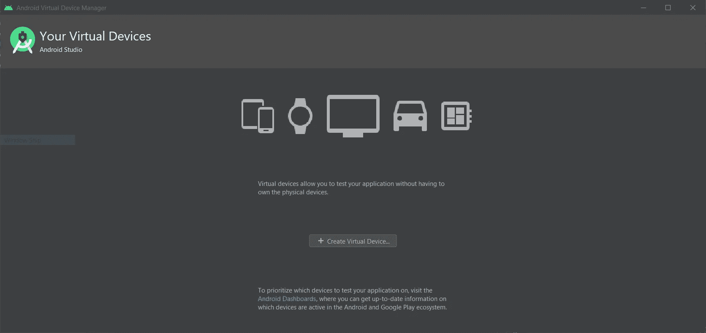**

**当您按下顶部栏中名为 **No Devices** 的按钮，然后点击 **AVD Manager** (Android 虚拟管理器)时，将会看到该窗口。从这里，您可以安装一个虚拟模拟器来测试应用程序。**

> **如果可能的话，我会建议使用 Android 设备而不是模拟器，因为这是一个缓慢且资源密集型的过程，您的计算机可能不支持或可能会执行滞后。**

## **4.让我们开始编码吧**

**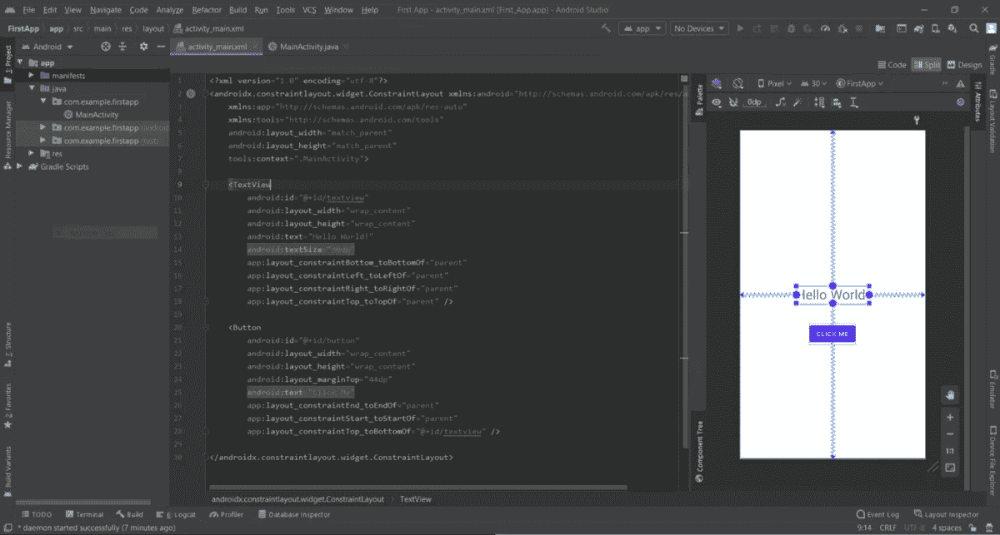**

**好了，在足够的介绍之后，让我们开始制作上面的应用程序，我们将在布局中添加一个按钮，并在应用程序的侧面添加约束，以便它保持在一个固定的位置。此外，我们将增加已经存在的文本视图的文本大小。现在我们将为文本视图和按钮提供 ID。这对于每个 UI 元素都是必要的，因为它给了它们一个身份，以便在代码中引用，并在编码时相互区分。**

**您也可以粘贴下面提供的代码进行测试。**

**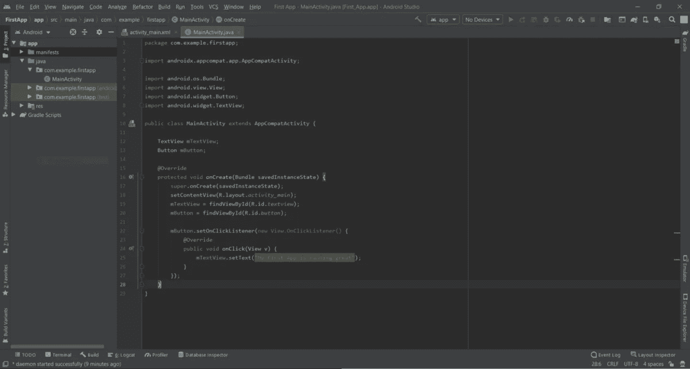**

**设置完 UI 部件后，让我们添加必要的代码来使这些元素起作用。如图所示，我们将首先创建一个变量作为我们想要编程的元素的**实例**，它们是 **mTextView** 作为 TextView 和 **mButton** 的实例，如下所示。**

```
TextView mTextView;
Button mButton;
```

**现在我们需要将它们连接到我们之前给定的 Id，以便它们通过" **findViewById()** "函数与它们的 UI 部分连接，该函数通过给定的 ID 找到特定的视图(元素)。**

```
mTextView = findViewById(R.id.*textview*);
mButton = findViewById(R.id.*button*);
```

**我们想在点击按钮时更改文本视图的文本，以显示“我的第一个应用程序运行良好”。所以为了监听按钮上的点击，我们需要在按钮上添加“ **OnClickListener()** ”。**

```
mButton.setOnClickListener(new View.OnClickListener() {
    @Override
    public void onClick(View v) {
        //write your code here
    }
});
```

**块中编写的代码将在单击按钮时执行。当我们想要改变文本时，我们选择了视图的属性“**【setText()**”。**

```
mTextView.setText("My First App is running great");
```

**您可以粘贴上面提供的代码进行测试。**

## **5.运行应用程序**

**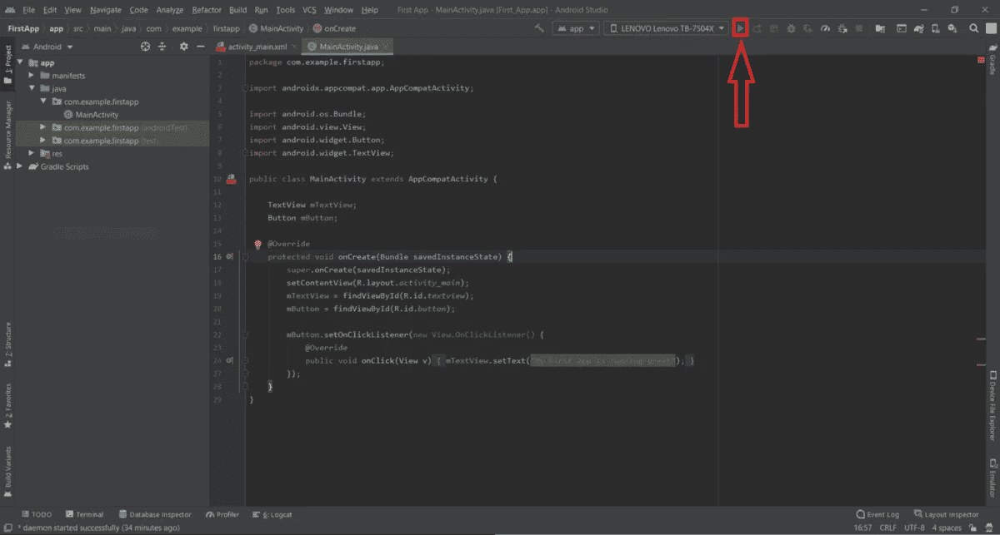**

**完成必要的代码后，我们需要建立和运行应用程序。如上图所示，设备名称或模拟器已连接，点击旁边的三角形播放按钮。它将在您的设备上构建并安装应用程序。可以点击按钮查看。**

> ***这是应用程序如我们所愿运行的证明。***

**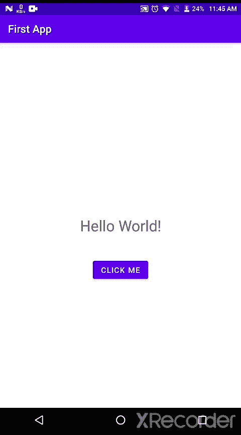**

**万岁！我们制作了第一个可用的 android 应用程序。这不是很简单吗？你不需要成为专业人士就可以开始开发安卓应用。**

## **后续步骤**

**好吧，我做了一个基础的 app，很简单，但是怎么才能做专业的 app 呢？这是一个简单的安装演示，演示了如何在 Android Studio 中运行应用程序。你的下一步是学习语言中的流程控制、集合、OOP 概念等，了解所有的 UI 元素，并像我们一样测试它们。**

**慢慢地，稳步地，你会很好地理解 Android 框架的活动、片段、服务等组件，以及如何使用它们。你不可能马上学会所有的东西，这也不是正确的方法。当你开始做项目或做别人的项目时，你会发现新的概念。**

> ***“学习是一个永无止境的过程”***
> 
> ***和“帝国不是一天建成的”***
> 
> **所以保持耐心，尝试学习新的东西。**

> **注:本文中除封面图片外的图片均由本人拍摄。**

**如果你觉得这个教程有帮助，请在下面欣赏它。谢谢:-)**

**如果你想谈更多或有任何疑问，你可以联系我，通过-**

**- [领英](https://www.linkedin.com/in/vatsal-patel-919691193/)**

**- [推特](https://twitter.com/VatsalP68888638)**