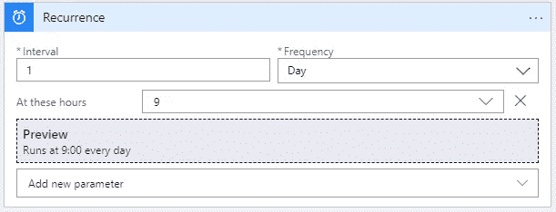
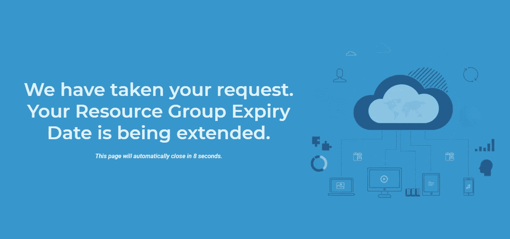

# 如何使用标签、逻辑应用、自动化帐户和 Runbooks 管理 Azure 资源组第二部分

> 原文：<https://medium.com/nerd-for-tech/how-to-manage-azure-resource-groups-with-tags-logic-apps-automation-account-and-runbooks-part-c6111a1bc6b0?source=collection_archive---------2----------------------->

## 使用逻辑应用、自动化帐户和 Powershell Runbooks 管理 Azure 资源组。

欢迎回来！在之前的[文章](/@kuharan/how-to-manage-azure-resource-groups-with-tags-logic-apps-automation-account-and-runbooks-part-i-82f65853e4c2?source=friends_link&sk=5a7ed2439896cf7508a626c0e0e9c63f)中，我们发现了一种自动供应资源组的方法。我们使用逻辑应用程序创建了一个流，当你从应用程序发出发布请求时，这个流就会触发。我们学习了如何使用标签进行管理。在本文中，我们将基于“expiration”标签来延长到期日期。够公平吗？我们走吧。

这个想法是当资源组的到期日临近时通知用户，并让他通过点击一个链接来延长它。(*一次性*)

## 步骤 1:创建一个带递归的逻辑应用程序



逻辑应用程序的定期显示运行配置在每天上午 9 点。

## 第二步:添加一本操作手册

使用创建作业操作来运行此 PowerShell 代码。如果你想知道如何创建一个，[看看我以前的帖子](/@kuharan/how-to-manage-azure-resource-groups-with-tags-logic-apps-automation-account-and-runbooks-part-i-82f65853e4c2)。这个 PowerShell runbook 扫描了所有资源，并生成了一个包含详细信息的 JSON。

```
#This section uses the service principal that is connected as this logic app to log into azure for access to create resources.
#since the service principal is a contributor on the root management group it has contributor level access to all subscription.$connectionName = "AzureRunAsConnection"try
{
    # Get the connection "AzureRunAsConnection "
    $servicePrincipalConnection=Get-AutomationConnection -Name $connectionName Add-AzureRmAccount `
        -ServicePrincipal `
        -TenantId $servicePrincipalConnection.TenantId `
        -ApplicationId $servicePrincipalConnection.ApplicationId `
        -CertificateThumbprint    $servicePrincipalConnection.CertificateThumbprint | Out-Null
}
catch {
    if (!$servicePrincipalConnection)
    {
        $ErrorMessage = "Connection $connectionName not found."
        throw $ErrorMessage
    } else{
        Write-Error -Message $_.Exception
        throw $_.Exception
    }
}#List the Azure Resource Groups with tags
$rgs = (Get-AzureRmResourceGroup)
$results = @()foreach ($rg in $rgs){
    $results += [PSCustomObject]@{
        rgname = $rg.ResourceGroupName
        tags = $rg.Tags
    }
}$rgjson = $results | ConvertTo-Json -compress
$data =  $rgjson | ConvertFrom-Json
$expiryobj = @()foreach ($i in $data){
    if ($i.tags.expiration -eq 'never'){
        continue
    }
    else{
        $expiryobj += [PSCustomObject]@{
            rgname = $i.rgname
            days_remaining = (New-TimeSpan -Start (Get-Date -format "d") -End ([DateTime]::ParseExact($i.tags.expiration, "M/d/yyyy h:mm:ss tt", $null))).Days
            tags = $i.tags
        }
    }
}$expiryjson = ConvertTo-Json -InputObject $expiryobj -compress
write-output $expiryjson
```

请注意，这里我们跳过了具有被称为 *never* 的 *expiration* 标签的资源组，以及已经扩展的资源组，即具有*扩展*标签的资源组。现在添加一个**获取作业输出**动作来获取 RGs 的详细信息。

## 步骤 3:添加解析 Json 组件

好了，现在只需添加 JSON 解析器和一个条件块，如果 *days_remaining* 小于 20 ( *可能是 15* )，就向用户发送电子邮件。要查看如何添加一个解析 Json 动作，[点击这里](/@kuharan/how-to-manage-azure-resource-groups-with-tags-logic-apps-automation-account-and-runbooks-part-i-82f65853e4c2)。

## 步骤 4:添加邮件组件

这是给这些资源的所有者发送电子邮件。在邮件正文中，提及 web 应用程序的链接。现在，当用户收到这封关于 RG 到期的邮件时，他将可以通过单击提供的链接来选择延期。链接显然应该重定向到 web 应用程序。在邮件正文中，添加以下内容，并将 **Is Html** 设置为 **True** 。

```
<a href=\”web_app_name.azurewebsites.net?data=rg_name”>Click Here To Extend</a>
```

一旦用户点击这个链接，它就会打开 web 应用程序来接受请求。

## 第五步:表演时间到了！

web 应用程序自动接受请求并触发扩展 Runbook。我试着保持整洁。接受请求，完成工作。完成了。



自动接受请求的示例 Web 应用程序。

还记得《碟中谍 4》吗？

以下是网络应用的 3 个功能，以备不时之需。

```
<!-- parameter passed as web_app_url.azurewebsites.net?data=resource_group_name -->
function getUrlParameter(name) {
    name = name.replace(/[\[]/, '\\[').replace(/[\]]/, '\\]');
    var regex = new RegExp('[\\?&]' + name + '=([^&#]*)');
    var results = regex.exec(location.search);
    return results === null ? '' : decodeURIComponent ( results[1].replace(/\+/g, ' ' ));
};function update_expiry(rg_name){
    jQuery.ajax ({
    url: "*url_of_Extension_Logic_App*",
    type: "POST",
    data: JSON.stringify({rgname:rg_name}),
    dataType: "json",
    contentType: "application/json; charset=utf-8"
    });
}<!-- This is the self destructive timer -->
var timeleft = 10;
var selfClosingTimer = setInterval(function(){
    timeleft--;
    document.getElementById("countdowntimer").textContent = timeleft;
    if(timeleft <= 0){
        clearInterval(selfClosingTimer);
        self.close();
    }
},1000);
```

## 第六步:扩展逻辑应用程序

当接收到 Http 请求时，添加一个**动作来激活流。这将接受来自 web 应用程序的有效负载。使用**创建作业**动作连接这是一本操作手册。**

## 步骤 7:扩展操作手册

该 Powershell 代码接受来自有效负载的参数，并向到期日期添加 30 天。但就这一次！一个额外的标签“**扩展**”帮助我们识别它曾经被扩展过。所以下一次，它扫描所有资源组中的到期日，跳过具有这个“ **extended** 标记的资源组。

```
param(
    [Parameter (Mandatory = $false)]
    [object] $payload
)#This section uses the service principal that is connected as this logic app to log into azure for access to create resources.#since the service principal is a contributor on the root management group it has contributor level access to all subscription.$connectionName = "AzureRunAsConnection"
try{
    # Get the connection "AzureRunAsConnection "
    $servicePrincipalConnection=Get-AutomationConnection -Name     $connectionName Add-AzureRmAccount `
        -ServicePrincipal `
        -TenantId $servicePrincipalConnection.TenantId `
        -ApplicationId $servicePrincipalConnection.ApplicationId `
        -CertificateThumbprint     $servicePrincipalConnection.CertificateThumbprint | Out-Null
}catch {
    if (!$servicePrincipalConnection){
        $ErrorMessage = "Connection $connectionName not found."
        throw $ErrorMessage
    } else{
        Write-Error -Message $_.Exception
        throw $_.Exception
    }
}$data = ConvertFrom-Json -InputObject $payload
$azureRGInfo = Get-AzureRmResourceGroup -Name $data.rgnameif($azureRGInfo.Tags.extended -eq 'True'){
    Write-Output "None"
}else{
    $azureRGInfo.Tags+= @{extended="True"}
    $olddate = $azureRGInfo.Tags['expiration']
    $newdate = [DateTime]::ParseExact($olddate, "M/d/yyyy h:mm:ss tt", $null).AddDays(30).ToString('M/d/yyyy h:mm:ss tt')
    $azureRGInfo.Tags['expiration'] = $newdate
    $status = Set-AzureRmResourceGroup -Tag $azureRGInfo.Tags -Name
    $data.rgname
}$status.ProvisioningState
```

## 步骤 8:最后添加一个电子邮件组件来发送成功的扩展通知。

最后，通过发送扩展确认让用户高兴。

恭喜你。您已经成功地延长了资源组的到期日期，并完成了资源组扩展自动化的第二部分内容。在接下来的几天里，我将写一篇关于资源组一旦过期就完全取消配置的文章。请继续关注最后一集——第三集。

**我可以在这里找到——** LinkedIn——[https://www.linkedin.com/in/kuharan/](https://www.linkedin.com/in/kuharan/)
Github——[https://github.com/kuharan](https://github.com/kuharan)