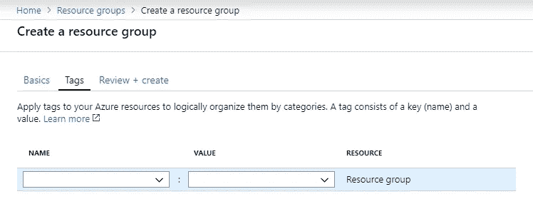
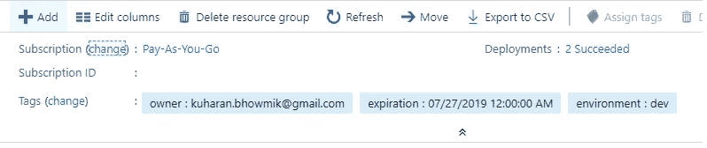
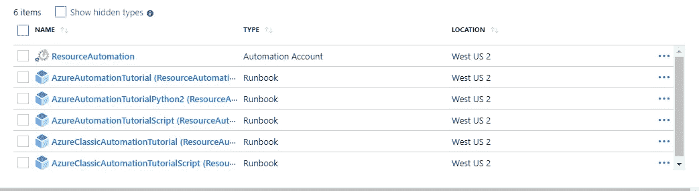
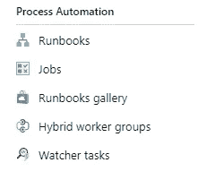
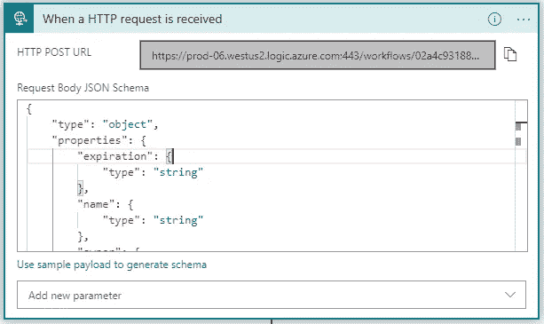
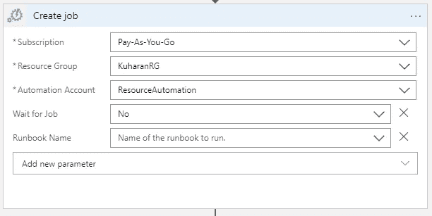
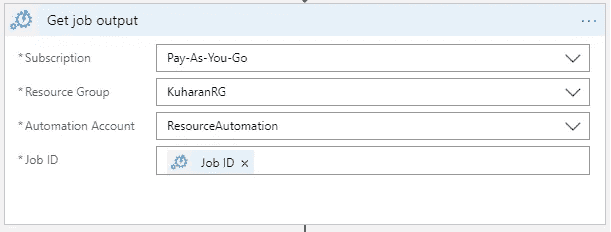
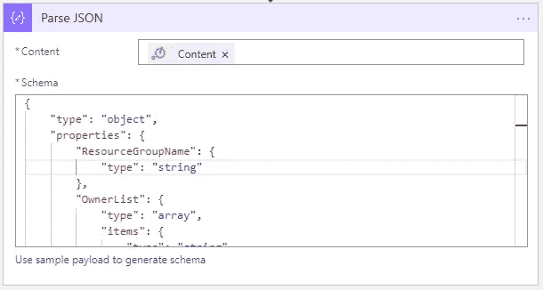
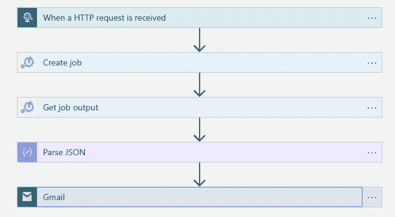

# 如何使用标签、逻辑应用、自动化帐户和 Runbooks 管理 Azure 资源组第一部分

> 原文：<https://medium.com/nerd-for-tech/how-to-manage-azure-resource-groups-with-tags-logic-apps-automation-account-and-runbooks-part-i-82f65853e4c2?source=collection_archive---------1----------------------->

## 使用逻辑应用、自动化帐户和 Powershell Runbooks 管理 Azure 资源组。

在 Microsoft Azure 中创建资源组时，可以为其分配标签。是的，这是一个可选的特性，看起来像是又一个管理琐事，但是精明的用户会利用这个结构来实现更好的治理和生产管理。



Microsoft Azure 的资源组创建步骤 2 —标签

如果你创造了，它就会像这样出现。



创建后显示标签的 Microsoft Azure 资源组

# 什么是 Azure 资源组？

它是一个容器，保存 Azure 解决方案的逻辑相关资源。在 Azure 中，你将相关的资源进行逻辑分组，作为一个实体进行部署和管理。换句话说，一个资源组可以包括解决方案的所有资源，或者只包括那些您希望作为一个组来管理的资源。

# **如何用标签管理 Azure 资源组？**

标记允许您通过为资源和资源组分配一个名称:值对(如 owner: your_name)来组织它们。当涉及到访问控制和法规遵从性时，这可能是有用的；跟踪谁可以与什么进行交互。但是不要因为我提到了就开始胡乱贴标签！以下是一些可以遵循的最佳标记实践—[https://docs . Microsoft . com/en-us/azure/architecture/cloud-adoption/decision-guides/resource-tagging/](https://docs.microsoft.com/en-us/azure/architecture/cloud-adoption/decision-guides/resource-tagging/)

# 如何自动配置 Azure 资源组？

## 步骤 1:创建一个自动化帐户。

Azure Automation 提供了流程自动化、更新管理、所需状态配置、跟踪变更和收集清单的功能。

**创建自动化时创建运行方式帐户。**

这将在自动化帐户中创建**运行方式帐户**,这对 Azure 进行身份验证以管理自动化运行手册中的 Azure 资源非常有用。默认情况下，此步骤将部署以下 6 个资源，包括 1 个自动化帐户和 5 个示例操作手册。



创建自动化帐户后 Microsoft Azure 的资源组和资源

## 步骤 2:创建供应运行手册。



自动化帐户的流程自动化

转到**自动化帐户**并在左侧窗格的**过程自动化**部分下，查找操作手册并创建操作手册。*您还可以根据自己的需要从 runbooks gallery 中选择各种常见的 run book。*

这是我写的 **PowerShell** 代码，它从一个 web 应用程序接受一个 **JSON** 有效负载，并作为一个后端系统，用有效负载的标签值创建一个资源组。

```
<#
    .DESCRIPTION
        An example runbook that connects with a service principal, adds azure guest accounts and creates resource group in the appropriate subscription..NOTES
        AUTHOR: Azure Automation Team
        LASTEDIT: Mar 14, 2016
#>param
(
    [Parameter (Mandatory = $false)]
    [object] $WebhookData
)#This section uses the service principal that is connected as this logic app to log into azure for access to create resources.
#Make Sure the service principal is a contributor on the root management groups.
$connectionName = "AzureRunAsConnection"
try
{
    # Get the connection "AzureRunAsConnection "
    $servicePrincipalConnection=Get-AutomationConnection -Name $connectionNameAdd-AzureRmAccount `
        -ServicePrincipal `
        -TenantId $servicePrincipalConnection.TenantId `
        -ApplicationId $servicePrincipalConnection.ApplicationId `
        -CertificateThumbprint $servicePrincipalConnection.CertificateThumbprint | Out-Null
}
catch {
    if (!$servicePrincipalConnection)
    {
        $ErrorMessage = "Connection $connectionName not found."
        throw $ErrorMessage
    } else{
        Write-Error -Message $_.Exception
        throw $_.Exception
    }
}#This receives the payload data from the message body of the incoming post. Make sure the payload is in Json.
$Request = $WebhookData
$Owner = ($Request.owner)
$Name = $Request.name
$RGName = ("Sandbox-" + $Name).tolower()#Connect Azure AD
$myCred = Get-AutomationPSCredential -Name ''
$userName = $myCred.UserName
$securePassword = $myCred.Password
$myAADCred = New-Object System.Management.Automation.PSCredential ($userName,$securePassword)
Connect-AzureAD -Credential $myAADCred | Out-Null#Select proper subscription to build RG in.$subname = "***"
$context = Set-AzureRmContext -SubscriptionName $subname
#$subscription = Get-AzureRmSubscription -SubscriptionName $subname#Create the resource group with the name the end user provided in the form and create it with tags they provided.
#Make sure you add expiration days to the current date to get the Resource Group's expiration date.try{
   $NewRG = New-AzureRmResourceGroup -Name ($RGName).tolower() -Location "WEST US 2" -Tag @{ owner = $Owner; environment=$Request.environment; expiration = ([DateTime]::Now.addDays($Request.expiration))} -force
}
catch{
   if (!$NewRG)
   {
       Write-Error -Message $_.Exception
       throw $_.Exception
   }
}$objOut = [PSCustomObject]@{
    ResourceGroupName = $RGName
    Owner = $Owner
    ExpiryDate = (Get-Date).AddDays($Request.expiration).ToString('MM-dd-yyyy')
    CreationDate = (Get-Date).ToString('MM-dd-yyyy')
}Write-Output ( $objOut | ConvertTo-json )
```

转到测试面板，用这个输入作为 Webhook 数据来测试输出—

```
{
 "expiration": "30",
 "name": "kuharan",
 "owner": [
     "kuharan.bhowmik@gmail.com"
 ],
 "environment":"dev"
}
```

输出—

```
{
    "ResourceGroupName":  "Sandbox-kuharan",
    "OwnerList":  [
                      "kuharan.bhowmik@gmail.com"
                  ],
    "ExpiryDate":  "08-27-2019",
    "CreationDate":  "07-28-2019"
}
```

如果您的输出与此类似，那么复制输出并粘贴到记事本中(*您将在之后需要它*

确保在继续之前发布它。

## 步骤 3:创建一个逻辑应用程序来自动化这个 Runbook。

当收到 Http 请求时为**创建一个动作**动作**。**使用 JSON 有效负载(*应在前端应用程序*中配置)，如下所示:

```
{
 "expiration": "30",
 "name": "kuharan",
 "owner": [
     "kuharan.bhowmik@gmail.com"
 ],
 "environment":"dev"
}
```

最终的模式应该是这样的—

```
{
    "type": "object",
    "properties": {
        "expiration": {
            "type": "string"
        },
        "name": {
            "type": "string"
        },
        "owner": {
            "type": "array",
            "items": {
                "type": "string"
            }
        },
        "environment": {
            "type": "string"
        }
    }
}
```

只要你保存了逻辑应用，azure 就会神奇地为你的应用生成一个 **POST** 请求 URL，如下所示

```
[https://prod-06.westus2.logic.azure.com:443/workflows/<workflowid>/triggers/manual/paths/invoke?api-version=2016-10-01&sp=%2Ftriggers%2Fmanual%2Frun&sv=1.0&sig=<](https://prod-06.westus2.logic.azure.com:443/workflows/02a4c93188ca4984a0292591c1014525/triggers/manual/paths/invoke?api-version=2016-10-01&sp=%2Ftriggers%2Fmanual%2Frun&sv=1.0&sig=U4-h6uaXvXZ1vJ5MptkQUwSvjF-jR75dZjIY4jIIw-s)sigid>
```

获取这个 URL 并配置您的前端应用程序。

…它看起来像这样—



Azure 资源组供应应用程序—步骤 1

接下来，当接收到 Http 请求时，将**创建作业**动作连接到**动作。通过点击 *+New Step* 按钮来搜索“ **Azure Automation** ”。下面是**创建作业**的样子。**



Azure 资源组供应应用程序—步骤 2

接下来，从 Runbook 连接一个**获取作业输出**动作。它只需要一个工作 ID



Azure 资源组供应应用程序—步骤 3

让我们在这一步用 **Parse JSON** 动作解析输出。从 Powershell Runbook 中复制测试输出(*步骤 2* )并粘贴到**使用示例有效负载生成模式**框中，模式将为您生成。



Azure 资源组供应应用程序—步骤 4

整体流程应该是这样的。漂亮！



Azure 资源组供应应用程序—总体

一旦你从你的应用程序或邮递员点击它，你会注意到逻辑应用程序正在幕后运行。有时，资源组的创建可能需要几分钟才能部署到 Azure 中。与此同时，你可以**深呼吸——**[https://www.google.com/search?q=breathing+exercise](https://www.google.com/search?q=breathing+exercise)我就是这么做的！

恭喜你。您已经完成了关于资源组配置自动化的这一密集内容的第一部分。我将在几天后撰写关于取消资源组供应的文章，并在本系列的下一篇专栏文章中发表。请继续关注第二部分。

**我可以在这里找到——** LinkedIn——[https://www.linkedin.com/in/kuharan/](https://www.linkedin.com/in/kuharan/)
Github——[https://github.com/kuharan](https://github.com/kuharan)