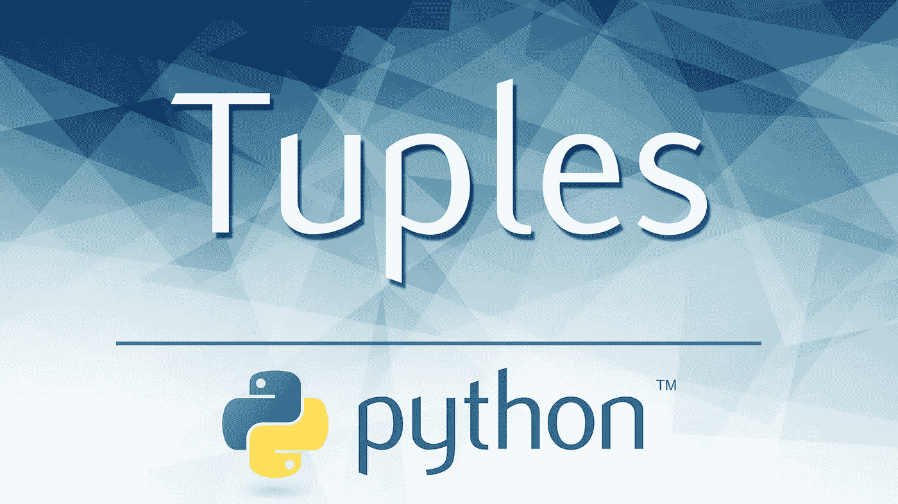
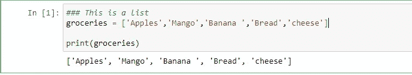
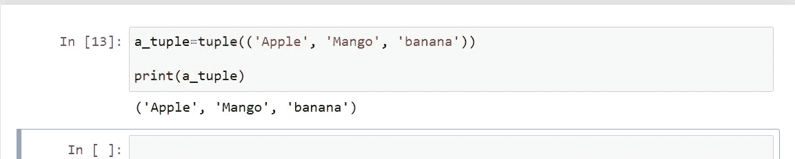
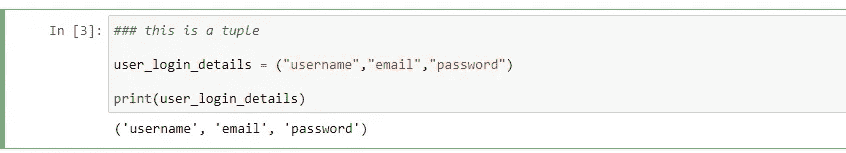
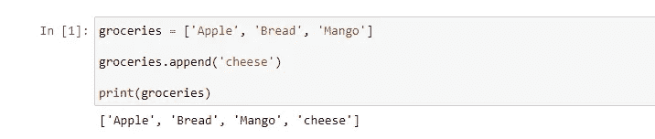
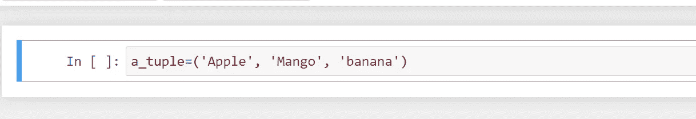
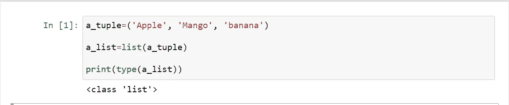
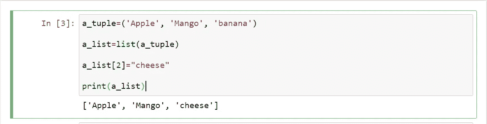
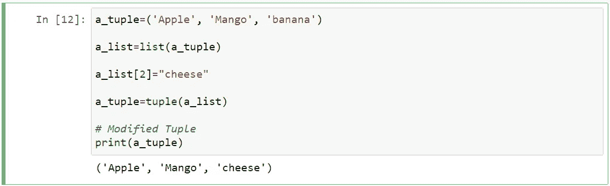

# 如何在 Python 中修改元组？周围的工作。

> 原文：<https://medium.com/nerd-for-tech/how-to-modify-tuples-in-python-the-work-arounds-9213a2df21fe?source=collection_archive---------9----------------------->

就像列表和字典一样，Tuple 是 python 中的另一种数据类型，用于在单个变量中存储多个项目。但是与列表和字典不同的是元组是“不可变的”。

让我们通过一个例子来理解列表和元组之间的区别。

列表是使用[]括号声明的，如下所示。

而 tuple 是使用()括号或 Tuple()方法声明的，如下所示。

元组和列表的主要区别在于，我们可以通过添加、删除条目来修改列表，但是对于元组，我们不能通过添加或删除条目来改变它。

## 比如说。

这是一个名为“杂货”的列表，最初有三个项目。现在，我修改了这个列表，添加了另一个条目“cheese ”,并将其打印出来。

正如你所看到的，最终的名单中也有奶酪。

但是我们不能对元组这样做。

## **为什么我们甚至需要一个元组？**

当我们处理我们不想改变的数据时，例如，存储人们的密码，我们将它们存储在元组中，因为这是你永远不想改变的。

## 但是，如果用户想改变他们的密码呢？

这将存储在另一个元组中，但旧密码将保持不变。

## 变通办法。

因为，元组是不可变的数据类型，不能被改变，但是有一些方法可以修改元组。

> 创建一个元组。

> 将其转换成列表

> 修改列表。

> 将其转换回元组。

通过这样做，您可以轻松地添加、删除、更新元组中的项目。