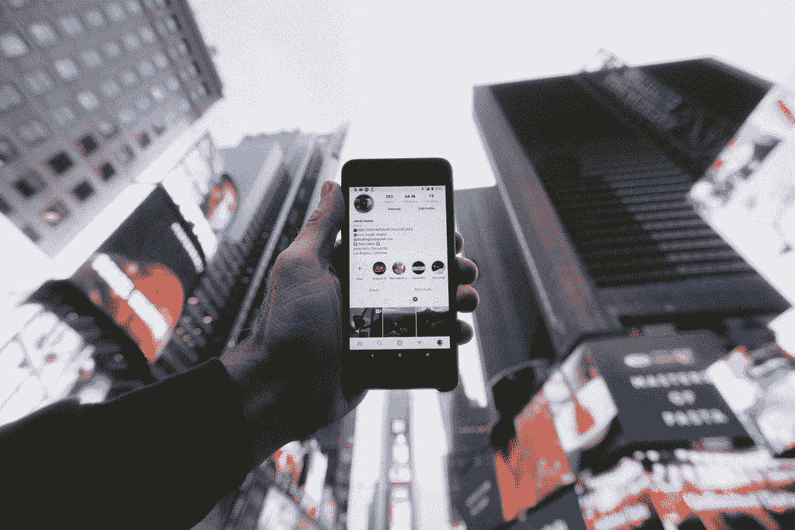

# 如何激励受众谈论你的品牌并在社交媒体上分享你的内容

> 原文：<https://medium.com/nerd-for-tech/how-to-motivate-audiences-to-talk-about-your-brand-and-share-your-content-on-social-media-575975322698?source=collection_archive---------1----------------------->

## 病毒含量

## 情绪是关键，但不是你想的那样。

照片由 [Unsplash](https://unsplash.com/) 的[雅各布·欧文斯](https://unsplash.com/@jakobowens1)拍摄

谁没有被网上的广告惹恼过，然后对着屏幕大喊大叫，直到那个该死的东西消失……然后突然你又变成了你自己，就像什么都没有发生过一样？