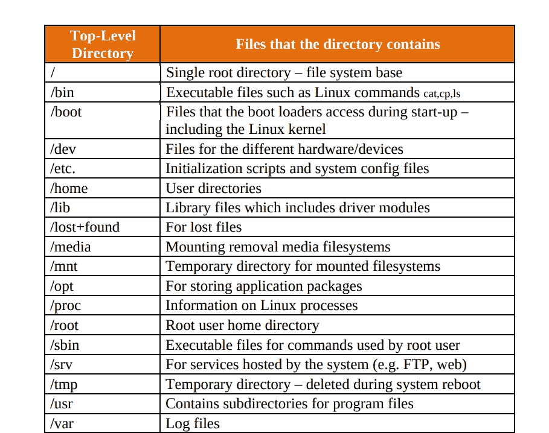
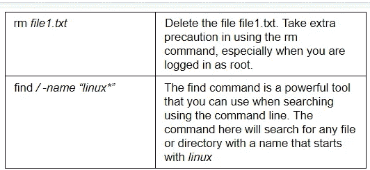
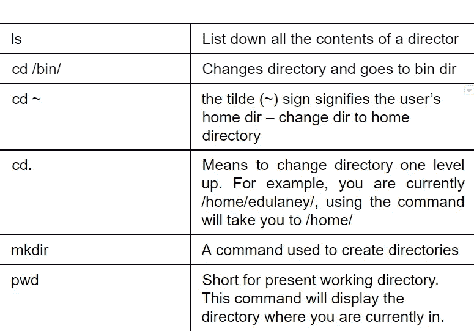

# 如何导航 Linux 文件系统？

> 原文：<https://medium.com/nerd-for-tech/how-to-navigate-the-linux-filesystem-4bdc23e72b00?source=collection_archive---------4----------------------->


# 介绍

Linux 是一个开源操作系统。它总是合作开发的。Linux 是最伟大的生态系统之一。这是用于从小型数字手表到服务器和超级计算机。

在本文中，我们将尝试掌握 Linux 操作系统的基础知识。如果我们没有太多使用 Linux 系统的经验，我们可能会被从命令行控制和导航 Linux 文件系统的视图淹没。

# 描述

*   Linux 使用一个层次系统来排列文件。
*   文件保存在目录中。
*   这些目录也可以包括其他目录。
*   当比较 [Linux](https://www.technologiesinindustry4.com/2021/05/basic-linux-administration.html) 文件系统和 Windows 时，我们会发现 Linux 中没有驱动器号。
*   所有文件都存储在一个根目录中。
*   在 Linux 中，我们还需要关于目录层次结构的信息(众所周知的路径名)来查找文件。
*   路径名自带顶级目录、目录层次结构和带有文件扩展名的文件名。
*   所有这些都用正斜杠(/)分隔。

# 重要的特殊字符

这对于每个人在使用命令之前了解重要的特殊字符是非常重要的。它们在 [Linux](https://www.technologiesinindustry4.com/2021/05/basic-linux-administration.html) 文件系统中有特殊的功能。

*   **圆点(。)**代表文件系统中的当前目录。
*   **圆点-圆点(..)**表示比当前目录高一级。
*   **正斜杠(/**代表文件系统的根。
*   Linux 文件系统中的每个目录或文件都嵌套在根目录下。
*   **波浪号(~)** 代表当前登录用户的主目录。

# Linux 顶级目录



# 导航目录

我们可以使用以下方法在 Linux 上的目录中导航:

*   使用 GUI 通过浏览文件夹来查找某个文件。
*   使用基于文本的通用搜索功能。
*   通过使用命令行。

# 有用的命令

现在我们将讨论 Linux 操作系统中的重要命令。这些命令是我们在 Linux 文件系统中的导航工具。我们可以在终端中使用以下有价值的命令在文件系统中导航和工作:



# 文件和目录处理

现在我们将演示如何创建和操作文件和目录。

**通过触摸**创建文件

*   一些命令和程序可以创建文件。
*   创建文件的基本方法是使用 touch 命令。
*   这将使用指定的名称和位置创建一个空文件。
*   我们应该首先验证我们是否在主目录中。
*   这是我们同意保存文件的位置。
*   然后，我们可以通过键入以下命令创建一个名为 file1 的文件:

```
cdtouch file1
```

*   如果我们查看目录中的文件，我们可以看到新创建的文件:

```
Lsfile1
```

*   我们同样可以同时创建多个文件。
*   我们也可以使用绝对路径。
*   例如，如果我们的用户帐户名为 demo，我们可以键入:

```
touch /home/demo/file2 /home/demo/file3lsfile1  file2  file3
```

**用 mkdir** 创建一个目录

*   mkdir 命令允许我们创建空目录。
*   例如，要在名为 test 的主目录中创建一个目录，我们可以键入:

```
cdmkdir test
```

*   对于在内制作一个目录*名为*的测试目录的例子*编写如下:*

```
mkdir test/example
```

*   测试目录必须预先存在，上面的命令才能工作。
*   我们可以使用-p 选项告诉 mkdir 它应该创建构建给定目录路径所需的任何目录。
*   这允许我们一步创建嵌套目录。
*   我们可以通过键入以下命令创建一个看起来像某些/其他/目录的目录结构:

```
mkdir -p some/other/directories
```

*   该命令最初会创建某个目录。
*   然后它会在其中创建另一个目录。
*   最后，它将在这两个目录中创建目录。

# 结论

我们已经介绍了在 [Linux](https://www.technologiesinindustry4.com/2021/05/basic-linux-administration.html) 操作系统中文件系统导航和操作的基本视图。理解任何概念的最好方法是将其付诸实践。因此，借助所描述的命令，我们可以更好地理解 Linux 文件系统，这些命令是我们的导航工具。

更多详情请访问:[https://www . technologiesinindustry 4 . com/2021/09/how-to-navigate-the-Linux-file system . html](https://www.technologiesinindustry4.com/2021/09/how-to-navigate-the-linux-filesystem.html)