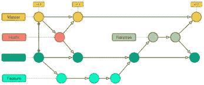

# 如何不用 git！

> 原文：<https://medium.com/nerd-for-tech/how-to-not-use-git-301d6e45cee6?source=collection_archive---------0----------------------->

我们每个开发者每天都在使用 git。我们真的在以正确的方式使用 git 吗？今天我将和你讨论如何不用 git。所以我们开始吧！！

## 1.不要直接提交给主、开发、发布分支。

如果我们认为理想情况下不应该在主分支中直接提交，这是一个不好的做法。主分支应该包含一个完全测试和可部署的代码版本，这意味着当我们准备好发布我们的变更时，我们将把开发的分支与主分支合并。为此，我们可以使用 **git-flow** 。

## **2。不要提交应用程序机密(。env/。evn*文件)。**

。env 文件太神奇了！对吗？它包含数据库密码、API 密钥、Jwt 秘密等等。但是我们不应该将敏感信息直接提交给 git。我们可以用**。gitignore** for。环境文件

## 3.不要用 Git 做文件存储，停止存储大文件。

我们不应该在 git 上推送多个大文件。git 有存储限制。对于存储文件，我们可以使用 s3 或任何其他服务。

## 4.不要在一个部门处理多个问题。

为了解决问题，我们可以创建一个新的分支。停止在一个 git 分支中修复多个问题。如果发现问题，请记录下来并为其创建一个新分支。不管问题有多小！为它创建一个新的分支。因为随着项目复杂性的增加，记录和组织问题的需求也在增加。

## 5.不要忽略。

尝试使用。gitignore 保护你的项目私人信息，例如数据库密码、令牌、API 密钥等等。

## 6.不要强行推动。

`git push -f`？(不！请不要！！坏主意！！！😥😥)

假设您的一位同事使用相同的分公司名称工作。现在你要用一个新的分支(相同的分支名称)来推送，但是他已经推送代码了。但这一次你的推动会破坏他的代码。

一些值得一提的提示是
#不要修改或删除提交历史。
#不要在没有提交更改的情况下重置分支。不要进行大量的提交。
#不要随意修改遥控器中的提交。

感谢您阅读我的帖子。如果您对本帖或本主题有任何疑问，请在[**中提出您的问题，在**、](http://ask.counsily.com)中您可以直接与经过验证的专家对话并获得答案。Counsily 是一个高智商个人提问的俱乐部&从经验证的顾问那里获得个性化的帮助。[**ask.counsily.com**](http://ask.counsily.com/)

[***上打招呼***](https://www.linkedin.com/in/ruhulcse/)**[***五五***](https://www.fiverr.com/share/qR7QBV)**