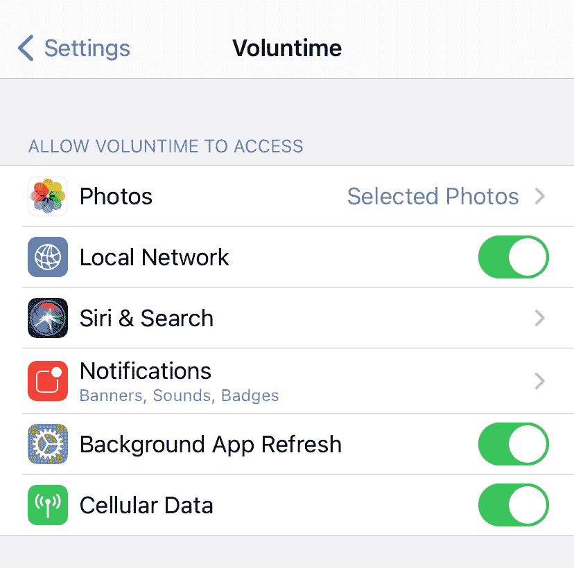

# 如何在设置中打开 React 原生应用

> 原文：<https://medium.com/nerd-for-tech/how-to-open-your-react-native-app-in-settings-44e162a751af?source=collection_archive---------9----------------------->



随着 React 原生应用规模的增长，并开始整合推送通知和摄像头访问等功能，您将需要处理用户授予您的应用的不同级别的权限。

有时，您可能想要提示用户更改他们的权限以启用您的应用程序的功能。这可能会有问题，因为在用户做出初始选择后，iOS 和 Android 手机不会再次显示相同的权限弹出窗口。之后更改权限的唯一方法是通过设置应用程序。

幸运的是，React Native 包括一个简单的内置方法，可以在设置中直接打开你的应用程序，这样用户就不必去搜索它了。

React Native 的链接模块是一个通用接口，可以与传入和传出的应用程序链接进行交互，它可以用于在设置中打开你的应用程序。

首先，您需要在文件顶部导入链接:

```
import { Linking } from ‘react-native’;
```

现在，每当你想打开设置时，就调用 Linking 的 openSettings 方法，就像在按钮的 onPress 函数中一样。

```
Linking.openSettings()
```

就是这样！在 [React Native 的链接文档](https://reactnative.dev/docs/linking)中了解更多关于链接功能的信息。