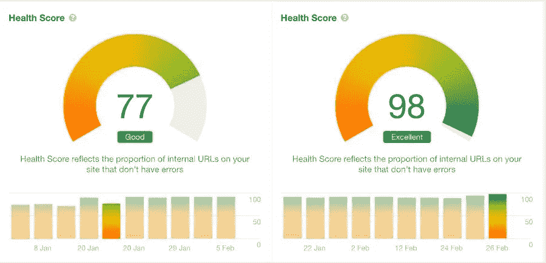
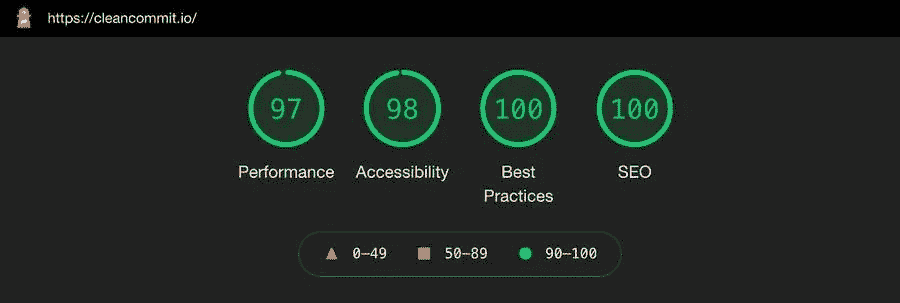
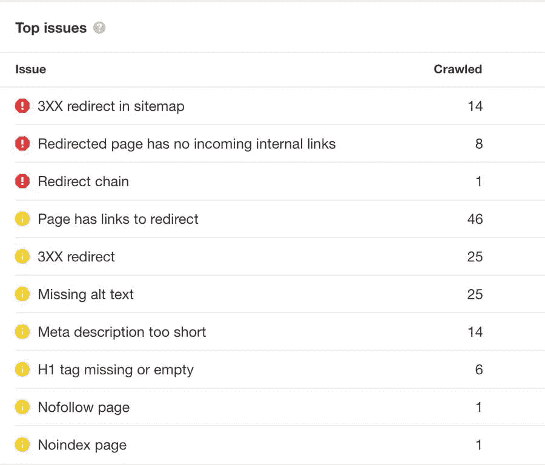
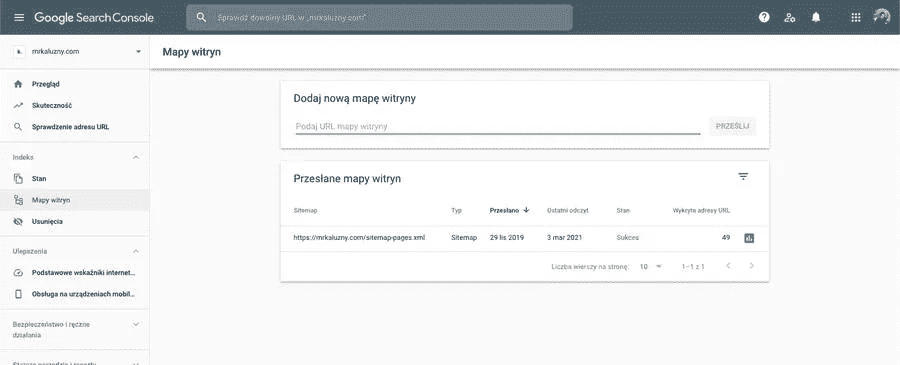

# 如何用 Gatsby & Netlify 优化 SEO

> 原文：<https://medium.com/nerd-for-tech/how-to-optimize-seo-with-gatsby-netlify-6ff19ab1737c?source=collection_archive---------16----------------------->


谢尔盖·佐尔金在 [Unsplash](https://unsplash.com?utm_source=medium&utm_medium=referral) 上拍摄的照片

为 SEO 优化网站对很多人来说是一件头疼的事情。谷歌的排名因素由很多元素组成。**最重要的是你页面的链接数量，其次是内容质量、核心网站要素(性能)和用户行为。**

性能是最重要的排名因素之一，盖茨比已经让我们占了上风。但是上面的因素并不是你唯一应该关心的。

二月份，我致力于优化我们和我们客户的网站的现场搜索引擎优化。我设法将 Clean Commit 网站的 ahrefs 分数从 77%更新到 98%。



优化前后的 Ahrefs 分数

在这篇文章中，我将向你展示所有你需要勾选的框，以最大化你的 Gatsby 网站 SEO 潜力。

# 建立盖茨比搜索引擎优化问题的工具。

你应该做的第一件事是专注于优化网站的性能。从长远来看，这将对你网站的排名产生巨大的影响。我为 Clean Commit 的博客写了一篇文章，列出了我们用来衡量性能的工具。

对于 SEO，我使用两个主要工具——ahrefs 和 Google 内置的 Lighthouse test。当发布网站时，我们的目标是在桌面上实现 90+的性能，在移动上实现 60+的性能，在搜索引擎优化得分方面达到 99+的性能，所以我们的灯塔得分看起来相当不错。



我们和盖茨比的速度分数

Ahrefs 提供了关于潜在现场问题的更详细的分析。这是我处理过的列表。



ahrefs 列出的问题

让我们开始处理所有的问题吧！

# 通过 Gatsby 为更好的 CTR 提供元数据

Ahrefs 提出了关于我们网站上的 meta 标签的问题。当创建一个 Gatsby 网站时，使用一个好的、可重用的 SEO 组件是很重要的。该组件将确保所有相关的元标签包含正确的数据。

我们将 SEO 组件分成两个部分:默认的组件(T12)和一个较小的组件(T13)，前者用 Henlo 设置头部参数，后者修改每个页面。

```
*import* React *from* 'react'
*import* { Helmet } *from* 'react-helmet'
*import* { graphql, useStaticQuery } *from* 'gatsby'*function* SEO({ data, children }) {
  *const* meta = useStaticQuery(graphql`
    query MetaDataQuery {
      site {
        siteMetadata {
          title
          separator
          baseTitle
          description
          keyword
          image
        }
      }
    }
  `) console.log(data) *const* metadata = meta.site.siteMetadata
  *const* metaDescription = data.description || metadata.description
  *const* title = data.title || metadata.title
  *const* image = data.image
    ? `${metadata.siteUrl}${data.image.childImageSharp.fluid.src}`
    : metadata.image *const* fullTitle = `${title} ${metadata.separator} ${metadata.baseTitle}` *return* (
    <Helmet
      title={title}
      titleTemplate={`%s ${metadata.separator} ${metadata.baseTitle}`}>
      <meta name='description' content={metaDescription} />
      <meta property='og:title' content={fullTitle} />
      <meta property='og:image' content={image} />
      <meta property='og:description' content={metaDescription} />
      <meta name='twitter:title' content={fullTitle} />
      <meta name='twitter:description' content={metaDescription} />
      <meta name='twitter:image' content={image} />
      {children}
    </Helmet>
  )
}*export* *default* SEO*export* *const* query = graphql`
  fragment SEO on MarkdownRemarkFrontmatter {
    seo {
      title
      description
      image {
        childImageSharp {
          fluid(maxWidth: 1200, quality: 100) {
            ...GatsbyImageSharpFluid_noBase64
          }
        }
      }
    }
  }
`
```

SEO 组件附带了一个片段来加载所有需要的信息，而不需要重复代码，使得将来的更改更快更容易。您在 [Netlify CMS 中设置 SEO partial，使用手动初始化在所有内容类型中重用它](https://mrkaluzny.com/blog/dry-netlify-cms-config-with-manual-initialization/)

优化元数据对 SEO 优化很重要。**元数据的内容不会真正影响你的排名**，谷歌可以忽略提供的内容生成片段。说**好的元数据内容会影响你的点击率(CTR)。把元数据想象成内容的预览，如果你能概括出最重要的信息，访问者点击你的链接的几率会更大。[使用这个工具](https://jamseotools.com/)确保你的标题和描述长度正确，易于阅读。**

# 避免盖茨比中多余的 301 重定向

我遇到的最大问题是 301 重定向。 **301 重定向是重定向流量的正确方法，不应该直接影响你的搜索引擎优化工作。**与此同时，301 重定向增加了加载时间，而且大多数时候根本不需要。确保内部链接中没有 301 重定向是很重要的。

**开箱即用盖茨比用尾随斜线建立路径。**如果你愿意，[你可以使用 Gatsby-plugin-remove-trailing-slashes](https://www.gatsbyjs.com/plugins/gatsby-plugin-remove-trailing-slashes/)从路径中删除尾随斜线。有些人直接在`gatsby-node.js`中删除路径的尾部斜杠，但是我建议不要在。

**使用 Netlify 时，最好使用带有尾随斜线的路径。** Netlify 将匹配重定向规则的路径，不管它们是否包含尾随斜杠。没有尾随斜杠的路径可能会导致无限重定向循环和意外行为。

为了避免创建意外的重定向，确保在`Link`组件中使用正确的路径。

```
<Link to='/about'>About us</Link>
```

此链接会导致 301 重定向(在 Netlify 上会)

```
<Link to='/about/'>About us</Link>
```

此链接不会导致 301 重定向

# 避免 Netlify 上的 Gatsby 中的重定向链

Netlify 导致一个现成的重定向链。它将[http://www.domain.com](http://www.domain.com/)重定向到[https://www.domain.com](https://www.domain.com/)到[https://domain.com](https://domain.com/)。

这个重定向是一个非常简单的修复方法。您所要做的就是向`_redirects`文件添加自定义重定向。

```
https://domain.netlify.app/* https://domain.com/:splat 301!
http://www.domain.com/* https://domain.com/:splat 301!
http://domain.com/* https://domain.com/:splat 301!
```

# 为更好的索引生成网站地图

你应该做的下一件事是为更好的索引生成一个站点地图。这将是一个平凡的任务，但幸运的是，我们可以利用 Gatsby 的插件来完成繁重的工作。

我的网站地图插件是[盖茨比-插件-高级-网站地图](https://www.gatsbyjs.com/plugins/gatsby-plugin-advanced-sitemap/)。如果你不想修改站点地图的内容，你所要做的就是把这个插件添加到 gatsby-config 中。一旦你的网站建成，网站地图将在 https://domain.com/sitemap.xml 下可用。

为了确保谷歌获取网站，你可以使用[谷歌搜索控制台工具](https://search.google.com/search-console/about)。你所需要做的就是添加域名，在你的 DNS 上用一个 TXT 记录来验证它。

验证您的域后，您可以导航到左侧导航中索引下的 Sitemap 选项卡。在那里你可以**提交你的网站地图的 URL，让谷歌知道你的网站已经准备好被索引了。**



向 Google 搜索添加域名

谷歌的搜索控制台是一个很好的工具，可以随时关注你在谷歌的排名，平均点击率，并检测页面的潜在问题。

# 优化 Gatsby SEO 的快速总结

1.  关注绩效改进
2.  为更好的 CTR 提供元数据信息
3.  避免不必要的 301 重定向
4.  使用 Netlify 时避免重定向链
5.  生成网站地图并提交给谷歌搜索控制台

如果你想改善与 Gatsby 一起工作的体验，请阅读[这篇关于 Netlify CMS 的干式配置的文章& Gatsby](https://mrkaluzny.com/blog/dry-netlify-cms-config-with-manual-initialization/)