# 如何编排 AWS 服务？AWS 阶跃函数

> 原文：<https://medium.com/nerd-for-tech/how-to-orchestrate-aws-services-aws-step-functions-3471ac52af67?source=collection_archive---------3----------------------->

您需要在 AWS 中协调多个 Lambda 函数。你推荐什么？有没有可以实现的 AWS 服务？让我们检查 AWS 步骤函数来找到我们的答案:

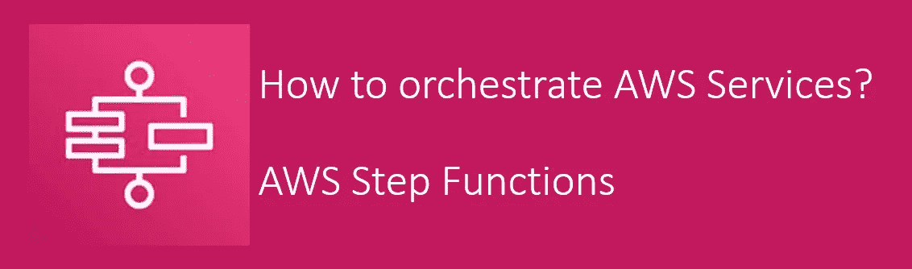

AWS Step 函数允许我们将任何工作流建模为状态机。它构建了跨不同服务协调任务的工作流。这可用于订单履行、数据处理或任何工作流程。

正如您在下面看到的，工作流是在 JSON 中定义的。它给出了工作流的可视化，工作流的执行，以及历史。该步骤可以是 lambda 函数，将数据插入 Dynamo DB、任何特定的 ECS 任务等。因此，通过 steps 函数，它将编排流程。

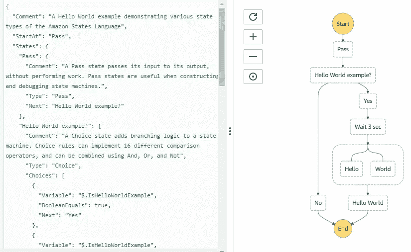

资源:AWS 控制台

从工作流入手，我们可以使用 SDK 调用、API 网关或者 CloudWatch 事件。任务状态可以是任何 AWS 服务调用，例如，调用可以在 JSON 中定义的 lambda 函数，如下所示:

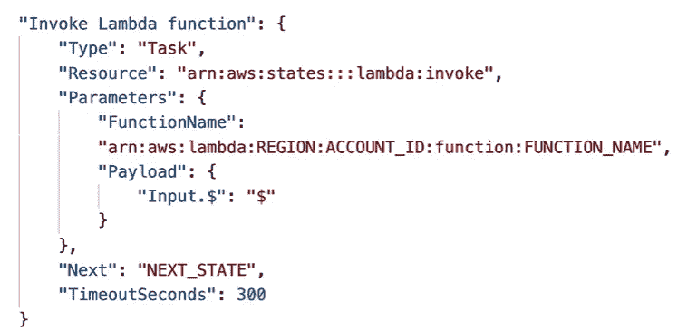

调用 lambda 函数的任务状态

在示例中，我们可以看到，类型是“Task”，资源是“Lambda Invoke”，必需的参数和 next 是“Next State”。现在，让我们讨论一下在阶跃函数中可以使用哪些状态:

*   选择状态:测试发送到特定分支的条件
*   失败或成功状态:以失败或成功停止执行的结束状态。
*   传递状态:该状态将其输入传递给下一个状态，而不执行任何工作，或者只是将一些固定数据注入下一个状态
*   等待状态:提供特定时间的延迟
*   映射状态:动态迭代步骤
*   并行状态:开始并行执行分支

以下是可视化工作流在执行过程中的样子:

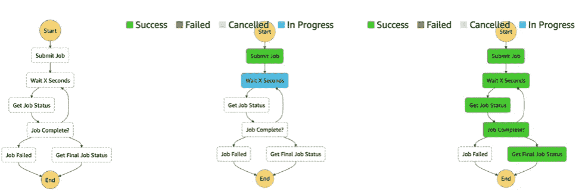

状态机中的可视化工作流，

现在我们准备一起进行一个简短的动手操作。开始吧！

登录 https://aws.amazon.com/[打开 AWS 控制台](https://aws.amazon.com/):

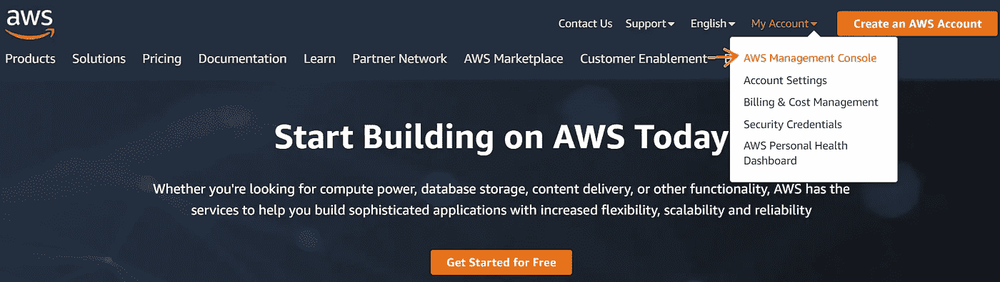

在服务中搜索步骤功能，然后单击“开始”。

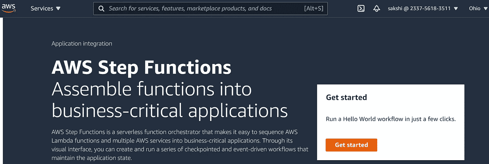

我们现在可以看到如下的 Hello World 工作流。我将向您展示它是如何基于‘IsHelloWorldExample’变量工作的，该变量决定执行的分支。

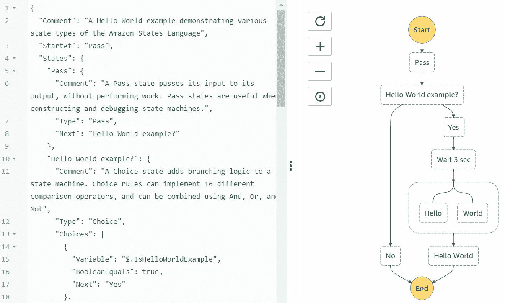

那么，让我们继续，单击“Next”创建它。在第 2 步中，我们需要指定一些细节，比如状态机名称，就像我给的“HelloWorld”一样。让其他参数保持原样。单击“创建状态机”按钮:

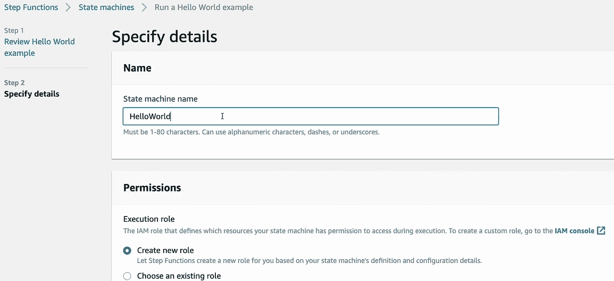

让我们首先将“IsHelloWorld”的输入设为“true ”:

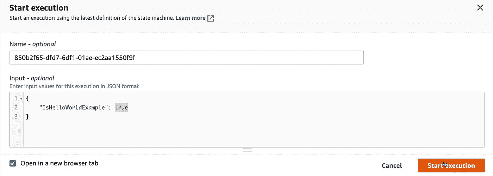

现在，我们可以看到执行正在发生:

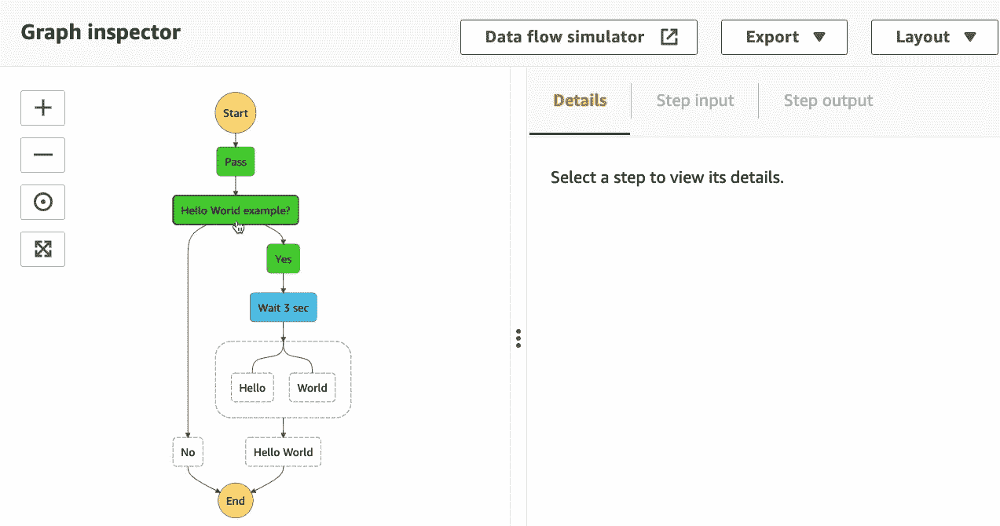

等待 3 秒钟后，我们可以看到执行输出。对于执行中发生的所有步骤，我们可以在“执行事件历史”选项卡中查看它们。

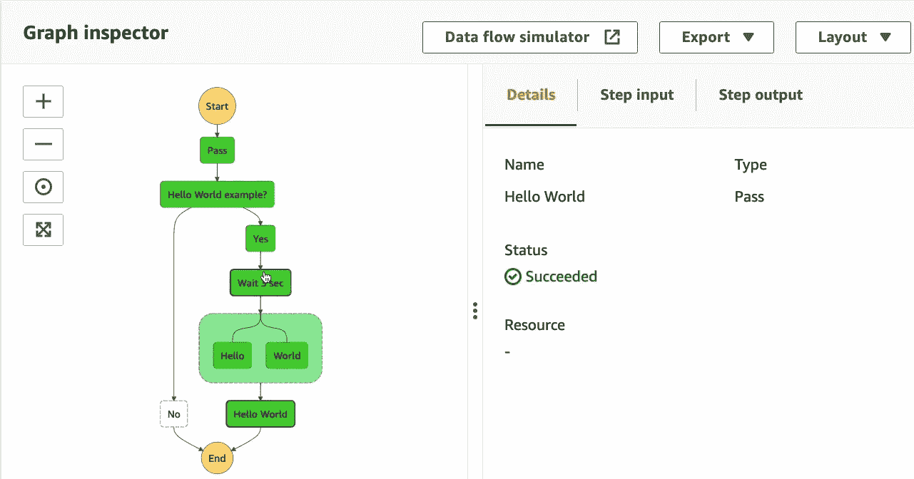

现在，让我们使用输入变量“false”运行相同的执行:

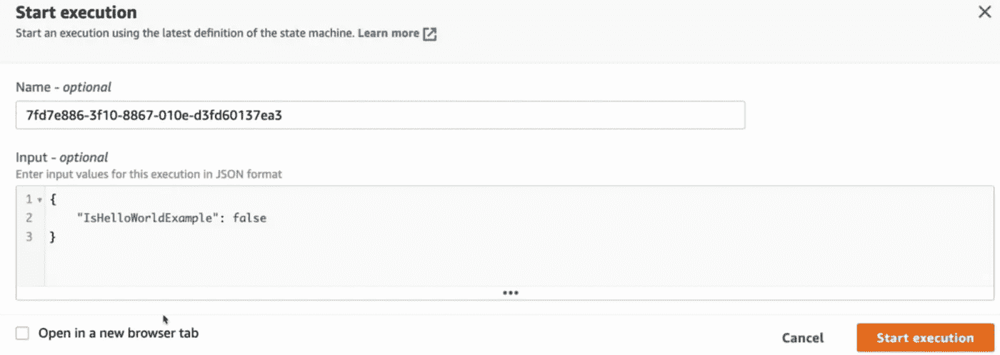

这一次，我们可以根据之前的输入看到失败状态:

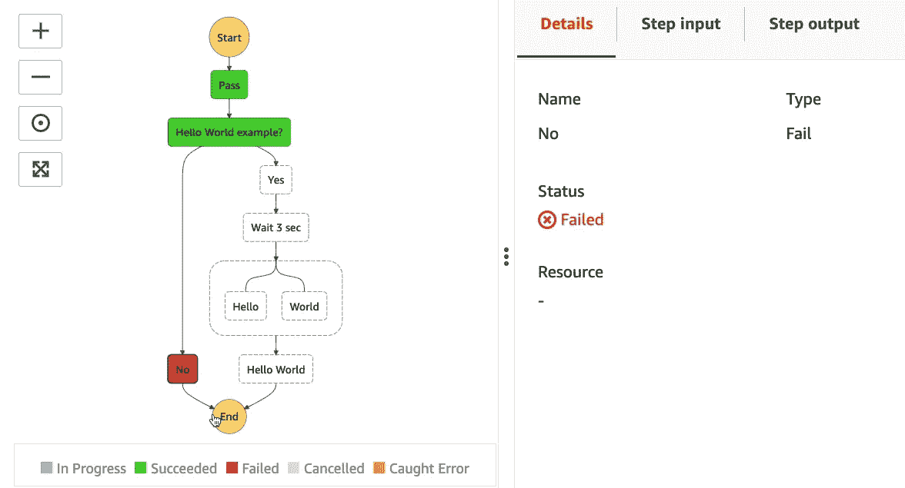

# 它还能做什么？

撰写 AWS 资源，包括:

*   自动气象站λ
*   弹性集装箱服务
*   AWS Fargate
*   AWS 批次
*   AWS 发电机数据库
*   AWS SNS(简单通知服务)
*   SQS(简单队列服务)
*   AWS SageMaker
*   AWS 事件桥
*   AWS EMR(弹性映射简化)

# 使用案例:

AWS 步骤功能使我们能够将业务流程实现为组成工作流的一系列步骤。下面是一些业务用例。每个用例的细节可以在最后的参考文献中找到。

*   结合 Lambda 函数构建基于 web 的应用程序
*   为 IAM 策略创建协调安全事件响应
*   同步来源和目标 S3 时段之间的数据
*   为流数据构建数据处理管道
*   运行 ETL 作业并构建、训练和部署机器学习模型
*   使用 AWS Step 函数 Data Science SDK 自动化机器学习工作流
*   从 PDF 或图像中提取数据进行处理

希望你理解了 AWS 步骤功能的基本流程。现在，您可以使用任何 AWS 服务创建自己的状态机。

如果您有任何相关的疑问，请随时联系我。如果可以的话，我很乐意帮助你。保持联系:)

## 如果你喜欢这个帖子，请为它鼓掌并在 Medium 上关注我！

## 领英:[www.linkedin.com/in/sakshikhandelwal276](http://www.linkedin.com/in/sakshikhandelwal276)推特:[https://twitter.com/SakshiKhandlwl](https://twitter.com/SakshiKhandlwl)

# 参考资料:

*   【https://aws.amazon.com/step-functions 
*   [https://aws.amazon.com/step-functions/use-cases/](https://aws.amazon.com/step-functions/use-cases/)