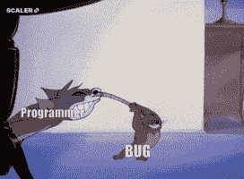
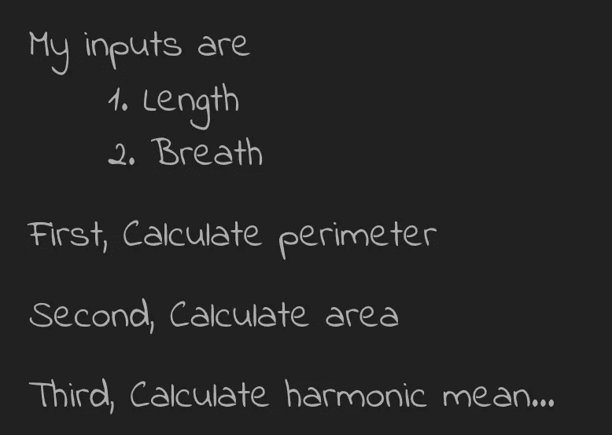

# 如何组织和构建你的代码？

> 原文：<https://medium.com/nerd-for-tech/how-to-organize-and-structure-your-code-bb394c42f935?source=collection_archive---------0----------------------->

## 这些步骤可以改变你对写代码的看法！


看完这个，你就有想法了。(来源:[吉菲](https://giphy.com/gifs/friends-best-news-ever-smiling-like-an-idiot-9Q9DYfOELkQIU))

## 先说一个统计数据:

> GitHub 报告称拥有超过 7300 万开发者和超过 2 亿个仓库**！！！**

这意味着编码已经成为我们生活中不可或缺的一部分。我们每天都要写很多行代码。有大量的文章和 youtube 视频展示了如何编写和学习编码，以及如何使用模块，甚至有一些展示了在时间和空间复杂性方面优化代码。

但是当你为一个包含多个脚本和模块的产品编写代码时，代码的结构就变得重要了。看，有一个简单的概念！**花在组织上的每一分钟，都可以赢得一个小时。**

撇开哲学不谈，让我们试着列出一些要点，为什么我们需要花时间组织我们的代码。

## 1.可理解的


乔伊理解我的代码！！！(来源:[吉菲](https://giphy.com/gifs/friends-best-news-ever-smiling-like-an-idiot-9Q9DYfOELkQIU))

有组织的代码会让任何人都很容易理解代码。人们可以清楚地理解代码的流程。以这种方式，即使数千行代码看起来也像一个故事。

## 2.易于修改


以此速度修改..(来源:[吉菲](https://giphy.com/gifs/friends-best-news-ever-smiling-like-an-idiot-9Q9DYfOELkQIU))

一旦我们头脑中的故事非常清晰，我们就可以非常轻松地添加、删除、修改和优化代码。这不仅会减少时间，每次你都有一个清晰的画面，在哪里做代码的变化。

## 3.几分钟内修复 Bug



这不会再发生了…(来源: [Giphy](https://giphy.com/gifs/friends-best-news-ever-smiling-like-an-idiot-9Q9DYfOELkQIU) )

这可能是一种痛苦。代码可以在几分钟内编写完成。但是识别和修复一个 bug 需要一段时间，有时甚至更长时间。但是，我保证有组织的代码将在很大程度上帮助你处理它。

所以，现在我们明白了组织代码的重要性。但问题是我们如何组织起来？因此，这里有一些很好的提示，可以帮助你构建你的代码。

# 1.这个计划

> P 在你写之前，把你的代码弄亮

每次你计划写代码的时候，确保你先计划好。同时思考和写代码会让你觉得自己写代码更快。但是从长远来看，理解和修改这些代码需要更多时间。首先，您可以问以下问题:

1.  *我有哪些输入？*
2.  我的代码应该是什么样的？
3.  *我需要多少不同的功能？*
4.  *产量是多少？*

**对于** **的例子**，假设给定一个矩形的长度和宽度，我们需要找到该矩形的面积和周长的调和平均值。这个问题背后的逻辑很简单。但是存在不同版本代码。

首先是计划，这很简单



该计划(图片由 [Aayush Ostwal](https://medium.com/u/c541fb3fb779?source=post_page-----bb394c42f935--------------------------------) 提供)

让我们开始编码并开发第一个代码:

```
**def calculate_harmonic_mean(length, breath):**
 perimeter = 2*(length + breath)
 area = length * breath
 hm = (area * perimeter) / (area+perimeter)
 return hm
```

# 2.修剪

> 捆在一起的木棒不会被折断，但是单个的木棒很容易被折断，
> 我们需要破解密码！！！


装饰(图片由 [Aayush Ostwal](https://medium.com/u/c541fb3fb779?source=post_page-----bb394c42f935--------------------------------) 提供)

在这一步，我们将看到如何使代码功能化。这个想法是将一大段代码修剪成一个更小的子功能。这些小功能会增加理解性。此外，调试变得容易，因为我们知道哪些功能在工作，谁在制造问题。

理想情况下，每个函数中应该只有**2–6 行。因此，每次调试时，您都会知道需要修复的确切行。**

## 如何功能化？

当我们计划代码结构时，我们创建了一些步骤。因此，对于每个步骤，我们可以创建一个或多个函数。这就是为什么我们首先进行了规划。

因此，根据我们的计划，我们有两个不同的步骤来计算面积和周长。因此，我们将为每个步骤创建单独的函数。

因此，现在代码变成了:

```
**def get_perimeter(length, breath):**
 perimeter = 2*(length + breath)
 return perimeter**def get_area(length, breath):**
 area = length * breath
 return area**def calculate_harmonic_mean(length, breath):**
 perimeter = get_perimeter(length, breath)
 area = get_area(length, breath)
 hm = (area*perimeter) / (area+perimeter)
 return hm
```

似乎我们增加了代码的长度。但是，如果你看到大的图片，这只是一个简单的功能。当你要开发一个管道或产品时，功能化肯定会产生更大的影响。

# 3.不要复制

> 永远不要重复你的代码！


合并相同的代码(图片由 [Aayush Ostwal](https://medium.com/u/c541fb3fb779?source=post_page-----bb394c42f935--------------------------------) 提供)

这应该是你写任何代码之前的底线。在你的代码中不应该有**重复。每当你想写同一行代码时，你可以很容易地将它功能化。**

这样做的最大好处是让代码修改变得非常容易。如果同一行代码多次出现在 project 中，当您修改代码时，可能会错过某些情况。

现在让我们也将长度和呼吸的调和平均值的计算函数化。因此，我们可以将调和平均值公式函数化，而不是写两次。

```
**def get_perimeter(length, breath):**
 return 2*(length + breath)

**def get_area(length, breath):**
 return length * breath**def calculate_harmonic_mean(a, b):**
 return (a*b) / (a+b)**def calculate_harmonic_mean(length, breath):**
 perimeter = get_perimeter(length, breath)
 area = get_area(length, breath)
 hm = calculate_harmonic_mean(area, perimeter)
 hm2 = calculate_harmonic_mean(length, breath)
 return hm, hm2
```

我们已经使用了两次相同的功能。因此，如果将来我们想计算平均值而不是调和平均值，我们可以简单地改变一个函数，而不是改变两行代码。

# 4.小而有效的提示

以上三种方法会极大地影响你的代码质量。除此之外，还有一些好做法可以遵循。这与代码的结构无关，但会影响理解性。

下面的方法完全没有必要。但是我强烈推荐，在使用以上方法之前，你应该先试试这些。这些都是非常基本的方法，在大学 laungaue 课程的初始讲座中教授。

## A.记录/评论

总是建议在代码中添加注释。此外，当您的代码是管道的一部分时，日志记录变得非常重要。

注释可以帮助你理解这些代码行是做什么的！您可以在注释中添加代码的逻辑或用途。

记录任何管道最重要的模块之一。根据我的观点，记录将在以下几个方面帮助你:

1.  日志记录是一种无需阅读代码就能与代码进行交互的方式。如果日志记录语句出现在正确或所需的位置，您可以毫不费力地从其日志文件中推断出代码。
2.  日志记录将帮助您及时了解代码在哪里运行，以防出现错误。您还可以在日志中打印出确切的错误(异常),或者您编码失败的那一行。我认为这是一个很好的工具。

## B.全球套餐

总会有一些变量需要我们经常调用。这些可以是一些常数值、一些目录路径或在数据库中配置的值。

具体来说，通常开发人员使用 SQL 表来使代码可配置。现在，这些变量在代码运行期间是固定的。因此，我们可以初始化一个全局变量，而不是多次查询数据库。

这不仅会减少 SQL 数据库上的**负载，还会减少代码的运行时间。**

## C.智能变量名

我不会在这部分浪费我们的时间。这很简单。变量的名字应该有意义。它们应该根据它们的用途来命名。

智能地命名变量不仅有助于您获得洞察力，而且通过代码跟踪它们会更容易。

## D.变量=值

当你调用一个函数时，可能有两种方式:

```
perimeter = **get_perimeter**(length, breath)
perimeter = **get_perimeter**(length=length, breath=breath)
```

我更喜欢用第二个。由于我们使用的函数非常小，但是当我们向函数传递 10 个以上的参数时，这种方法使得代码非常方便。

# 摘要


在 [Unsplash](https://unsplash.com?utm_source=medium&utm_medium=referral) 上由[Christina @ wocintechchat.com](https://unsplash.com/@wocintechchat?utm_source=medium&utm_medium=referral)拍摄的照片

编写、阅读和修改代码可能是一件痛苦的事情。减少这种工作的唯一方法是使您的代码更有组织性。组织和优化是两个不同的世界。我在这篇文章中谈到的都是关于组织的。

这些是我们讨论过的技巧:

```
1\. **THE PLAN**: Create a plan before you start writing code
2\. **THE TRIM**: Try to create small functions
3\. **DO NOT COPY**: Never repeat you code
4\. **OTHER SMALL TIPS**
  A. **Logging and Comments**: Add logs and comments to you code
  B. **Global Package**: Define a global package in you repository
  C. **Variable Naming**: Name your Variable wisely
  D. **Calling a function**: Call your function with proper parameters
```

我希望这些技巧能帮助你写出更有条理、更有效的代码。我相信修正错误将不再是一件痛苦的事。无论何时有新的团队成员加入你的项目，他/她都可以快速提升。

此外，请让我知道你用什么技术来编写更有组织和结构化的代码。我很乐意阅读你的评论。