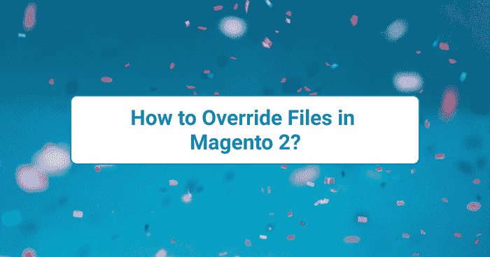

# 如何在 Magento 2 中覆盖文件？

> 原文：<https://medium.com/nerd-for-tech/how-to-override-files-in-magento-2-ba1f46034e17?source=collection_archive---------24----------------------->



如何在 Magento 2 中覆盖文件？

在这个系列教程中，我将解释如何在 Magento 2 中覆盖文件。如果我们在定制主题上工作，我们可能需要根据需要覆盖文件。我们可以覆盖模块或父模块的主题模板、布局或 web (less、js 等)。

**你可能也会喜欢这篇文章:**

1.  [Magento 2 中的主题概念](/nerd-for-tech/theme-concept-magento-2-b9a1fafc3590)
2.  [Magento 2 中的布局概述](/nerd-for-tech/layout-overview-in-magento-2-9d4739ee4254)

# 如何在 Magento 2 中覆盖模板文件？

在 Magento 2 中，对于模板文件，我们把它放在**/app/design/frontend/<vendor>/<theme>/。**例如，我需要对登录页面进行更改，因此我将在我们的主题中覆盖 login.phtml。

***login.phtml*** 的原始文件路径为:

***/供应商/magento/模块-客户/视图/前端/模板/表单/login.phtml***

覆盖我们的主题:

***/app/design/frontend/<厂商> / <主题>/Magento _ Customer/templates/form/log in . phtml***

在我的例子中，供应商是**雅利安人**，主题是**教程。**

```
app/design/frontend/Aryan/Tutorial/
├── Magento_Customer/
│ ├── templates/
│ │ ├── form/ 
│ | | ├── login.phtml
```

现在， ***login.phtml*** 在主题中被覆盖。您可以通过启用[模板路径提示](https://docs.magento.com/user-guide/system/template-path-hints.html)来检查

# 如何在 Magento 2 中覆盖预定义变量？

在 Magento 中，已经为组件(如按钮背景、链接、边框等)预定义了变量。).我要给你看的是。

1.  变量的文件位置
2.  覆盖主题中的变量

## 变量的文件位置:

默认情况下，文件存储在***lib/web/CSS/source/lib/variables/***中

> **注:**变量文件中每个 mixin 的预定义变量。

```
lib/web ├── css/ │ ├── docs/ (Library documentation) │ ├── source/ │ │ ├── lib/ (Library source files) | | | ├── variables/ (Predefined variables for each mixin)
```

## 覆盖主题中的变量:

为了覆盖主题中的变量，我们需要在***/app/design/frontend/Aryan/Tutorial/web/CSS/source/***下添加文件

例如，我需要改变页面的背景颜色和主题原色。

默认值:

@ theme _ _ color _ _ primary:@ color-blue 1；
@ page _ _ background-color:@ color-white；

***_theme.less*** 用于改变变量值的内容

```
@theme__color__primary: #222222;
@page__background-color: grey;
```

# 如何包含自定义 CSS/LESS 文件？

如果我们正在创建一个新的主题，我们只需要按照我们的要求在设计中添加额外的 CSS 代码。我们可以用两种方法做到这一点，一种是 LESS，另一种是 CSS。如果你不知道更少，不要担心你可以使用 CSS 文件来设计你的页面。

## 如何在主题中添加自定义 CSS 文件？

首先在***app/design/frontend/Aryan/Tutorial/Magento _ Theme/layout/***下的***default _ head _ blocks . XML***中声明 css 文件

```
<?xml version="1.0"?>
<!--
/**
 * Copyright © Magento, Inc. All rights reserved.
 * See COPYING.txt for license details.
 */
-->
<page xmlns:xsi="[http://www.w3.org/2001/XMLSchema-instance](http://www.w3.org/2001/XMLSchema-instance)" xsi:noNamespaceSchemaLocation="urn:magento:framework:View/Layout/etc/page_configuration.xsd">
    <head>
        <css src="css/custom.css"/>
    </head>
</page>
```

现在，在***app/design/frontend/Aryan/Tutorial/web/CSS/中创建。***

```
app/design/frontend/Aryan/Tutorial/
├── web/
│ ├── css/
│ │ ├── custom.css
```

部署并清除缓存

```
$ php bin/magento s:s:d -f 
$ php bin/magento c:f
```

## 如何添加自定义少文件？

首先我们创建 ***_custom.less*** 文件***app/design/frontend/Aryan/Tutorial/web/CSS/source/***。我们将在这个文件中编写代码。但是我们需要将这个文件导入到 ***_source.less*** 文件中

***app/设计/前端/雅利安/教程/web/CSS/source/_ source . less***

```
@import '_custom.less';
```

现在执行命令

```
$ php bin/magento s:up 
$ php bin/magento s:s:d -f 
$ php bin/magento c:f
```

> 如果您不想添加自定义 LESS 文件，那么您可以在***app/design/frontend/Aryan/Tutorial/web/CSS/source/_ extend . LESS***文件中进行更改。

希望这篇文章能帮助你理解文件覆盖的概念。如果您有任何疑问，您可以直接发邮件到[**【aryansrivastavadesssigner@gmail.com】**](mailto:aryansrivastavadesssigner@gmail.com)询问我，或者在这里 **联系我[。](https://desssigner.in/contact/)**

如果你想要一个现场会议，请直接 ping 我的 [**LinkedIn**](https://www.linkedin.com/in/er-aryan-srivastava-0b9576170/) 我会在周末安排一个在线会议。

如果你喜欢这篇文章，你可以给我买杯咖啡[给我买杯咖啡](https://www.buymeacoffee.com/aryansrivastava)。

## 参考链接:

1.  [https://devdocs.magento.com](https://devdocs.magento.com/)

*原载于 2021 年 6 月 27 日*[*https://desssigner . in*](https://desssigner.in/how-to-override-files-in-magento-2/)*。*