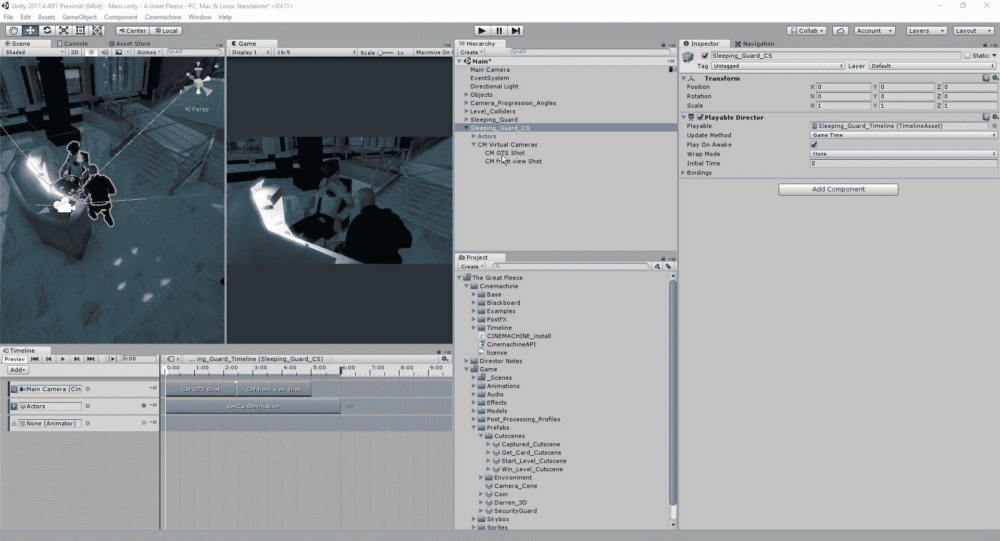
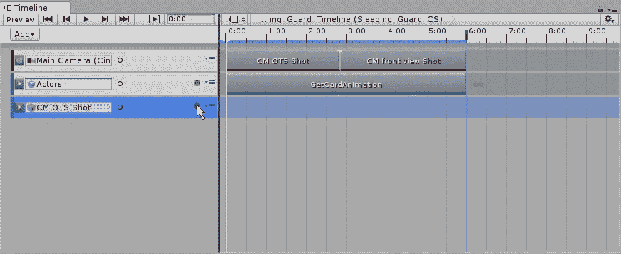
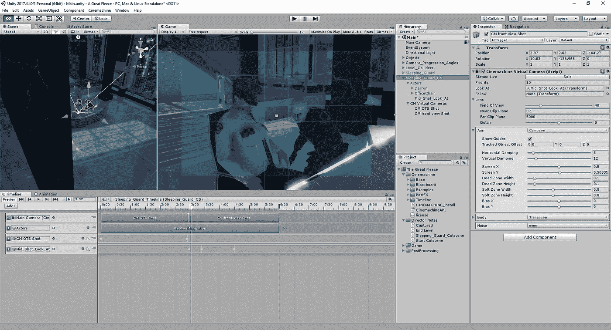
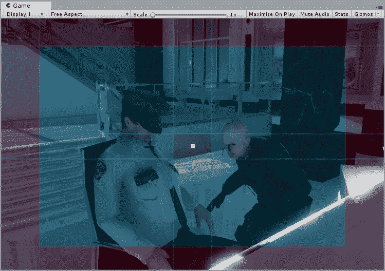
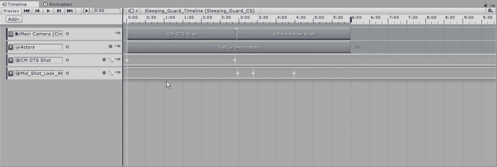
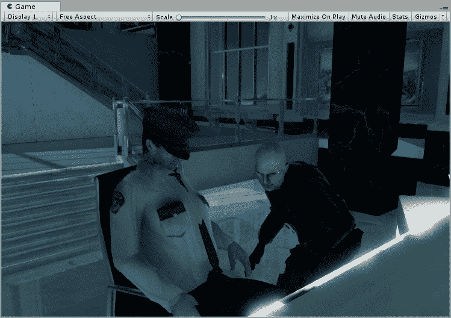
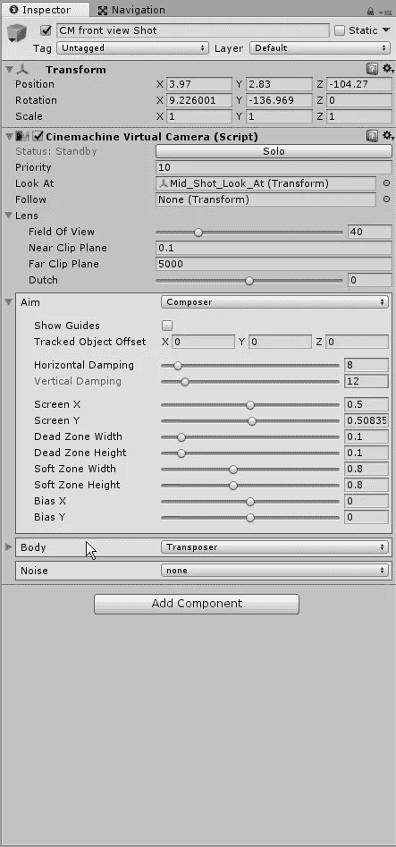
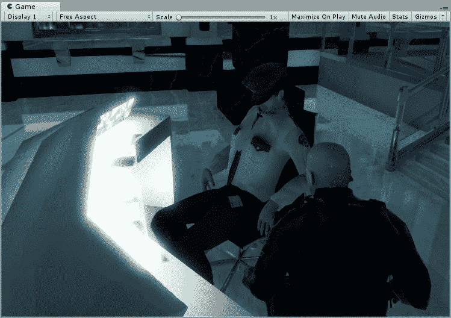

# 如何用时间轴平移我们的过场动画

> 原文：<https://medium.com/nerd-for-tech/how-to-pan-our-cutscene-with-timeline-9b7323d4df19?source=collection_archive---------27----------------------->

现在我们已经设置了翻转的时间线，让我们开始平移相机，让它更生动。首先，我们需要创建一个动画轨迹，并将我们的摄像机连接到插槽:

当我们把我们的 OTS 镜头拖到新的慢镜头中时，它会为我们创建一个新的动画轨道，同时给我们的摄像机附加一个动画制作人:

在这里，我们将点击“录制”按钮，根据导演的意愿，创建我们希望摄像机进行的运动。在这种情况下，他们希望摄像机移到后面:

既然我们已经完成了这个角度，是时候在另一边工作了。首先，我们需要为我们的摄像机创建一个空对象来跟随:

我们要做的是创建一个空的对象，并设置我们的前视图镜头，让它看着这个对象。只要我们把物体放在中间的死方块里，它就会朝那个方向看。当它离开那里的时候，摄像机也会跟着移动:

从这里，我们将为我们的时间线创建一个新的动画轨道，并将中间的镜头放在动画中:

一旦我们为下一个动画设置了关键帧，我们可以看看它在场景中的样子:

我们有一个成功的追随者，但这是机械的，而不是平稳的过渡。要改变这一点，我们必须进入我们的前视图拍摄的目标组件，并调整我们的阻尼字段中的值:

一旦我们调整了这些值，我们就可以完整地查看我们的场景，看看它是什么样子的:

现在，我们已经完成了场景的平移，我们将研究一些细节和一点清理。