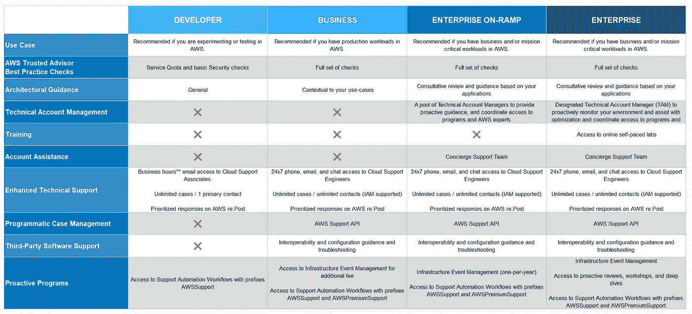
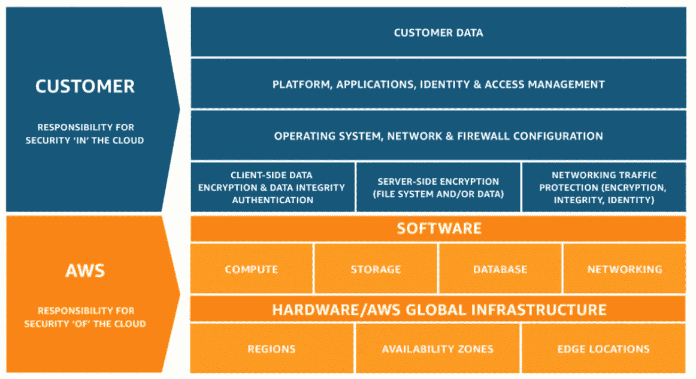
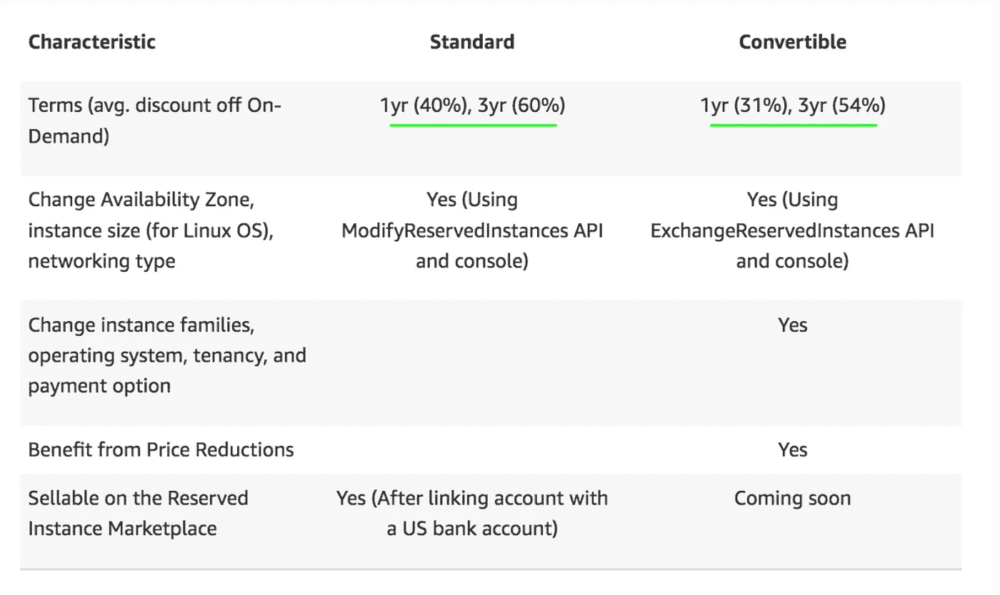

# 如何通过 AWS 云从业者考试:CLF-C01 考试

> 原文：<https://medium.com/nerd-for-tech/how-to-pass-the-aws-cloud-practitioner-exam-clf-c01-exam-3503f5a88ee8?source=collection_archive---------2----------------------->

图像[来源](https://www.credly.com/badges/d5d45d17-f2af-4aae-a264-34ae49c4dd80)

这是一篇短文，提供了一些关于如何通过 AWS 云从业者考试的提示和技巧。这是一次很好的考试，可以让你对云有所了解，并了解云是如何工作的。未来是云，AWS 是云计算的市场领导者。AWS 正以惊人的速度增长，2021 年[的收入将达到 740 亿美元](https://www.crn.com/news/cloud/aws-now-has-a-74b-annualized-revenue-run-rate#:~:text=AWS%20Now%20Has%20A%20%2474B%20Annualized%20Revenue%20Run%20Rate%20%7C%20CRN)。花时间了解云是值得的！还不服气？[这里是一些关于 AWS](https://www.statista.com/statistics/250520/forecast-of-amazon-web-services-revenue/) 的统计数据。

我将从概述考试和预期内容开始。然后我会解释我是如何准备考试的，以及我是如何在 **3 周**内通过考试的。事不宜迟，让我们开始吧！

所有关于考试的信息都可以在 [**这里**](https://aws.amazon.com/certification/certified-cloud-practitioner/) 找到。AWS 建议如下:

*   暴露在自动气象站云端六个月
*   对 IT 服务及其在 AWS 云平台中的用途有基本了解
*   关于核心 AWS 服务和使用案例、计费和定价模式、安全概念以及云如何影响您的业务的知识

# 内容

**领域 1** :云概念占 26%

**领域 2** :安全性和合规性 25%

**领域 3** :科技 33%

**域 4** :计费和定价 16%

我个人不认为 6 个月的准备是通过考试的必要条件。在参加考试之前有经验是很好的，但是以前的经验并不总是可能的，因为这是一个入门级的考试。很多时候，初级证书会帮助你获得第一份技术工作。最棒的是，AWS 有一个 [**免费层账户**](https://aws.amazon.com/free/?trk=78b916d7-7c94-4cab-98d9-0ce5e648dd5f&sc_channel=ps&sc_campaign=acquisition&sc_medium=ACQ-P|PS-GO|Brand|Desktop|SU|AWS|Core|US|EN|Text&s_kwcid=AL!4422!3!423676352544!e!!g!!aws%20free%20tier&ef_id=CjwKCAjw_b6WBhAQEiwAp4HyIIMrZxO70e4K4w0g7CNToeQqdHyMBOzofJKMgyMUYdM49jYIVuYJNBoCZZIQAvD_BwE:G:s&s_kwcid=AL!4422!3!423676352544!e!!g!!aws%20free%20tier&all-free-tier.sort-by=item.additionalFields.SortRank&all-free-tier.sort-order=asc&awsf.Free%20Tier%20Types=*all&awsf.Free%20Tier%20Categories=*all) ，允许你测试服务并获得一些实践经验。我强烈建议你报名参加并投入其中！我购买的这本书有几个演练，并解释了免费层帐户。

这概述了 65 题考试的细节。结帐提纲[这里**这里**。](https://d1.awsstatic.com/training-and-certification/docs-cloud-practitioner/AWS-Certified-Cloud-Practitioner_Exam-Guide.pdf)

# 我的学习过程

每个人的学习方式略有不同，但我发现通过实体书、视频和实践经验学习材料对我最有效。如果你发现这种方法对你的学习方式无效，请做相应的调整。

> 为了获得各种各样的测试问题和接近材料的方法，从至少 3 个来源中寻找内容是很好的。

# 学习时间表

**前 2 周(3.5 小时/天):**

我从阅读 [AWS 认证云从业者学习指南:CLF-C01 考试](https://www.amazon.com/gp/product/1119490707/ref=ppx_yo_dt_b_search_asin_title?ie=UTF8&psc=1)开始。我跳过了我已经熟悉的部分，但是大部分时间，我读完了整本书。

*   2 小时阅读/章节结束复习测验
*   1 小时免费层客户实践—设置 S3 存储桶、RDS 数据库等。

探索不同的 AWS 服务，通过谷歌写下问题进行研究，并在 YouTube 上观看视频。我发现这对我自己的理解很重要。写下我的问题，并为我寻找答案，巩固了我的理解，帮助我记住了材料。

*   大约 30 分钟——每天在[**Quizlet**](https://quizlet.com/)**上制作抽认卡并学习术语**

****第三周(2 小时/天)****

*   **90 分钟模拟考试(我花了 50 分钟完成)**
*   **复习之前练习考试中遗漏的问题**
*   **我参加了 5 次模拟测试—第一次模拟测试由 [**书**](https://www.amazon.com/gp/product/1119490707/ref=ppx_yo_dt_b_search_asin_title?ie=UTF8&psc=1) **提供。**另外 4 个测试是从[**tutorialsdojo**](https://portal.tutorialsdojo.com/courses/aws-certified-cloud-practitioner-practice-exams/)**花 14.99 美元购买的。****

****我不能充分推荐 tutorialsdojo 考试，因为这些考试与实际考试非常接近。该网站有大量的学习资料，如 [**AWS 备忘单**](https://tutorialsdojo.com/aws-cheat-sheets/) 和其他内容。我还用 f [reeCodeCamp](http://AWS Certified Cloud Practitioner Certification Course (CLF-C01) - Pass the Exam!) 视频来补充阅读。在考试前的最后一周，我每天都参加模拟考试，并留出几天缓冲时间来研究模拟考试中遗漏的问题和主题。****

> ****带走——参加考试，研究错过的问题，加强理解，冲洗和重复，直到你在模拟考试中得分 85%。****

# ****最后的想法****

****感谢阅读！希望这篇文章对你的学习之旅有所帮助！如果你也想参加 [**会计安全高级**考试，看看我的文章](/nerd-for-tech/quick-tips-for-passing-the-comptia-security-plus-sy0-601-exam-61ff7f3e499c)。****

****考试重点关注以下几个话题。我将附上一些帮助我学习和理解材料的图表。****

****PS…不要在工作笔记本上考试。我的考试失败了，我不得不重新安排考试时间。****

************************

****干杯！****