# 如何在 ASP 中执行验证？NET web 应用程序

> 原文：<https://medium.com/nerd-for-tech/how-to-perform-validations-in-asp-net-web-applications-da568f0edcce?source=collection_archive---------10----------------------->

对于您今天生产的任何产品，在交付给客户之前进行验证是非常重要的。您需要强制验证制造的产品是否满足所有要求的参数。在目前的世界中，通过互联网进行这些验证是可能的。

考虑一个假设的场景，你正在预订机票。预订时，您将被要求填写您的个人信息(大部分是文本字段)。现在想象一下如果没有验证会发生什么。这将增加许多旅行者被记录的无效数据的数量。为了避免这种情况，对网站中的所有输入字段进行验证是很重要的。

作为开发人员，要使一个字段成为强制字段，每次都需要编写相同的代码逻辑。相反，ASP.Net 提出了以数据注释的形式进行验证的想法。它提供了一组预定义的通用控件，可用于需要验证的字段。开发人员需要做的只是为验证器提供一些规范，并在应用程序中使用它。让我们详细看看 ASP 附带的验证器。Net 以及如何在项目中实现它们。

**目录**

1.  ASP.Net 验证控件简介，
2.  验证控制的实际实施，
3.  结论

# ASP.Net 验证简介

ASP。Net Validations 提供了一种方便的机制来验证输入，而不需要为它编写新的代码。此外，它还提供了自定义验证器来对字段进行用户定义的验证。用户甚至可以向任何控件添加验证，这将在下一节中详细介绍。当控件的焦点改变或单击提交按钮时，控件的验证就完成了。在这种情况下，提供的数据注释验证输入字段，并根据结果将页面设置为无效或有效状态。这些验证发生在代码的服务器端。

类似地，一个字段可以有多个验证。例如，您可以有一个必填字段验证器和一个范围验证器来检查数字是否在提供的范围内。

让我们在下一节中详细了解不同类型的可用验证及其实现。

# 验证控制的实际实施

在我们进入实现部分之前，这里是 ASP 中可用验证的列表。网。

1.  必填字段验证器，
2.  比较验证器，
3.  范围验证器，
4.  正则表达式验证器，
5.  自定义验证程序

为了实现，我们将创建一个注册页面，并研究页面上显示的输入字段的上述验证器。

## 第一步

从项目模板创建一个 ASP.Net 核心 Web 应用程序，并为项目提供一个有效的名称。

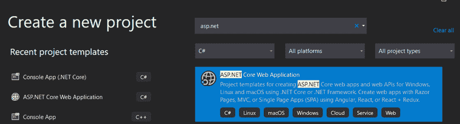

## 第二步

选择模板为 **WebApplication(模型-视图-控制器)**并创建项目。

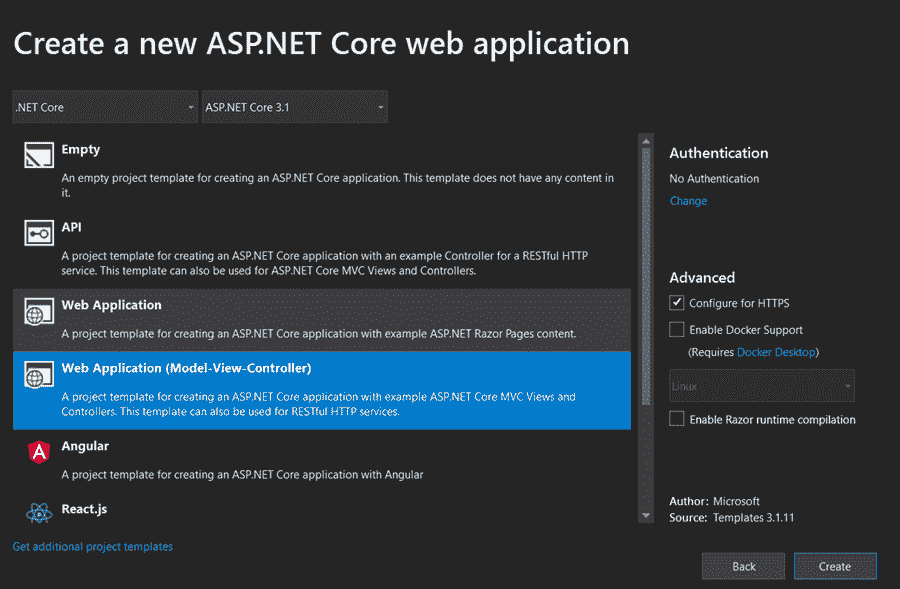

## 第三步

项目的文件夹结构如下所示。

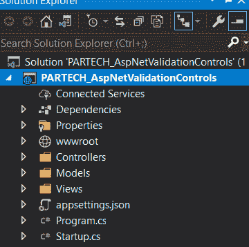

## 第四步

创建一个保存注册表单数据的模型。要创建模型，右键单击 Models 文件夹，并选择 Add 选项。选择 Class 并为该类提供一个有效的名称，然后创建将成为注册页面一部分的属性。

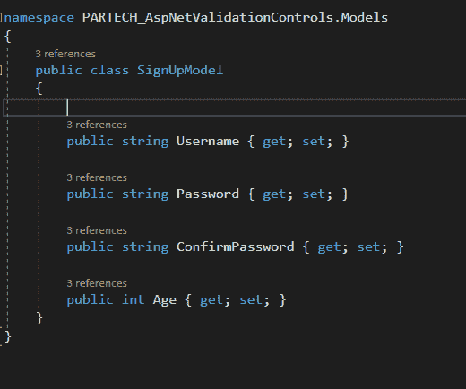

## 第五步

一旦创建了模型，右键单击 views 下的 home 文件夹，然后单击 add Razor Page。然后提供注册模型作为模型类，并选择视图的模板作为 create。

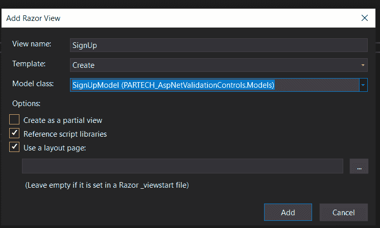

根据模型中的属性，创建了 UI 的字段。

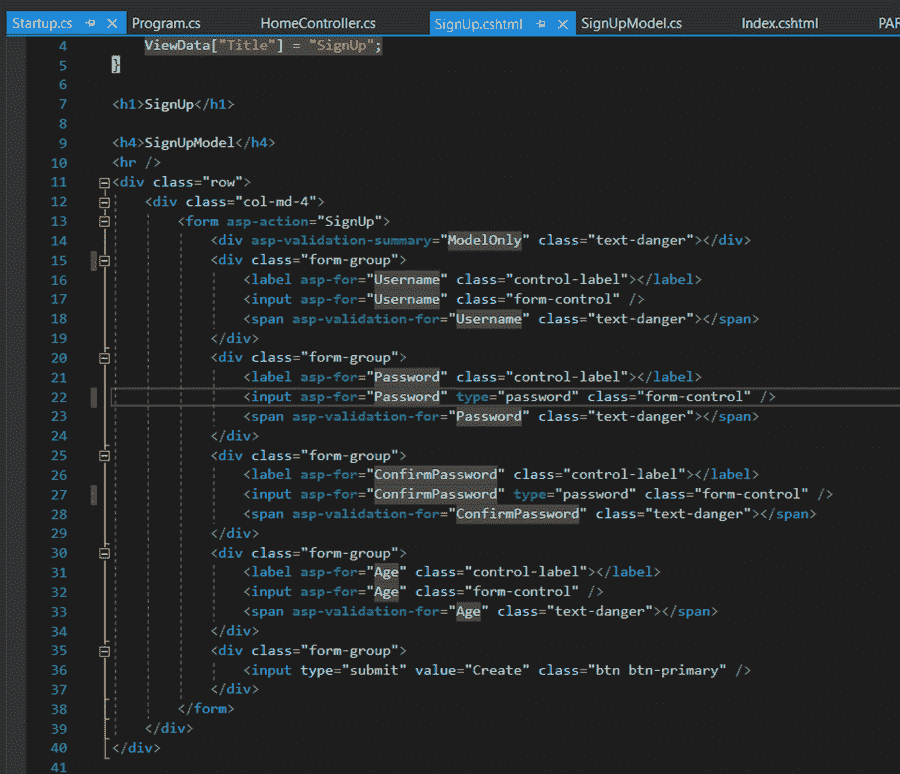

## 第六步

现在，要使注册页面成为我们的主页，请转到启动文件。在“配置”下，修改现有配置，如下图所示(操作=注册)。

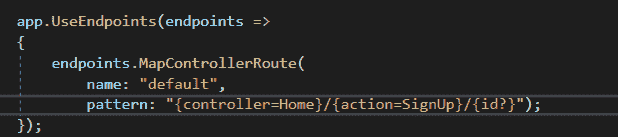

并将 HomeController 中的索引方法更改为 SignUp。

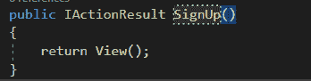

## 第七步

让我们开始在模型上实现验证。作为第一步，让我们实现所需的字段验证器。要实现它，请在注册模型字段中的每个属性上方添加***[必需]*** 属性。系统。ComponentModel.DataAnnotations 必须在 header 部分导入。

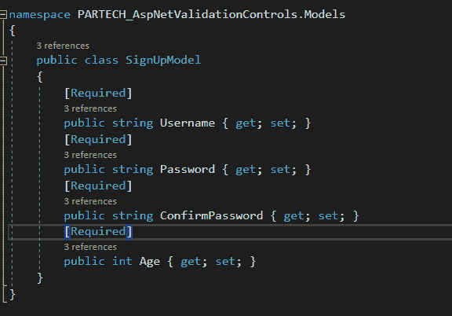

## 第八步

现在，运行应用程序。UI 将在提供的浏览器中打开。您是否也看到了模型页面上显示的 UI 中的所有字段？

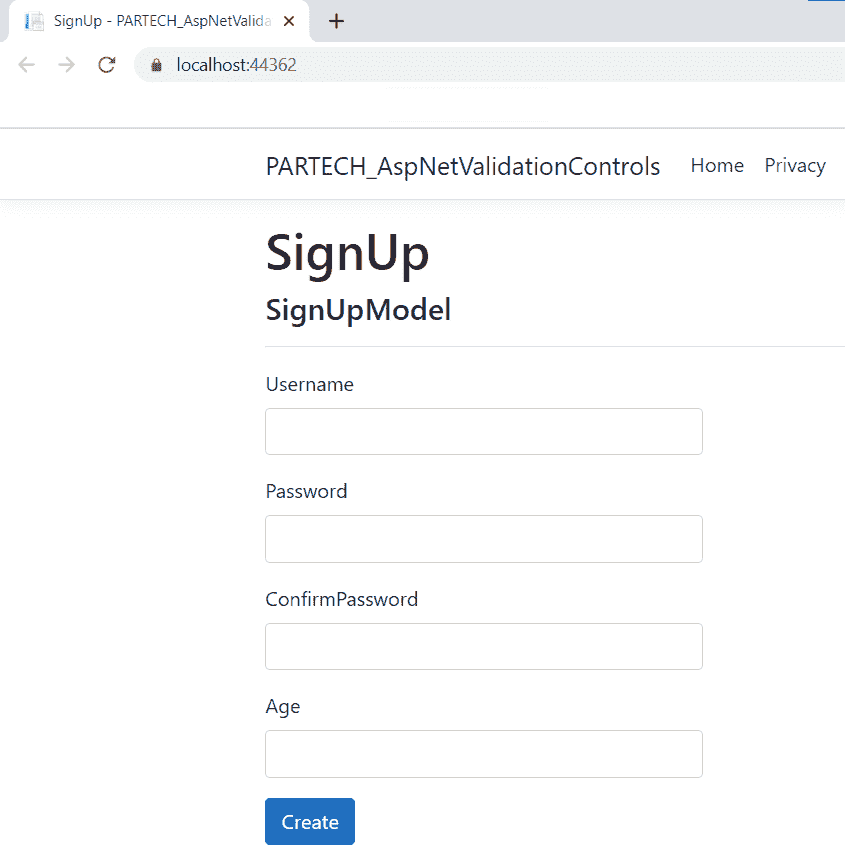

现在，如果我们试图提交页面而不填充细节，它将在所有字段中抛出错误。因为我们已将所有字段标记为必填。

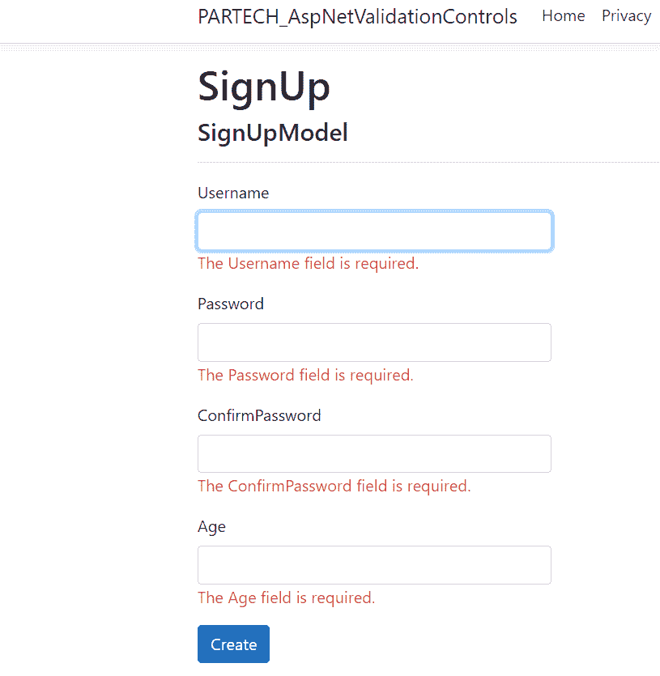

## 第九步

现在，让我们尝试添加更多的验证。假设我们希望用户名最少 10 个字符，最多 50 个字符，年龄应该在 1 到 100 之间(范围验证器)，那么要实现这些，必须添加下图中的验证属性。

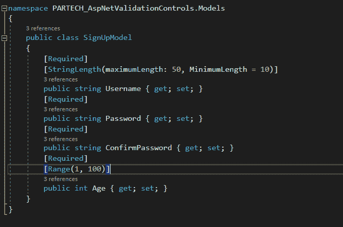

错误是这样的。

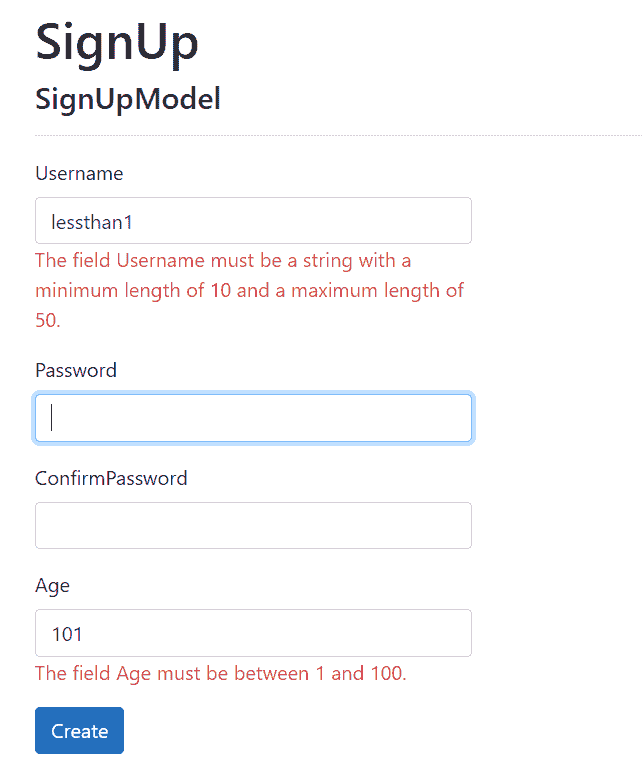

## 第十步

因为我们有密码和确认密码字段，所以这两个字段中的输入必须相同。让我们看看如何为密码字段实现比较验证器。在比较属性的括号内提供要比较的属性的名称。

错误是这样的。

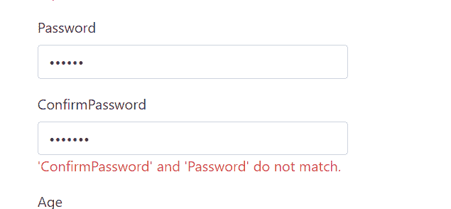

## 步骤 11

让我们为用户名字段添加一些正则表达式验证器。让我们验证用户名字段中输入的文本是否是电子邮件 id 格式。要实现它，添加属性 RegularExpression 并为表达式提供括号。此外，对于所有的验证器，可以提供一个定制的错误消息来覆盖默认的错误消息。

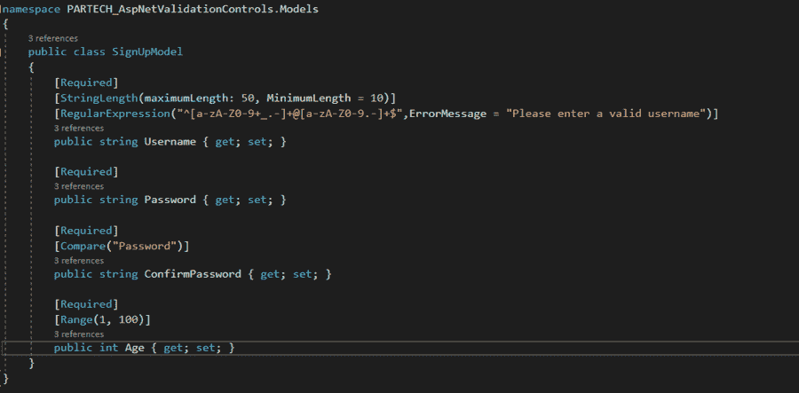

错误是这样的。

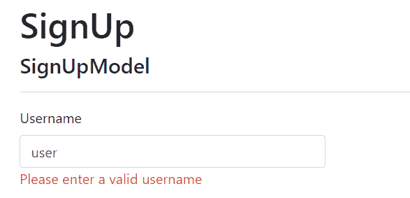

## 步骤 12

若要实现自定义验证器，请创建一个类并继承 ValidationAttribute。现在在类重写中，方法 IsValid 返回 bool 类型。另外，添加需要验证的必要条件。

将创建的类名作为简写添加到相应的属性中。

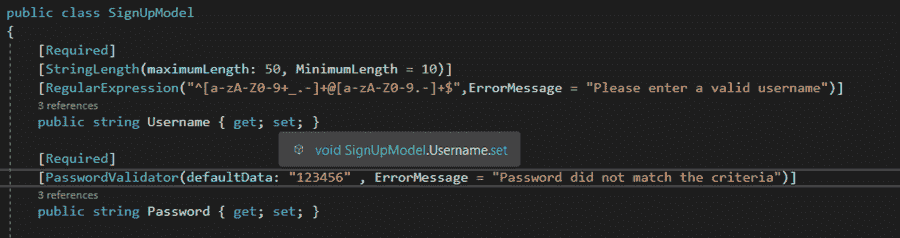

# 结论

默认情况下，ASP.Net 提供了非常有用的验证器，可以方便地验证字段。这些特性节省了大量用于验证字段的代码可维护性，以及实现更改所需的时间。

*原载于*[*https://www . partech . nl*](https://www.partech.nl/nl/publicaties/2021/04/how-to-perform-validations-in-asp-net-web-applications)*。*