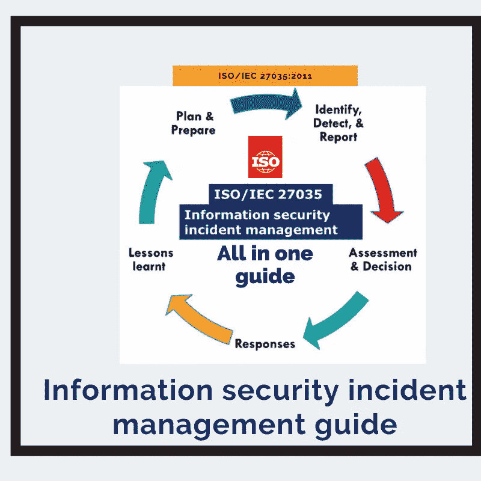
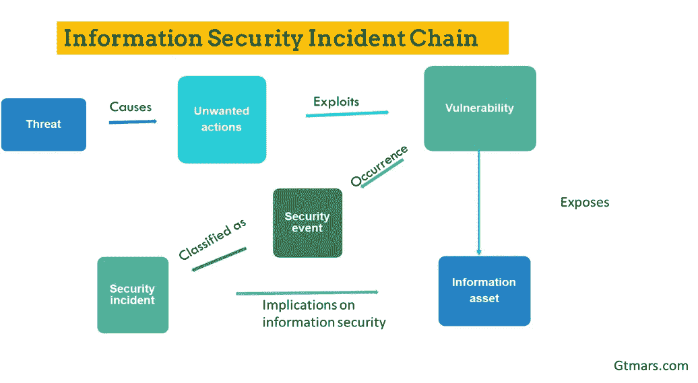
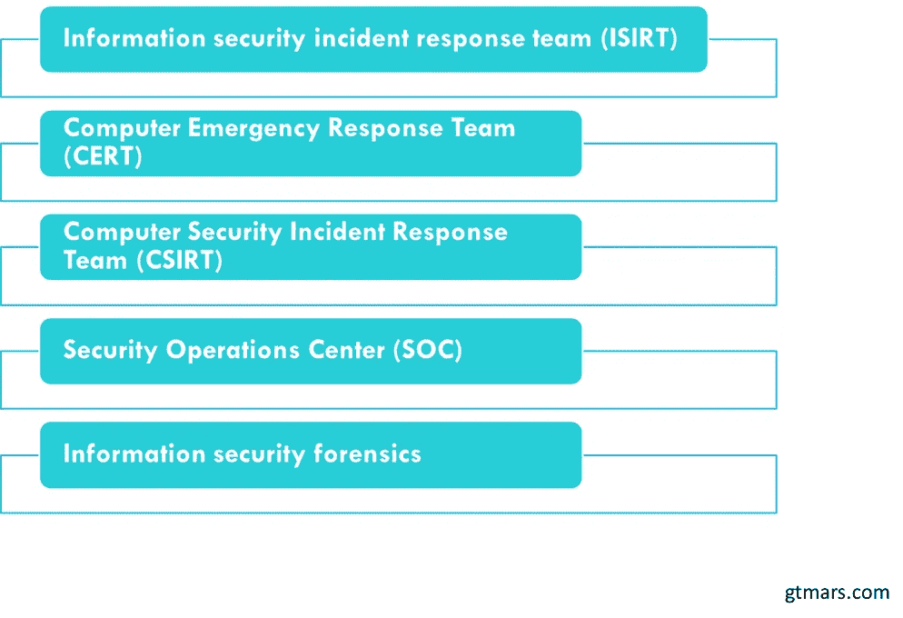
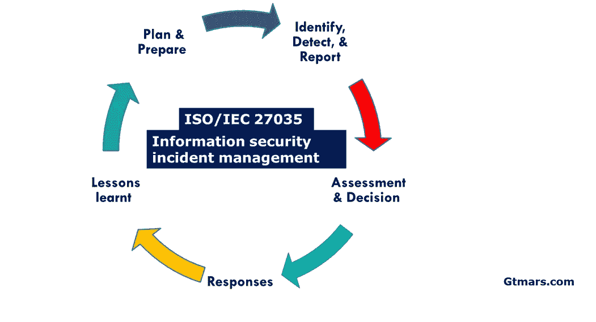
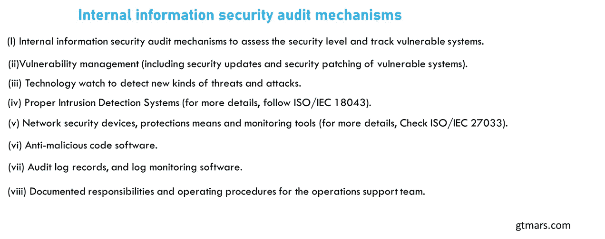
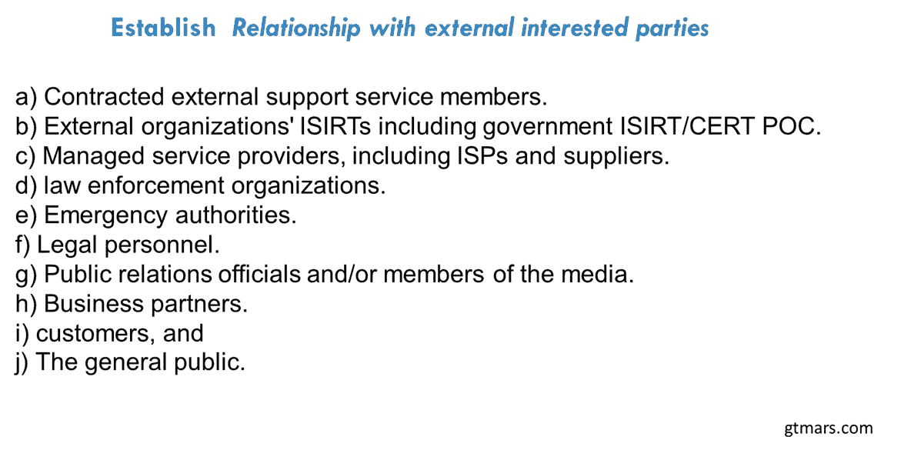
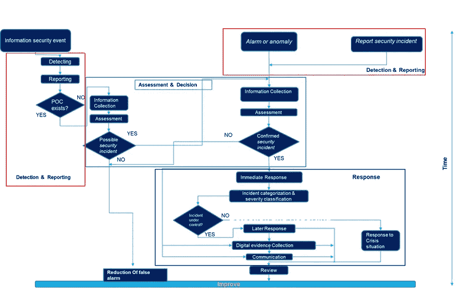

# ISO/IEC 27035 指南:信息安全事件-网络攻击。

> 原文：<https://medium.com/nerd-for-tech/how-to-plan-detect-assess-and-respond-to-information-security-incidents-by-using-iso-iec-27035-ed744c8b7cd5?source=collection_archive---------1----------------------->

# ***1。*目的和范围:**

★在本文中，我们将了解安全事件阶段、安全事件响应计划(IRP)、事件响应团队结构，并帮助组织降低风险。这些前瞻性的实用方法和指南有助于公共和私营部门进行准备、检测、分析、补救、恢复和事故后分析。我们能够使用建议的用例、指南和解决方案来满足并根据我们特定的安全和任务需求进行调整。

★它已经成为信息技术(It)项目的重要组成部分。像大爆炸一样，网络安全相关的攻击不断发展，也对实体造成更多的损害。因此，每个组织都需要有一致的事件响应计划(IRP)和事件管理技能，以减轻弱点，保持业务运行，根据风险评估的结果最大限度地减少损失和声誉。通过这种方式，它有助于减少事故的发生，也要记住，不是所有的事故都可以预防。

★本 ISO (27035:2016)国际标准为大中型组织提供了信息安全事件管理发布的指南、技术和最佳实践。除了小型组织可以遵循一套基本的程序和推荐的国际事件管理实践之外，您还可以提供外部方来处理信息安全事件。

# **1.1 初级管理基本概念:必须知道，伙计！**

★以下概念、术语和定义是事故管理不可或缺的。因此，在进入本文之前，让我们快速了解一下它。

***安全事件:***
★安全事件是在系统或网络上发生时识别出的事件，表明可能违反了 CIA triad。这些意外事件可能会对组织造成重大损失，危及业务运营，并向公众泄露敏感数据。事件的发生可以根据中央情报局三元组的目标进行分类。

***信息资产:***
★资产是对组织有价值的任何东西。可以根据您试图保护的资产类型对资产进行分类。在对资产进行分类时，要考虑它们的价值、年限、位置、法律和对公众的暴露程度。之后，您可以根据所需的时间、资金和人力来制定计划，以保护您组织中的机密资产。

***漏洞:***
★漏洞是系统、设计或网络中最终可能被威胁者利用的弱点或缺陷。

***威胁:***
★威胁威胁者在找到利用系统或网络漏洞的方法时实施的一种不必要的行为。当被利用的威胁对资产构成巨大威胁时。

***漏洞利用:***
★当威胁参与者设法编制一组任意代码来利用系统上的漏洞时，他就执行了利用。

***对策:***
★我们会在这个位置做到这一点。当我们执行风险评估以了解更多关于已发现漏洞的信息时。在此阶段，我们将应用对策来消除或减少系统中的漏洞。

图二。**信息安全事件链。**

***1.2 参赛队伍:***

图 3。安全响应小组的类型。

# 2.信息安全事件管理的五个关键阶段指导了事件管理的原则。

★有两个角度需要考虑，一个是组织的整体安全策略应立即实施必要的控制和程序，另一个是业务角度，以减少或遏制安全事件造成的影响。

★这些信息安全事件管理实践分为 5 个标准阶段。

图 4.ISO/IEC 27035:信息安全事故管理。

***5 个关键阶段的好处:***

㈠改善整体信息安全。

㈡减少不利的业务影响。

(三)强化信息安全事件预防重点。

㈣加强优先排序。

㈤加强证据。

㈥帮助说明预算和资源的合理性。

㈦改进信息安全风险评估的更新。

㈧提供强化的安全意识和培训。

㈨为信息安全政策增加投入。

# **2.1 计划和准备阶段:**

★本阶段主要活动的概述是为事件管理政策规划和准备适当的计划，同时考虑将事件管理、漏洞管理方案纳入本阶段，并最终使执行成员完全致力于该政策，以便在实施后生效。

★同样，一致性对成功至关重要，定期更新信息安全和风险管理政策至关重要，应在所有系统、部门和网络级别应用。

★发生事件时，责任人应根据管理方案记录详细的安全事件信息。本文件包含整体程序、政策、操作工具、模板、角色和职责。

***纳入主题包括:***

信息安全事件根据事件分类表进行分类，用于对任何已发生的事件进行分级。在此类事件中，决策应基于对业务运营的实际或预计不利影响。“安全事件/事故/漏洞表”只能由处理人员处理和填写。
最初报告的信息保存在数据库中，在每个阶段，当有更新时，会记录在“信息安全事件/事故/漏洞”数据库中。
当在事件中发现漏洞时，报告者会报告并记录下来。
当操作程序受到事故影响时。
(I)关闭受影响的系统、服务和/或网络，
(ii)让受影响的连接系统、服务和/或网络保持运行。
(iii)监控受影响系统、服务和/或网络内部的数据流。
(iv)启动备份和危机管理程序。
(v)出于合法目的保护和保存所有电子证据。
(vi)公开披露事件，并与内部和外部组织分享。
为团队成员实施适当的培训计划。
在直接参与信息安全事件的内部和外部组织之间建立和保持透明的关系。为了减少和防止安全事故的发生，请遵循以下机制。

图 5。内部信息安全审计机制。

设计和开发信息安全事件、事故和漏洞管理框架以及培训计划。

测试信息安全事故管理计划的使用。

***2.1.1 其他策略中的信息安全事件管理集成:***

★每个组织都应根据制定的信息安全管理政策记录安全事件、事故和漏洞。该策略可以根据组织的规模进行调整，并在正式实施之前进行全面审查。

★组织应确保事故政策和风险管理得到执行成员的批准，并且建议的政策涵盖所有级别，如系统、服务和网络资源。如果你想了解更多关于“风险管理”的知识，别忘了查看 ISO/IEC 27005:2008。以下清单有助于您验证这一点。

a)描述为什么信息安全事件管理和信息安全事件计划对组织至关重要。
b)请求高级管理层做出需要适当准备和应对信息安全事件的公司决策。
c)确保各种政策的一致性。
d)确保计划的、系统的方法在行动中最大限度地减少影响。

***2.1.2 信息安全事件管理方案:***
★提供处理信息安全事件所需的工作流程和流程，以及事件、事件、漏洞的沟通等详细流程。

a)快速响应任何信息安全事件。
b)确定安全事件在任何点是否变为安全事件。
c)总结管理信息安全事件，
d)快速应对信息安全漏洞，
e)总结经验教训，并找出可添加到计划中的改进措施。
f)将该等变动应用于该计划。

***2.1.3 建立信息安全事件响应小组(ISIRT):***

建立信息安全事件响应团队，以帮助组织识别、评估和响应任何安全事件、与其他部门协调、处理反馈并结案。ISIRT 团队减少了对公司的损害，防止了与数据泄露或诉讼相关的金钱损失。
ISIRT 的规模、结构和职能应由组织的管理层决定。
ISIRT 经理应有单独的联络点(POC)渠道，以便高级管理层成员在发生安全事件时接收有助于决策的命令。因此，ISIRT 经理必须获得该领域的所有技能知识和最新趋势，才能推动团队走上正确的道路。

***2.1.4 建立与外部利益相关方的关系:***

图 6。 ***与外部利益相关方建立关系。***

***2.1.5 技术及其他支持(包括运营支持):***

为了快速采取行动并对安全事件做出响应，组织应获取、准备并测试所有必要的技术和其他支持部门。

a)通过最新的资产分类账及其与组织业务职能的链接信息，访问信息资产的详细信息。
b)危机管理文件及程序。
c)明确告知其政策、文件及沟通渠道。
d)将安全事件/事件/漏洞馈送到集中式数据库，新事件将快速更新到数据库，并安全地保护数据库。
e)拥有充足的工具进行信息安全取证证据收集和分析，
f)制定充足的业务连续性管理计划。

***2.1.6 意识和培训:***

★私营和公共部门组织都应发起胜任的培训计划，并鼓励其员工理解安全是一项" *s* ***单人工作***" it***人人工作*** "。

培训和计划对于一个组织在事故管理方面的成功至关重要。高管和高级领导必须明白，每个人都接受培训，所有人都可以获得相关资源，包括新加入的员工、第三方用户和与业务相关的承包商。

# ***2.2 识别、检测和报告阶段:***

在事故管理的第一阶段，操作阶段是第一阶段，该过程是关于检测、收集与安全事故相关的信息以及报告安全事故。为了确保指派适当的人员处理报告，安全漏洞被记录在数据库中，就像如何处理非信息安全故障一样。

图 7。信息安全事件和事故流程图。

这些操作由人工通过自动化过程来处理。每个组织都应确保在此阶段执行以下关键活动。

a)检测并报告组织的产品和服务、客户、员工、承包商组件和网络资源中出现的安全事件和漏洞。

1)设置网络陷阱，例如基于(蜜罐、蜜罐令牌、蜜罐客户端、tarpit)的系统，以安全地监控网络上入侵者的存在，并欺骗、分散、鼓励入侵者对伪造的材料进行操作以进行拒绝操作。
2)来自网络监控系统(如防火墙、流量分析、网页过滤和其他系统)的整体安全警报。
3)分析来自设备、服务、主机和网络系统的日志信息。
4)评估 ICT 检测到的异常事件。
5)评估服务台检测到的异常事件。
6)检查用户报告，以及
7)来自第三方的外部通知，如其他 isirt、信息安全服务、ISP、电信服务提供商、外包公司、政府 isirt。

b)收集关于安全事件或漏洞的信息。
c)确保所有 PoC 正确记录所有活动、结果和相关决策，以便
日后进行分析和审查。
d)确保安全地收集、存储、保存电子数据，并出于合法目的保存所需数据。确保变更控制程序得到维护和积极更新。
f)在整个阶段根据需要开罚单，以及
g)在事故跟踪系统中注册。

***2.2.1 事件检测:***

所有类型的物理安全事件都可以被负责该任务的人直接检测到。也就是说，借助于签名和基于异常的参数，可以自动检测技术安全事件。当对可能性有疑虑时，应遵循程序并与团队的其他成员协商以获得许可。

→用户。
→直线经理和安全经理。
→客户。
→ IT 部门，包括网络运营中心和安全运营中心)IT 服务台。
→服务提供商(包括 ISP、电信和供应商)。
→伊西特斯。
→日常工作中发现异常的其他单位。
→大众媒体和
→披露网站、bug 县、博客等。,.

***2.2.2 事件报告:***

团队的负责成员应遵循规定的程序，开放对可用 PoC 的访问，并使用报告模板来注册新事件。

***汇报 elements:***

→检测的时间/日期，

→观察，以及

→联系信息(可选)。

# ***2.3 评估和决策阶段:***

事故管理计划的第三阶段包括评估与安全事件相关的信息，并根据以下关键活动为决策做准备。

进行评估以确定安全事件是可能发生还是处于误报状态，或者已经结束。ISIRT 将进行评估以确认 PoC 的评估结果，从而了解事件是真是假。根据结果，应进行二次评估。

a)在整个阶段确保进一步评估和决策操作的活动。

b)收集关于安全事件或漏洞的信息。
c)确保所有 PoC 正确记录所有活动、结果和相关决策，以供日后分析和审查。
d)确保安全地收集、存储、保存电子数据，并出于合法目的保存所需数据。确保变更控制程序得到维护和积极更新。
f)在整个阶段按需开罚单，以及
g)在事故跟踪系统中注册。

h)通过适当的评估责任层级，将安全事故管理活动和责任平均分配给责任人。

I)提供执行程序，包括审查、修改所做报告的变更、评估损害，以及通知相关人员采取进一步行动。

***2 . 3 . 1 PoC 的评估和决策要素:***

a)所见所闻，包括所操作的软件和工具清单。

b)潜在证据的位置；

c)证据如何存档(如果适用)。

d)如何进行证据验证(如果适用)，以及

e)材料储存/安全保管及随后使用的详细信息。

***2 . 3 . 2 ISIRT 的评估和事件确认:***

在评估和确认每个决策后，ISIRT 的责任是，是否将检测到的安全事件归类为安全事件，应由 ISIRT 负责。ISIRT 中的接收人应执行以下操作:

a)确认收到安全事件表并完成 PoC。
b)如果表单不是由 PoC 团队成员提供的，请将其提供给安全事件数据库，并确保在必要时将其更新到数据库中。
c)如果需要，向 PoC 成员寻求澄清和建议。
d)审核报告表格内容。收集任何所需的和已知的可用信息。

# ***2.4 响应阶段:***

事故管理计划的第四阶段是响应操作。所有响应都是基于决策阶段的输出做出的，响应可以在实时基础上立即做出，或者在法医分析操作的帮助下在决定的时间范围内做出。在响应阶段，组织应确保关键活动如下:

ISIRT 审查并确定安全事件是否得到控制，以及以下活动:
1。要求回应正式流程开始。
2。这可以是立即响应，包括激活恢复程序，向负责人员发出相关命令，或稍后从灾难中完全恢复。之后，确保所有信息都为事件后审查活动做好准备。越早发起越好，因为如果危机得不到控制，将会对业务服务造成严重影响。

b)协调和识别内部/外部资源，以应对事故。
c)进行安全取证分析和安全事件分类，以评定等级，并根据需要修改等级。
d)在整个阶段根据需要上报，以便进一步评估和/或决策流程。

e)确保所有日志记录所有活动，以备日后分析。
f)确保电子证据在静止/移动/传输时安全收集和存储，并持续进行保存监控，以防法律诉讼需要。
g)确保变更控制计划在安全事件跟踪、报告、更新的整个生命周期中得到遵守，从而确保安全事件/事件/漏洞数据库保持最新，以便运营。

h)传达安全事故的存在和相关细节，因此其他内部和外部成员，如组织的(资产/信息/服务所有者)，特别是资产/信息/服务所有者，将有助于确定、管理和解决事故。

一旦确定了安全事件，并就所需的响应达成一致，后续活动应按照如下所述准备就绪:

a)通过适当的决策渠道层级来分配事故管理活动的责任。

b)提供每个相关人员遵循的正式程序，包括审查和修改报告，重新评估损害，并通知相关人员。c)使用指南全面记录信息安全事件、后续行动以及更新安全事件/事故/漏洞数据库的活动。
d)记录后续行动。
e)定期更新信息安全事件/事故/漏洞数据库。

***2.4.1 即时响应:***

安全事件管理计划和相关措施的主要目标是最大限度地减少业务影响，而识别攻击者应被视为次要目标。

响应信息安全事件的响应目标如下:

限制潜在的不利影响。

b)提高信息安全性。

在作出这样的决定时，要考虑的事情是，攻击者可能意识到他的行为正在被观察，并且可能采取对受影响的信息系统、服务和/或网络以及相关数据造成进一步损害的行为，并且攻击者可能进一步破坏可能有助于追踪攻击来源的数据。

一旦作出决定，必须了解可能采取的技术措施，以便迅速可靠地切断和/或关闭受攻击的信息系统、服务和/或网络。这有助于控制事故。

***2.4.2 事件信息更新:***

a)信息安全事件的内容。

b)它是如何引起的，原因是什么，由谁引起的。

c)它影响或可能进一步影响转让。

d)对业务服务的影响或潜在影响。

e)根据预先确定的严重性等级，安全事件被视为重大或未被确定。

f)迄今为止是如何处理的。

***2.4.3 危机情况应对:***

a)需要采取的预防、应变和危机管理措施。

b)应对危机情况所需的组织结构和职责，以及

c)危机管理计划所需的结构和概要内容。

***2.4.4 信息安全取证分析:***

a)确保目标系统、服务和/或网络在取证分析期间受到保护。
b)对证据的获取和收集进行优先排序，例如从最不稳定到最不稳定。
c)识别目标系统、服务和/或网络上的所有相关文件，包括文件、密码、受保护数据和加密文件。
d)通过文件完整性监控(FIM)服务尽可能多地恢复发现的已删除文件和其他数据。发现 IP 地址、主机名、网络路由器和网站信息。
f)提取应用程序和操作系统软件使用的隐藏、临时和交换文件的内容。
g)访问受保护或加密文件的内容。
h)分析在特殊光盘存储区发现的所有可能相关的数据。
i)分析文件访问、修改和创建时间。
j)分析系统/服务/网络和应用程序日志。
k)确定系统/服务/网络上的用户和/或应用的活动。
l)分析电子邮件的来源信息和内容。
m)执行文件完整性检查，检测特洛伊木马文件和原本不在系统中的文件。
n)分析实物证据，如适用，例如指纹、财产损失、视频监控、报警系统日志、出入证访问日志和询问证人。
o)确保提取的潜在证据以不会被损坏或变得不可用的方式进行处理和存储。
p)总结安全事故的原因、所需采取的措施以及主要报告的相关证据列表。
q)根据需要为任何纪律或法律行动提供专家支持。

***2.4.5 内外沟通:***

应该确保谁需要知道什么以及什么时候知道。当涉及到受影响的利益相关方时，应确定这些利益相关方，并最好将其分为以下几组:

a)直接内部利益相关方(危机管理、管理人员等)。),

b)直接外部利益相关者(所有者、客户、合作伙伴、供应商等)。)，以及

c)其他外部联系，如新闻和/或其他媒体。

***2.4.6 升级:***
在极端情况下，可能需要将事件升级，以适应失控并对不可接受的业务影响构成潜在危险的事件。此类事件需要上报，以激活业务连续性计划(BCP)。遵循有关信息安全事件管理计划的指导，并通知可能在某个时候需要上报问题的成员，如 PoC 和 ISIRT 成员。

***2.4.7 活动记录和变更控制:***
正确记录各种类型的活动，以备后用。它应包含在安全报告表中，并在从报告到事后分析和结案的整个安全事件周期中不断更新。应通过适当的备份和 DRP 程序安全地保存。

# ***2.5 经验教训阶段:***

关键活动概述包括信息安全取证分析、确定经验教训、改进信息安全控制实施、信息安全风险评估和管理审查结果、信息安全事件管理计划以及其他改进。

在信息安全事件管理计划的最后阶段，当安全事件得到解决/结束时，该计划将跟进，并涉及从事件和某些漏洞在规定时间内的处理方式中吸取经验教训。对于经验教训阶段，组织应确保关键活动如下:
a)根据需要进行进一步的信息安全取证分析。
b)确定从信息安全事件和漏洞中吸取的教训。
c)根据吸取的经验教训，审查、确定并改进信息安全控制、实施和政策。
d)评审、确定并改进组织现有的信息安全风险评估和管理评审结果，以吸取经验教训。
e)审查流程、程序和报告模板结构在响应、评估和从每个信息安全事件中恢复的有效性，并在报告中简要说明所需的更改。
f)更新数据库中的信息安全事件/事故/漏洞。
g)在可信社区内交流和共享评审结果。

**结论:**

在本文中，我们讨论了安全事件阶段、安全事件响应计划(IRP)、事件响应团队结构，以及帮助组织降低风险。这些前瞻性的实用方法和指南有助于公共和私营部门进行准备、检测、分析、补救、恢复和事故后分析。这四个领域是 ISO 27035:2016 草案的一部分(事故管理原则、事故响应计划和准备指南、ICT 事故响应操作和协调)。

—————**结尾** — — —

***当日语录:*γηράσκωδ᾽αἰεὶπολλὰδιδασκόμενος(***gēraskūd ' aíeípoll didaskómenos)。*

***解释:*** 我老了总会学到很多东西。

感谢阅读！
祝你愉快！