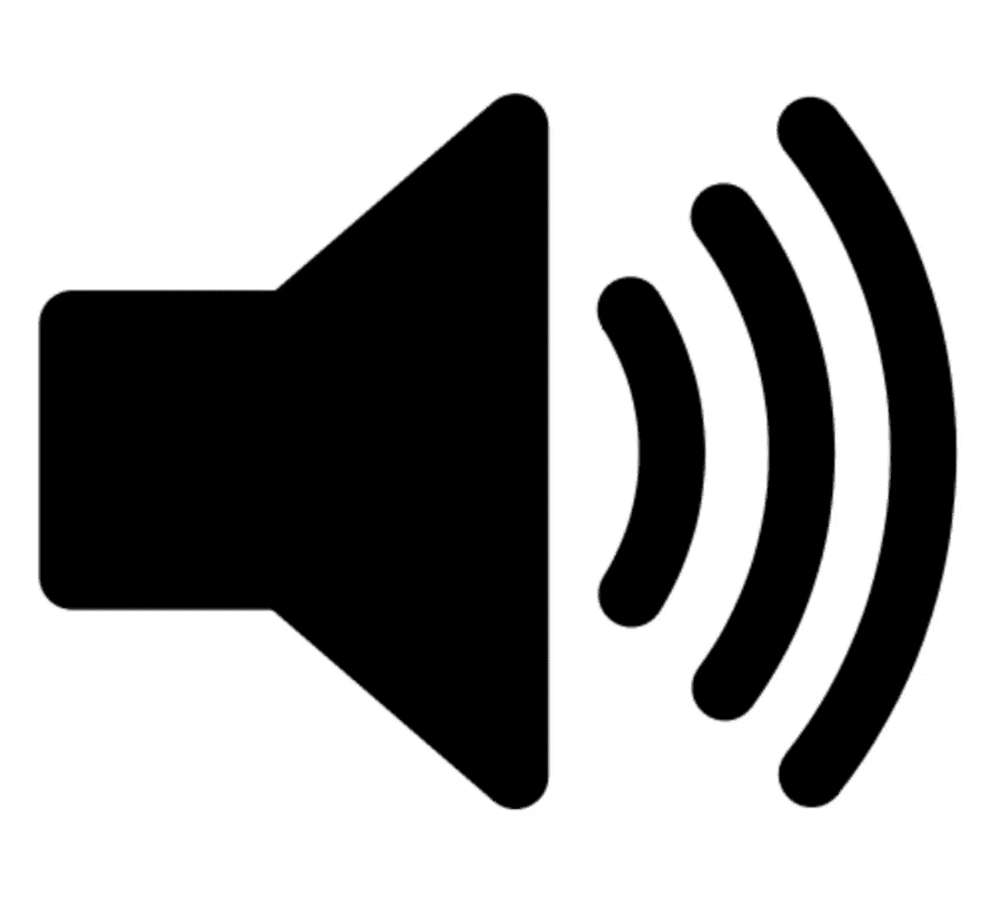
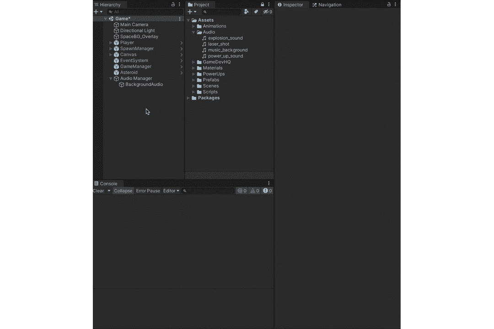
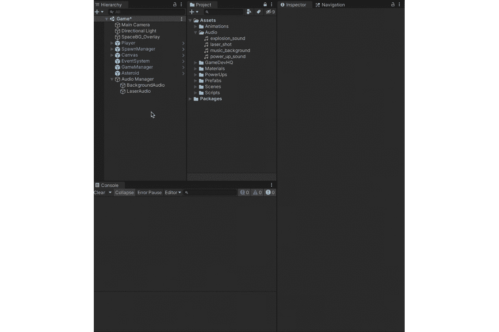
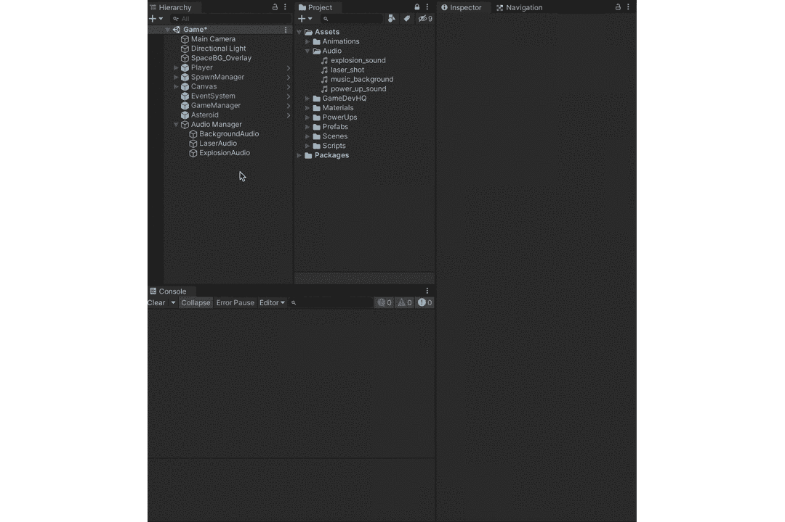
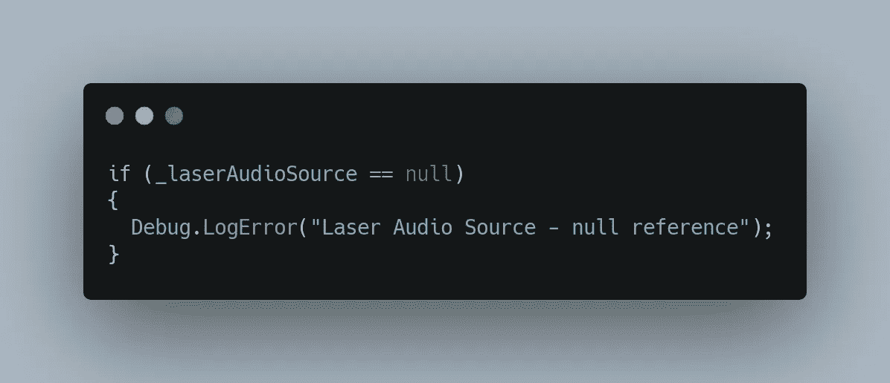
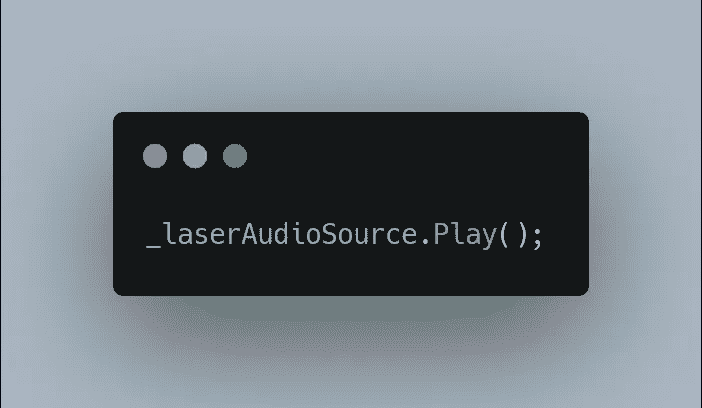
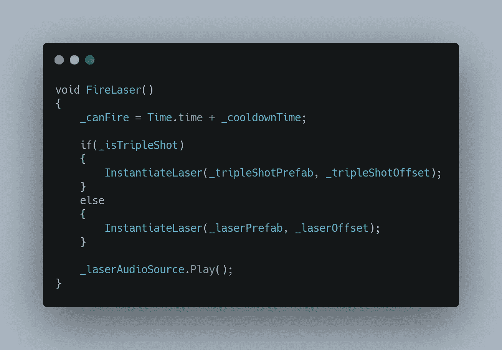
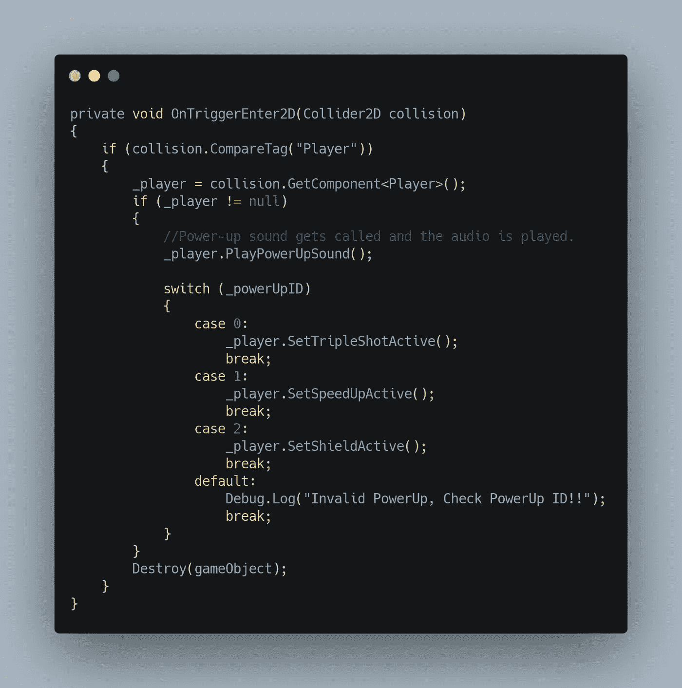
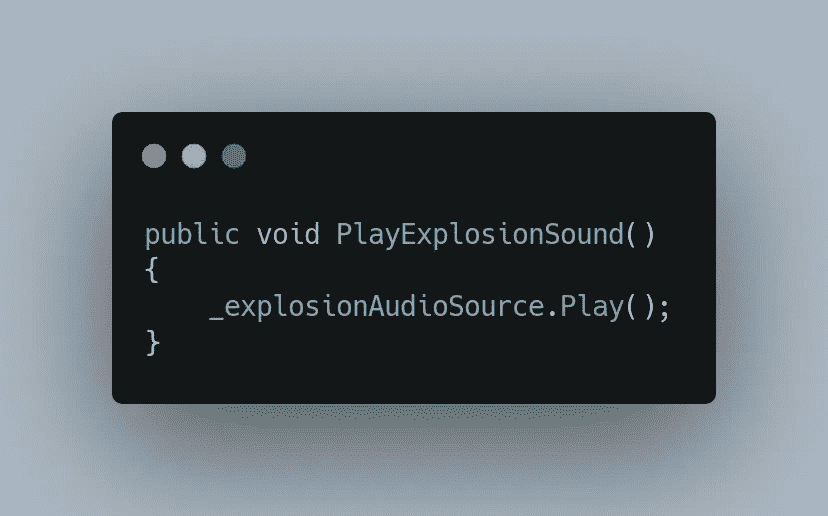
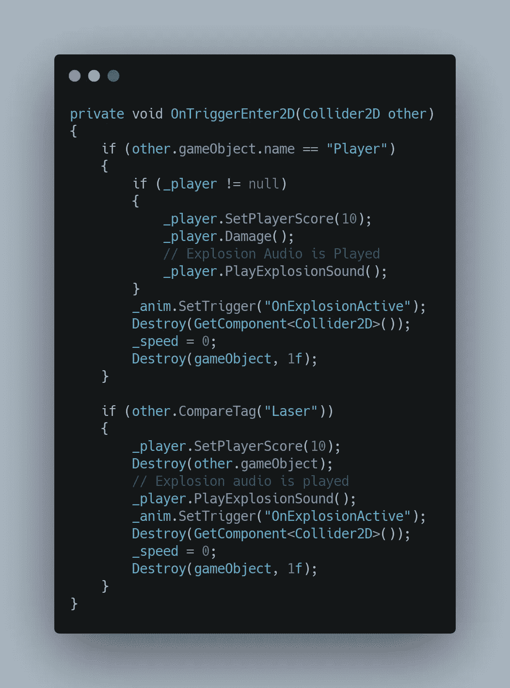

# 如何在 Unity 中播放音效

> 原文：<https://medium.com/nerd-for-tech/how-to-play-sound-effects-in-unity-2f8ea89a7793?source=collection_archive---------21----------------------->

在[之前的文章](https://sidthakur3519.medium.com/immersion-starts-with-sound-53037a872b0b)中，我们看到了如何使用音频源来播放音频剪辑。本文在此基础上添加了对何时播放何种声音的复杂控制。

***目标:添加激光、爆炸、加电声等互动音效。***

让我们从为每个给定的音效创建一个**音频源**组件开始。

*注意:请确保在唤醒时关闭播放，因为我们的目标是在我们希望播放时播放音频，而不是在场景加载时立即播放(基本上是手动控制)。*

***激光音频源:***

***爆炸音频来源:***

***开机音源:***

至此，我们已经设置好了所有的音频源。现在让我们开始行为方面的工作。

***行为上面提到的音效:***

对于 LaserAudio，我们希望在玩家发射激光时播放音效。我们希望当玩家拿起一个电源时播放电源启动的声音。至于爆炸声，我们希望每当发生爆炸时都能听到。

为此，我们首先必须捕获这些对象的引用，这可以通过执行以下操作来完成:

引用组件的两种方式。找到()并通过检查器。

我更喜欢通过变量 **SerializeFields** 直接通过 **Inspector** 面板分配组件，因为在这种情况下效率更高(*注:使用 GameObject。Find()各有千秋*)。

我还养成了空引用组件的习惯，这可以通过以下方式实现:

你也可以对其他两个变量做同样的事情。

有了这个，我们现在可以访问所有的音频源，现在我们要做的就是编码播放声音的行为。

***播放激光音频:***

要播放音频，我要做的就是，

AudioSourceGameObject。播放()

因为我想在玩家发射激光时播放音频，所以它将被添加到 FireLaser()中。

***播放开机音频:***

当玩家选择加电时播放音频，

玩家行为脚本

公共方法，因为它将在加电行为脚本中被引用。

通电行为脚本

***播放爆炸音频:***

类似于加电音频，

玩家行为脚本

因为我希望其他行为脚本能够访问这个方法。在这种情况下，当**激光**接触到**敌人**或者当**玩家**接触到**敌人**时，将播放音频

敌人行为脚本

有了这个，我们现在在游戏中有了音效，相信我，这让游戏感觉好多了。

感谢您的阅读。更多即将推出！！！