# 如何在 Unity 中播放音效

> 原文：<https://medium.com/nerd-for-tech/how-to-play-sound-effects-in-unity-7a024bf923a2?source=collection_archive---------14----------------------->

现在我们有了一些背景音乐，让我们为游戏添加一些音效。

首先，让我们得到一个激光音效。首先，我们将创建一个空的游戏对象，并将其重命名为 Laser。从这里，我们将添加一个音频源组件，然后拖动我们的激光音效:

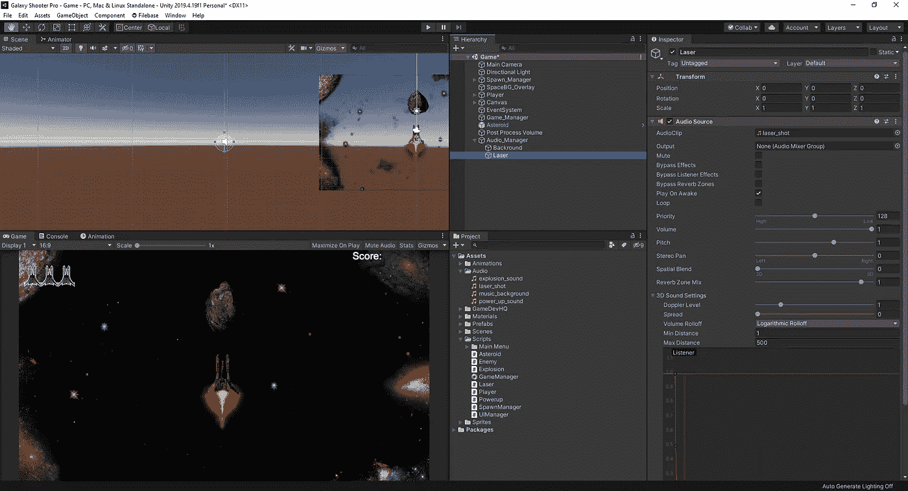

现在，我们将不得不进入我们的播放器脚本，并添加一些代码，让我们的激光声音剪辑播放时，我们发射我们的激光。首先，让我们创建一些游戏组件来附加我们的声音效果:

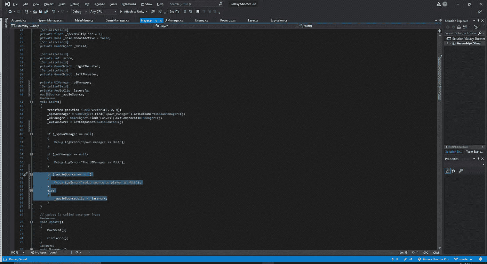

在供 lasersfx 播放的音频剪辑之上，我们还将为播放器创建一个到音频源的连接。这将允许我们直接从音频源中拉出 sfx，而不是手动连接它，并让任何可能的故障发生。从这里，我们可以进入我们的 Unity 编辑器，将激光连接到音频剪辑:

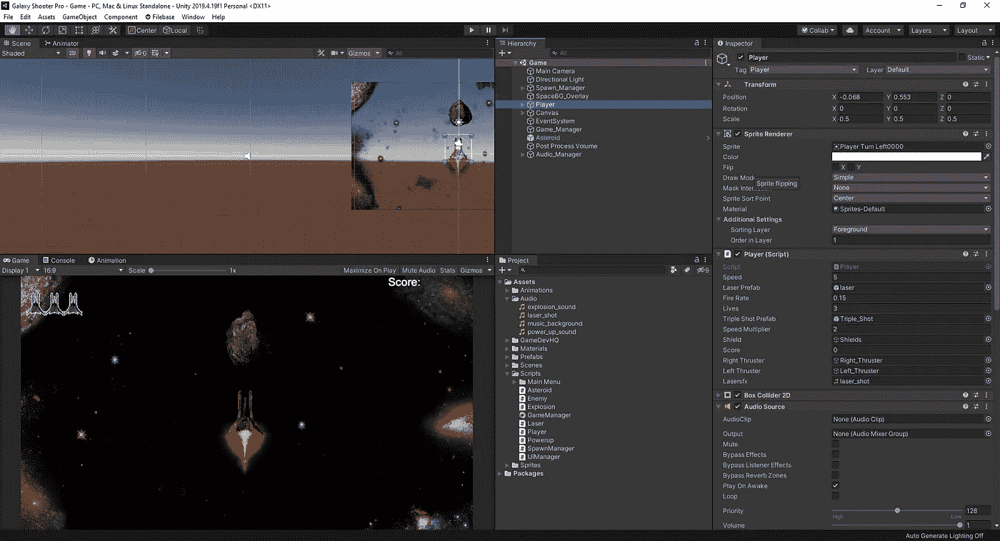

最后，我们将向下滚动到我们的 fire 方法，并添加我们的代码来激活激光声音剪辑。我们让 Unity 知道，当我们发射激光时，就是我们希望声音触发的时候:

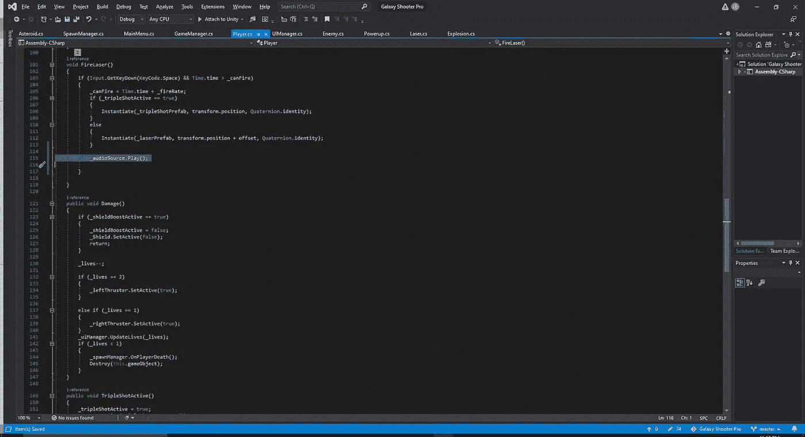

最后，我们可以在游戏中测试它，我们将看到玩家的音频源中的音频剪辑会在玩游戏时切换到 lasersfx:

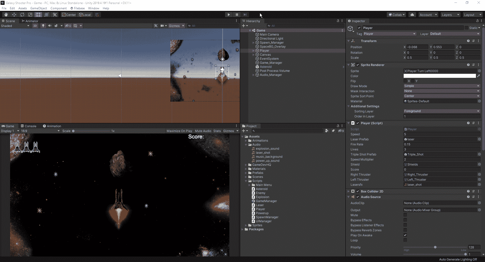

接下来，让我们得到一些摧毁我们的小行星和敌人的爆炸效果。首先，让我们把更快的那颗去掉，把它加到我们的小行星上。至于我们将使用的方法，我们将不得不看看我们的小行星脚本，看看还记得我们是如何编码的。

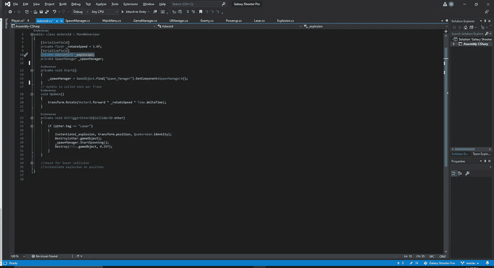

正如我们看到的小行星，我们目前有它的爆炸效果运行通过一个游戏对象，该对象有自己的脚本，所以我们可以移动到我们的爆炸脚本，并添加我们需要激活爆炸的代码:

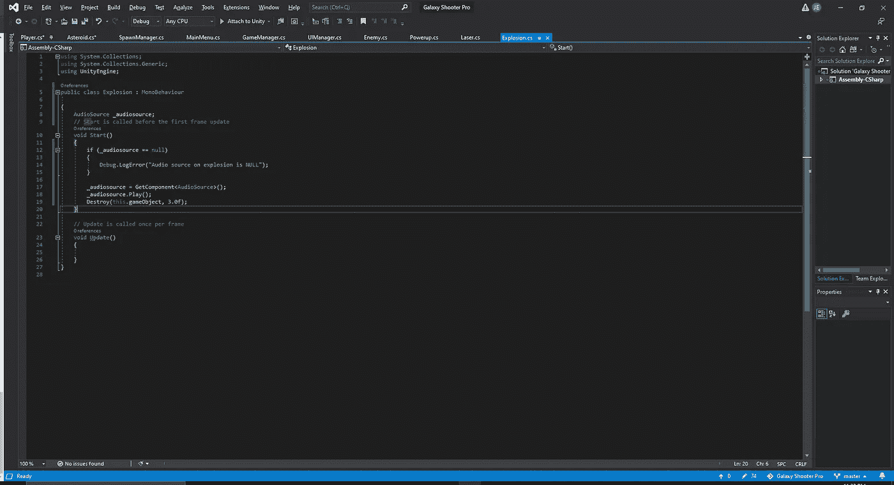

我们将简单地重复我们之前的过程，让 getcomponent 成为我们的音频源。在这种情况下，我们将爆炸声音效果直接应用到我们的音频源，因此我们不需要创建一个组件来将声音效果链接到我们将在此脚本中引用的组件:

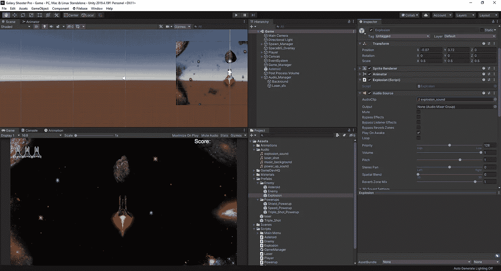

至于我们的敌人，我们使用了一种稍微不同的方法来制造爆炸。我们没有提到这次爆炸，而是在敌人体内创造了爆炸的代码。因此，我们需要重复刚刚对我们的小行星所做的过程，并将其应用于我们的敌人。我们将需要添加音频源组件到我们的敌人和攻击爆炸声音剪辑到它。从那里，我们将在代码中创建到 AudioSource 游戏对象的链接，并告诉 Unity 我们希望在激光击中敌人时以及敌人击中玩家时播放音频:

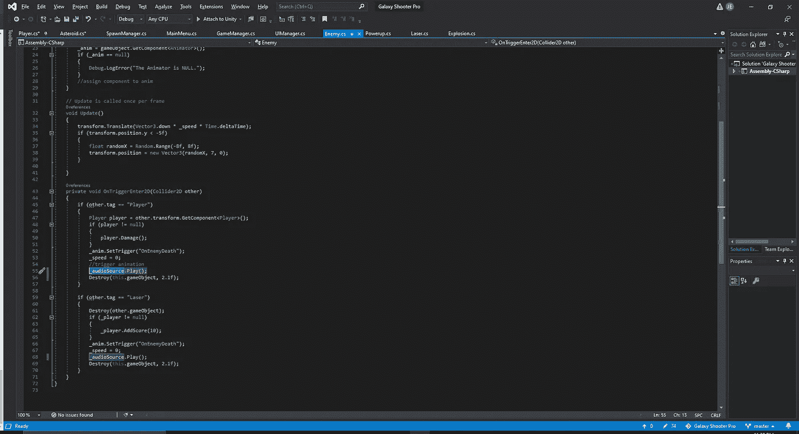

此外，我们希望在检查器中关闭音频源中的“唤醒时播放”选项，这样我们就不会听到敌人一直在爆炸:

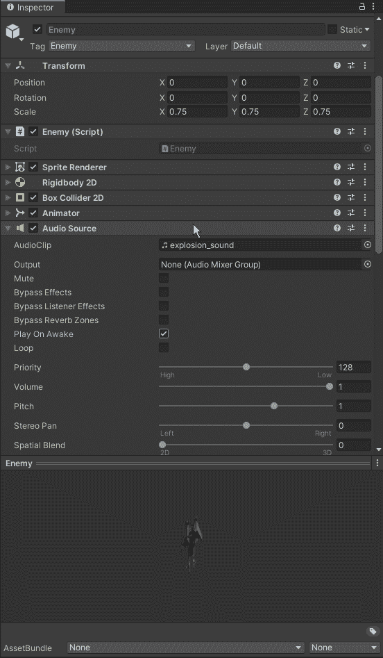

最后，让我们为我们的 powerup upon 收集一个声音剪辑。我们会认为，我们可以遵循我们一直使用的相同方法，创建一个连接到我们所有电源的音频源的链接，并调用该音频剪辑，但是这一次该方法不起作用。这是因为我们的能量在玩家收集的时候就被破坏了，这也破坏了声音片段。为了补救这一点，我们必须使用不同的方法来播放音频剪辑。首先，我们必须弄清楚我们需要使用什么类型的方法，当我们必须研究该做什么时，谷歌总是我们的好朋友。在通过论坛搜索答案后，我们会注意到一个对 PlayClipAtPoint 的引用，所以让我们在我们的脚本 API 中检查一下这是关于什么的:

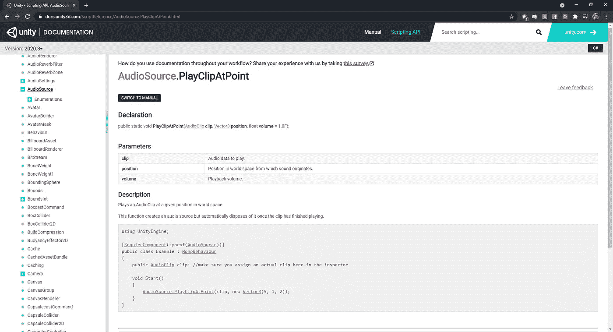

正如我们所看到的，play clip at point 将允许我们在指定位置实例化我们的音频剪辑，本质上是在该点创建一个空对象来为我们播放音频剪辑，然后它就消失了。因此，有了这些知识，我们可以回到我们的加电脚本并在那里应用它:

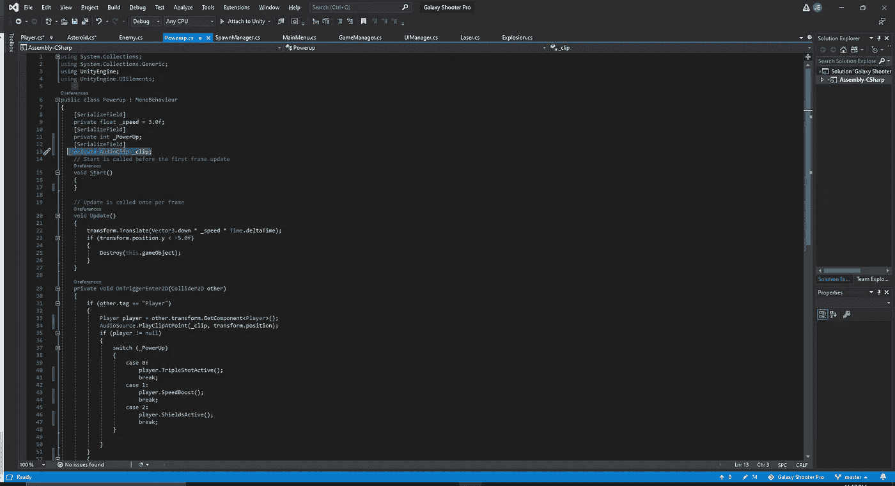

在我们的脚本中，我们设置了我们的剪辑和一个私有音频剪辑，并通过我们的检查器将我们的音频剪辑附加到它上面。在我们的脚本中，我们将告诉 Unity，当我们的 powerup 与我们的播放器交互时，我们希望它在该位置播放我们的剪辑。

我们找到了。我们已经成功地使用了 3 种不同的方法将我们的音效附加到游戏中的一些物体上。现在我们已经完成了这个，我们可以看看如何部署我们的游戏，以及在我们的游戏中添加一些新的行为。