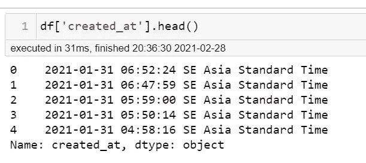
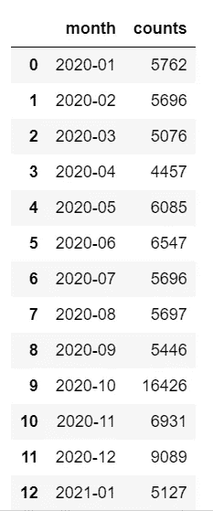
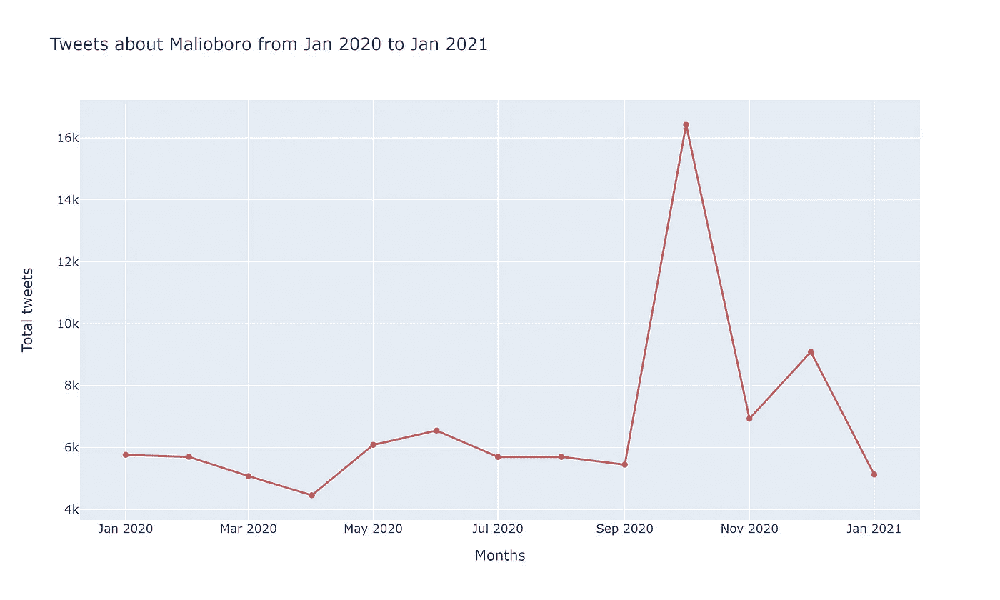
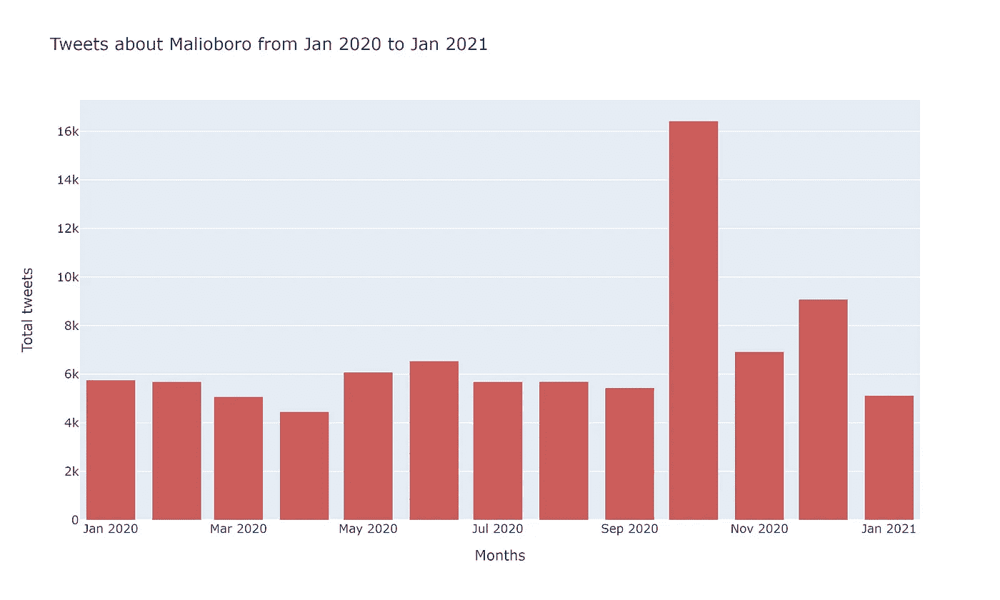
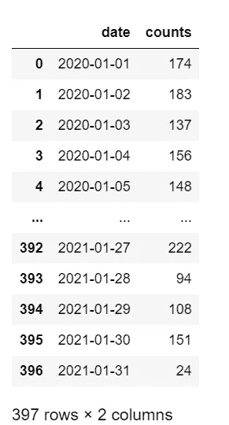
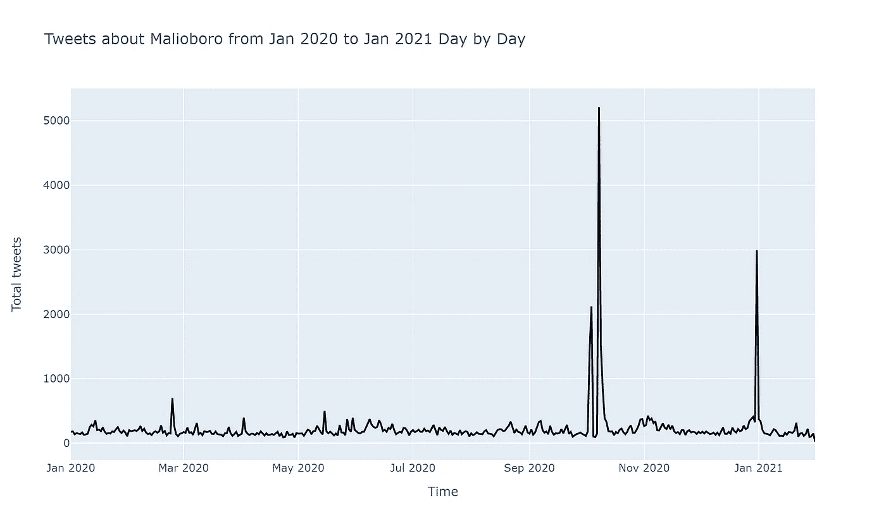
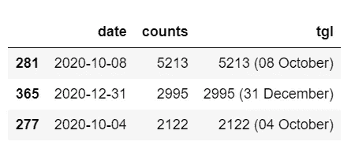
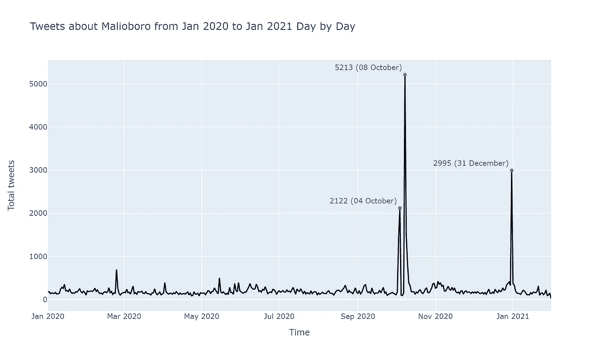

# 如何用 Python 和 Plotly 绘制时间序列数据

> 原文：<https://medium.com/nerd-for-tech/how-to-plot-timeseries-data-in-python-and-plotly-1382d205cc2?source=collection_archive---------0----------------------->

## 这是一个关于用 Python 处理时间序列数据的简单教程，从提取日期和其他数据到将它们绘制成图表。


图片由[爆](https://www.pexels.com/@burst)发自【Pexels.com】T2

处理时间序列数据可能有点棘手。当我第一次不得不用 Python 处理时间序列数据并将它们放入图表时，我真的很沮丧。我可能花了一整天的时间试图找出如何从一系列时间戳数据中提取日期或月份，到最后，我仍然不明白很多事情。

然后当我不得不使用像 [**matplotlib**](https://matplotlib.org/stable/index.html) 或 [**plotly**](https://plotly.com/python/) **，**这样的库将这些数据转换成图表时，这只会给我增加更多的困惑。幸运的是，现在我终于学会了如何解决这些问题。

我将向你们展示一些我最近学到的代码。希望我未来的自己或任何寻找时间序列可视化线索的人会发现这很有帮助。

# 数据

我不想在我们的例子中使用虚拟数据，所以我将使用真实数据。我收集了从 2020 年 1 月 1 日到 2021 年 1 月 31 日(13 个月的数据)所有包含单词**“malio boro”**的推文。

Malioboro 是日惹的一条街道，我在这个城市生活了两年，它被认为是这个城市最大的旅游景点。它不仅为当地游客所知，也为国际游客所知(至少在新冠肺炎疫情之前，这个地方曾被来自世界各国的游客所包围)。因此，我认为它必须每天在 Twitter 上被提及。

我使用了一个名为 [**Twint**](https://github.com/twintproject/twint/) 的库来收集来自 Twitter 的数据。你可以在这里下载[数据](https://github.com/catris25/timeline-plotly-examples/blob/master/data/keyword-malioboro.json) (JSON 格式)并在我的 Github 页面上查看[我用来收集数据的代码](https://github.com/catris25/timeline-plotly-examples/blob/master/get%20data%20using%20twint.ipynb)。但是，您可以使用您拥有的任何数据(只要其中包含日期)来遵循本教程。


马利奥博罗街的人们。(照片由 [arialqadri](https://unsplash.com/@arialqadri22?utm_source=medium&utm_medium=referral) 拍摄——在 [Unsplash](https://unsplash.com?utm_source=medium&utm_medium=referral) 上)

# 加载数据

让我们从导入一些重要的包和数据本身开始。

由于收集的数据是 JSON 格式的，我需要让 Python 逐行读取它们，并将其转换为 pandas 数据帧格式。

```
import pandas as pd
import jsontweets = []
for line in open('data/keyword-malioboro.json', 'r', encoding='UTF-8'):
    tweets.append(json.loads(line))
df = pd.json_normalize(tweets)
len(df)
```

总共收集了 88035 条推文。

对于一年之久的数据来说，相当牛逼吧？马利奥博罗确实是个有名的地方，不然推特也不会说这个了。

# 提取日期

时间数据还没有标准格式。如果你看下面的图片，你会看到它后面有时区名称。我的笔记本电脑的时区设置为 GMT+07(曼谷/雅加达，东南亚)，Twint 可能也遵循了这种格式。



根据您笔记本电脑上设置的时区，您可能会看到类似的情况。我们将删除这些子字符串，只将日期时间存储到一个新的`created`列中。

```
from dateutil.parser import parsedf['created'] = [x.replace(" SE Asia Standard Time", "") for x in df['created_at']]
```

现在我们已经将日期时间数据存储在了`created`列中。然而，由于我们只需要日期和月份数据，我们将使用下面的代码解析这些数据。

```
df['date'] = [parse(date).date() for date in df['created']]
df['monthyear'] = pd.to_datetime(df['date']).dt.to_period('M')
```

为了绘制数据，我们需要每个时间单位(月或天)的推文数量。

# 按月绘图

首先，我们将按月绘制数据。为此，我们制作了一个新的数据框架，由每个月及其各自的推文数量组成。

```
by_month = pd.to_datetime(df['date']).dt.to_period('M').value_counts().sort_index()
by_month.index = pd.PeriodIndex(by_month.index)df_month = by_month.rename_axis('month').reset_index(name='counts')
df_month
```



从 2020 年 1 月到 2021 年 1 月有 13 个月。

这些数据现在可以绘制出来了。

## 在折线图中按月绘制

```
import plotly.express as px
import plotly.graph_objs as gofig = go.Figure(data=go.Scatter(x=df_month['month'].astype(dtype=str), 
                        y=df_month['counts'],
                        marker_color='indianred', text="counts"))fig.update_layout({"title": 'Tweets about Malioboro from Jan 2020 to Jan 2021',
                   "xaxis": {"title":"Months"},
                   "yaxis": {"title":"Total tweets"},
                   "showlegend": False})
fig.write_image("by-month.png",format="png", width=1000, height=600, scale=3)
fig.show()
```



## 在条形图中按月绘制

```
fig = go.Figure(data=go.Bar(x=df_month['month'].astype(dtype=str), 
                        y=df_month['counts'],
                        marker_color='indianred', text="counts"))fig.update_layout({"title": 'Tweets about Malioboro from Jan 2020 to Jan 2021',
                   "xaxis": {"title":"Months"},
                   "yaxis": {"title":"Total tweets"},
                   "showlegend": False})

fig.show()
```



# 白天绘图

你也可以做一个更详细的图表，显示每天的趋势，但是我不建议你做更长时间的数据(比如说，三年或更长时间)，因为这些线会变得很混乱，很难读懂。

我们通过创建一个数据框架来存储每天的推文数量。

```
by_date = pd.Series(df['date']).value_counts().sort_index()
by_date.index = pd.DatetimeIndex(by_date.index)df_date = by_date.rename_axis('date').reset_index(name='counts')
df_date
```



```
fig = go.Figure(data=go.Scatter(x=df_date['date'].astype(dtype=str), 
                                y=df_date['counts'],
                                marker_color='black', text="counts"))fig.update_layout({"title": 'Tweets about Malioboro from Jan 2020 to Jan 2021 Day by Day',
                   "xaxis": {"title":"Time"},
                   "yaxis": {"title":"Total tweets"},
                   "showlegend": False})fig.show()
```



这个图表看起来非常有趣，因为现在你可以看到特定日期的峰值。在那些日子里，一定发生了什么重要的事情，导致 Twitter 比往常更多地谈论 Malioboro。

我将突出这些重要的日期，用一些点来表示它们在数据中的重要性。

在这里，我将获取前三个峰值日期，并将它们存储在一个数据框中。

```
top_dates = df_date.sort_values(by=['counts'],ascending=False).head(3)
vals = []
for tgl, tot in zip(top_dates["date"], top_dates["counts"]):
    tgl = tgl.strftime("%d %B")
    val = "%d (%s)"%(tot, tgl)
    vals.append(val)
top_dates['tgl'] = vals
top_dates
```



然后我用这个数据框在图表上做笔记。它与我们之前制作的图表非常相似，但它有一些点突出了这些日期。

```
fig = go.Figure(data=go.Scatter(x=df_date['date'].astype(dtype=str), 
                                y=df_date['counts'],
                                marker_color='black', text="counts"))fig.update_layout({"title": 'Tweets about Malioboro from Jan 2020 to Jan 2021 Day by Day',
                   "xaxis": {"title":"Time"},
                   "yaxis": {"title":"Total tweets"},
                   "showlegend": False})
fig.add_traces(go.Scatter(x=top_dates['date'], y=top_dates['counts'],
                          textposition='top left',
                          textfont=dict(color='#233a77'),
                          mode='markers+text',
                          marker=dict(color='red', size=6),
                          text = top_dates["tgl"]))
fig.show()
```



您可以将点上显示的文本更改为您想要的任何文本，例如，您可以使用它来写下一些关于导致峰值点的事件的注释。

这些图表很有趣，但是如果没有一个故事来伴随它们，读者不会得到很多线索。

在我的例子中，10 月 4 日和 10 月 8 日成为图表中的顶点，因为在这两天马里奥博罗发生了大规模的示威游行。Twitter 用户很快更新了导致 Malioboro 一词流行并成为新闻话题的情况。

12 月 31 日出现了另一个高峰，因为尽管日惹的新冠肺炎病例不断增加，T2 地方政府决定在新年前夕不封锁或限制马利奥博罗。推特上的用户立即加入了争论，在推特上发表了他们的观点。

这些图表和背景有望创造出某种关于我们数据的故事。

简而言之，使用 Plotly 绘制时间序列数据实际上非常简单明了。如果你仍然觉得有些事情令人困惑，没关系，你不必第一次就把所有东西都弄懂，因为有时需要一些时间来适应。

希望你觉得这个教程很容易理解，否则请给我一些建议！

你可以在下面我的 Github 库中查看我在本文中使用的全部代码。感谢阅读！

[](https://github.com/catris25/timeline-plotly-examples) [## catris 25/timeline-plotly-示例

### 通过在 GitHub 上创建一个帐户，为 catris 25/timeline-plot ly-examples 开发做出贡献。

github.com](https://github.com/catris25/timeline-plotly-examples)