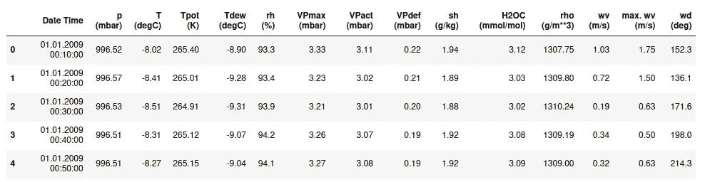
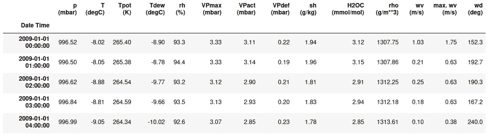
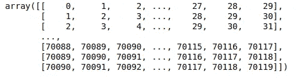
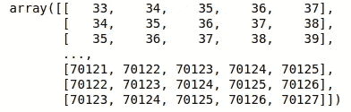

# 如何准备 LSTM/RNN 的时间序列数据？(数据窗口)

> 原文：<https://medium.com/nerd-for-tech/how-to-prepare-time-series-data-for-lstm-rnn-data-windowing-8d44b63a29d5?source=collection_archive---------3----------------------->

当我们处理 LSTM 或 RNN 模型时，我们经常使用多步输入。比如我们拿这个流行的天气数据[【耶拿 _ 气候】](https://www.kaggle.com/gayathrirprog/jena-climate-from-2009-to-2016)。该数据集是时间序列数据，每隔 10 分钟测量一次。你可以在我的 [Github](https://github.com/pinakin9526/medium_01) 找到完整的 Jupyter 笔记本。

耶拿气候数据

在这里，除了将 Date time 列转换为 datetime64 类型并使其成为索引之外，我不会对数据进行任何处理。然后通过取第一个值，将其重新采样为每小时的样本聚集数据。这种重采样是完全可选的，因为我只是减少了数据。

将日期时间列作为索引并重新采样后的数据

现在，我必须建立一个 LSTM 模型，该模型采用过去 30 个样本(即本例中过去 30 小时的数据)，并预测接下来 5 个样本(即本例中接下来 5 个小时)的一些或所有参数。

或者，输入来自 **t-30，t-29，t-28，…，t-1** 处的样本，输出来自 **t，t+1，t+2，t+3，t+4** 处的样本。

此外，有人可能需要预测 5 个样本，但不是立即预测，而是延迟一段时间，例如 3 小时后的下 5 个样本。这意味着输入是在 **t-30，t-29，t-28，…，t-1** 的样本，输出是 **t+3，t+4，t+5，t+6** 和 **t+7** 。

让 **l、m** 和 **n** 分别作为**延迟**、**延迟**和**下一步**。

因此，输入将是来自**t-1，t-1+1，t-1+2，…，t-1** 的样本，输出是来自 **t+m，t+m+1，…，t+m+n-1** 的样本。

因此，LSTM 输入的一个示例将具有 **(1，l，d)** 的形状，并且输出形状将具有 **(1，n，d)**

这里， **d** =数据的维度(即数据中的列数)

因此，如果数据中总共有 **N** 个样本，那么整个数据集的输入和输出形状将分别为 **(k，l，d)** 和 **(k，N，d)** 。

其中， **k = N-(l+m+n)**

有几种方法可以做到这一点，但是，其中一些方法非常慢，因为使用了 for 循环。如果你有非常大的数据，高维数据，那么速度会很慢。这里我们可以利用 numpy 的高级索引来加速这个过程。

因此，通过迭代整个数据矩阵，我们可以创建包含索引片段的矩阵。我从 TensorFlow 文章的这个[时间序列示例中得到灵感，但它是使用 TensorFlow 编写的。](https://www.tensorflow.org/tutorials/structured_data/time_series#data_windowing)

为了使用 numpy，我们可以实现如下

**我说的指数切片是什么意思？**

考虑之前的例子，我们必须制作数据，使得 **l=30，m = 3，n = 5**

这意味着第一个输入将包含从 **0 到 29** 的样本，输出将包含从 **33 到 37** 的样本。

然后，下一个输入将包含来自 **1 至 30** 的样本和来自 **34 至 38** 的输出样本

诸如此类…

我们可以创建两个矩阵作为索引，分别获取输入和输出矩阵的窗口数据。

以下是输入，它将具有 **(k，l)** 的形状

输入切片

下面是输出，它将具有(k，n)的形状

输出切片

我们可以使用这个 2 矩阵为我们的 LSTM/RNN 输入创建输入。

如果您有任何疑问或发现任何差异或任何错误，请随时评论。

希望这篇文章能对你有所帮助，如果有，那就分享吧…