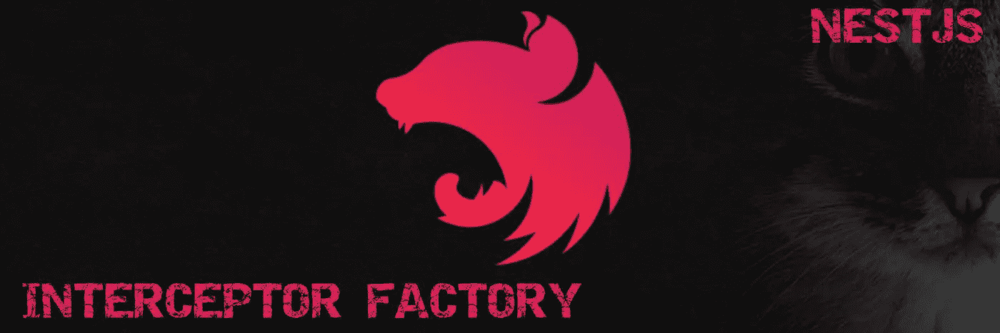

# 如何正确创建 NestJs 拦截器或守卫工厂

> 原文：<https://medium.com/nerd-for-tech/how-to-properly-create-nestjs-interceptor-or-guard-factory-5211b40a8718?source=collection_archive---------3----------------------->

我们每天都在使用 NestJs 拦截器和守卫，大多数情况下我们不需要将它们封装到工厂中，但是偶尔当我们修饰某个控制器或某个控制器的方法时，我们需要静态地向它们传递一个参数。



# **任务:**

假设我们需要发送一些指标 KPI 来跟踪应用程序的使用情况。因此，本质上，对于某些操作，我们希望向消息队列发送一个事件，以便它可以在以后由一些分析服务处理。

# 解决办法

所以我们知道我们需要一个特定的 KPI 事件来配合消息，所以整个分析是有意义的(lol)，而不是在实际的控制器或一些服务中这样做，让我们只是创建一个**拦截器**来实现这个目标。

让我们创建一个枚举来保存我们的 KPI 操作名称
*src/common/enums/warehouse-event-KPI-name . ts*

```
*export enum* WarehouseEventKpiName {
  *CheckIn* = 'check-in',
  *GuestArrival* = 'guest-arrival',
}
```

首先，让我们创建 KPI 模块
*src/common/modules/KPI/KPI . Module . ts*

```
*import* { *Module* } *from* '@nestjs/common';
*import* { KpiService } *from* './kpi.service';
*import* { ConfigModule } *from* '@nestjs/config';

@Module({
  imports: [ConfigModule],
  providers: [KpiService],
  exports: [KpiService],
})
*export class* KpiModule {}
```

然后，让我们创建 KPI 服务
*src/common/modules/KPI/KPI . Service . ts*

```
*import* { *Injectable* } *from* '@nestjs/common';
*import* { *Channel*, *connect as* amqpConnect, *Connection* } *from* 'amqplib';
*import* { ConfigService } *from* '@nestjs/config';

@Injectable()
*export class* KpiService {
  *private* connection: *Connection*;

  *constructor*(*private readonly* config: ConfigService) {
    *this*.connect()
      .then(() => {
        console.log('Connected');
      })
      .catch((*e*) => console.error(*e*));
  }

  *async* publish<T>(*message*: T, *exchangeName*: *string*, *routingKey*: *string*) {
    *const* channel = *await this*.prepareChannel(*exchangeName*);
    channel.publish(
      *exchangeName*,
      *routingKey*,
      Buffer.*from*(JSON.stringify(*message*)),
    );
  }

  *protected async* prepareChannel(*exchangeName*): *Promise*<*Channel*> {
    *const* channel = *await this*.connection.createChannel();
    *await* channel.assertExchange(...);
    *return* channel;
  }

  *private async* connect() {
    *this*.connection = *await amqpConnect*(
      ...
    );
  }
}
```

现在让我们为 KPI 拦截器
*src/common/Interceptors/KPI . interceptor . ts*创建一个基类

```
*import* {
  *CallHandler*,
  *ExecutionContext*,
  *Injectable*,
  *NestInterceptor*,
} *from* '@nestjs/common';
*import* { Observable } *from* 'rxjs';
*import* { KpiService } *from* 'src/common/modules/kpi/kpi.service';
*import* UserResponseDTO *from* '...../dto/user.dto';

@Injectable()
*export abstract class* KpiInterceptor *implements NestInterceptor* {
  *abstract readonly* exchange: *string*;
  *abstract readonly* routingKey: *string*;

  *abstract* intercept(
    *context*: *ExecutionContext*,
    *next*: *CallHandler*,
  ): Observable<*any*>;

  *constructor*(*protected readonly* kpiService: KpiService) {}

  *protected async* dispatch(*data*, *user*: UserResponseDTO) {
    *try* {
      *await this*.kpiService.publish(
        *this*.prepareMessage(*data*, *user*),
        *this*.exchange,
        *this*.routingKey,
      );
    } *catch* (*e*) {
      console.error(*e*);
    }
  }

  *protected* extractUser(*request*): UserResponseDTO {
    *return // EXTRACT USER FROM REQUEST*;
  } 

  protected isResponseSuccessfull(response) {
    return response.statusCode >= 200 && response.statusCode < 300
  } *private* prepareMessage(*data*, *user*: UserResponseDTO) {
    *return* {
      // COMBINE DATA AND ACTOR TO CREATE MESSAGE
      timestamp: Date.now(),
    };
  }
}
```

# 为了预定义 KPI 操作，我们需要创建拦截器工厂

基本原则是:

```
type InterceptorFactory = (action: KPIEventName) => *ClassDecorator*
```

所以真的很简单。

现在让我们为仓库事件创建一个专门的 KPI 拦截器。
*src/common/interceptors/warehouse-event-KPI . interceptor . ts*

```
*import* {
  *CallHandler*,
  *ExecutionContext*,
  *Injectable*,
  *mixin*,
  *NestInterceptor*,
} *from* '@nestjs/common'; 
*import* { *tap* } *from* 'rxjs/operators';*import* { KpiInterceptor } *from* '...';
*import* { KpiService } *from* '...';

*export function WarehouseEventKPI*(
  *kpi*: *string*
): *ClassDecorator* {
  @Injectable()
  *class* WarehouseEventKpiInterceptor
    *extends* KpiInterceptor
    *implements NestInterceptor* { exchange = '...';
    routingKey = '...';

    *constructor*(*protected readonly* kpiService: KpiService) {
      *super*(kpiService);
    }

    intercept(*context*: *ExecutionContext*, *next*: *CallHandler*){
      *const* request = *context*.switchToHttp().getRequest();
      *const* response = *context*.switchToHttp().getResponse();

      *return next*.handle().pipe(
        *tap*((*data*) => { 
          if (this.isResponseSuccessfull(response))
            *this*.dispatch(
              {
                warehouseId: this.getWarehouseId(*data*), 
                action: *kpi // HERE WE USE PREDEFINED KPI* },
              *this*.extractUser(request),
            );
        }),
      );
    }

    *private* getWarehouseId({ *event* }): *number* {
      *return // EXTRACT WAREHOUSE ID*;
    }
  } *return mixin*(WarehouseEventKpiInterceptor);
}
```

这就够了。

# 使用拦截器工厂

```
@Put(':id/check-in')
@UseGuards(AuthGuard('jwt'))
@UseInterceptors(
  *WarehouseEventKPI*(WarehouseEventKpiName.*CheckIn*)
)
*async* eventCheckIn(
  ...
) {
  ...
}
```

我们已经成功地创建了拦截器工厂。我们的代码看起来干净多了。所有的 KPI 逻辑都封装在 KPI 拦截器中，所以我们不会污染控制器或服务层。

*快乐编码！*