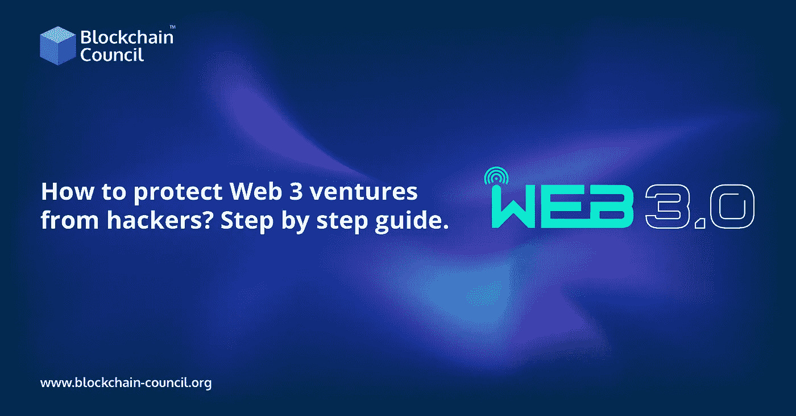

# 如何保护 Web 3 ventures 免受黑客攻击？逐步指南

> 原文：<https://medium.com/nerd-for-tech/how-to-protect-web-3-ventures-from-hackers-step-by-step-guide-a5bce1bc16c3?source=collection_archive---------6----------------------->

让你的网站活起来就相当于让你办公室的门开着，让保险箱开着:大多数来到你的物理位置的访问者并不知道你的所有数据都可以通过漫步进入。在极少数情况下，您会遇到怀有恶意的人，他们会闯入您的系统并窃取您的数据。正是因为这个原因，你才会在门上和保险箱上上锁。

阅读更多— [区块链开发者课程](https://www.blockchain-council.org/certifications/certified-blockchain-developer/)

你的网站是一样的，除了在你的安全程序到位之前，没有人能够访问它。电子窃贼不易察觉且速度很快，他们会在你的网站上搜寻你客户的账户信息，尤其是信用卡信息。您有法律义务保护个人信息不被窃取，并披露任何安全漏洞。

随着[区块链技术](https://www.blockchain-council.org/blockchain/what-is-blockchain-technology-and-how-does-it-work/)的兴起，保证安全变得更加重要。

## 建立可靠的防火墙

网站不是黑客手动黑的。一个熟练的黑客会构建一个机器人来检测易受影响的网站，并自动完成大部分程序。机器人现在被编程来完成非常特殊的任务。他们没有意识到他们周围的环境。

防火墙本质上是检测有害请求的程序。防火墙用于将所有信息请求路由到您的网站。如果防火墙检测到请求是恶意的或来自已知的恶意 IP 地址，它将自动阻止该请求。

## 使用密码管理器并遵循严格的密码策略

字母、数字和符号用于创建强密码。罕见的组合很难破解，暴力破解技术可能需要数年才能破解。此外，越复杂的密码越难破解。

阅读更多- [智能合同开发者课程](https://www.blockchain-council.org/certifications/certified-smart-contract-developer/)

## 安装 SSL，使您的网站 HTTPS。

安全套接字层(SSL)证书对网站与其访问者之间的所有通信进行加密。安装一个可以确保即使你网站上的数据被拦截，黑客也无法读取。

## 彻底检查管理员用户。

大多数消费者认为黑客会简单地把恶意软件放到他们的网站上，然后就消失了。事实并非如此。真正精明的黑客会创建一个拥有管理员权限的虚拟账户，允许他们随时重新进入系统。

定期复习可以解决这个问题。

## 记录你的活动。

在各种情况下，在你的网站上看到意想不到的东西可以作为一个及时的警告。考虑一下，如果一个管理员帐户是在未经你允许的情况下建立的，或者一个插件(比如安全插件)在未经你允许的情况下被停用，会发生什么。

这些都是可接受的网站管理员任务，但它们也可能是未经授权访问的迹象。活动日志将向您显示您的网站上发生了什么，您将能够确定这些行为是否可信。

# 包扎

你的网站对你和访问它的人都是有价值的。同样，对于黑客来说。这份黑客保护指南将让你站在边缘，远离黑客。

随着越来越多的人搜索如何学习区块链，区块链教育正在兴起。报名参加一门课程，开始你成为 ace [区块链专业人士](https://www.blockchain-council.org/certifications/certified-blockchain-professional-expert/)的旅程。