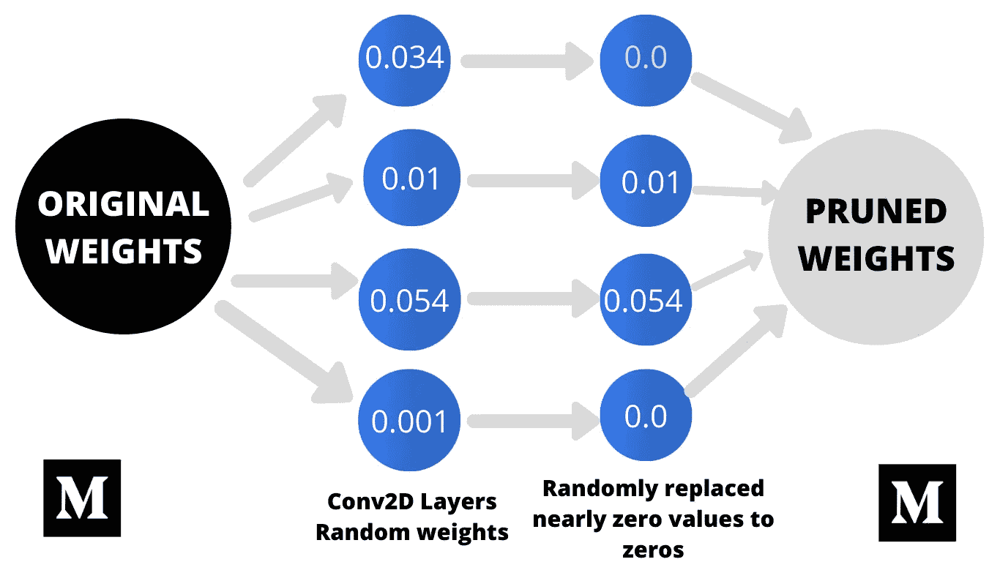
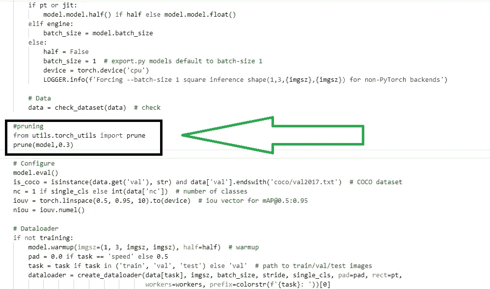

# 如何修剪和稀疏约洛夫 5 ❓

> 原文：<https://medium.com/nerd-for-tech/how-to-prune-sparse-yolov5-da19e1d84a6?source=collection_archive---------0----------------------->

Y olov5 是一个现代的物体检测算法，这是用 PyTorch 写的，除此之外，它还有，*速度快，精度高，易于安装和使用。*

*yolov 5 的重要性提高，由于其不同的出口和部署模块。我们可以转换训练好的模型(。pt)在许多分机中即*

*   *火炬(。pt) → tensorflow-lite(。TF lite)**{用于 android 开发等)*
*   **火炬→开放-神经网络-交换(。onnx)*{用于跨平台}*
*   **火炬→Tensorrt-发动机(。trt/。发动机)*{用于 Tensorrt 集成)*

***修剪？***

> *剪枝是**通过减少权重参数来修改权重的过程，不影响类别的分类**。** Yolov5 使用剪枝技术，其方式是“随机地在某个百分比的权重参数中， **nn.conv2d** 层的权重接近于零，**它会将它们转换为零**”。***

******

***Yolov5 修剪工作流程***

*****YOLOV5 修剪程序？*****

***您首先需要在您的自定义数据上训练 yolov5，一旦训练完成，然后您需要在验证数据上验证您训练的模型，这时您可以调用 prune 函数对训练的模型进行修剪。***

> ***您可以使用您自定义训练的 weights **best.pt** 文件来修剪以下代码，如果您只想修剪模型以获得概念，那么您可以下载 yolov5s.pt 文件并用以下代码修剪该文件。***

***如果您使用的是自定义模型，请打开 yolov5 文件夹，在该文件夹中您已经执行了培训，打开 val.py 文件，并将提到的代码粘贴到图像中显示的位置。否则，您可以从 GitHub 克隆 yolov5 存储库，并安装它的依赖项。打开 val.py 文件，将上面提到的代码粘贴到图中所示的位置。***

```
***from utils.torch_utils import prune
prune(model,0.3)***
```

******

***Yolov5 修剪***

***一旦你添加了上面的代码，然后保存文件。然后在同一文件夹中打开终端，并运行下面的命令。此命令将修剪您的模型。***

> *****注意:**如果您正在修剪您的定制模型，那么首先将它的 **best.pt** 文件存储在其他地方，因为修剪将删除该文件，并将在相同的位置创建具有相同名称 **best.pt** 的新文件。***

```
***python3 val.py --data "coco.yaml or your custom data.yaml" --weights "yolov5s.pt or your custom file.pt"***
```

***你可以通过调用剪枝函数来设置剪枝的百分比，如上图，我已经用 ***30%稀疏度*** 剪枝了我的模型。也就是说模型在 ***nn.conv2d*** 层中 30%的权重参数会等于 0，而 ***AP(平均精度)和 AR(平均召回)*** 得分会略有降低。你可以根据你的用例来改变它。***

> *****以上是关于什么是修剪的全部内容&在 yolov5 中修剪是如何工作的？**更多详情可以访问 [***剪枝/稀疏***](https://github.com/ultralytics/yolov5/issues/304)*教程和 [***期***](https://github.com/ultralytics/yolov5/issues/6514)[***约洛夫***](https://github.com/ultralytics/yolov5) 。****

******关于我** ❓****

****我有超过 1 年半的软件开发工作经验。目前，我是一名软件工程师，通过使用零售分析、建立大数据分析工具、创建和维护模型以及加入引人注目的新数据集，为我们的客户改进产品和服务。****

*****之前，我是 Spark 基金会的计算机视觉实习生，在那里我体验了对来自不同开源平台(如 Kaggle、google images、open images 等)的视觉数据的分析。)，并在该数据上训练不同的深度学习模型。*****

*   ****[*在 LinkedIn 上联系我*](https://www.linkedin.com/in/muhammadrizwanmunawar/)****
*   ****[*与我协商*](https://www.upwork.com/services/product/consultation-1477666319161577472?ref=project_share)****
*   ****[*我的 yolov5 服务*](https://www.upwork.com/services/product/you-will-get-image-classification-projects-using-machine-learning-with-python-1323963101029052416?ref=project_share)****

*******如有疑问请在下方随意评论*******