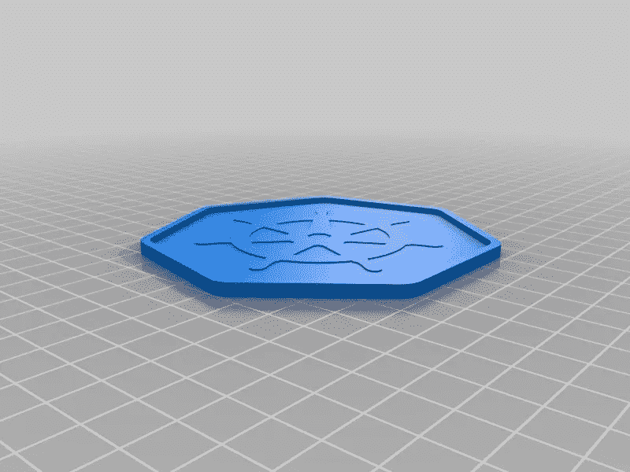

# 如何用 Azure Pipelines，Nginx，Let's Encrypt，Cloudflare 在 Kubernetes 发布一个应用？

> 原文：<https://medium.com/nerd-for-tech/how-to-publish-an-application-in-kubernetes-with-azure-pipelines-nginx-lets-encrypt-and-73950eeb9f9a?source=collection_archive---------0----------------------->

本文将向您展示如何将 ASPNET 核心 web 应用程序发布为 Docker 容器，并在 Kubernetes 中运行，同时自动生成其证书。

—在 Juntoz.com，我们目前正在构建 V3 平台，这是我们旅程的一部分。