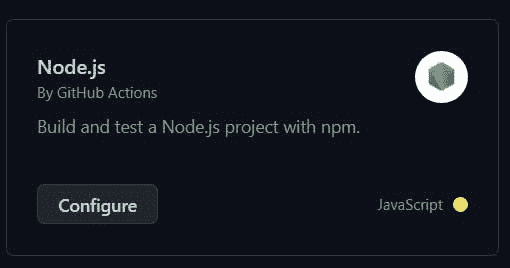
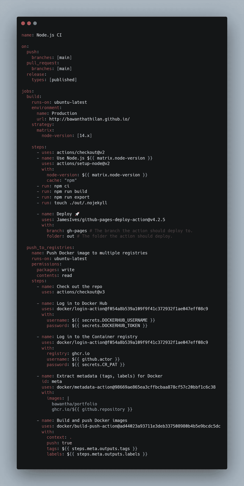
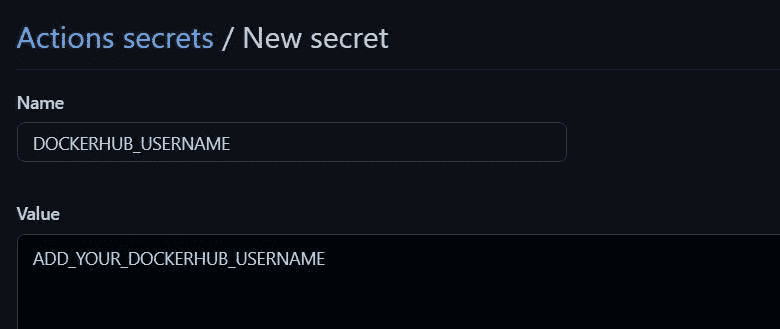
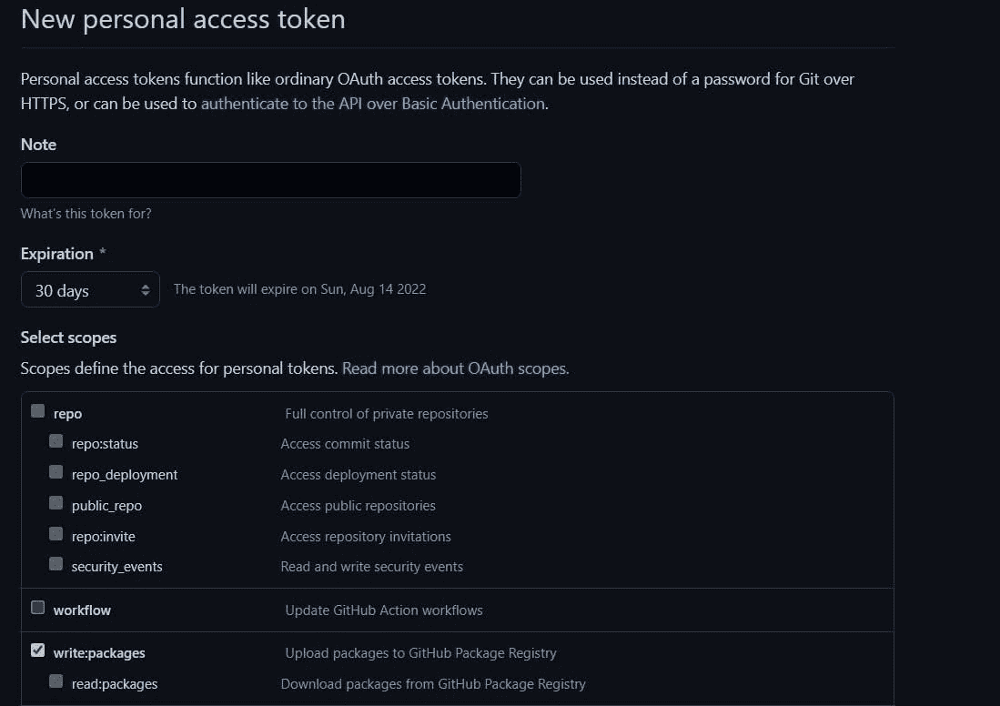
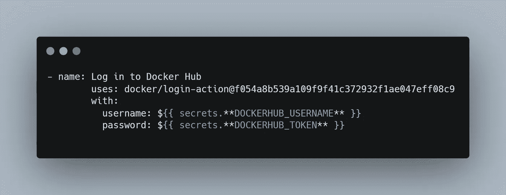
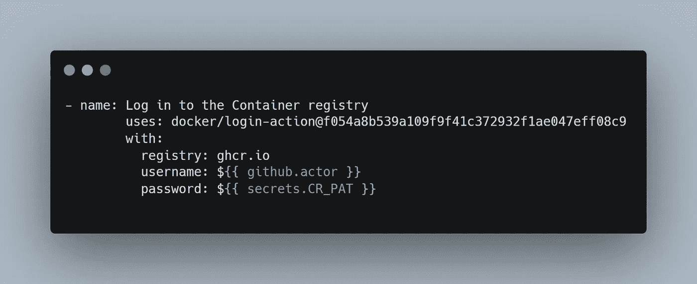
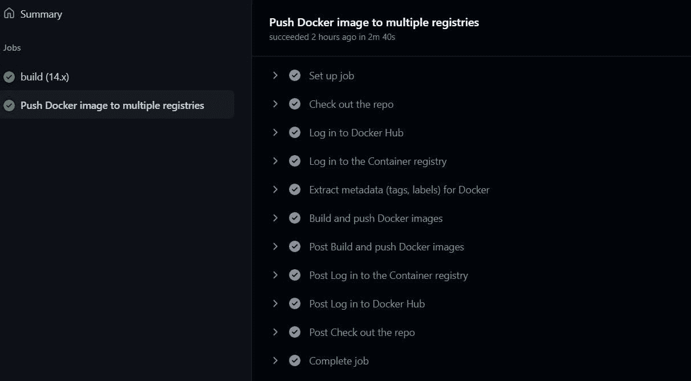
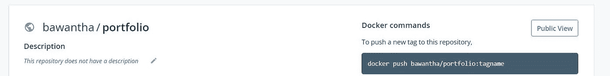

# 如何使用 GitHub 动作将 Docker 图像推送到多个注册中心

> 原文：<https://medium.com/nerd-for-tech/how-to-push-docker-image-to-multiple-registries-using-github-actions-42cb844fdb8d?source=collection_archive---------1----------------------->

在本文中，我将向你展示如何使用 GitHub 动作将你的 docker 图片推送到 Docker Hub 和 GitHub 包管理器。

# 先决条件

*   您必须有 Dockerize 应用程序:)
*   您必须拥有 docker hub 帐户和 docker hub 存储库
*   您的 GitHub 存储库应该包含一个 docker 文件

# 步骤 1 —创建 Github 操作

*   单击“活动”选项卡并创建节点 js 工作流模板

*   现在，单击“配置”按钮来设置此工作流

# 第 2 步—更改工作流文件，如下所示

# 第三步——将你的 DockerHub 秘密添加到 GitHub

*   转到设置

然后选择机密

*   单击“新建存储库机密”来添加您的机密

*   现在你需要添加你的 docker 用户名和密码作为 github 秘密，它们将在 GitHub 操作中使用。

*   现在你需要添加你的 docker 用户名和密码作为 github 秘密，它们将在 GitHub 操作中使用。

让我们创建 GitHub 个人访问令牌⚡

转到配置文件设置->开发人员设置->个人访问令牌->生成新令牌

然后选择 **write:packages** 勾选✅并生成您的令牌

之后，我们需要像这样定义工作流中的变量

*   现在回到上一个浏览器标签，提交你的 GitHub 操作。

*   你也可以在 docker hub 库和 Github 包注册表中看到你的 docker 镜像

谢谢大家！希望你喜欢这篇文章。你可以在下面找到这个 GitHub 库和 DockerHub 库

[Bawanthathilan/Bawanthathilan . github . io](https://github.com/Bawanthathilan/bawanthathilan.github.io)

*原发布于*[*https://bawanthathilan . hashnode . dev*](https://bawanthathilan.hashnode.dev/how-to-push-docker-image-to-multiple-registries-using-github-actions)*。*